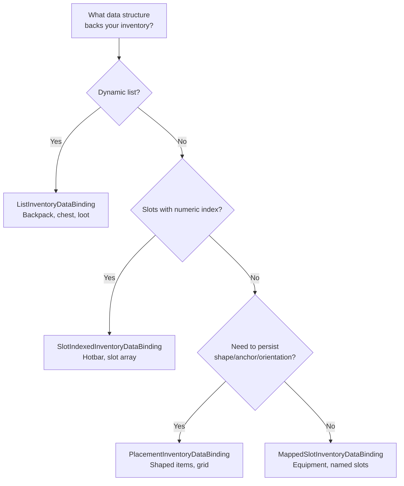

# Binding Templates

This page describes the ready-made templates your DataBinding inherits from. Each template automatically implements UI loading, add/remove event handling, and data synchronization — you only need to define a few primitive methods.

For a general overview of DataBinding and its role in the pipeline, see [Data Binding](data-binding.md).

---

## Which Template To Choose



| Template | Data structure | Sync pattern | When to use |
|---|---|---|---|
| `ListInventoryDataBinding` | Dynamic list | Per-adapter (each adapter separately) | Backpack, chest, loot, merchant |
| `SlotIndexedInventoryDataBinding` | Array/dict by index | Per-slot, with adapter list | Hotbar, equipment slot array |
| `MappedSlotInventoryDataBinding` | Named properties | Per-slot + per-slot validation | Character equipment (head, body, weapon) |
| `PlacementInventoryDataBinding` | Placements with anchor/orientation | Per-placement, with every item instance | Shaped items, grid inventories |

---

## ListInventoryDataBinding

For inventories where data is stored as a **list**: `List<T>`, array, database collection.

### What to implement

```csharp
public class BackpackBinding : ListInventoryDataBinding<ItemSO, ItemSOAdapter>
{
    [SerializeField] private List<ItemSO> _items;

    // 1. Where to read data from when loading UI
    protected override IReadOnlyList<ItemSO> GetItems() => _items;

    // 2. How to create an adapter from a data element
    protected override ItemSOAdapter CreateAdapter(ItemSO item) => new(item);

    // 3. How to add to data (called for EACH adapter in the stack)
    protected override void AddToData(ItemSOAdapter adapter) => _items.Add(adapter.Data);

    // 4. How to remove from data (called for EACH adapter in the stack)
    protected override void RemoveFromData(ItemSOAdapter adapter) => _items.Remove(adapter.Data);
}
```

### How it works automatically

**On load** (`ReloadUI`): iterates `GetItems()`, creates an adapter for each element, adds to UI.

**On item added** (drag & drop): iterates all adapters in the stack and calls `AddToData` for each:

```
Stack of 3 items → AddToData(adapter[0]), AddToData(adapter[1]), AddToData(adapter[2])
```

**On item removed**: same pattern, `RemoveFromData` for each adapter.

!!! note "Why per-adapter?"
    Each adapter in a stack can hold unique runtime data (serial number, purchase timestamp). Per-adapter processing guarantees the exact instances are added to and removed from your data.

---

## SlotIndexedInventoryDataBinding

For inventories where data is tied to **slots by numeric index**: fixed-size array, `int → Item` dictionary.

### What to implement

```csharp
public class HotbarBinding : SlotIndexedInventoryDataBinding<ItemSO, ItemSOAdapter>
{
    [SerializeField] private ItemSO[] _slots = new ItemSO[8];

    // 1. Which slots are occupied (skip empties)
    protected override IEnumerable<(int index, IReadOnlyList<ItemSO> items)> GetOccupiedSlots()
    {
        for (int i = 0; i < _slots.Length; i++)
            if (_slots[i] != null)
                yield return (i, new[] { _slots[i] });
    }

    // 2. How to create an adapter from a data element
    protected override ItemSOAdapter CreateAdapter(ItemSO item) => new(item);

    // 3. How to write data to a slot (full adapter list for the stack)
    protected override void AddToSlotData(int index, IReadOnlyList<ItemSOAdapter> adapters)
        => _slots[index] = adapters[0].Data;

    // 4. How to clear slot data (full adapter list for the stack)
    protected override void RemoveFromSlotData(int index, IReadOnlyList<ItemSOAdapter> adapters)
        => _slots[index] = null;
}
```

### How it works automatically

**On load**: iterates `GetOccupiedSlots()`, creates an adapter for every item in `items`, builds a stack, and adds it to UI at the slot index.

**On add/remove**: called **once** for the entire stack and passes all typed adapters from that stack:

```
Stack of 3 items into slot #2 → AddToSlotData(2, adapters[0..2])
```

This preserves per-instance data in a stack. If three items look the same but carry different runtime data, the binding receives all three adapters.

### Difference from List template

| | List | SlotIndexed |
|---|---|---|
| Sync | Per adapter | Single call per slot with adapter list |
| Slot identity | None | Numeric index |
| Size | Dynamic | Usually fixed |

---

## MappedSlotInventoryDataBinding

For inventories where each slot is a **separate named property** with its own read, write, and validation logic. Supports both single items and stacks — both slot types can be mixed in the same `CreateBindingMap()`.

### What to implement

```csharp
public class EquipmentBinding : MappedSlotInventoryDataBinding<ItemModel, ItemModelAdapter>
{
    [SerializeField] private UniversalSlot _weaponSlot;
    [SerializeField] private UniversalSlot _armorSlot;
    [SerializeField] private UniversalSlot _potionSlot;
    [SerializeField] private CharacterData _data;

    // 1. Declarative map: slot → how to read, write, clear, validate
    protected override Dictionary<BaseSlot, SlotBinding<ItemModel, ItemModelAdapter>> CreateBindingMap() => new()
    {
        // Single item (simple constructor)
        [_weaponSlot] = new(
            get: () => _data.Weapon,
            set: adapter => _data.Weapon = adapter.Model,
            clear: () => _data.Weapon = null,
            canDrop: adapter => adapter.Model.Type == ItemType.Weapon
                ? RuleResult.Success()
                : RuleResult.Failure("Weapons only")),

        [_armorSlot] = new(
            get: () => _data.Armor,
            set: adapter => _data.Armor = adapter.Model,
            clear: () => _data.Armor = null),

        // Stacking slot (list constructor)
        [_potionSlot] = new(
            getAll: () => _data.Potions,
            add: adapters => _data.AddPotions(adapters),
            remove: adapters => _data.RemovePotions(adapters),
            clear: () => _data.ClearPotions(),
            canDrop: adapter => adapter.Model.Type == ItemType.Potion
                ? RuleResult.Success()
                : RuleResult.Failure("Potions only")),
    };

    // 2. How to create an adapter from a data element (for ReloadUI)
    protected override ItemModelAdapter CreateAdapter(ItemModel item) => new(item);
}
```

### How it works automatically

**On load**: iterates all entries in `BindingMap`, calls `GetAll()` for each slot. For each item in the list, creates a separate adapter and assembles them into an `ItemStack` via `ItemStack.TryCreate()`.

**On item added**: filters adapters of type `TAdapter` from the stack, finds the binding for the target slot, calls `Add(adapter_list)`.

**On item removed**: similarly filters adapters, finds the binding for the source slot, calls `Remove(adapter_list)`.

**On CanDrop/CanStartDrag check**: automatically calls `CanDrop(adapter)` / `CanStartDrag(adapter)` for the target/source slot using `PrimaryAdapter`, if a validator is provided.

### Two SlotBinding constructors

**Simple** — for single items (one item per slot):

```csharp
new SlotBinding<TData, TAdapter>(
    get: () => ...,              // read current value (TData)
    set: adapter => ...,         // write via adapter (TAdapter)
    clear: () => ...,            // clear
    canDrop: adapter => ...      // optional: validation on drop (TAdapter)
)
```

Internally `get/set/clear` are wrapped into the list-based API: `GetAll` returns a single-element array, `Add` calls `set(adapters[0])`, `Remove` calls `clear()`.

**Stacking** — for multiple identical items in a slot:

```csharp
new SlotBinding<TData, TAdapter>(
    getAll: () => ...,           // all items in the slot (IReadOnlyList<TData>)
    add: adapters => ...,        // add adapters (IReadOnlyList<TAdapter>)
    remove: adapters => ...,     // remove adapters (IReadOnlyList<TAdapter>)
    clear: () => ...,            // full clear
    canDrop: adapter => ...      // optional: validation on drop (TAdapter)
)
```

`add`/`remove` receive the concrete adapter instances from the stack. Like `ListInventoryDataBinding`, this lets you work with individual instance data without an intermediate `ExtractData` step.

!!! note "Both types in one BindingMap"
    Both constructors produce the same `SlotBinding<TData, TAdapter>`. They can be freely mixed in a single dictionary — the base class always works through the unified list-based API.

`canDrop` and `canStartDrag` are optional in both constructors. If not set, the slot accepts anything that passes other rules.

### Difference from SlotIndexed template

| | SlotIndexed | MappedSlot |
|---|---|---|
| Slot identity | Numeric index | `BaseSlot` object reference |
| Slot data | Same pattern for all | Individual get/set/clear per slot |
| Validation | Shared via `CanDrop` override | Individual `canDrop` / `canStartDrag` per slot |
| Stacks | Via slot adapter list | Via list-based API (each adapter individually) |
| Slot count | Can be many | Usually < 10 |

---

## PlacementInventoryDataBinding

For inventories that need to persist not only the slot, but also item placement: anchor, orientation, covered cells, and item shape.

This is usually used for shaped items, grid inventories, and any system where an item can occupy several cells.

### What to implement

```csharp
public class ShapedItemsBinding
    : PlacementInventoryDataBinding<ItemModel, ItemModelAdapter>
{
    [SerializeField] private List<MyPlacementModel> _placements;

    protected override IEnumerable<PlacementData<ItemModel>> GetPlacements()
    {
        foreach (var placement in _placements)
            yield return new PlacementData<ItemModel>(
                placement.Items,
                placement.AnchorIndex,
                placement.Orientation);
    }

    protected override ItemModelAdapter CreateAdapter(ItemModel item) => new(item);
    protected override ItemModel ExtractData(ItemModelAdapter adapter) => adapter.Model;

    protected override void AddPlacementData(
        PlacementCommitContext<ItemModel, ItemModelAdapter> context)
    {
        _placements.Add(new MyPlacementModel(
            context.Data,
            context.AnchorIndex,
            context.Orientation));
    }

    protected override void RemovePlacementData(
        PlacementCommitContext<ItemModel, ItemModelAdapter> context)
    {
        RemovePlacementAt(context.AnchorIndex);
    }
}
```

### What changed in the current API

`PlacementData<TData>` now stores `Items`, the full list of item instances in the placement.

`PlacementCommitContext<TData, TAdapter>` now exposes:

- `Data` — data for every adapter in the transferred stack
- `Adapters` — all typed adapters from the transferred stack
- `PrimaryData` / `Adapter` — the first item, only as a convenience for single-item cases

Use `context.Data` when a stack can contain different instances. Use `PrimaryData` only when the slot really stores one item or your items are fully homogeneous.

---

## Base class: InventoryDataBindingBase

All templates inherit from `InventoryDataBindingBase`. You normally don't inherit from it directly, but it's useful to know which virtual methods are available for override:

| Method | Default | When to override |
|---|---|---|
| `CanStartDrag(context, entry)` | `Success` | Block taking items from this inventory |
| `CanDrop(context, entry)` | `Success` | Add drop checks (MappedSlot overrides this automatically) |
| `CanSwap(args)` | `Success` | Extra swap validation |
| `OnSwapCompleted(args)` | No-op | React to completed swap |
| `OnDropCompletedFrom(context)` | No-op | React after a drop completes where this inventory was the **source** |
| `OnDropCompletedTo(context)` | No-op | React after a drop completes where this inventory was the **target** |
| `CreateItemConverter()` | `null` | Item conversion between inventories with different formats |

Occupied-slot drop handling is no longer a virtual method on `InventoryDataBindingBase`. Implement `IPreRuleOccupiedSlotDropHandler` or `IPostRuleOccupiedSlotDropHandler` on your binding instead. See [Optional Interfaces](../reference/optional-interfaces.md).

Helper methods are also available:

- `ReloadUI()` — full resync of UI with data
- `ClearUI()` — clear all slots
- `AddToUIQuiet(adapter, count, slotIndex)` — add item without generating events
- `BeginSync()` — start sync scope (suppresses events, prevents feedback loops)

---

## Deferred Processing: OnDropCompletedFrom / OnDropCompletedTo

`OnItemAddedToUI` and `OnItemRemovedFromUI` are called **per allocation** during a transfer. If a transfer splits across multiple target slots (batch transfer), you'll receive multiple calls for a single drag operation.

When this is a problem, use `OnDropCompletedFrom` / `OnDropCompletedTo`. They are called **once** after the entire drop operation completes.

### Example: Craft Result Slot

Recipe `3×A → 6×B`. Slot contains 384×B. Player drags into an inventory with max stack 64.

- The transfer spreads across 6 slots: `64+64+64+64+64+64 = 384`
- `OnItemRemovedFromUI` fires 6 times with `Count = 64`
- `64 / 6 = 10` (integer division) — remainder lost on each call

Solution — accumulate removed items and consume ingredients once:

```csharp
public class CraftResultDataBinding : InventoryDataBindingBase
{
    private int _pendingRemovedItems;

    protected override void OnItemRemovedFromUI(InventoryItemEventContext context)
    {
        // Only accumulate, don't consume yet
        _pendingRemovedItems += context.Stack.Count;
    }

    protected override void OnDropCompletedFrom(DragContext context)
    {
        // Called once after the entire transfer
        int craftsConsumed = _pendingRemovedItems / resultCount;
        _pendingRemovedItems = 0;
        manager.ConsumeCraftIngredients(craftsConsumed);
    }
}
```

### DragAmountStep

The transfer respects the source inventory's `DragAmountStep`: the **total** number of transferred items is rounded down to a multiple of the step. This guarantees that the sum of all placements is divisible by the step, even if individual placements are not.

```csharp
// In the source inventory:
_inventory.SetDragAmountStep(recipe.ResultCount, DragAmountStepRounding.Ceil);
// Transfer: total = floor(total / step) * step
```
