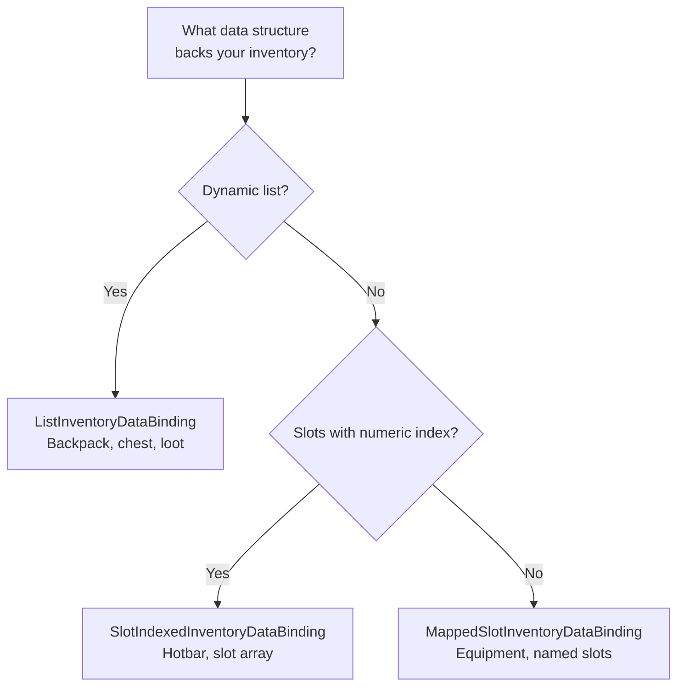

# Binding Templates

Esta página describe las plantillas ya preparadas de las que hereda tu DataBinding. Cada plantilla implementa automáticamente la carga de UI, el manejo de eventos add/remove y la sincronización de datos; tú solo necesitas definir unos pocos métodos primitivos.

Para una visión general de DataBinding y su papel dentro del pipeline, consulta [Data Binding](data-binding.md).

---

## Qué plantilla elegir



| Plantilla | Estructura de datos | Patrón de sync | Cuándo usarla |
|---|---|---|---|
| `ListInventoryDataBinding` | Lista dinámica | Por adapter (cada adapter por separado) | Mochila, cofre, loot, comerciante |
| `SlotIndexedInventoryDataBinding` | Array/dict por índice | Por slot (una sola llamada por slot) | Hotbar, array de slots de equipamiento |
| `MappedSlotInventoryDataBinding` | Propiedades con nombre | Por slot + validación por slot | Equipamiento del personaje (cabeza, cuerpo, arma) |

---

## ListInventoryDataBinding

Para inventarios donde los datos se almacenan como una **lista**: `List<T>`, array, colección de base de datos.

### Qué implementar

```csharp
public class BackpackBinding : ListInventoryDataBinding<ItemSO, ItemSOAdapter>
{
    [SerializeField] private List<ItemSO> _items;

    // 1. De dónde leer los datos al cargar la UI
    protected override IReadOnlyList<ItemSO> GetItems() => _items;

    // 2. Cómo crear un adapter a partir de un elemento de datos
    protected override ItemSOAdapter CreateAdapter(ItemSO item) => new(item);

    // 3. Cómo añadir a los datos (se llama por CADA adapter del stack)
    protected override void AddToData(ItemSOAdapter adapter) => _items.Add(adapter.Data);

    // 4. Cómo eliminar de los datos (se llama por CADA adapter del stack)
    protected override void RemoveFromData(ItemSOAdapter adapter) => _items.Remove(adapter.Data);
}
```

### Cómo funciona automáticamente

**Al cargar** (`ReloadUI`): itera `GetItems()`, crea un adapter por cada elemento y lo añade a la UI.

**Al añadir un item** (drag & drop): itera todos los adapters del stack y llama a `AddToData` para cada uno:

```
Stack of 3 items → AddToData(adapter[0]), AddToData(adapter[1]), AddToData(adapter[2])
```

**Al eliminar un item**: mismo patrón, `RemoveFromData` para cada adapter.

!!! note "Why per-adapter?"
    Cada adapter dentro de un stack puede contener datos runtime únicos (número de serie, timestamp de compra). El procesamiento por adapter garantiza que las instancias exactas se añadan y eliminen de tus datos.

---

## SlotIndexedInventoryDataBinding

Para inventarios donde los datos están ligados a **slots por índice numérico**: array de tamaño fijo, diccionario `int → Item`.

### Qué implementar

```csharp
public class HotbarBinding : SlotIndexedInventoryDataBinding<ItemSO, ItemSOAdapter>
{
    [SerializeField] private ItemSO[] _slots = new ItemSO[8];

    // 1. Qué slots están ocupados (omitir vacíos)
    protected override IEnumerable<(int index, ItemSO item, int count)> GetOccupiedSlots()
    {
        for (int i = 0; i < _slots.Length; i++)
            if (_slots[i] != null)
                yield return (i, _slots[i], 1);
    }

    // 2. Cómo crear un adapter a partir de un elemento de datos
    protected override ItemSOAdapter CreateAdapter(ItemSO item) => new(item);

    // 3. Cómo escribir datos en un slot (una sola llamada para todo el stack)
    protected override void AddToSlotData(int index, ItemSOAdapter adapter, int count)
        => _slots[index] = adapter.Data;

    // 4. Cómo limpiar los datos de un slot (una sola llamada para todo el stack)
    protected override void RemoveFromSlotData(int index, ItemSOAdapter adapter, int count)
        => _slots[index] = null;
}
```

### Cómo funciona automáticamente

**Al cargar**: itera `GetOccupiedSlots()`, crea un adapter para cada entrada y lo añade a la UI en el índice de slot correspondiente.

**Al añadir/quitar**: se llama **una sola vez** para todo el stack, pasando `PrimaryAdapter` y el `count` total:

```
Stack of 3 items into slot #2 → AddToSlotData(2, primaryAdapter, 3)
```

### Diferencia con la plantilla List

| | List | SlotIndexed |
|---|---|---|
| Sync | Por adapter | Una llamada por slot |
| Identidad del slot | Ninguna | Índice numérico |
| Tamaño | Dinámico | Normalmente fijo |

---

## MappedSlotInventoryDataBinding

Para inventarios donde cada slot es una **propiedad con nombre separada** con su propia lógica de lectura, escritura y validación. Soporta tanto items individuales como stacks: ambos tipos de slot pueden mezclarse dentro del mismo `CreateBindingMap()`.

### Qué implementar

```csharp
public class EquipmentBinding : MappedSlotInventoryDataBinding<ItemModel, ItemModelAdapter>
{
    [SerializeField] private UniversalSlot _weaponSlot;
    [SerializeField] private UniversalSlot _armorSlot;
    [SerializeField] private UniversalSlot _potionSlot;
    [SerializeField] private CharacterData _data;

    // 1. Mapa declarativo: slot → cómo leer, escribir, limpiar y validar
    protected override Dictionary<BaseSlot, SlotBinding<ItemModel, ItemModelAdapter>> CreateBindingMap() => new()
    {
        // Single item (simple constructor)
        [_weaponSlot] = new(
            get: () => _data.Weapon,
            set: adapter => _data.Weapon = adapter.Model,
            clear: () => _data.Weapon = null,
            canDrop: adapter => adapter.Model.Type == ItemType.Weapon
                ? RuleResult.Success()
                : RuleResult.Failure("Weapons only")),

        [_armorSlot] = new(
            get: () => _data.Armor,
            set: adapter => _data.Armor = adapter.Model,
            clear: () => _data.Armor = null),

        // Stacking slot (list constructor)
        [_potionSlot] = new(
            getAll: () => _data.Potions,
            add: adapters => _data.AddPotions(adapters),
            remove: adapters => _data.RemovePotions(adapters),
            clear: () => _data.ClearPotions(),
            canDrop: adapter => adapter.Model.Type == ItemType.Potion
                ? RuleResult.Success()
                : RuleResult.Failure("Potions only")),
    };

    // 2. Cómo crear un adapter a partir de un elemento de datos (para ReloadUI)
    protected override ItemModelAdapter CreateAdapter(ItemModel item) => new(item);
}
```

### Cómo funciona automáticamente

**Al cargar**: itera todas las entradas de `BindingMap`, llama a `GetAll()` para cada slot. Para cada item de la lista crea un adapter separado y los ensambla en un `ItemStack` mediante `ItemStack.TryCreate()`.

**Al añadir un item**: filtra del stack los adapters de tipo `TAdapter`, encuentra el binding del slot objetivo y llama a `Add(adapter_list)`.

**Al eliminar un item**: del mismo modo filtra adapters, encuentra el binding del slot de origen y llama a `Remove(adapter_list)`.

**En la comprobación de CanDrop/CanStartDrag**: llama automáticamente a `CanDrop(adapter)` / `CanStartDrag(adapter)` para el slot objetivo/origen usando `PrimaryAdapter`, si se ha proporcionado un validador.

### Dos constructores de SlotBinding

**Simple**: para items individuales (un item por slot):

```csharp
new SlotBinding<TData, TAdapter>(
    get: () => ...,              // read current value (TData)
    set: adapter => ...,         // write via adapter (TAdapter)
    clear: () => ...,            // clear
    canDrop: adapter => ...      // optional: validation on drop (TAdapter)
)
```

Internamente `get/set/clear` se envuelven dentro de la API basada en listas: `GetAll` devuelve un array de un solo elemento, `Add` llama a `set(adapters[0])` y `Remove` llama a `clear()`.

**Stacking**: para varios items idénticos dentro de un slot:

```csharp
new SlotBinding<TData, TAdapter>(
    getAll: () => ...,           // all items in the slot (IReadOnlyList<TData>)
    add: adapters => ...,        // add adapters (IReadOnlyList<TAdapter>)
    remove: adapters => ...,     // remove adapters (IReadOnlyList<TAdapter>)
    clear: () => ...,            // full clear
    canDrop: adapter => ...      // optional: validation on drop (TAdapter)
)
```

`add`/`remove` reciben las instancias concretas de adapter del stack. Igual que en `ListInventoryDataBinding`, esto te permite trabajar con datos de instancia individuales sin un paso intermedio de `ExtractData`.

!!! note "Both types in one BindingMap"
    Ambos constructores producen el mismo `SlotBinding<TData, TAdapter>`. Pueden mezclarse libremente dentro de un único diccionario; la clase base siempre trabaja a través de la API unificada basada en listas.

`canDrop` y `canStartDrag` son opcionales en ambos constructores. Si no se definen, el slot acepta cualquier cosa que supere las demás rules.

### Diferencia respecto a SlotIndexed

| | SlotIndexed | MappedSlot |
|---|---|---|
| Identidad del slot | Índice numérico | Referencia a objeto `BaseSlot` |
| Datos del slot | Mismo patrón para todos | `get/set/clear` individual por slot |
| Validación | Compartida mediante override de `CanDrop` | `canDrop` / `canStartDrag` individual por slot |
| Stacks | Mediante parámetro `count` | Mediante API basada en listas (cada adapter individualmente) |
| Número de slots | Puede ser grande | Normalmente < 10 |

---

## Clase base: InventoryDataBindingBase

Las tres plantillas heredan de `InventoryDataBindingBase`. Normalmente no heredas de ella directamente, pero conviene saber qué métodos virtuales están disponibles para override:

| Método | Por defecto | Cuándo sobreescribir |
|---|---|---|
| `CanStartDrag(context, entry)` | `Success` | Bloquear coger items de este inventario |
| `CanDrop(context, entry)` | `Success` | Añadir comprobaciones de drop (MappedSlot lo sobrescribe automáticamente) |
| `CanSwap(args)` | `Success` | Validación extra de swap |
| `OnSwapCompleted(args)` | No-op | Reaccionar a un swap completado |
| `OnDropCompletedFrom(context)` | No-op | Reaccionar después de un drop completado donde este inventario fue el **source** |
| `OnDropCompletedTo(context)` | No-op | Reaccionar después de un drop completado donde este inventario fue el **target** |
| `CreateItemConverter()` | `null` | Conversión de items entre inventarios con formatos distintos |
| `CanHandleOccupiedSlotDrop(entry, slot)` | `false` | Manejo personalizado de drops sobre slots ocupados |
| `ExecuteOccupiedSlotDrop(entry, slot)` | `false` | Ejecutar el drop personalizado en slot ocupado |

También hay métodos helper disponibles:

- `ReloadUI()` — resincronización completa de la UI con los datos
- `ClearUI()` — limpiar todos los slots
- `AddToUIQuiet(adapter, count, slotIndex)` — añadir item sin generar eventos
- `BeginSync()` — iniciar un scope de sync (suprime eventos y evita feedback loops)

---

## Deferred Processing: OnDropCompletedFrom / OnDropCompletedTo

`OnItemAddedToUI` y `OnItemRemovedFromUI` se llaman **por allocation** durante una transferencia. Si una transferencia se divide entre varios slots objetivo (batch transfer), recibirás varias llamadas para una sola operación de drag.

Cuando eso sea un problema, usa `OnDropCompletedFrom` / `OnDropCompletedTo`. Se llaman **una sola vez** después de que termine toda la operación de drop.

### Ejemplo: Craft Result Slot

Receta `3×A → 6×B`. El slot contiene 384×B. El jugador arrastra a un inventario con stack máximo 64.

- El planner distribuye en 6 slots: `64+64+64+64+64+64 = 384`
- `OnItemRemovedFromUI` se dispara 6 veces con `Count = 64`
- `64 / 6 = 10` (división entera): se pierde el resto en cada llamada

Solución: acumular los items retirados y consumir ingredientes una sola vez:

```csharp
public class CraftResultDataBinding : InventoryDataBindingBase
{
    private int _pendingRemovedItems;

    protected override void OnItemRemovedFromUI(InventoryItemEventContext context)
    {
        // Only accumulate, don't consume yet
        _pendingRemovedItems += context.Stack.Count;
    }

    protected override void OnDropCompletedFrom(DragContext context)
    {
        // Called once after the entire transfer
        int craftsConsumed = _pendingRemovedItems / resultCount;
        _pendingRemovedItems = 0;
        manager.ConsumeCraftIngredients(craftsConsumed);
    }
}
```

### DragAmountStep

El transfer planner respeta el `DragAmountStep` del inventario de origen: el número **total** de items transferidos se redondea hacia abajo a un múltiplo del step. Esto garantiza que la suma de todas las allocations sea divisible por el step, aunque las allocations individuales no lo sean.

```csharp
// In the source inventory:
_inventory.SetDragAmountStep(recipe.ResultCount, DragAmountStepRounding.Ceil);
// Planner: total = floor(total / step) * step
```

