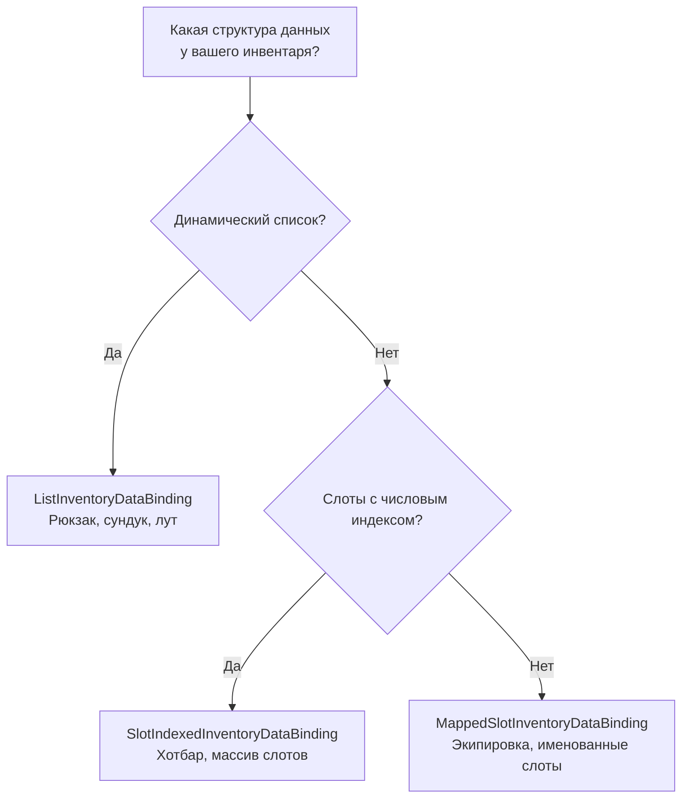

# Шаблоны DataBinding

Эта страница описывает готовые шаблоны, от которых наследуется ваш DataBinding. Каждый шаблон автоматически реализует загрузку UI, обработку событий добавления/удаления и синхронизацию с вашими данными — вам остаётся определить несколько методов-примитивов.

Общее описание DataBinding и его роли в пайплайне — на странице [Привязка данных](data-binding.md).

---

## Какой шаблон выбрать



| Шаблон | Структура данных | Синхронизация | Когда использовать |
|---|---|---|---|
| `ListInventoryDataBinding` | Динамический список | Поадаптерно (каждый адаптер отдельно) | Рюкзак, сундук, лут, торговец |
| `SlotIndexedInventoryDataBinding` | Массив/словарь по индексу | Послотово (один вызов на слот) | Хотбар, массив ячеек экипировки |
| `MappedSlotInventoryDataBinding` | Именованные свойства | Послотово + валидация на слот | Экипировка персонажа (голова, тело, оружие) |

---

## ListInventoryDataBinding

Для инвентарей, где данные хранятся как **список**: `List<T>`, массив, коллекция из базы данных.

### Что нужно реализовать

```csharp
public class BackpackBinding : ListInventoryDataBinding<ItemSO, ItemSOAdapter>
{
    [SerializeField] private List<ItemSO> _items;

    // 1. Откуда читать данные при загрузке UI
    protected override IReadOnlyList<ItemSO> GetItems() => _items;

    // 2. Как создать адаптер из элемента данных
    protected override ItemSOAdapter CreateAdapter(ItemSO item) => new(item);

    // 3. Как добавить в данные (вызывается для КАЖДОГО адаптера в стеке)
    protected override void AddToData(ItemSOAdapter adapter) => _items.Add(adapter.Data);

    // 4. Как удалить из данных (вызывается для КАЖДОГО адаптера в стеке)
    protected override void RemoveFromData(ItemSOAdapter adapter) => _items.Remove(adapter.Data);
}
```

### Как работает автоматически

**При загрузке** (`ReloadUI`): проходит по `GetItems()`, создаёт адаптер для каждого элемента, добавляет в UI.

**При добавлении предмета** (drag & drop): итерирует все адаптеры в стеке и вызывает `AddToData` для каждого:

```
Стек из 3 предметов → AddToData(адаптер[0]), AddToData(адаптер[1]), AddToData(адаптер[2])
```

**При удалении предмета**: аналогично, `RemoveFromData` для каждого адаптера.

!!! note "Почему поадаптерно?"
    Каждый адаптер в стеке может хранить уникальные runtime-данные (серийный номер, timestamp покупки). Поадаптерная обработка гарантирует, что именно нужные экземпляры добавляются и удаляются из ваших данных.

---

## SlotIndexedInventoryDataBinding

Для инвентарей, где данные привязаны к **слотам по числовому индексу**: массив фиксированного размера, словарь `int → Item`.

### Что нужно реализовать

```csharp
public class HotbarBinding : SlotIndexedInventoryDataBinding<ItemSO, ItemSOAdapter>
{
    [SerializeField] private ItemSO[] _slots = new ItemSO[8];

    // 1. Какие слоты заняты (пустые можно не возвращать)
    protected override IEnumerable<(int index, ItemSO item, int count)> GetOccupiedSlots()
    {
        for (int i = 0; i < _slots.Length; i++)
            if (_slots[i] != null)
                yield return (i, _slots[i], 1);
    }

    // 2. Как создать адаптер из элемента данных
    protected override ItemSOAdapter CreateAdapter(ItemSO item) => new(item);

    // 3. Как записать данные в слот (один вызов на весь стек)
    protected override void AddToSlotData(int index, ItemSOAdapter adapter, int count)
        => _slots[index] = adapter.Data;

    // 4. Как очистить данные слота (один вызов на весь стек)
    protected override void RemoveFromSlotData(int index, ItemSOAdapter adapter, int count)
        => _slots[index] = null;
}
```

### Как работает автоматически

**При загрузке**: проходит по `GetOccupiedSlots()`, создаёт адаптер для каждого, добавляет в UI по индексу слота.

**При добавлении/удалении**: вызывается **один раз** для всего стека, передавая `PrimaryAdapter` и общий `count`:

```
Стек из 3 предметов в слот #2 → AddToSlotData(2, primaryAdapter, 3)
```

### Отличие от List-шаблона

| | List | SlotIndexed |
|---|---|---|
| Синхронизация | По каждому адаптеру отдельно | Один вызов на слот |
| Идентификация слота | Нет | Числовой индекс |
| Размер | Динамический | Обычно фиксированный |

---

## MappedSlotInventoryDataBinding

Для инвентарей, где каждый слот — это **отдельное именованное свойство** с собственной логикой чтения, записи и валидации. Поддерживает как единичные предметы, так и стеки — оба типа слотов можно комбинировать в одном `CreateBindingMap()`.

### Что нужно реализовать

```csharp
public class EquipmentBinding : MappedSlotInventoryDataBinding<ItemModel, ItemModelAdapter>
{
    [SerializeField] private UniversalSlot _weaponSlot;
    [SerializeField] private UniversalSlot _armorSlot;
    [SerializeField] private UniversalSlot _potionSlot;
    [SerializeField] private CharacterData _data;

    // 1. Декларативная карта: слот → как читать, писать, очищать, валидировать
    protected override Dictionary<ISlot, SlotBinding<ItemModel>> CreateBindingMap() => new()
    {
        // Единичный предмет (простой конструктор)
        [_weaponSlot] = new(
            get: () => _data.Weapon,
            set: item => _data.Weapon = item,
            clear: () => _data.Weapon = null,
            canAccept: item => item.Type == ItemType.Weapon
                ? RuleResult.Success()
                : RuleResult.Failure("Только оружие")),

        [_armorSlot] = new(
            get: () => _data.Armor,
            set: item => _data.Armor = item,
            clear: () => _data.Armor = null),

        // Стек предметов (list-конструктор)
        [_potionSlot] = new(
            getAll: () => _data.Potions,
            add: items => _data.AddPotions(items),
            remove: items => _data.RemovePotions(items),
            clear: () => _data.ClearPotions(),
            canAccept: item => item.Type == ItemType.Potion
                ? RuleResult.Success()
                : RuleResult.Failure("Только зелья")),
    };

    // 2. Как создать адаптер из элемента данных
    protected override ItemModelAdapter CreateAdapter(ItemModel item) => new(item);

    // 3. Как извлечь данные обратно из адаптера
    protected override ItemModel ExtractData(ItemModelAdapter adapter) => adapter.Model;
}
```

### Как работает автоматически

**При загрузке**: проходит по всем записям в `BindingMap`, вызывает `GetAll()` для каждого слота. Для каждого элемента списка создаёт отдельный адаптер и собирает их в `ItemStack` через `ItemStack.TryCreate()`.

**При добавлении**: извлекает `TData` из **каждого адаптера** в стеке через `ExtractData`, находит привязку для целевого слота, вызывает `Add(список_данных)`.

**При удалении**: аналогично извлекает `TData` из каждого адаптера, находит привязку для исходного слота, вызывает `Remove(список_данных)`.

**При проверке CanDrop**: автоматически вызывает `CanAccept(data)` для целевого слота по `PrimaryAdapter`, если валидатор задан.

### Два конструктора SlotBinding

**Простой** — для единичных предметов (один предмет на слот):

```csharp
new SlotBinding<TData>(
    get: () => ...,              // чтение текущего значения
    set: item => ...,            // запись нового значения
    clear: () => ...,            // очистка
    canAccept: item => ...       // опционально: валидация при дропе
)
```

Внутренне `get/set/clear` оборачиваются в list-based API: `GetAll` возвращает массив из одного элемента, `Add` вызывает `set(items[0])`, `Remove` вызывает `clear()`.

**Стекаемый** — для нескольких одинаковых предметов в слоте:

```csharp
new SlotBinding<TData>(
    getAll: () => ...,           // все элементы в слоте (IReadOnlyList<TData>)
    add: items => ...,           // добавить элементы (IReadOnlyList<TData>)
    remove: items => ...,        // удалить элементы (IReadOnlyList<TData>)
    clear: () => ...,            // полная очистка
    canAccept: item => ...       // опционально: валидация при дропе
)
```

`add`/`remove` получают конкретные экземпляры `TData`, извлечённые из каждого адаптера в стеке. Это позволяет сохранять индивидуальные данные каждого экземпляра.

!!! note "Оба типа в одном BindingMap"
    Простой и стекаемый конструкторы создают одинаковый `SlotBinding<TData>`. Их можно свободно комбинировать в одном словаре — базовый класс всегда работает через единый list-based API.

`canAccept` — необязательный параметр в обоих конструкторах. Если не задан, слот принимает всё, что прошло остальные правила.

### Отличие от SlotIndexed-шаблона

| | SlotIndexed | MappedSlot |
|---|---|---|
| Идентификация слота | Числовой индекс | Ссылка на объект `ISlot` |
| Данные слота | Общий паттерн для всех | Индивидуальный get/set/clear на каждый |
| Валидация | Общая через `CanDrop` override | Индивидуальная `CanAccept` на слот |
| Стеки | Через count параметр | Через list-based API (каждый адаптер индивидуально) |
| Количество слотов | Может быть много | Обычно < 10 |

---

## Базовый класс: InventoryDataBindingBase

Все три шаблона наследуются от `InventoryDataBindingBase`. Обычно от него не наследуются напрямую, но полезно знать, какие виртуальные методы доступны для override:

| Метод | По умолчанию | Когда переопределять |
|---|---|---|
| `CanStartDrag(context, entry)` | `Success` | Запретить взятие предмета из этого инвентаря |
| `CanDrop(context, entry)` | `Success` | Добавить проверки при дропе (MappedSlot переопределяет автоматически) |
| `CanSwap(args)` | `Success` | Доп. проверки при обмене предметами |
| `OnSwapCompleted(args)` | Ничего | Реакция на завершённый обмен |
| `CreateItemConverter()` | `null` | Конвертация предметов между инвентарями разных форматов |
| `CanHandleOccupiedSlotDrop(entry, slot)` | `false` | Кастомная обработка дропа на занятый слот |
| `ExecuteOccupiedSlotDrop(entry, slot)` | `false` | Выполнение кастомного дропа на занятый слот |

Также доступны вспомогательные методы:

- `ReloadUI()` — полная пересинхронизация UI с данными
- `ClearUI()` — очистка всех слотов
- `AddToUIQuiet(adapter, count, slotIndex)` — добавить предмет без генерации событий
- `BeginSync()` — начать scope синхронизации (подавляет события, предотвращает feedback-loop)
