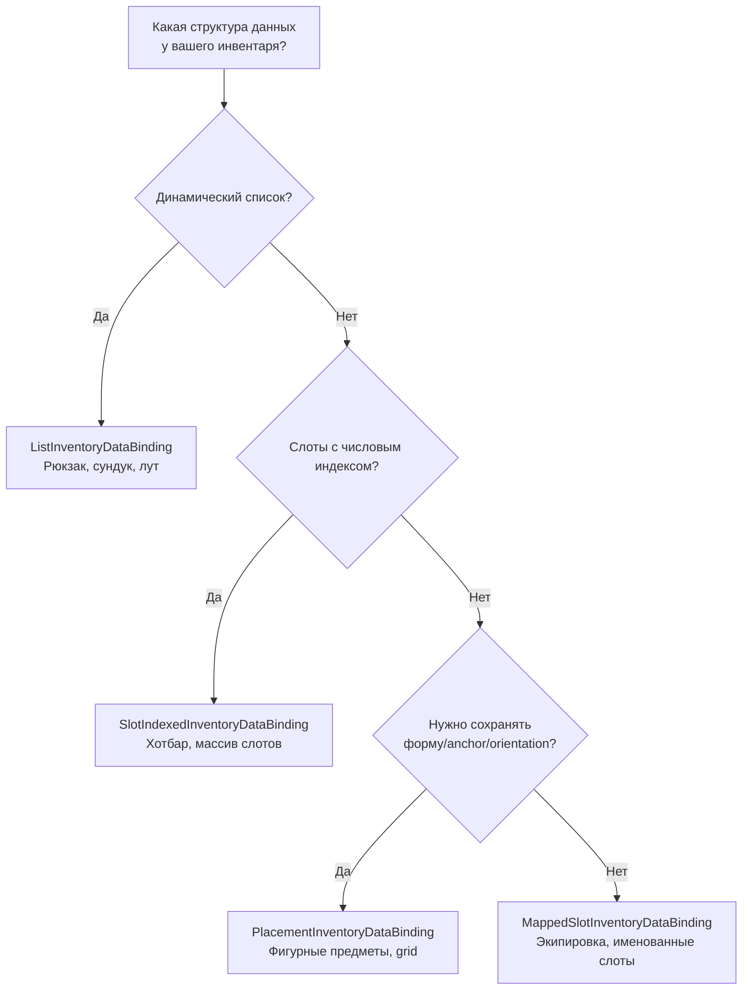

# Шаблоны DataBinding

Эта страница описывает готовые шаблоны, от которых наследуется ваш DataBinding. Каждый шаблон автоматически реализует загрузку UI, обработку событий добавления/удаления и синхронизацию с вашими данными — вам остаётся определить несколько методов-примитивов.

Общее описание DataBinding и его роли в пайплайне — на странице [Привязка данных](data-binding.md).

---

## Какой шаблон выбрать



| Шаблон | Структура данных | Синхронизация | Когда использовать |
|---|---|---|---|
| `ListInventoryDataBinding` | Динамический список | Поадаптерно (каждый адаптер отдельно) | Рюкзак, сундук, лут, торговец |
| `SlotIndexedInventoryDataBinding` | Массив/словарь по индексу | Послотово, со списком адаптеров | Хотбар, массив ячеек экипировки |
| `MappedSlotInventoryDataBinding` | Именованные свойства | Послотово + валидация на слот | Экипировка персонажа (голова, тело, оружие) |
| `PlacementInventoryDataBinding` | Размещения с anchor/orientation | По размещению, со всеми item-экземплярами | Фигурные предметы, grid-инвентари |

---

## ListInventoryDataBinding

Для инвентарей, где данные хранятся как **список**: `List<T>`, массив, коллекция из базы данных.

### Что нужно реализовать

```csharp
public class BackpackBinding : ListInventoryDataBinding<ItemSO, ItemSOAdapter>
{
    [SerializeField] private List<ItemSO> _items;

    // 1. Откуда читать данные при загрузке UI
    protected override IReadOnlyList<ItemSO> GetItems() => _items;

    // 2. Как создать адаптер из элемента данных
    protected override ItemSOAdapter CreateAdapter(ItemSO item) => new(item);

    // 3. Как добавить в данные (вызывается для КАЖДОГО адаптера в стеке)
    protected override void AddToData(ItemSOAdapter adapter) => _items.Add(adapter.Data);

    // 4. Как удалить из данных (вызывается для КАЖДОГО адаптера в стеке)
    protected override void RemoveFromData(ItemSOAdapter adapter) => _items.Remove(adapter.Data);
}
```

### Как работает автоматически

**При загрузке** (`ReloadUI`): проходит по `GetItems()`, создаёт адаптер для каждого элемента, добавляет в UI.

**При добавлении предмета** (drag & drop): итерирует все адаптеры в стеке и вызывает `AddToData` для каждого:

```
Стек из 3 предметов → AddToData(адаптер[0]), AddToData(адаптер[1]), AddToData(адаптер[2])
```

**При удалении предмета**: аналогично, `RemoveFromData` для каждого адаптера.

!!! note "Почему поадаптерно?"
    Каждый адаптер в стеке может хранить уникальные runtime-данные (серийный номер, timestamp покупки). Поадаптерная обработка гарантирует, что именно нужные экземпляры добавляются и удаляются из ваших данных.

---

## SlotIndexedInventoryDataBinding

Для инвентарей, где данные привязаны к **слотам по числовому индексу**: массив фиксированного размера, словарь `int → Item`.

### Что нужно реализовать

```csharp
public class HotbarBinding : SlotIndexedInventoryDataBinding<ItemSO, ItemSOAdapter>
{
    [SerializeField] private ItemSO[] _slots = new ItemSO[8];

    // 1. Какие слоты заняты (пустые можно не возвращать)
    protected override IEnumerable<(int index, IReadOnlyList<ItemSO> items)> GetOccupiedSlots()
    {
        for (int i = 0; i < _slots.Length; i++)
            if (_slots[i] != null)
                yield return (i, new[] { _slots[i] });
    }

    // 2. Как создать адаптер из элемента данных
    protected override ItemSOAdapter CreateAdapter(ItemSO item) => new(item);

    // 3. Как записать данные в слот (полный список адаптеров стека)
    protected override void AddToSlotData(int index, IReadOnlyList<ItemSOAdapter> adapters)
        => _slots[index] = adapters[0].Data;

    // 4. Как очистить данные слота (полный список адаптеров стека)
    protected override void RemoveFromSlotData(int index, IReadOnlyList<ItemSOAdapter> adapters)
        => _slots[index] = null;
}
```

### Как работает автоматически

**При загрузке**: проходит по `GetOccupiedSlots()`, создаёт адаптер для каждого элемента в списке `items`, собирает стек и добавляет его в UI по индексу слота.

**При добавлении/удалении**: вызывается **один раз** для всего стека и передаёт все typed adapters этого стека:

```
Стек из 3 предметов в слот #2 → AddToSlotData(2, adapters[0..2])
```

Это сохраняет данные каждого экземпляра в стеке. Если три предмета выглядят одинаково, но имеют разные runtime-данные, binding получает все три адаптера.

### Отличие от List-шаблона

| | List | SlotIndexed |
|---|---|---|
| Синхронизация | По каждому адаптеру отдельно | Один вызов на слот со списком адаптеров |
| Идентификация слота | Нет | Числовой индекс |
| Размер | Динамический | Обычно фиксированный |

---

## MappedSlotInventoryDataBinding

Для инвентарей, где каждый слот — это **отдельное именованное свойство** с собственной логикой чтения, записи и валидации. Поддерживает как единичные предметы, так и стеки — оба типа слотов можно комбинировать в одном `CreateBindingMap()`.

### Что нужно реализовать

```csharp
public class EquipmentBinding : MappedSlotInventoryDataBinding<ItemModel, ItemModelAdapter>
{
    [SerializeField] private UniversalSlot _weaponSlot;
    [SerializeField] private UniversalSlot _armorSlot;
    [SerializeField] private UniversalSlot _potionSlot;
    [SerializeField] private CharacterData _data;

    // 1. Декларативная карта: слот → как читать, писать, очищать, валидировать
    protected override Dictionary<BaseSlot, SlotBinding<ItemModel, ItemModelAdapter>> CreateBindingMap() => new()
    {
        // Единичный предмет (простой конструктор)
        [_weaponSlot] = new(
            get: () => _data.Weapon,
            set: adapter => _data.Weapon = adapter.Model,
            clear: () => _data.Weapon = null,
            canDrop: adapter => adapter.Model.Type == ItemType.Weapon
                ? RuleResult.Success()
                : RuleResult.Failure("Только оружие")),

        [_armorSlot] = new(
            get: () => _data.Armor,
            set: adapter => _data.Armor = adapter.Model,
            clear: () => _data.Armor = null),

        // Стек предметов (list-конструктор)
        [_potionSlot] = new(
            getAll: () => _data.Potions,
            add: adapters => _data.AddPotions(adapters),
            remove: adapters => _data.RemovePotions(adapters),
            clear: () => _data.ClearPotions(),
            canDrop: adapter => adapter.Model.Type == ItemType.Potion
                ? RuleResult.Success()
                : RuleResult.Failure("Только зелья")),
    };

    // 2. Как создать адаптер из элемента данных (для ReloadUI)
    protected override ItemModelAdapter CreateAdapter(ItemModel item) => new(item);
}
```

### Как работает автоматически

**При загрузке**: проходит по всем записям в `BindingMap`, вызывает `GetAll()` для каждого слота. Для каждого элемента списка создаёт отдельный адаптер и собирает их в `ItemStack` через `ItemStack.TryCreate()`.

**При добавлении**: фильтрует адаптеры типа `TAdapter` из стека, находит привязку для целевого слота, вызывает `Add(список_адаптеров)`.

**При удалении**: аналогично фильтрует адаптеры, находит привязку для исходного слота, вызывает `Remove(список_адаптеров)`.

**При проверке CanDrop/CanStartDrag**: автоматически вызывает `CanDrop(adapter)` / `CanStartDrag(adapter)` для целевого/исходного слота по `PrimaryAdapter`, если валидатор задан.

### Два конструктора SlotBinding

**Простой** — для единичных предметов (один предмет на слот):

```csharp
new SlotBinding<TData, TAdapter>(
    get: () => ...,              // чтение текущего значения (TData)
    set: adapter => ...,         // запись через адаптер (TAdapter)
    clear: () => ...,            // очистка
    canDrop: adapter => ...      // опционально: валидация при дропе (TAdapter)
)
```

Внутренне `get/set/clear` оборачиваются в list-based API: `GetAll` возвращает массив из одного элемента, `Add` вызывает `set(adapters[0])`, `Remove` вызывает `clear()`.

**Стекаемый** — для нескольких одинаковых предметов в слоте:

```csharp
new SlotBinding<TData, TAdapter>(
    getAll: () => ...,           // все элементы в слоте (IReadOnlyList<TData>)
    add: adapters => ...,        // добавить адаптеры (IReadOnlyList<TAdapter>)
    remove: adapters => ...,     // удалить адаптеры (IReadOnlyList<TAdapter>)
    clear: () => ...,            // полная очистка
    canDrop: adapter => ...      // опционально: валидация при дропе (TAdapter)
)
```

`add`/`remove` получают конкретные экземпляры адаптеров из стека. Как и в `ListInventoryDataBinding`, это позволяет работать с индивидуальными данными каждого экземпляра без промежуточного `ExtractData`.

!!! note "Оба типа в одном BindingMap"
    Простой и стекаемый конструкторы создают одинаковый `SlotBinding<TData, TAdapter>`. Их можно свободно комбинировать в одном словаре — базовый класс всегда работает через единый list-based API.

`canDrop` и `canStartDrag` — необязательные параметры в обоих конструкторах. Если не заданы, слот принимает всё, что прошло остальные правила.

### Отличие от SlotIndexed-шаблона

| | SlotIndexed | MappedSlot |
|---|---|---|
| Идентификация слота | Числовой индекс | Ссылка на объект `BaseSlot` |
| Данные слота | Общий паттерн для всех | Индивидуальный get/set/clear на каждый |
| Валидация | Общая через `CanDrop` override | Индивидуальная `canDrop` / `canStartDrag` на слот |
| Стеки | Через список адаптеров слота | Через list-based API (каждый адаптер индивидуально) |
| Количество слотов | Может быть много | Обычно < 10 |

---

## PlacementInventoryDataBinding

Для инвентарей, где нужно сохранять не только слот, но и размещение предмета: anchor, orientation, covered cells и форму предмета.

Обычно это фигурные предметы, grid-инвентари и любые системы, где предмет может занимать несколько клеток.

### Что нужно реализовать

```csharp
public class ShapedItemsBinding
    : PlacementInventoryDataBinding<ItemModel, ItemModelAdapter>
{
    [SerializeField] private List<MyPlacementModel> _placements;

    protected override IEnumerable<PlacementData<ItemModel>> GetPlacements()
    {
        foreach (var placement in _placements)
            yield return new PlacementData<ItemModel>(
                placement.Items,
                placement.AnchorIndex,
                placement.Orientation);
    }

    protected override ItemModelAdapter CreateAdapter(ItemModel item) => new(item);
    protected override ItemModel ExtractData(ItemModelAdapter adapter) => adapter.Model;

    protected override void AddPlacementData(
        PlacementCommitContext<ItemModel, ItemModelAdapter> context)
    {
        _placements.Add(new MyPlacementModel(
            context.Data,
            context.AnchorIndex,
            context.Orientation));
    }

    protected override void RemovePlacementData(
        PlacementCommitContext<ItemModel, ItemModelAdapter> context)
    {
        RemovePlacementAt(context.AnchorIndex);
    }
}
```

### Что изменилось в текущем API

`PlacementData<TData>` теперь хранит `Items`, то есть полный список item-экземпляров в размещении.

`PlacementCommitContext<TData, TAdapter>` теперь отдаёт:

- `Data` — данные для каждого адаптера в перенесённом стеке
- `Adapters` — все typed adapters из перенесённого стека
- `PrimaryData` / `Adapter` — первый элемент, только как удобство для одиночных предметов

Используйте `context.Data`, если стек может содержать разные экземпляры. Используйте `PrimaryData` только когда слот действительно хранит один предмет или ваши предметы полностью одинаковые.

---

## Базовый класс: InventoryDataBindingBase

Все шаблоны наследуются от `InventoryDataBindingBase`. Обычно от него не наследуются напрямую, но полезно знать, какие виртуальные методы доступны для override:

| Метод | По умолчанию | Когда переопределять |
|---|---|---|
| `CanStartDrag(context, entry)` | `Success` | Запретить взятие предмета из этого инвентаря |
| `CanDrop(context, entry)` | `Success` | Добавить проверки при дропе (MappedSlot переопределяет автоматически) |
| `CanSwap(args)` | `Success` | Доп. проверки при обмене предметами |
| `OnSwapCompleted(args)` | Ничего | Реакция на завершённый обмен |
| `OnDropCompletedFrom(context)` | Ничего | Реакция после завершения drop-операции, если этот инвентарь был **источником** |
| `OnDropCompletedTo(context)` | Ничего | Реакция после завершения drop-операции, если этот инвентарь был **целью** |
| `CreateItemConverter()` | `null` | Конвертация предметов между инвентарями разных форматов |

Обработка drop на занятый слот больше не является virtual-методом `InventoryDataBindingBase`. Для этого реализуйте `IPreRuleOccupiedSlotDropHandler` или `IPostRuleOccupiedSlotDropHandler` на вашем binding. Подробности — в [Опциональных интерфейсах](../reference/optional-interfaces.md).

Также доступны вспомогательные методы:

- `ReloadUI()` — полная пересинхронизация UI с данными
- `ClearUI()` — очистка всех слотов
- `AddToUIQuiet(adapter, count, slotIndex)` — добавить предмет без генерации событий
- `BeginSync()` — начать scope синхронизации (подавляет события, предотвращает feedback-loop)

---

## Отложенная обработка: OnDropCompletedFrom / OnDropCompletedTo

`OnItemAddedToUI` и `OnItemRemovedFromUI` вызываются **на каждую аллокацию** в процессе трансфера. Если перенос разбивается на несколько target-слотов (batch transfer), вы получите несколько вызовов за одну drag-операцию.

Когда это проблема — используйте `OnDropCompletedFrom` / `OnDropCompletedTo`. Они вызываются **один раз** после завершения всей drop-операции.

### Пример: слот результата крафта

Рецепт `3×A → 6×B`. В слоте 384×B. Игрок перетаскивает в инвентарь с max stack 64.

- Перенос распределяется по 6 слотам: `64+64+64+64+64+64 = 384`
- `OnItemRemovedFromUI` вызывается 6 раз с `Count = 64`
- `64 / 6 = 10` (целочисленное) — остаток теряется на каждом вызове

Решение — копить removed items и потреблять ингредиенты один раз:

```csharp
public class CraftResultDataBinding : InventoryDataBindingBase
{
    private int _pendingRemovedItems;

    protected override void OnItemRemovedFromUI(InventoryItemEventContext context)
    {
        // Только копим, не потребляем
        _pendingRemovedItems += context.Stack.Count;
    }

    protected override void OnDropCompletedFrom(DragContext context)
    {
        // Вызывается один раз после всего трансфера
        int craftsConsumed = _pendingRemovedItems / resultCount;
        _pendingRemovedItems = 0;
        manager.ConsumeCraftIngredients(craftsConsumed);
    }
}
```

### DragAmountStep

Перенос учитывает `DragAmountStep` инвентаря-источника: **общее** количество переносимых предметов округляется вниз до кратного step. Это гарантирует, что сумма всех размещений кратна step, даже если отдельные размещения — нет.

```csharp
// В инвентаре-источнике:
_inventory.SetDragAmountStep(recipe.ResultCount, DragAmountStepRounding.Ceil);
// Перенос: total = floor(total / step) * step
```
