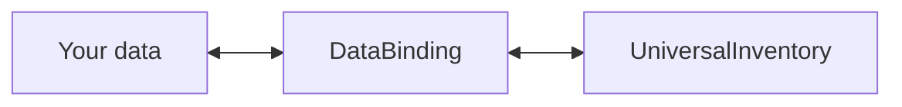
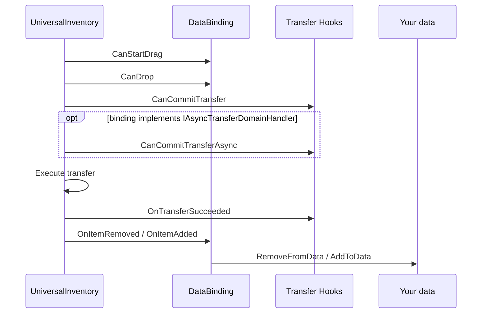

# Data Binding

`DataBinding` connects `UniversalInventory` to your own data.

This is the layer that answers:
"what should update UI state, and what should update my game model?"

---

## Simple mental model



---

## Two main templates

| Template | Use it for |
|---|---|
| `ListInventoryDataBinding<TData, TAdapter>` | backpack, chest, loot, general item lists |
| `MappedSlotInventoryDataBinding<TData, TAdapter>` | equipment, quickbar, named fixed slots |

---

## Transfer lifecycle



---

## What belongs where

| Hook | When it runs | Use it for |
|---|---|---|
| `CanStartDrag` | before drag starts | block taking an item from source |
| `CanDrop` | during preview and planning | mechanical constraints, slot compatibility |
| `CanCommitTransfer` | before real commit | fast local pre-commit checks, money, domain veto |
| `CanCommitTransferAsync` | optionally after sync pre-commit and before commit | server, file, database, external profile, any external async checks |
| `OnTransferSucceeded` | after successful commit | currency changes, analytics, domain side effects |
| `AddToData` / `RemoveFromData` | after inventory events | syncing your data |

The important split is:

- `CanDrop` is for mechanics
- `CanCommitTransfer` and `CanCommitTransferAsync` together handle pre-commit business validation
- `AddToData/RemoveFromData` are for sync only

If a binding implements both versions, the order is:

1. `CanCommitTransfer`
2. `CanCommitTransferAsync`
3. real commit

If the sync check fails, the async check is not called.

---

## Regular list binding example

```csharp
public class BackpackBinding : ListInventoryDataBinding<ItemSO, ItemSOAdapter>
{
    [SerializeField] private List<ItemSO> _items;

    protected override IReadOnlyList<ItemSO> GetItems() => _items;
    protected override ItemSOAdapter CreateAdapter(ItemSO item) => new(item);
    protected override ItemSO ExtractData(ItemSOAdapter adapter) => adapter.Data;
    protected override void AddToData(InventoryItemEventContext ctx, ItemSO item) => _items.Add(item);
    protected override void RemoveFromData(InventoryItemEventContext ctx, ItemSO item) => _items.Remove(item);
}
```

---

## Transfer-level business hook

```csharp
public class ShopInventoryBinding
    : ListInventoryDataBinding<ItemModel, ItemModelAdapter>, ITransferDomainHandler
{
    public RuleResult CanCommitTransfer(TransferDomainContext context)
    {
        return ValidateBusinessRules(context)
            ? RuleResult.Success()
            : RuleResult.Failure("Transfer is not allowed");
    }

    public void OnTransferSucceeded(TransferDomainContext context)
    {
        ApplyDomainEffects(context);
    }
}
```

---

## Async pre-commit validation

If a transfer must wait for an external check before commit, for example:

- a server response
- reading a file
- a database query
- loading external profile or save data

implement `IAsyncTransferDomainHandler` on the binding as well.

```csharp
public class ServerBackedInventoryBinding
    : ListInventoryDataBinding<ItemModel, ItemModelAdapter>,
      ITransferDomainHandler,
      IAsyncTransferDomainHandler
{
    public RuleResult CanCommitTransfer(TransferDomainContext context)
    {
        return ValidateLocalState(context)
            ? RuleResult.Success()
            : RuleResult.Failure("Local validation failed");
    }

    public async Task<RuleResult> CanCommitTransferAsync(
        TransferDomainContext context,
        CancellationToken cancellationToken)
    {
        bool allowed = await _serverApi.ValidateTransferAsync(context, cancellationToken);
        return allowed
            ? RuleResult.Success()
            : RuleResult.Failure("Server rejected the transfer");
    }
}
```

How it works:

- `CanDrop` stays a fast synchronous preview hook
- `CanCommitTransfer` handles local pre-commit checks
- `CanCommitTransferAsync` does not replace the sync version, it extends it
- if the binding implements both, `CanCommitTransfer` runs first and `CanCommitTransferAsync` runs second
- `CanCommitTransferAsync` runs once before the real commit if the binding implements the interface
- if async validation returns `RuleResult.Failure(...)`, the transfer is cancelled

Use `IAsyncTransferDomainHandler` when the answer cannot be produced immediately.
If the check is local and fast, regular `CanCommitTransfer` is enough.

---

## Item conversion

If two inventories use different item representations, a binding can provide a converter:

```csharp
protected override IInventoryItemConverter CreateItemConverter()
{
    return new MyInventoryItemConverter();
}
```

---

## Reloading from data

If your data changes outside the drag & drop pipeline, call:

```csharp
ReloadUI();
```

Or explicitly:

```csharp
ForceSyncToUI();
```
