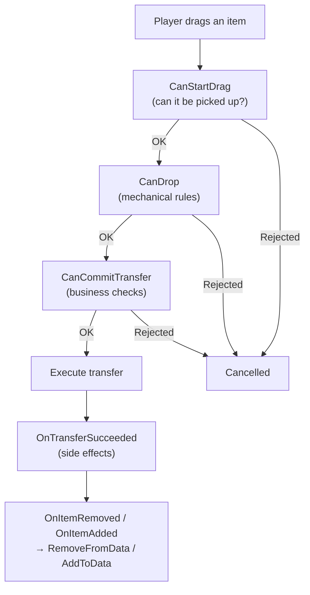

# Data Binding

`DataBinding` connects `UniversalInventory` to your own data.

This is the layer that answers:
"what should update UI state, and what should update my game model?"

---

## Simple mental model


- `UniversalInventory` manages slots, transfers and events
- `DataBinding` translates those events into changes to your data
- your data stays in your model, not inside the UI inventory

---

## Three templates

Choose a template based on your data structure:

| Template | Use it for |
|---|---|
| `ListInventoryDataBinding<TData, TAdapter>` | backpack, chest, loot, general item lists |
| `SlotIndexedInventoryDataBinding<TData, TAdapter>` | hotbar, slot array with numeric indices |
| `MappedSlotInventoryDataBinding<TData, TAdapter>` | equipment, quickbar, named fixed slots |

For a detailed description of each template, which methods to implement, and how they work internally, see [Binding Templates](binding-templates.md).

---

## Transfer lifecycle



---

## What belongs where

| Hook | When it runs | Use it for |
|---|---|---|
| `CanStartDrag` | before drag starts | block taking an item from source |
| `CanDrop` | during preview and target validation | mechanical constraints, slot compatibility |
| `CanStartTransfer` | once, before the first mutation | veto the whole operation (shop closed, ownership) |
| `CanCommitTransfer` | before each concrete placement commits | fast local per-placement checks, money, domain veto |
| `CanStartTransferAsync` | once, before the first mutation (async path only) | transfer-wide async veto: server, file, database, external profile |
| `OnTransferSucceeded` | after successful commit | currency changes, analytics, domain side effects |
| `AddToData` / `RemoveFromData` | after inventory events | syncing your data |

The important split is:

- `CanDrop` is for mechanics
- `CanStartTransfer` / `CanStartTransferAsync` veto the **whole** operation before it begins
- `CanCommitTransfer` validates each **concrete** placement before it commits
- `AddToData/RemoveFromData` are for sync only

`CanStartTransfer` and `CanStartTransferAsync` are transfer-wide and run once, before
the first mutation. `CanStartTransferAsync` runs only on the asynchronous execution
path; if an async handler is present, a synchronous transfer is rejected rather than
silently skipping the check.

For more on the three types of checks (rules, business checks, notifications), see the [Transfer Pipeline](transfer-pipeline.md) page.

---

## Regular list binding example

```csharp
public class BackpackBinding : ListInventoryDataBinding<ItemSO, ItemSOAdapter>
{
    [SerializeField] private List<ItemSO> _items;

    protected override IReadOnlyList<ItemSO> GetItems() => _items;
    protected override ItemSOAdapter CreateAdapter(ItemSO item) => new(item);
    protected override void AddToData(ItemSOAdapter adapter) => _items.Add(adapter.Data);
    protected override void RemoveFromData(ItemSOAdapter adapter) => _items.Remove(adapter.Data);
}
```

No business logic here. Just data read and write. For details on `ListInventoryDataBinding` and the other two templates, see [Binding Templates](binding-templates.md).

---

## Transfer-level business hook

If a binding needs to participate in the business logic of the operation, implement `ITransferDomainHandler`:

```csharp
public class ShopInventoryBinding
    : ListInventoryDataBinding<ItemModel, ItemModelAdapter>, ITransferDomainHandler
{
    // Transfer-wide veto, runs once before anything is mutated.
    public RuleResult CanStartTransfer(DragContext context, IInventory targetInventory)
    {
        return _shopIsOpen
            ? RuleResult.Success()
            : RuleResult.Failure("The shop is closed");
    }

    // Per-placement check, runs before each concrete placement commits.
    public RuleResult CanCommitTransfer(TransferDomainContext context)
    {
        return ValidateBusinessRules(context)
            ? RuleResult.Success()
            : RuleResult.Failure("Transfer is not allowed");
    }

    public void OnTransferSucceeded(TransferDomainContext context)
    {
        ApplyDomainEffects(context);
    }
}
```

---

## Async transfer-wide veto

If the *whole* transfer must wait for an external answer before anything moves, for
example:

- a server response
- reading a file
- a database query
- loading external profile or save data

implement `IAsyncTransferDomainHandler` on the binding as well. Its single method,
`CanStartTransferAsync`, is a transfer-wide veto that runs once before the first
mutation — the asynchronous counterpart of `CanStartTransfer`.

```csharp
public class ServerBackedInventoryBinding
    : ListInventoryDataBinding<ItemModel, ItemModelAdapter>,
      ITransferDomainHandler,
      IAsyncTransferDomainHandler
{
    // Local per-placement check, still synchronous.
    public RuleResult CanCommitTransfer(TransferDomainContext context)
    {
        return ValidateLocalState(context)
            ? RuleResult.Success()
            : RuleResult.Failure("Local validation failed");
    }

    public void OnTransferSucceeded(TransferDomainContext context) { }

    // Synchronous transfer-wide veto. Required by ITransferDomainHandler.
    // Return Success here and let the async version do the awaiting work.
    public RuleResult CanStartTransfer(DragContext context, IInventory targetInventory)
        => RuleResult.Success();

    // Asynchronous transfer-wide veto, runs once before the first mutation.
    public async Task<RuleResult> CanStartTransferAsync(
        DragContext context,
        IInventory targetInventory,
        CancellationToken cancellationToken)
    {
        bool allowed = await _serverApi.ValidateTransferAsync(context, cancellationToken);
        return allowed
            ? RuleResult.Success()
            : RuleResult.Failure("Server rejected the transfer");
    }
}
```

How it works:

- `CanDrop` stays a fast synchronous preview hook
- `CanCommitTransfer` handles local per-placement checks
- `CanStartTransferAsync` is transfer-wide and runs once, before the first mutation
- it runs only on the asynchronous execution path; a synchronous transfer is
  rejected when an async handler is present, so the check is never skipped
- if async validation returns `RuleResult.Failure(...)`, the whole transfer is cancelled

Use `IAsyncTransferDomainHandler` when the answer cannot be produced immediately.
If the check is local and fast, `CanStartTransfer` / `CanCommitTransfer` are enough.

For the exact call order, the role of `TransferDomainContext`, and the difference between
`ITransferDomainHandler` and rules, see [Optional Interfaces](../reference/optional-interfaces.md).

---

## Item conversion

If two inventories use different item representations, a binding can provide a converter:

```csharp
protected override IItemAdapterConverter CreateItemConverter()
{
    return new MyInventoryItemConverter();
}
```

For details on how conversion works in the transfer pipeline, see [Transfer Pipeline](transfer-pipeline.md).

---

## Reloading from data

If your data changes outside the drag & drop pipeline, call:

```csharp
ReloadUI();
```

Or explicitly:

```csharp
ForceSyncToUI();
```

For batch operations, use `BeginSync()` to suppress events and prevent feedback loops.

---

## What you usually don't need to know

In a typical project you don't need to dig into:

- internal inventory events
- the internal transfer engine
- low-level placement and storage classes

Usually it's enough to:

1. choose the right [template](binding-templates.md)
2. describe your adapter
3. implement sync in `AddToData/RemoveFromData`
4. optionally add `CanDrop` and `CanCommitTransfer`
