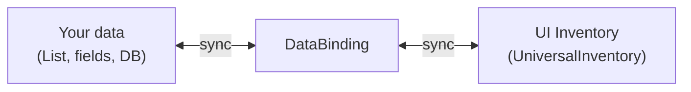
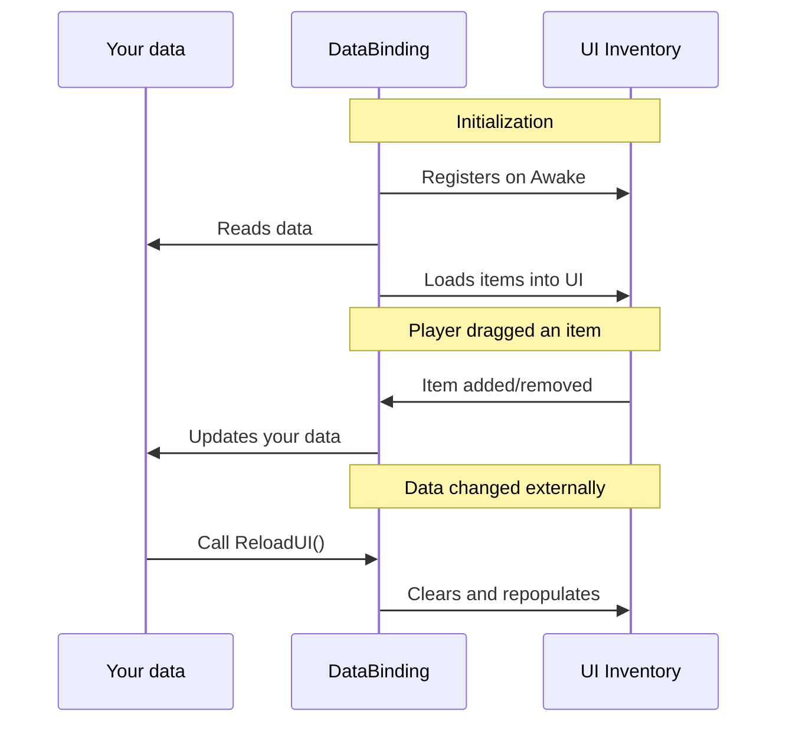
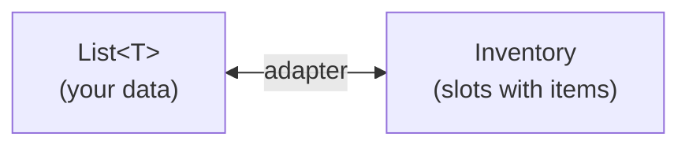
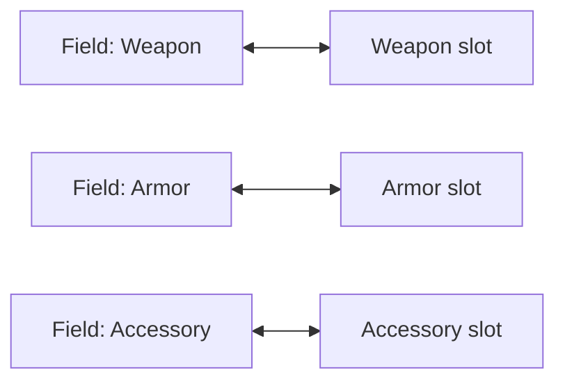
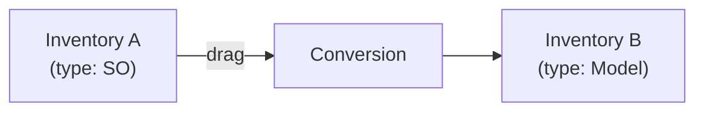

# Data Binding

DataBinding is a bridge between your game data and the UI inventory. It automatically synchronizes changes in both directions: when the player drags items in the UI and when data changes from code.

---

## Why DataBinding Is Needed

The UI inventory (`UniversalInventory`) does not store your data --- it only displays it. DataBinding connects your data (lists, fields, models) with the visual representation, providing two-way synchronization.

---

## How It Is Connected



---

## Lifecycle



---

## Two Patterns

### List (ListInventoryDataBinding)

For list-based inventories --- backpack, loot, trading.



The inheritor defines 5 methods:

```csharp
public class MyInventoryBinding : ListInventoryDataBinding<ItemSO, ItemSOAdapter>
{
    [SerializeField] private List<ItemSO> _items;

    // Where to read data from
    protected override IReadOnlyList<ItemSO> GetItems() => _items;

    // How to create an adapter (IInventoryItem wrapper) from data
    protected override ItemSOAdapter CreateAdapter(ItemSO item) => new(item);

    // How to extract data from an adapter
    protected override ItemSO ExtractData(ItemSOAdapter adapter) => adapter.Item;

    // What to do when an item is added in the UI
    protected override void AddToData(InventoryItemEventContext ctx, ItemSO item)
        => _items.Add(item);

    // What to do when an item is removed from the UI
    protected override void RemoveFromData(InventoryItemEventContext ctx, ItemSO item)
        => _items.Remove(item);
}
```

### Equipment Slots (MappedSlotInventoryDataBinding)

For inventories with fixed named slots --- equipment, quick-access panel.



Each slot is declaratively bound to data through a dictionary:

```csharp
public class EquipmentBinding : MappedSlotInventoryDataBinding<ItemModel, ItemModelAdapter>
{
    [SerializeField] private UniversalSlot _weaponSlot, _armorSlot;

    protected override Dictionary<ISlot, SlotBinding<ItemModel>> CreateBindingMap() => new()
    {
        [_weaponSlot] = new(
            get:   () => _data.Weapon,        // Where to read from
            set:   item => _data.Weapon = item, // Where to write to
            clear: () => _data.Weapon = null,   // How to clear
            canAccept: item => item.Type == ItemType.Weapon  // Validation
                ? RuleResult.Success()
                : RuleResult.Failure("Weapons only")),

        [_armorSlot] = new(
            get:   () => _data.Armor,
            set:   item => _data.Armor = item,
            clear: () => _data.Armor = null),
    };

    protected override ItemModelAdapter CreateAdapter(ItemModel item) => new(item);
    protected override ItemModel ExtractData(ItemModelAdapter a) => a.Item;
}
```

---

## Item Conversion

When transferring between inventories with different data types, the item is converted automatically.



To configure conversion, override `CreateItemConverter()` in DataBinding:

```csharp
protected override IInventoryItemConverter CreateItemConverter()
{
    return new MyConverter(); // Converts SO → Model and back
}
```

---

## Validation Hooks

DataBinding provides virtual methods for transfer control:

```csharp
// Can dragging start from this inventory?
protected override RuleResult CanStartDrag(DragContext context, DragEntry entry)
{
    if (IsLocked) return RuleResult.Failure("Inventory is locked");
    return RuleResult.Success();
}

// Can the item be dropped into this inventory?
protected override RuleResult CanDrop(DragContext context, DragEntry entry)
{
    if (!HasEnoughGold(entry)) return RuleResult.Failure("Not enough gold");
    return RuleResult.Success();
}

// Can a swap be performed?
protected override RuleResult CanSwap(InventorySwapContext context)
{
    return RuleResult.Success(); // Allowed by default
}
```

These methods are automatically integrated into the inventory's rule system.

---

## Sync Scope

For bulk data changes, use `BeginSync()` to suppress events:

```csharp
// Bulk update without extra events
using (BeginSync())
{
    _inventory.ClearAll();
    foreach (var item in newItems)
        _inventory.TryAddItem(CreateAdapter(item), 1);
}
// After exiting the scope --- a single UI update
```

`ReloadUI()` automatically uses sync scope: clears the UI and repopulates from your data.

---

## Key Classes

| Concept | Class | Description |
|---|---|---|
| Base class | `InventoryDataBindingBase` | Common synchronization and hook logic |
| List pattern | `ListInventoryDataBinding<TData, TAdapter>` | For list-based inventories |
| Slot pattern | `MappedSlotInventoryDataBinding<TData, TAdapter>` | For fixed named slots |
| Slot binding | `SlotBinding<TData>` | Declarative binding: get/set/clear/validate |
| Converter | `IInventoryItemConverter` | Item conversion between inventories |
| Event context | `InventoryItemEventContext` | Information about item addition/removal |
