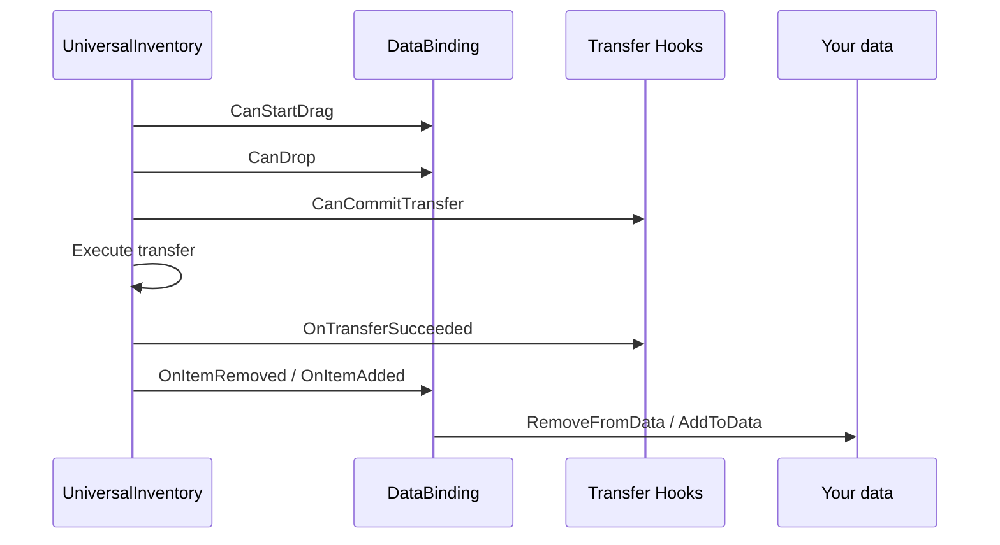

# Data Binding

`DataBinding` connects `UniversalInventory` to your own data.

This is the layer that answers:
"what should update UI state, and what should update my game model?"

---

## Simple mental model


---

## Two main templates

| Template | Use it for |
|---|---|
| `ListInventoryDataBinding<TData, TAdapter>` | backpack, chest, loot, general item lists |
| `MappedSlotInventoryDataBinding<TData, TAdapter>` | equipment, quickbar, named fixed slots |

---

## Transfer lifecycle



---

## What belongs where

| Hook | When it runs | Use it for |
|---|---|---|
| `CanStartDrag` | before drag starts | block taking an item from source |
| `CanDrop` | during preview and planning | mechanical constraints, slot compatibility |
| `CanCommitTransfer` | before real commit | money, server checks, domain veto |
| `OnTransferSucceeded` | after successful commit | currency changes, analytics, domain side effects |
| `AddToData` / `RemoveFromData` | after inventory events | syncing your data |

The important split is:

- `CanDrop` is for mechanics
- `CanCommitTransfer` is for business logic
- `AddToData/RemoveFromData` are for sync only

---

## Regular list binding example

```csharp
public class BackpackBinding : ListInventoryDataBinding<ItemSO, ItemSOAdapter>
{
    [SerializeField] private List<ItemSO> _items;

    protected override IReadOnlyList<ItemSO> GetItems() => _items;
    protected override ItemSOAdapter CreateAdapter(ItemSO item) => new(item);
    protected override ItemSO ExtractData(ItemSOAdapter adapter) => adapter.Data;
    protected override void AddToData(InventoryItemEventContext ctx, ItemSO item) => _items.Add(item);
    protected override void RemoveFromData(InventoryItemEventContext ctx, ItemSO item) => _items.Remove(item);
}
```

---

## Transfer-level business hook

```csharp
public class ShopInventoryBinding
    : ListInventoryDataBinding<ItemModel, ItemModelAdapter>, ITransferDomainHandler
{
    public RuleResult CanCommitTransfer(TransferDomainContext context)
    {
        return ValidateBusinessRules(context)
            ? RuleResult.Success()
            : RuleResult.Failure("Transfer is not allowed");
    }

    public void OnTransferSucceeded(TransferDomainContext context)
    {
        ApplyDomainEffects(context);
    }
}
```

---

## Item conversion

If two inventories use different item representations, a binding can provide a converter:

```csharp
protected override IInventoryItemConverter CreateItemConverter()
{
    return new MyInventoryItemConverter();
}
```

---

## Reloading from data

If your data changes outside the drag & drop pipeline, call:

```csharp
ReloadUI();
```

Or explicitly:

```csharp
ForceSyncToUI();
```
