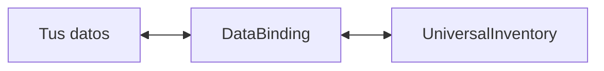
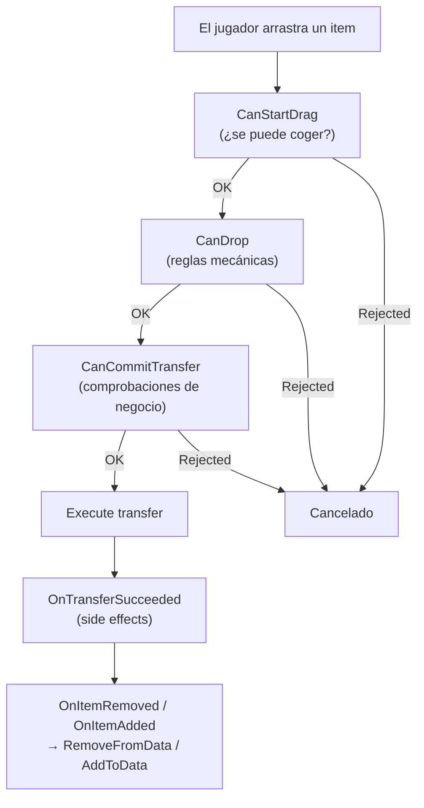

# Data Binding

`DataBinding` conecta `UniversalInventory` con tus propios datos.

Esta es la capa que responde a la pregunta:
"¿qué debe actualizar el estado de la UI y qué debe actualizar mi modelo de juego?"

---

## Modelo mental simple



- `UniversalInventory` gestiona slots, transferencias y eventos
- `DataBinding` traduce esos eventos en cambios sobre tus datos
- tus datos permanecen en tu modelo, no dentro del inventario de UI

---

## Tres plantillas

Elige una plantilla según la estructura de tus datos:

| Plantilla | Úsala para |
|---|---|
| `ListInventoryDataBinding<TData, TAdapter>` | mochila, cofre, loot, listas generales de items |
| `SlotIndexedInventoryDataBinding<TData, TAdapter>` | hotbar, array de slots con índices numéricos |
| `MappedSlotInventoryDataBinding<TData, TAdapter>` | equipamiento, quickbar, slots fijos con nombre |

Para una descripción detallada de cada plantilla, qué métodos implementar y cómo funcionan internamente, consulta [Binding Templates](binding-templates.md).

---

## Lifecycle de transferencia



---

## Qué va en cada sitio

| Hook | Cuándo se ejecuta | Úsalo para |
|---|---|---|
| `CanStartDrag` | antes de que empiece el drag | bloquear coger un item desde el origen |
| `CanDrop` | durante preview y planning | restricciones mecánicas, compatibilidad de slot |
| `CanCommitTransfer` | antes del commit real | comprobaciones rápidas locales previas al commit, dinero, veto de dominio |
| `CanCommitTransferAsync` | opcionalmente después del pre-commit síncrono y antes del commit | servidor, fichero, base de datos, perfil externo, cualquier comprobación asíncrona externa |
| `OnTransferSucceeded` | tras un commit exitoso | cambios de moneda, analíticas, side effects de dominio |
| `AddToData` / `RemoveFromData` | tras los eventos del inventario | sincronizar tus datos |

La separación importante es:

- `CanDrop` es para la mecánica
- `CanCommitTransfer` y `CanCommitTransferAsync` juntos gestionan la validación de negocio previa al commit
- `AddToData/RemoveFromData` son solo para sincronización

Si un binding implementa ambas versiones, el orden es:

1. `CanCommitTransfer`
2. `CanCommitTransferAsync`
3. commit real

Si la comprobación síncrona falla, la comprobación asíncrona no se ejecuta.

Para más sobre los tres tipos de comprobaciones (rules, business checks, notifications), consulta la página [Transfer Pipeline](transfer-pipeline.md).

---

## Ejemplo de binding de lista normal

```csharp
public class BackpackBinding : ListInventoryDataBinding<ItemSO, ItemSOAdapter>
{
    [SerializeField] private List<ItemSO> _items;

    protected override IReadOnlyList<ItemSO> GetItems() => _items;
    protected override ItemSOAdapter CreateAdapter(ItemSO item) => new(item);
    protected override void AddToData(ItemSOAdapter adapter) => _items.Add(adapter.Data);
    protected override void RemoveFromData(ItemSOAdapter adapter) => _items.Remove(adapter.Data);
}
```

Aquí no hay lógica de negocio. Solo lectura y escritura de datos. Para detalles sobre `ListInventoryDataBinding` y las otras dos plantillas, consulta [Binding Templates](binding-templates.md).

---

## Hook de negocio a nivel de transferencia

Si un binding debe participar en la lógica de negocio de la operación, implementa `ITransferDomainHandler`:

```csharp
public class ShopInventoryBinding
    : ListInventoryDataBinding<ItemModel, ItemModelAdapter>, ITransferDomainHandler
{
    public RuleResult CanCommitTransfer(TransferDomainContext context)
    {
        return ValidateBusinessRules(context)
            ? RuleResult.Success()
            : RuleResult.Failure("La transferencia no está permitida");
    }

    public void OnTransferSucceeded(TransferDomainContext context)
    {
        ApplyDomainEffects(context);
    }
}
```

---

## Validación asíncrona previa al commit

Si una transferencia debe esperar a una comprobación externa antes del commit, por ejemplo:

- una respuesta del servidor
- leer un fichero
- una consulta a base de datos
- cargar un perfil externo o datos de guardado

implementa también `IAsyncTransferDomainHandler` en el binding.

```csharp
public class ServerBackedInventoryBinding
    : ListInventoryDataBinding<ItemModel, ItemModelAdapter>,
      ITransferDomainHandler,
      IAsyncTransferDomainHandler
{
    public RuleResult CanCommitTransfer(TransferDomainContext context)
    {
        return ValidateLocalState(context)
            ? RuleResult.Success()
            : RuleResult.Failure("La validación local ha fallado");
    }

    public async Task<RuleResult> CanCommitTransferAsync(
        TransferDomainContext context,
        CancellationToken cancellationToken)
    {
        bool allowed = await _serverApi.ValidateTransferAsync(context, cancellationToken);
        return allowed
            ? RuleResult.Success()
            : RuleResult.Failure("El servidor rechazó la transferencia");
    }
}
```

Cómo funciona:

- `CanDrop` sigue siendo un hook síncrono y rápido para preview
- `CanCommitTransfer` gestiona comprobaciones locales previas al commit
- `CanCommitTransferAsync` no sustituye a la versión síncrona, la amplía
- si el binding implementa ambas, `CanCommitTransfer` se ejecuta primero y `CanCommitTransferAsync` después
- `CanCommitTransferAsync` se ejecuta una sola vez antes del commit real si el binding implementa la interfaz
- si la validación asíncrona devuelve `RuleResult.Failure(...)`, la transferencia se cancela

Usa `IAsyncTransferDomainHandler` cuando la respuesta no pueda producirse inmediatamente.
Si la comprobación es local y rápida, `CanCommitTransfer` normal es suficiente.

Para ver el orden exacto de llamadas, el papel de `TransferDomainContext` y la diferencia entre `ITransferDomainHandler` y las rules, consulta [Optional Interfaces](../reference/optional-interfaces.md).

---

## Conversión de items

Si dos inventarios usan representaciones distintas del item, un binding puede proporcionar un converter:

```csharp
protected override IItemAdapterConverter CreateItemConverter()
{
    return new MyInventoryItemConverter();
}
```

Para más detalles sobre cómo funciona la conversión dentro del transfer pipeline, consulta [Transfer Pipeline](transfer-pipeline.md).

---

## Recargar desde los datos

Si tus datos cambian fuera del pipeline de drag & drop, llama a:

```csharp
ReloadUI();
```

O explícitamente:

```csharp
ForceSyncToUI();
```

Para operaciones por lotes, usa `BeginSync()` para suprimir eventos y evitar feedback loops.

---

## Lo que normalmente no necesitas saber

En un proyecto típico no hace falta profundizar en:

- eventos internos del inventario
- estructuras helper internas del planning layer
- clases low-level del execution layer

Normalmente basta con:

1. elegir la [plantilla](binding-templates.md) correcta
2. describir tu adapter
3. implementar la sincronización en `AddToData/RemoveFromData`
4. opcionalmente añadir `CanDrop` y `CanCommitTransfer`

