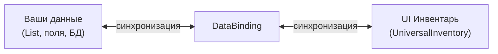
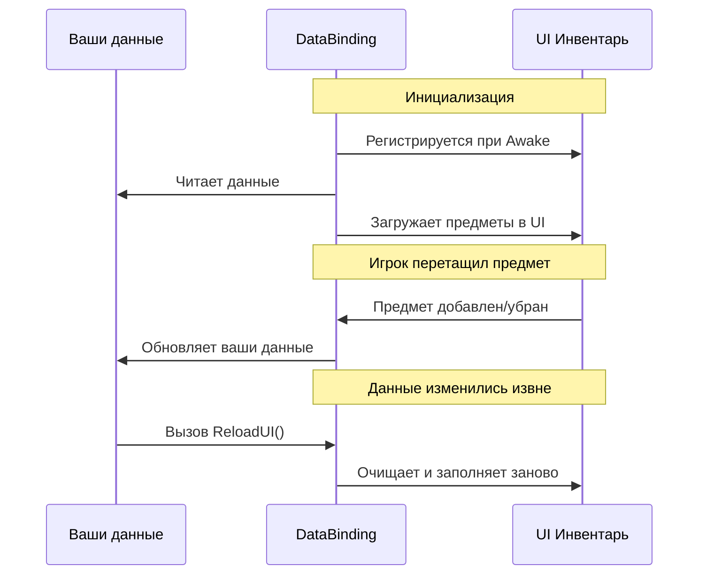
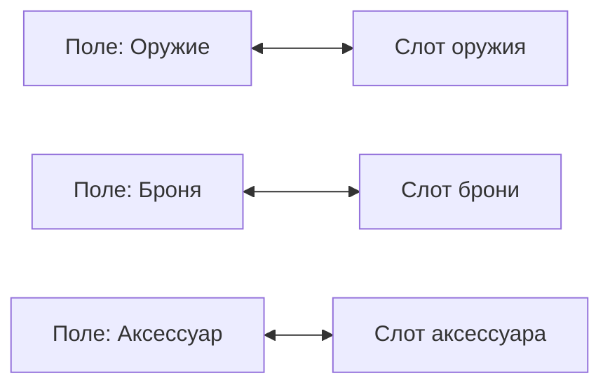

# Привязка данных (DataBinding)

DataBinding --- мост между вашими игровыми данными и UI инвентарём. Он автоматически синхронизирует изменения в обоих направлениях: когда игрок перетаскивает предметы в UI и когда данные меняются из кода.

---

## Зачем нужен DataBinding

Инвентарь в UI (`UniversalInventory`) не хранит ваши данные --- он только отображает их. DataBinding связывает ваши данные (списки, поля, модели) с визуальным представлением, обеспечивая двустороннюю синхронизацию.

---

## Как это связано



---

## Жизненный цикл



---

## Два шаблона

### Список (ListInventoryDataBinding)

Для инвентарей на основе списка --- рюкзак, лут, торговля.


Наследник определяет 5 методов:

```csharp
public class MyInventoryBinding : ListInventoryDataBinding<ItemSO, ItemSOAdapter>
{
    [SerializeField] private List<ItemSO> _items;

    // Откуда читать данные
    protected override IReadOnlyList<ItemSO> GetItems() => _items;

    // Как создать адаптер (обёртку IInventoryItem) из данных
    protected override ItemSOAdapter CreateAdapter(ItemSO item) => new(item);

    // Как извлечь данные из адаптера
    protected override ItemSO ExtractData(ItemSOAdapter adapter) => adapter.Item;

    // Что делать, когда предмет добавлен в UI
    protected override void AddToData(InventoryItemEventContext ctx, ItemSO item)
        => _items.Add(item);

    // Что делать, когда предмет убран из UI
    protected override void RemoveFromData(InventoryItemEventContext ctx, ItemSO item)
        => _items.Remove(item);
}
```

### Слоты экипировки (MappedSlotInventoryDataBinding)

Для инвентарей с фиксированными именованными слотами --- экипировка, панель быстрого доступа.



Каждый слот декларативно привязывается к данным через словарь:

```csharp
public class EquipmentBinding : MappedSlotInventoryDataBinding<ItemModel, ItemModelAdapter>
{
    [SerializeField] private UniversalSlot _weaponSlot, _armorSlot;

    protected override Dictionary<ISlot, SlotBinding<ItemModel>> CreateBindingMap() => new()
    {
        [_weaponSlot] = new(
            get:   () => _data.Weapon,        // Откуда читать
            set:   item => _data.Weapon = item, // Куда писать
            clear: () => _data.Weapon = null,   // Как очистить
            canAccept: item => item.Type == ItemType.Weapon  // Валидация
                ? RuleResult.Success()
                : RuleResult.Failure("Только оружие")),

        [_armorSlot] = new(
            get:   () => _data.Armor,
            set:   item => _data.Armor = item,
            clear: () => _data.Armor = null),
    };

    protected override ItemModelAdapter CreateAdapter(ItemModel item) => new(item);
    protected override ItemModel ExtractData(ItemModelAdapter a) => a.Item;
}
```

---

## Конвертация предметов

При переносе между инвентарями с разными типами данных предмет конвертируется автоматически.


Для настройки конвертации переопределите `CreateItemConverter()` в DataBinding:

```csharp
protected override IInventoryItemConverter CreateItemConverter()
{
    return new MyConverter(); // Преобразует SO → Model и обратно
}
```

---

## Хуки валидации

DataBinding предоставляет виртуальные методы для контроля переноса:

```csharp
// Можно ли начать перетаскивание из этого инвентаря?
protected override RuleResult CanStartDrag(DragContext context, DragEntry entry)
{
    if (IsLocked) return RuleResult.Failure("Инвентарь заблокирован");
    return RuleResult.Success();
}

// Можно ли бросить предмет в этот инвентарь?
protected override RuleResult CanDrop(DragContext context, DragEntry entry)
{
    if (!HasEnoughGold(entry)) return RuleResult.Failure("Не хватает золота");
    return RuleResult.Success();
}

// Можно ли выполнить обмен?
protected override RuleResult CanSwap(InventorySwapContext context)
{
    return RuleResult.Success(); // По умолчанию разрешено
}
```

Эти методы автоматически интегрируются в систему правил инвентаря.

---

## Scope синхронизации

При массовых изменениях данных используйте `BeginSync()`, чтобы подавить события:

```csharp
// Массовое обновление без лишних событий
using (BeginSync())
{
    _inventory.ClearAll();
    foreach (var item in newItems)
        _inventory.TryAddItem(CreateAdapter(item), 1);
}
// После выхода из scope --- одно обновление UI
```

`ReloadUI()` автоматически использует sync scope: очищает UI и заполняет заново из ваших данных.

---

## Ключевые классы

| Концепция | Класс | Описание |
|---|---|---|
| Базовый класс | `InventoryDataBindingBase` | Общая логика синхронизации и хуков |
| Шаблон списка | `ListInventoryDataBinding<TData, TAdapter>` | Для инвентарей на основе списка |
| Шаблон слотов | `MappedSlotInventoryDataBinding<TData, TAdapter>` | Для фиксированных именованных слотов |
| Привязка слота | `SlotBinding<TData>` | Декларативная привязка: get/set/clear/validate |
| Конвертер | `IInventoryItemConverter` | Преобразование предметов между инвентарями |
| Контекст события | `InventoryItemEventContext` | Информация о добавлении/удалении предмета |
