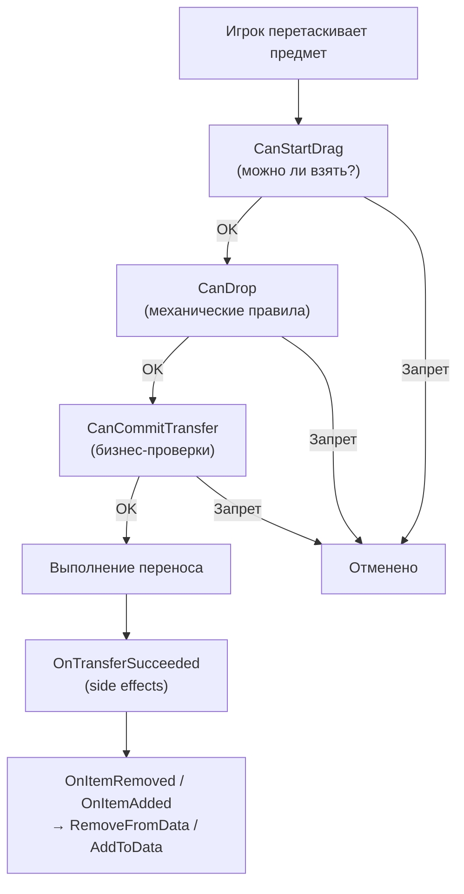

# Привязка данных (DataBinding)

`DataBinding` связывает `UniversalInventory` с вашими данными.

Это главный слой, который отвечает на вопрос:
"что в этой системе должно обновлять UI, а что должно обновлять мою игровую модель?"

---

## Простая ментальная модель


- `UniversalInventory` управляет слотами, переносом и событиями
- `DataBinding` переводит эти события в изменения ваших данных
- ваши данные остаются в вашей модели, а не внутри UI-инвентаря

---

## Три шаблона

Выберите шаблон в зависимости от структуры ваших данных:

| Шаблон | Когда использовать |
|---|---|
| `ListInventoryDataBinding<TData, TAdapter>` | обычные списки предметов, рюкзак, сундук, лут |
| `SlotIndexedInventoryDataBinding<TData, TAdapter>` | хотбар, массив слотов с числовым индексом |
| `MappedSlotInventoryDataBinding<TData, TAdapter>` | экипировка, quickbar, фиксированные именованные слоты |

Подробное описание каждого шаблона, какие методы реализовать и как они работают внутри — на отдельной странице [Шаблоны DataBinding](binding-templates.md).

---

## Жизненный цикл переноса



---

## Что где писать

| Точка | Когда вызывается | Для чего использовать |
|---|---|---|
| `CanStartDrag` | перед началом drag | запретить взять предмет из источника |
| `CanDrop` | во время preview и planning | механические ограничения: тип слота, лок, базовая совместимость |
| `CanCommitTransfer` | перед реальным commit | быстрые локальные pre-commit проверки, деньги, доменный veto |
| `CanCommitTransferAsync` | опционально, после sync pre-commit и до commit | сервер, файл, база данных, внешний профиль, любые внешние async-проверки |
| `OnTransferSucceeded` | после успешного commit | списание/начисление валюты, аналитика, доменные side effects |
| `AddToData` / `RemoveFromData` | после inventory events | синхронизация ваших данных с уже подтверждённым результатом |

Главное правило:

- `CanDrop` отвечает за механическую совместимость
- `CanCommitTransfer` и `CanCommitTransferAsync` вместе отвечают за pre-commit бизнес-проверки
- `AddToData/RemoveFromData` отвечают только за sync

Если binding реализует обе версии проверки, порядок такой:

1. `CanCommitTransfer`
2. `CanCommitTransferAsync`
3. реальный commit

Если синхронная проверка вернула отказ, асинхронная уже не вызывается.

Подробнее о трёх типах проверок (правила, бизнес-проверки, уведомления) — на странице [Конвейер переноса](transfer-pipeline.md).

---

## Пример обычного list-binding

```csharp
public class BackpackBinding : ListInventoryDataBinding<ItemSO, ItemSOAdapter>
{
    [SerializeField] private List<ItemSO> _items;

    protected override IReadOnlyList<ItemSO> GetItems() => _items;
    protected override ItemSOAdapter CreateAdapter(ItemSO item) => new(item);
    protected override void AddToData(ItemSOAdapter adapter) => _items.Add(adapter.Data);
    protected override void RemoveFromData(ItemSOAdapter adapter) => _items.Remove(adapter.Data);
}
```

Здесь нет бизнес-логики. Только чтение и запись данных. Подробнее о `ListInventoryDataBinding` и двух других шаблонах — в разделе [Шаблоны DataBinding](binding-templates.md).

---

## Пример бизнес-хука уровня переноса

Если binding должен участвовать в бизнес-логике операции, реализуйте `ITransferDomainHandler`:

```csharp
public class ShopInventoryBinding
    : ListInventoryDataBinding<ItemModel, ItemModelAdapter>, ITransferDomainHandler
{
    public RuleResult CanCommitTransfer(TransferDomainContext context)
    {
        return ValidateBusinessRules(context)
            ? RuleResult.Success()
            : RuleResult.Failure("Transfer is not allowed");
    }

    public void OnTransferSucceeded(TransferDomainContext context)
    {
        ApplyDomainEffects(context);
    }
}
```

Сюда стоит помещать:

- денежные проверки
- серверные проверки перед коммитом
- доменные ограничения уровня всей операции

Сюда не стоит помещать:

- обычный sync списка
- slot compatibility
- типовые UI-проверки

---

## Асинхронная проверка перед commit

Если перед переносом нужно дождаться внешней проверки, например:

- ответа сервера
- чтения файла
- обращения к базе данных
- загрузки сохранения или внешнего профиля

реализуйте для binding ещё и `IAsyncTransferDomainHandler`.

```csharp
public class ServerBackedInventoryBinding
    : ListInventoryDataBinding<ItemModel, ItemModelAdapter>,
      ITransferDomainHandler,
      IAsyncTransferDomainHandler
{
    public RuleResult CanCommitTransfer(TransferDomainContext context)
    {
        return ValidateLocalState(context)
            ? RuleResult.Success()
            : RuleResult.Failure("Local validation failed");
    }

    public async Task<RuleResult> CanCommitTransferAsync(
        TransferDomainContext context,
        CancellationToken cancellationToken)
    {
        bool allowed = await _serverApi.ValidateTransferAsync(context, cancellationToken);
        return allowed
            ? RuleResult.Success()
            : RuleResult.Failure("Server rejected the transfer");
    }
}
```

Как это работает:

- `CanDrop` остаётся быстрым синхронным preview-хуком
- `CanCommitTransfer` выполняет локальные pre-commit проверки
- `CanCommitTransferAsync` не заменяет sync-версию, а дополняет её
- если binding реализует обе версии, сначала вызывается `CanCommitTransfer`, потом `CanCommitTransferAsync`
- `CanCommitTransferAsync` вызывается один раз перед реальным commit, если binding реализует этот интерфейс
- если async-проверка вернула `RuleResult.Failure(...)`, перенос отменяется

Используйте `IAsyncTransferDomainHandler`, когда решение нельзя получить мгновенно.
Если проверка локальная и быстрая, достаточно обычного `CanCommitTransfer`.

Подробно о точном порядке вызовов, роли `TransferDomainContext` и различии между
`ITransferDomainHandler` и rules — в разделе [Опциональные интерфейсы](../reference/optional-interfaces.md).

---

## Конвертация предметов

Если два инвентаря используют разные представления предмета, binding может предоставить converter:

```csharp
protected override IItemAdapterConverter CreateItemConverter()
{
    return new MyInventoryItemConverter();
}
```

Это нужно, например, для торговли, где:

- торговец хранит `ScriptableObject`
- игрок хранит runtime-модель

Подробнее о конвертации — на странице [Конвейер переноса](transfer-pipeline.md).

---

## Когда обновлять UI из данных

Если данные изменились вне конвейера drag & drop, вызовите:

```csharp
ReloadUI();
```

Если вы хотите явно подчеркнуть намерение синхронизации:

```csharp
ForceSyncToUI();
```

Для массовых операций используйте `BeginSync()`, чтобы не реагировать на промежуточные события.

---

## Что пользователю обычно не нужно знать

В обычном проекте вам не нужно лезть в:

- внутренние inventory events ассета
- вспомогательные структуры этапа планирования
- низкоуровневые классы выполнения переноса

Чаще всего достаточно:

1. выбрать [подходящий шаблон](binding-templates.md)
2. описать adapter
3. реализовать sync в `AddToData/RemoveFromData`
4. при необходимости добавить `CanDrop` и `CanCommitTransfer`
