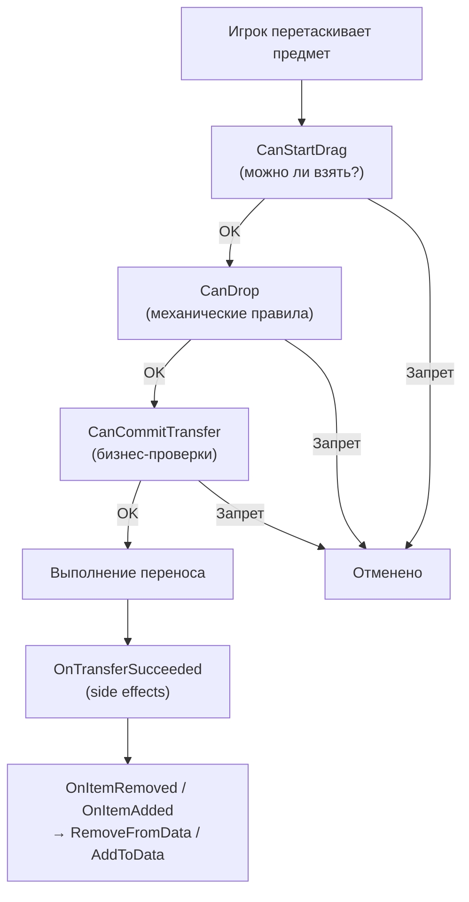

# Привязка данных (DataBinding)

`DataBinding` связывает `UniversalInventory` с вашими данными.

Это главный слой, который отвечает на вопрос:
"что в этой системе должно обновлять UI, а что должно обновлять мою игровую модель?"

---

## Простая ментальная модель


- `UniversalInventory` управляет слотами, переносом и событиями
- `DataBinding` переводит эти события в изменения ваших данных
- ваши данные остаются в вашей модели, а не внутри UI-инвентаря

---

## Основные шаблоны

Выберите шаблон в зависимости от структуры ваших данных:

| Шаблон | Когда использовать |
|---|---|
| `ListInventoryDataBinding<TData, TAdapter>` | обычные списки предметов, рюкзак, сундук, лут |
| `SlotIndexedInventoryDataBinding<TData, TAdapter>` | хотбар, массив слотов с числовым индексом |
| `MappedSlotInventoryDataBinding<TData, TAdapter>` | экипировка, quickbar, фиксированные именованные слоты |
| `PlacementInventoryDataBinding<TData, TAdapter>` | фигурные предметы, grid-инвентари, сохранение anchor/orientation |

Подробное описание каждого шаблона, какие методы реализовать и как они работают внутри — на отдельной странице [Шаблоны DataBinding](binding-templates.md).

---

## Жизненный цикл переноса



---

## Что где писать

| Точка | Когда вызывается | Для чего использовать |
|---|---|---|
| `CanStartDrag` | перед началом drag | запретить взять предмет из источника |
| `CanDrop` | во время preview и валидации цели | механические ограничения: тип слота, лок, базовая совместимость |
| `CanStartTransfer` | один раз, до первой мутации | вето на всю операцию (магазин закрыт, владение) |
| `CanCommitTransfer` | перед фиксацией каждого конкретного размещения | быстрые локальные per-placement проверки, деньги, доменный veto |
| `CanStartTransferAsync` | один раз, до первой мутации (только async-путь) | вето на весь перенос асинхронно: сервер, файл, база данных, внешний профиль |
| `OnTransferSucceeded` | после успешного commit | списание/начисление валюты, аналитика, доменные side effects |
| `AddToData` / `RemoveFromData` | после inventory events | синхронизация ваших данных с уже подтверждённым результатом |

Главное правило:

- `CanDrop` отвечает за механическую совместимость
- `CanStartTransfer` / `CanStartTransferAsync` накладывают вето на **весь** перенос до его начала
- `CanCommitTransfer` проверяет каждое **конкретное** размещение перед его фиксацией
- `AddToData/RemoveFromData` отвечают только за sync

`CanStartTransfer` и `CanStartTransferAsync` — transfer-wide и срабатывают один раз, до
первой мутации. `CanStartTransferAsync` работает только на асинхронном пути исполнения;
если async-обработчик есть, синхронный перенос отклоняется, а не молча пропускает
проверку.

Подробнее о трёх типах проверок (правила, бизнес-проверки, уведомления) — на странице [Конвейер переноса](transfer-pipeline.md).

---

## Пример обычного list-binding

```csharp
public class BackpackBinding : ListInventoryDataBinding<ItemSO, ItemSOAdapter>
{
    [SerializeField] private List<ItemSO> _items;

    protected override IReadOnlyList<ItemSO> GetItems() => _items;
    protected override ItemSOAdapter CreateAdapter(ItemSO item) => new(item);
    protected override void AddToData(ItemSOAdapter adapter) => _items.Add(adapter.Data);
    protected override void RemoveFromData(ItemSOAdapter adapter) => _items.Remove(adapter.Data);
}
```

Здесь нет бизнес-логики. Только чтение и запись данных. Подробнее о `ListInventoryDataBinding` и двух других шаблонах — в разделе [Шаблоны DataBinding](binding-templates.md).

---

## Пример бизнес-хука уровня переноса

Если binding должен участвовать в бизнес-логике операции, реализуйте `ITransferDomainHandler`:

```csharp
public class ShopInventoryBinding
    : ListInventoryDataBinding<ItemModel, ItemModelAdapter>, ITransferDomainHandler
{
    // Вето на весь перенос, срабатывает один раз до любых мутаций.
    public RuleResult CanStartTransfer(DragContext context, IInventory targetInventory)
    {
        return _shopIsOpen
            ? RuleResult.Success()
            : RuleResult.Failure("Магазин закрыт");
    }

    // Проверка на конкретное размещение, перед его фиксацией.
    public RuleResult CanCommitTransfer(TransferDomainContext context)
    {
        return ValidateBusinessRules(context)
            ? RuleResult.Success()
            : RuleResult.Failure("Transfer is not allowed");
    }

    public void OnTransferSucceeded(TransferDomainContext context)
    {
        ApplyDomainEffects(context);
    }
}
```

Сюда стоит помещать:

- денежные проверки
- серверные проверки перед коммитом
- доменные ограничения уровня всей операции

Сюда не стоит помещать:

- обычный sync списка
- slot compatibility
- типовые UI-проверки

---

## Асинхронное вето на весь перенос

Если перед переносом нужно дождаться внешней проверки, например:

- ответа сервера
- чтения файла
- обращения к базе данных
- загрузки сохранения или внешнего профиля

реализуйте для binding ещё и `IAsyncTransferDomainHandler`. Его единственный метод,
`CanStartTransferAsync`, — это вето на весь перенос, срабатывающее один раз до первой
мутации; асинхронный аналог `CanStartTransfer`.

```csharp
public class ServerBackedInventoryBinding
    : ListInventoryDataBinding<ItemModel, ItemModelAdapter>,
      ITransferDomainHandler,
      IAsyncTransferDomainHandler
{
    // Локальная проверка на размещение, по-прежнему синхронная.
    public RuleResult CanCommitTransfer(TransferDomainContext context)
    {
        return ValidateLocalState(context)
            ? RuleResult.Success()
            : RuleResult.Failure("Local validation failed");
    }

    public void OnTransferSucceeded(TransferDomainContext context) { }

    // Синхронное вето на весь перенос. Требуется интерфейсом ITransferDomainHandler.
    // Возвращаем Success, а ожидание делаем в async-версии.
    public RuleResult CanStartTransfer(DragContext context, IInventory targetInventory)
        => RuleResult.Success();

    // Асинхронное вето на весь перенос, один раз до первой мутации.
    public async Task<RuleResult> CanStartTransferAsync(
        DragContext context,
        IInventory targetInventory,
        CancellationToken cancellationToken)
    {
        bool allowed = await _serverApi.ValidateTransferAsync(context, cancellationToken);
        return allowed
            ? RuleResult.Success()
            : RuleResult.Failure("Server rejected the transfer");
    }
}
```

Как это работает:

- `CanDrop` остаётся быстрым синхронным preview-хуком
- `CanCommitTransfer` выполняет локальные проверки на каждое размещение
- `CanStartTransferAsync` — transfer-wide и срабатывает один раз, до первой мутации
- он работает только на асинхронном пути; если async-обработчик есть, синхронный
  перенос отклоняется, так что проверка не пропускается
- если async-проверка вернула `RuleResult.Failure(...)`, отменяется весь перенос

Используйте `IAsyncTransferDomainHandler`, когда решение нельзя получить мгновенно.
Если проверка локальная и быстрая, достаточно `CanStartTransfer` / `CanCommitTransfer`.

Подробно о точном порядке вызовов, роли `TransferDomainContext` и различии между
`ITransferDomainHandler` и rules — в разделе [Опциональные интерфейсы](../reference/optional-interfaces.md).

---

## Конвертация предметов

Если два инвентаря используют разные представления предмета, binding может предоставить converter:

```csharp
protected override IItemAdapterConverter CreateItemConverter()
{
    return new MyInventoryItemConverter();
}
```

Это нужно, например, для торговли, где:

- торговец хранит `ScriptableObject`
- игрок хранит runtime-модель

Подробнее о конвертации — на странице [Конвейер переноса](transfer-pipeline.md).

---

## Когда обновлять UI из данных

Если данные изменились вне конвейера drag & drop, вызовите:

```csharp
ReloadUI();
```

Если вы хотите явно подчеркнуть намерение синхронизации:

```csharp
ForceSyncToUI();
```

Для массовых операций используйте `BeginSync()`, чтобы не реагировать на промежуточные события.

---

## Что пользователю обычно не нужно знать

В обычном проекте вам не нужно лезть в:

- внутренние inventory events ассета
- внутренний движок переноса
- низкоуровневые классы размещения и хранения

Чаще всего достаточно:

1. выбрать [подходящий шаблон](binding-templates.md)
2. описать adapter
3. реализовать sync в `AddToData/RemoveFromData`
4. при необходимости добавить `CanDrop` и `CanCommitTransfer`
