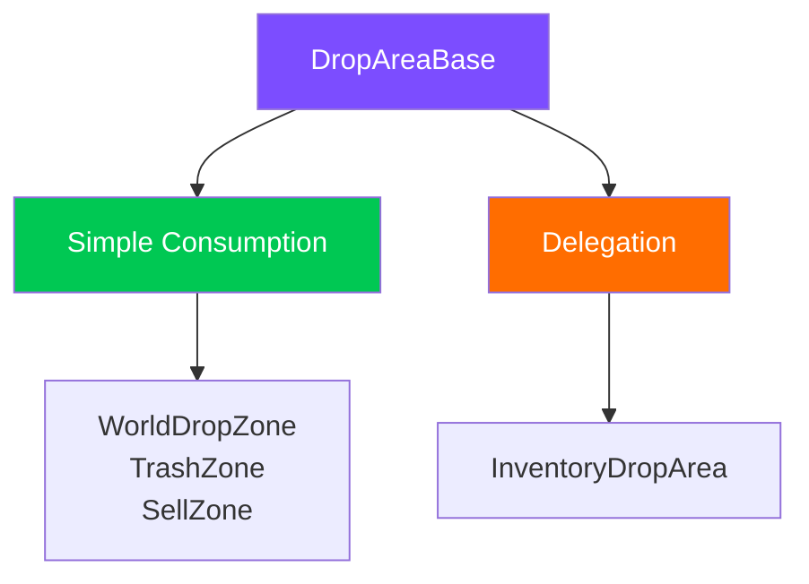
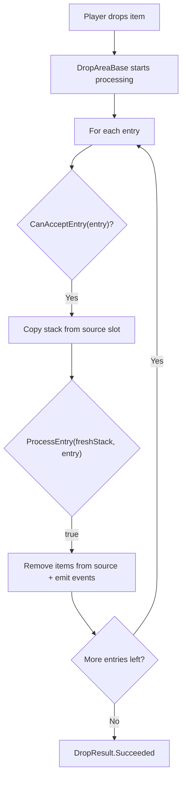

# Drop Areas (DropAreaBase)

The `DropAreaBase` base class lets you create custom drop areas without knowing system internals. It handles all interaction mechanics, while the subclass defines only **what to do** with the items.

---

## Two Usage Patterns



| Pattern | Idea | When to Use |
|---------|------|-------------|
| **Simple Consumption** | Override `CanAcceptEntry` + `ProcessEntry`. Source removal is automatic | World zone, trash, sell --- any target without an inventory |
| **Delegation** | Override `GetDropProcessor()`, return your own `IDropProcessor` | Inventory areas with complex logic (policy, swap, conversion) |

---

## Simple Consumption

A minimal subclass requires just two methods:

```csharp
public class TrashDropZone : DropAreaBase
{
    protected override bool CanAcceptEntry(DragEntry entry)
    {
        // Accept everything
        return entry.Stack != null && !entry.Stack.IsEmpty;
    }

    protected override bool ProcessEntry(ItemStack freshStack, DragEntry entry)
    {
        // Do nothing --- items simply disappear.
        // Source removal is handled automatically by the base class.
        return true;
    }
}
```

### How It Works Inside



---

## Delegation

When you need complex drop logic (the transfer pipeline, policies, swaps), override `GetDropProcessor()`:

```csharp
public class CustomInventoryArea : DropAreaBase
{
    [SerializeField] private UniversalInventory _inventory;

    protected override bool TryActivateAsFocusedTarget()
    {
        if (_inventory == null) return false;
        // Custom validation...
        DragManager.PushDropTarget(this);
        return true;
    }

    public override IDropProcessor GetDropProcessor()
    {
        // Return your own processor instead of this
        return new InventoryDropProcessor(_inventory, DragManager?.GlobalRules);
    }

    public override BaseSlot GetTargetSlot() => null;
}
```

In this case, `CanAcceptEntry` and `ProcessEntry` of the base class are **never called** --- all processing goes through the returned processor.

---

## What the Base Class Handles

`DropAreaBase` extends `Selectable` and implements `IDropTarget` + `IDropProcessor`.

### Automatic Mechanics

| Mechanic | Description |
|----------|-------------|
| **Pointer tracking** | OnPointerEnter/Exit automatically push/pop to DragAndDropManager's target stack |
| **State events** | Subscribes to OnDragStarted/Cancelled/Completed/Ended to manage interactable and raycast |
| **Raycast management** | raycastTarget is enabled only during a drag |
| **Gamepad support** | Selectable inheritance provides navigation and focus out of the box |
| **Highlight lifecycle** | OnBecomeActiveTarget/OnBecomeInactiveTarget call `OnHighlightChanged` |
| **Source removal** | In the simple consumption pattern --- automatic removal from the source slot with event emission |

---

## All Override Points

```csharp
public abstract class DropAreaBase : Selectable, IDropTarget, IDropProcessor
{
    // ── Simple Consumption ──────────────────────
    // Override for non-inventory zones

    protected virtual bool CanAcceptEntry(DragEntry entry);
    // Can this zone accept the entry?
    // Default: true

    protected virtual bool ProcessEntry(ItemStack freshStack, DragEntry entry);
    // What to do with the items? Source removal is automatic.
    // Default: false (no-op)

    // ── Delegation ──────────────────────────────
    // Override for inventory-based zones

    public virtual IDropProcessor GetDropProcessor();
    // Default: this (simple consumption)

    public virtual BaseSlot GetTargetSlot();
    // Default: null

    // ── Common ──────────────────────────────────

    internal virtual bool TryActivateAsFocusedTarget();
    // Called when cursor enters during a drag.
    // Default: checks CanAcceptEntry on first entry + PushDropTarget.

    protected virtual void OnTargetDeactivated();
    // Called when cursor leaves. For resetting internal state.

    protected virtual void OnHighlightChanged(bool highlighted, bool canAccept);
    // Called when highlight state changes. highlighted = is the zone active,
    // canAccept = can it accept the current item.

    protected virtual bool RemoveFromSource { get; }
    // Whether to remove items from source after ProcessEntry.
    // Default: true. Override to false for copy/preview zones.
}
```

---

## Subclass Examples

### WorldDropZone --- Spawn in 3D World

The snippet below follows the current `Demo2 Loot` implementation.

```csharp
public class WorldDropZone : DropAreaBase
{
    [SerializeField] private Transform _spawnPoint;

    protected override bool CanAcceptEntry(DragEntry entry)
    {
        // All adapters must have a 3D prefab
        foreach (var adapter in entry.Stack.Adapters)
            if (adapter is not ItemAdapterSoWith3DAdapter with3D || with3D.WorldPrefab == null)
                return false;
        return true;
    }

    protected override bool ProcessEntry(ItemStack freshStack, DragEntry entry)
    {
        foreach (var adapter in freshStack.Adapters)
        {
            var with3D = (ItemAdapterSoWith3DAdapter)adapter;
            Instantiate(with3D.WorldPrefab, _spawnPoint.position, Quaternion.identity);
        }
        return true;
    }
}
```

### SellDropZone --- Sell for Gold

```csharp
public class SellDropZone : DropAreaBase
{
    [SerializeField] private PlayerWallet _wallet;

    protected override bool CanAcceptEntry(DragEntry entry)
    {
        return entry.Stack.PrimaryAdapter is ISellable;
    }

    protected override bool ProcessEntry(ItemStack freshStack, DragEntry entry)
    {
        int total = 0;
        foreach (var adapter in freshStack.Adapters)
            total += ((ISellable)adapter).SellPrice;
        _wallet.AddGold(total);
        return true;
    }
}
```

### PreviewDropZone --- View Without Removal

```csharp
public class PreviewDropZone : DropAreaBase
{
    protected override bool RemoveFromSource => false;

    protected override bool CanAcceptEntry(DragEntry entry)
        => entry.Stack?.PrimaryAdapter is IPreviewable;

    protected override bool ProcessEntry(ItemStack freshStack, DragEntry entry)
    {
        ShowPreview(freshStack);
        return true;
    }
}
```

`RemoveFromSource = false` disables automatic source removal. Items remain in the original inventory.

---

## Highlighting

Override `OnHighlightChanged` for visual feedback:

```csharp
[SerializeField] private Image _highlight;
[SerializeField] private Color _validColor = Color.green;
[SerializeField] private Color _invalidColor = Color.red;

protected override void OnHighlightChanged(bool highlighted, bool canAccept)
{
    if (_highlight == null) return;
    _highlight.color = highlighted
        ? (canAccept ? _validColor : _invalidColor)
        : Color.clear;
}
```

`canAccept` is determined automatically via `CanAcceptEntry` on the first entry during hover.

---

## Reference

| Class | Pattern | Description |
|-------|---------|-------------|
| `DropAreaBase` | --- | Base class for all drop areas |
| `WorldDropZone` | Simple Consumption | Spawns 3D objects in the world |
| `InventoryDropArea` | Delegation | Drop into an inventory through the transfer pipeline |
