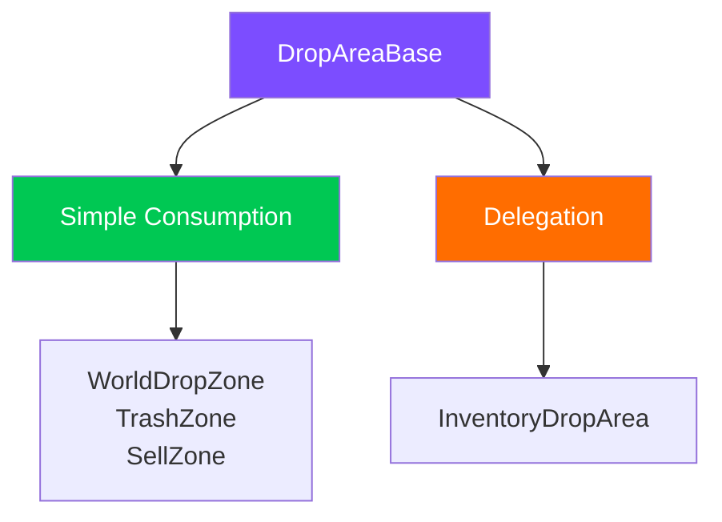
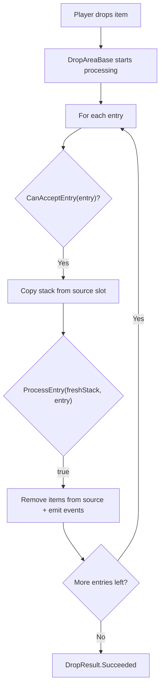

# Drop Areas (DropAreaBase)

La clase base `DropAreaBase` te permite crear drop areas personalizadas sin conocer los internals del sistema. Se encarga de toda la mecánica de interacción, mientras que la subclase define únicamente **qué hacer** con los items.

---

## Dos patrones de uso



| Patrón | Idea | Cuándo usarlo |
|---------|------|-------------|
| **Simple Consumption** | Sobrescribe `CanAcceptEntry` + `ProcessEntry`. La eliminación del source es automática | Zona del mundo, papelera, venta: cualquier target sin inventario |
| **Delegation** | Sobrescribe `GetDropProcessor()`, devuelve tu propio `IDropProcessor` | Áreas de inventario con lógica compleja (policy, swap, conversión) |

---

## Simple Consumption

Una subclase mínima solo necesita dos métodos:

```csharp
public class TrashDropZone : DropAreaBase
{
    protected override bool CanAcceptEntry(DragEntry entry)
    {
        // Accept everything
        return entry.Stack != null && !entry.Stack.IsEmpty;
    }

    protected override bool ProcessEntry(ItemStack freshStack, DragEntry entry)
    {
        // Do nothing --- items simply disappear.
        // Source removal is handled automatically by the base class.
        return true;
    }
}
```

### Cómo funciona internamente



---

## Delegation

Cuando necesitas lógica compleja de drop (el pipeline de transferencia, policies, swaps), sobrescribe `GetDropProcessor()`:

```csharp
public class CustomInventoryArea : DropAreaBase
{
    [SerializeField] private UniversalInventory _inventory;

    protected override bool TryActivateAsFocusedTarget()
    {
        if (_inventory == null) return false;
        // Custom validation...
        DragManager.PushDropTarget(this);
        return true;
    }

    public override IDropProcessor GetDropProcessor()
    {
        // Return your own processor instead of this
        return new InventoryDropProcessor(_inventory, DragManager?.GlobalRules);
    }

    public override BaseSlot GetTargetSlot() => null;
}
```

En este caso, `CanAcceptEntry` y `ProcessEntry` de la clase base **nunca se llaman**: todo el procesamiento pasa a través del processor devuelto.

---

## Qué maneja la clase base

`DropAreaBase` hereda de `Selectable` e implementa `IDropTarget` + `IDropProcessor`.

### Mecánicas automáticas

| Mecánica | Descripción |
|----------|-------------|
| **Seguimiento del puntero** | `OnPointerEnter/Exit` hace push/pop automático en la target stack de `DragAndDropManager` |
| **Eventos de estado** | Se suscribe a OnDragStarted/Cancelled/Completed/Ended para gestionar interactable y raycast |
| **Gestión de raycast** | `raycastTarget` solo está activado durante un drag |
| **Soporte para gamepad** | La herencia de `Selectable` aporta navegación y focus de serie |
| **Lifecycle de highlight** | `OnBecomeActiveTarget/OnBecomeInactiveTarget` llaman a `OnHighlightChanged` |
| **Eliminación del source** | En el patrón simple consumption, eliminación automática del source slot con emisión de eventos |

---

## Todos los puntos de override

```csharp
public abstract class DropAreaBase : Selectable, IDropTarget, IDropProcessor
{
    // ── Simple Consumption ──────────────────────
    // Override for non-inventory zones

    protected virtual bool CanAcceptEntry(DragEntry entry);
    // Can this zone accept the entry?
    // Default: true

    protected virtual bool ProcessEntry(ItemStack freshStack, DragEntry entry);
    // What to do with the items? Source removal is automatic.
    // Default: false (no-op)

    // ── Delegation ──────────────────────────────
    // Override for inventory-based zones

    public virtual IDropProcessor GetDropProcessor();
    // Default: this (simple consumption)

    public virtual BaseSlot GetTargetSlot();
    // Default: null

    // ── Common ──────────────────────────────────

    internal virtual bool TryActivateAsFocusedTarget();
    // Called when cursor enters during a drag.
    // Default: checks CanAcceptEntry on first entry + PushDropTarget.

    protected virtual void OnTargetDeactivated();
    // Called when cursor leaves. For resetting internal state.

    protected virtual void OnHighlightChanged(bool highlighted, bool canAccept);
    // Called when highlight state changes. highlighted = is the zone active,
    // canAccept = can it accept the current item.

    protected virtual bool RemoveFromSource { get; }
    // Whether to remove items from source after ProcessEntry.
    // Default: true. Override to false for copy/preview zones.
}
```

---

## Ejemplos de subclase

### WorldDropZone --- Spawn en mundo 3D

El fragmento siguiente sigue la implementación actual de `Demo2 Loot`.

```csharp
public class WorldDropZone : DropAreaBase
{
    [SerializeField] private Transform _spawnPoint;

    protected override bool CanAcceptEntry(DragEntry entry)
    {
        // All adapters must have a 3D prefab
        foreach (var adapter in entry.Stack.Adapters)
            if (adapter is not ItemAdapterSoWith3DAdapter with3D || with3D.WorldPrefab == null)
                return false;
        return true;
    }

    protected override bool ProcessEntry(ItemStack freshStack, DragEntry entry)
    {
        foreach (var adapter in freshStack.Adapters)
        {
            var with3D = (ItemAdapterSoWith3DAdapter)adapter;
            Instantiate(with3D.WorldPrefab, _spawnPoint.position, Quaternion.identity);
        }
        return true;
    }
}
```

### SellDropZone --- Vender por oro

```csharp
public class SellDropZone : DropAreaBase
{
    [SerializeField] private PlayerWallet _wallet;

    protected override bool CanAcceptEntry(DragEntry entry)
    {
        return entry.Stack.PrimaryAdapter is ISellable;
    }

    protected override bool ProcessEntry(ItemStack freshStack, DragEntry entry)
    {
        int total = 0;
        foreach (var adapter in freshStack.Adapters)
            total += ((ISellable)adapter).SellPrice;
        _wallet.AddGold(total);
        return true;
    }
}
```

### PreviewDropZone --- Ver sin eliminar

```csharp
public class PreviewDropZone : DropAreaBase
{
    protected override bool RemoveFromSource => false;

    protected override bool CanAcceptEntry(DragEntry entry)
        => entry.Stack?.PrimaryAdapter is IPreviewable;

    protected override bool ProcessEntry(ItemStack freshStack, DragEntry entry)
    {
        ShowPreview(freshStack);
        return true;
    }
}
```

`RemoveFromSource = false` desactiva la eliminación automática del source. Los items permanecen en el inventario original.

---

## Highlighting

Sobrescribe `OnHighlightChanged` para añadir feedback visual:

```csharp
[SerializeField] private Image _highlight;
[SerializeField] private Color _validColor = Color.green;
[SerializeField] private Color _invalidColor = Color.red;

protected override void OnHighlightChanged(bool highlighted, bool canAccept)
{
    if (_highlight == null) return;
    _highlight.color = highlighted
        ? (canAccept ? _validColor : _invalidColor)
        : Color.clear;
}
```

`canAccept` se determina automáticamente mediante `CanAcceptEntry` sobre la primera entry durante el hover.

---

## Referencia

| Clase | Patrón | Descripción |
|-------|---------|-------------|
| `DropAreaBase` | --- | Clase base para todas las drop areas |
| `WorldDropZone` | Simple Consumption | Crea objetos 3D en el mundo |
| `InventoryDropArea` | Delegation | Drop dentro del inventario vía el pipeline de transferencia |

