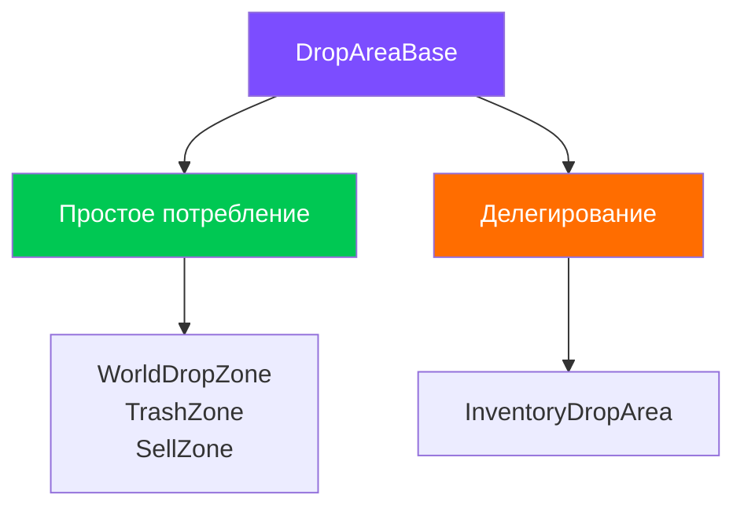
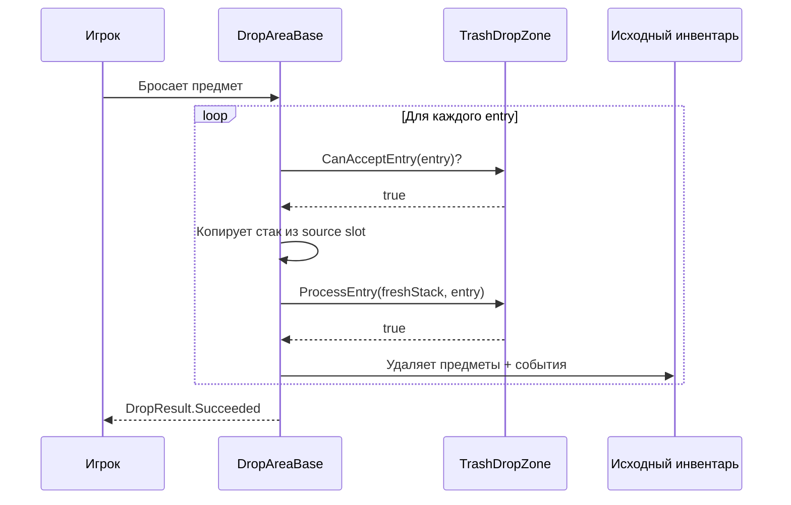

# Зоны дропа (DropAreaBase)

Базовый класс `DropAreaBase` позволяет создавать кастомные зоны дропа без знания внутренностей системы. Он берёт на себя всю механику взаимодействия, а подкласс определяет только **что делать** с предметами.

---

## Два паттерна использования



| Паттерн | Суть | Когда использовать |
|---------|------|--------------------|
| **Простое потребление** | Переопределить `CanAcceptEntry` + `ProcessEntry`. Удаление из источника --- автоматически | Зона мира, корзина, продажа --- любая цель без инвентаря |
| **Делегирование** | Переопределить `GetDropProcessor()`, вернуть свой `IDropProcessor` | Инвентарные области со сложной логикой (policy, planner, swap) |

---

## Простое потребление

Минимальный подкласс --- всего два метода:

```csharp
public class TrashDropZone : DropAreaBase
{
    protected override bool CanAcceptEntry(DragEntry entry)
    {
        // Принимаем всё
        return entry.Stack != null && !entry.Stack.IsEmpty;
    }

    protected override bool ProcessEntry(ItemStack freshStack, DragEntry entry)
    {
        // Ничего не делаем --- предметы просто исчезают.
        // Удаление из источника выполнит базовый класс автоматически.
        return true;
    }
}
```

### Как работает внутри



---

## Делегирование

Когда нужна сложная логика дропа (planner/executor, policy, swap), переопределите `GetDropProcessor()`:

```csharp
public class CustomInventoryArea : DropAreaBase
{
    [SerializeField] private UniversalInventory _inventory;

    protected override bool TryActivateAsFocusedTarget()
    {
        if (_inventory == null) return false;
        // Своя валидация...
        DragManager.PushDropTarget(this);
        return true;
    }

    public override IDropProcessor GetDropProcessor()
    {
        // Возвращаем свой процессор вместо this
        return new InventoryDropProcessor(_inventory, DragManager?.GlobalRules);
    }

    public override ISlot GetTargetSlot() => null;
}
```

В этом случае методы `CanAcceptEntry` и `ProcessEntry` базового класса **не вызываются** --- вся обработка идёт через возвращённый процессор.

---

## Что делает базовый класс

`DropAreaBase` наследует `Selectable` и реализует `IDropTarget` + `IDropProcessor`.

### Автоматическая механика

| Механика | Описание |
|----------|----------|
| **Pointer tracking** | OnPointerEnter/Exit автоматически push/pop в стек целей DragAndDropManager |
| **State events** | Подписка на OnDragStarted/Cancelled/Completed/Ended для управления interactable и raycast |
| **Raycast management** | raycastTarget включается только во время перетаскивания |
| **Gamepad support** | Наследование от Selectable даёт навигацию и фокус из коробки |
| **Highlight lifecycle** | OnBecomeActiveTarget/OnBecomeInactiveTarget вызывают `OnHighlightChanged` |
| **Source removal** | В паттерне простого потребления --- автоматическое удаление из слота-источника с эмиссией событий |

---

## Все override-точки

```csharp
public abstract class DropAreaBase : Selectable, IDropTarget, IDropProcessor
{
    // ── Простое потребление ──────────────────────
    // Переопределить для зон без инвентаря

    protected virtual bool CanAcceptEntry(DragEntry entry);
    // Может ли зона принять этот entry?
    // По умолчанию: true

    protected virtual bool ProcessEntry(ItemStack freshStack, DragEntry entry);
    // Что сделать с предметами? Удаление из источника --- автоматически.
    // По умолчанию: false (ничего не делает)

    // ── Делегирование ────────────────────────────
    // Переопределить для зон с инвентарём

    public virtual IDropProcessor GetDropProcessor();
    // По умолчанию: this (простое потребление)

    public virtual ISlot GetTargetSlot();
    // По умолчанию: null

    // ── Общие ────────────────────────────────────

    internal virtual bool TryActivateAsFocusedTarget();
    // Вызывается при наведении курсора во время перетаскивания.
    // По умолчанию: проверяет CanAcceptEntry на первом entry + PushDropTarget.

    protected virtual void OnTargetDeactivated();
    // Вызывается при уходе курсора. Для сброса внутреннего состояния.

    protected virtual void OnHighlightChanged(bool highlighted, bool canAccept);
    // Вызывается при смене подсветки. highlighted = активна ли зона,
    // canAccept = может ли принять текущий предмет.
}
```

---

## Примеры подклассов

### WorldDropZone --- спавн в 3D мире

```csharp
public class WorldDropZone : DropAreaBase
{
    [SerializeField] private Transform _spawnPoint;

    protected override bool CanAcceptEntry(DragEntry entry)
    {
        // Все адаптеры должны иметь 3D-префаб
        foreach (var adapter in entry.Stack.Adapters)
            if (adapter is not IWorld3DAdapter w || w.WorldPrefab == null)
                return false;
        return true;
    }

    protected override bool ProcessEntry(ItemStack freshStack, DragEntry entry)
    {
        foreach (var adapter in freshStack.Adapters)
        {
            var w = (IWorld3DAdapter)adapter;
            Instantiate(w.WorldPrefab, _spawnPoint.position, Quaternion.identity);
        }
        return true;
    }
}
```

### SellDropZone --- продажа за золото

```csharp
public class SellDropZone : DropAreaBase
{
    [SerializeField] private PlayerWallet _wallet;

    protected override bool CanAcceptEntry(DragEntry entry)
    {
        return entry.Stack.PrimaryAdapter is ISellable;
    }

    protected override bool ProcessEntry(ItemStack freshStack, DragEntry entry)
    {
        int total = 0;
        foreach (var adapter in freshStack.Adapters)
            total += ((ISellable)adapter).SellPrice;
        _wallet.AddGold(total);
        return true;
    }
}
```

---

## Подсветка

Переопределите `OnHighlightChanged` для визуального отклика:

```csharp
[SerializeField] private Image _highlight;
[SerializeField] private Color _validColor = Color.green;
[SerializeField] private Color _invalidColor = Color.red;

protected override void OnHighlightChanged(bool highlighted, bool canAccept)
{
    if (_highlight == null) return;
    _highlight.color = highlighted
        ? (canAccept ? _validColor : _invalidColor)
        : Color.clear;
}
```

`canAccept` определяется автоматически через `CanAcceptEntry` на первом entry при наведении.

---

## Справочник

| Класс | Паттерн | Описание |
|-------|---------|----------|
| `DropAreaBase` | --- | Базовый класс для всех зон дропа |
| `WorldDropZone` | Простое потребление | Спавн 3D-объектов в мире |
| `InventoryDropArea` | Делегирование | Дроп в инвентарь через planner/executor |
