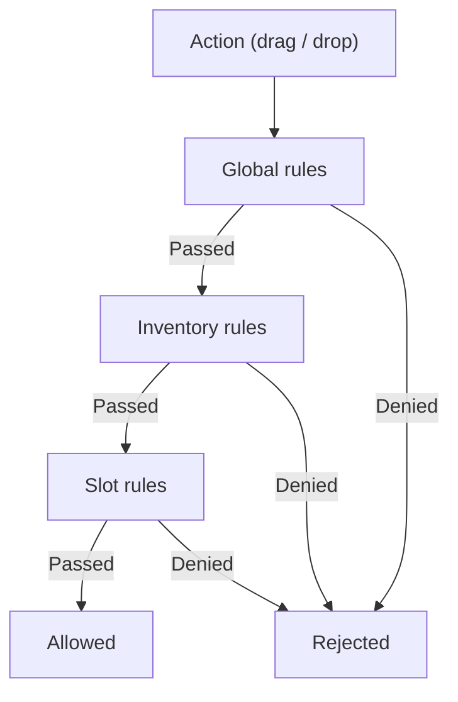
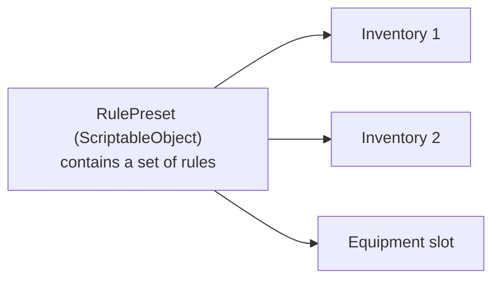
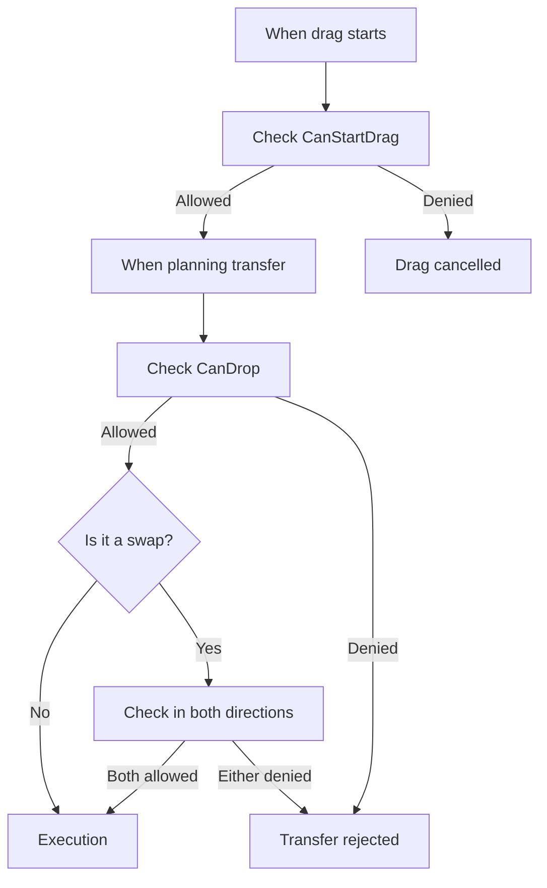

# Rules

Rules control what can be dragged and where it can be dropped. The system validates rules at three levels: global, inventory, and slot --- the first denial stops the operation.

---

## Why Rules Are Needed

Rules separate constraint logic from placement logic. Instead of embedding checks into inventory code, you declaratively describe constraints --- through the Inspector or code --- and the system automatically applies them on every transfer.

!!! note "Rules are not the same as business hooks"
    Rules handle mechanical transfer constraints: can the item be dragged, can it be dropped into this target, does the slot accept this type.
    If you need operation-level checks such as enough gold, server authorization, or post-success side effects, use transfer-level hooks (`CanCommitTransfer`, `OnTransferSucceeded`) instead of `CanDrop`.

---

## Three Validation Levels



Each rule returns a `RuleResult` --- success or denial with a reason. Rules are validated in priority order (lower = earlier).

| Level | Where configured | Scope | Example |
|---|---|---|---|
| **Global** | `DragAndDropManager` | All inventories | Deny drop into the same slot |
| **Inventory** | `UniversalInventory` / `DataBinding` | Specific inventory | Unique item limit |
| **Slot** | `UniversalSlot` | Specific slot | Weapons only in weapon slot |

---

## Built-in Rules

| Rule | Level | What it does |
|---|---|---|
| `SameSlotRule` | Global | Denies dropping an item into the same slot |
| `SameInventoryRule` | Inventory | Allows/denies movement within the same inventory |
| `ItemIdFilterRule` | Inventory / Slot | Whitelist or blacklist items by ID |
| `UniqueItemLimitRule` | Inventory | Limits the number of unique items |
| `MaxStackSizeRule` | Inventory | Limits stack size in a slot |
| `SlotLockRule` | Inventory | Locks specific slots |
| `CustomRule` | Inventory | Arbitrary validation via lambdas |

---

## Creating Your Own Rule

```csharp
using DragAndDropSystem.Core;
using DragAndDropSystem.Rules;

// Rule: items of a certain level
[Serializable]
public class ItemLevelRule : DragRuleBase, ISlotRule
{
    [SerializeField] private int _minLevel = 1;

    // Validation priority (lower = earlier)
    public override int Priority => 50;

    // Check when drag starts (optional)
    public override RuleResult CanStartDrag(DragContext context, DragEntry entry)
    {
        return RuleResult.Success(); // Always allow
    }

    // Check on drop
    public override RuleResult CanDrop(DragContext context, DragEntry entry)
    {
        // Get item from context
        if (entry.Stack?.Item is ILeveledItem leveled)
        {
            if (leveled.Level < _minLevel)
                return RuleResult.Failure($"Requires level {_minLevel}+");
        }

        return RuleResult.Success();
    }
}
```

!!! tip "Marker Interfaces"
    Implement `IGlobalRule`, `IInventoryRule`, or `ISlotRule` depending on the desired level.
    A single rule can implement multiple interfaces (e.g., `IInventoryRule, ISlotRule`).

---

## Rule Presets

Presets allow reusing rule sets across inventories and slots.



- Create a `RulePreset` as a ScriptableObject in the project.
- Add the desired rules (inline or nested presets).
- Assign the preset to an inventory, slot, or DataBinding through the Inspector.
- Presets support nesting (with circular reference protection).

---

## Where Rules Are Validated



Specific validation points:

1. **Drag start** --- global + inventory + slot rules of the source.
2. **Transfer planning** --- global + inventory + slot rules of the target.
3. **Swap** --- rules are validated in both directions (A&rarr;B and B&rarr;A).

---

## Key Classes

| Concept | Class | Description |
|---|---|---|
| Result | `RuleResult` | Success or denial with reason |
| Base interface | `IDragRule` | Contract: `CanStartDrag` + `CanDrop` + `Priority` |
| Base class | `DragRuleBase` | Convenient inheritor with default implementation |
| Global validator | `GlobalRuleValidator` | Validates `IGlobalRule` rules |
| Inventory validator | `InventoryRuleValidator` | Validates `IInventoryRule` rules |
| Slot validator | `SlotRuleValidator` | Validates `ISlotRule` rules |
| Preset | `RulePreset<TRule>` | ScriptableObject container for rules |
