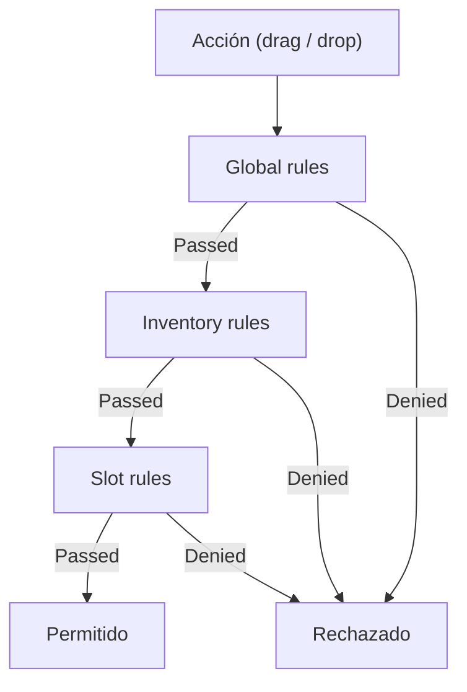
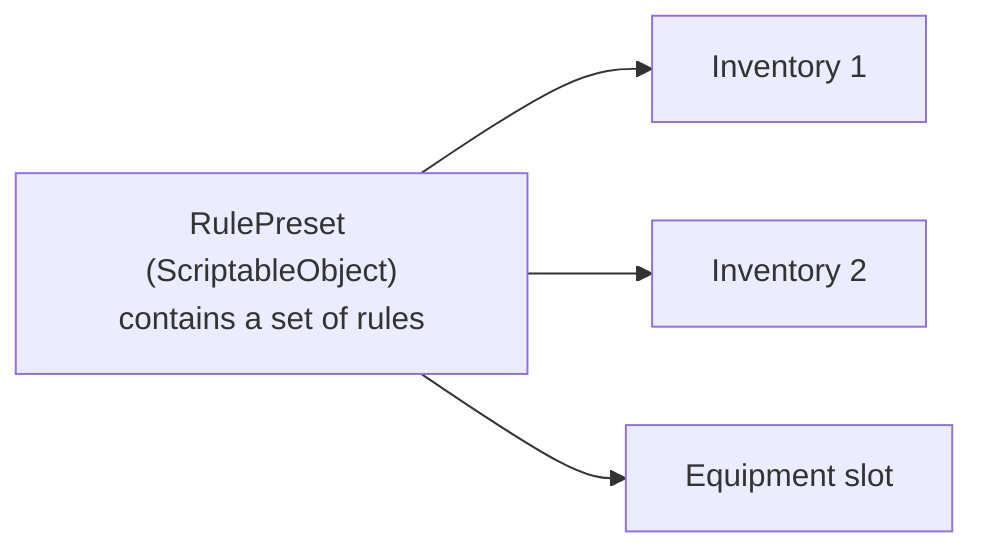
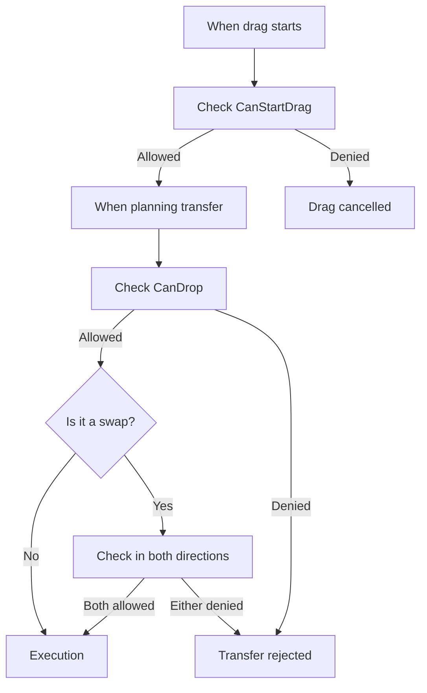

# Rules

Las rules controlan qué puede arrastrarse y dónde puede soltarse. El sistema valida rules en tres niveles: global, inventario y slot; la primera denegación detiene la operación.

---

## Por qué hacen falta las rules

Las rules separan la lógica de restricciones de la lógica de colocación. En vez de incrustar comprobaciones dentro del código del inventario, describes las restricciones de forma declarativa, desde el Inspector o desde código, y el sistema las aplica automáticamente en cada transferencia.

!!! note "Las rules no son lo mismo que los business hooks"
    Las rules se ocupan de restricciones mecánicas de transferencia: si el item puede arrastrarse, si puede soltarse en este objetivo, si el slot acepta este tipo.
    Si necesitas comprobaciones a nivel de operación como suficiente oro, autorización del servidor o side effects después del éxito, usa transfer-level hooks (`CanCommitTransfer`, `CanCommitTransferAsync`, `OnTransferSucceeded`) en lugar de `CanDrop`.
    Para una comparación compacta, consulta también [Transfer Pipeline](transfer-pipeline.md) y [Drop Policy Matrix](drop-policy-matrix.md).

---

## Tres niveles de validación



Cada rule devuelve un `RuleResult`: éxito o denegación con un motivo. Las rules se validan por prioridad (menor = antes).

| Nivel | Dónde se configura | Ámbito | Ejemplo |
|---|---|---|---|
| **Global** | `DragAndDropManager` | Toda la aplicación | Denegar drop en el mismo slot |
| **Inventory** | `UniversalInventory` / `DataBinding` | Inventario concreto | Límite de items únicos |
| **Slot** | `UniversalSlot` | Slot concreto | Solo armas en slot de arma |

---

## Rules incluidas

| Rule | Nivel | Qué hace |
|---|---|---|
| `SameSlotRule` | Global | Niega soltar un item en el mismo slot |
| `SameInventoryRule` | Inventory | Permite/niega mover dentro del mismo inventario |
| `ItemIdFilterRule` | Inventory / Slot | Lista blanca o negra de items por ID |
| `UniqueItemLimitRule` | Inventory | Limita el número de items únicos |
| `SlotLockRule` | Inventory | Bloquea slots concretos |
| `CustomRule` | Inventory | Validación arbitraria mediante lambdas |

---

## Crear tu propia rule

```csharp
using UniversalDragAndDrop.Core;
using UniversalDragAndDrop.Rules;

// Rule: items of a certain level
[Serializable]
public class ItemLevelRule : DragRuleBase, ISlotRule
{
    [SerializeField] private int _minLevel = 1;

    // Validation priority (lower = earlier)
    public override int Priority => 50;

    // Check when drag starts (optional)
    public override RuleResult CanStartDrag(DragContext context, DragEntry entry)
    {
        return RuleResult.Success(); // Always allow
    }

    // Check on drop
    public override RuleResult CanDrop(DragContext context, DragEntry entry)
    {
        // Get item from context
        if (entry.Stack?.PrimaryAdapter is ILeveledItem leveled)
        {
            if (leveled.Level < _minLevel)
                return RuleResult.Failure($"Requires level {_minLevel}+");
        }

        return RuleResult.Success();
    }
}
```

!!! tip "Marker Interfaces"
    Implementa `IGlobalRule`, `IInventoryRule` o `ISlotRule` según el nivel deseado.
    Una sola rule puede implementar varias interfaces a la vez (por ejemplo `IInventoryRule, ISlotRule`).

---

## Rule Presets

Los presets permiten reutilizar conjuntos de rules entre inventarios y slots.



- Crea un `RulePreset` como ScriptableObject dentro del proyecto.
- Añade las rules deseadas (inline o presets anidados).
- Asigna el preset a un inventario, slot o DataBinding desde el Inspector.
- Los presets soportan anidamiento (con protección frente a referencias circulares).

---

## Dónde se validan las rules



Puntos específicos de validación:

1. **Inicio del drag** — global + inventory + slot rules del origen.
2. **Planning de la transferencia** — global + inventory + slot rules del objetivo.
3. **Swap** — las rules se validan en ambas direcciones (A&rarr;B y B&rarr;A).

Si las rules parecen dispararse "demasiado a menudo", empieza por [Logs and Debugging](../reference/logs-and-debugging.md) y [Troubleshooting](../reference/troubleshooting.md).

---

## Clases clave

| Concepto | Clase | Descripción |
|---|---|---|
| Result | `RuleResult` | Éxito o denegación con motivo |
| Interface base | `IDragRule` | Contrato: `CanStartDrag` + `CanDrop` + `Priority` |
| Clase base | `DragRuleBase` | Heredero cómodo con implementación por defecto |
| Validador global | `GlobalRuleValidator` | Valida rules `IGlobalRule` |
| Validador de inventario | `InventoryRuleValidator` | Valida rules `IInventoryRule` |
| Validador de slot | `SlotRuleValidator` | Valida rules `ISlotRule` |
| Preset | `RulePreset<TRule>` | Contenedor ScriptableObject de rules |

