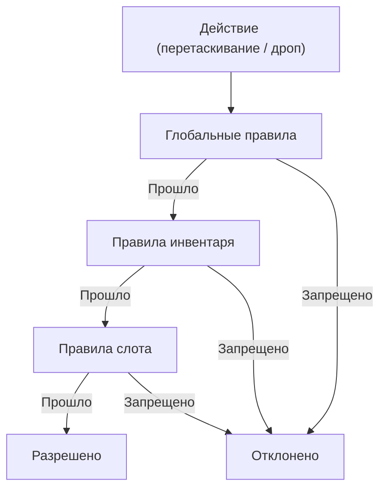
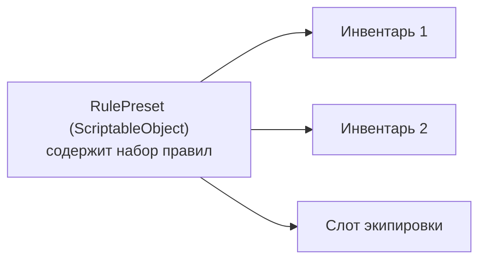
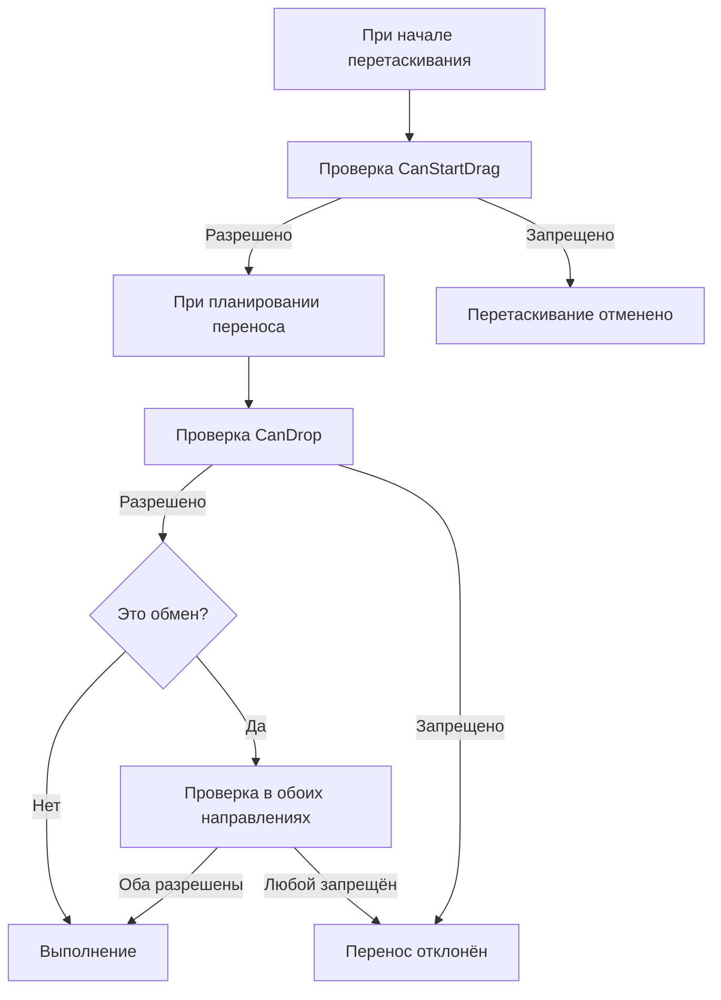

# Правила (Rules)

Правила контролируют, что можно перетаскивать и куда можно бросать. Система проверяет правила на трёх уровнях: глобальном, инвентарном и слотовом --- первый запрет останавливает операцию.

---

## Зачем нужны правила

Правила отделяют логику ограничений от логики размещения. Вместо того чтобы встраивать проверки в код инвентаря, вы декларативно описываете ограничения --- через Inspector или код --- и система автоматически применяет их при каждом переносе.

!!! note "Rules и business hooks — не одно и то же"
    Rules отвечают за механические ограничения переноса: можно ли взять предмет, можно ли бросить его в слот, подходит ли тип.
    Если вам нужна проверка уровня всей операции, например хватает ли денег, разрешил ли сервер перенос или нужно применить side effects после успеха, используйте transfer-level hooks (`CanCommitTransfer`, `OnTransferSucceeded`), а не `CanDrop`.

---

## Три уровня проверки



Каждое правило возвращает `RuleResult` --- успех или отказ с причиной. Правила проверяются в порядке приоритета (меньше = раньше).

| Уровень | Где задаётся | Область действия | Пример |
|---|---|---|---|
| **Глобальные** | `DragAndDropManager` | Все инвентари | Запрет дропа в тот же слот |
| **Инвентарные** | `UniversalInventory` / `DataBinding` | Конкретный инвентарь | Лимит уникальных предметов |
| **Слотовые** | `UniversalSlot` | Конкретный слот | Только оружие в слот оружия |

---

## Встроенные правила

| Правило | Уровень | Что делает |
|---|---|---|
| `SameSlotRule` | Глобальное | Запрещает бросать предмет в тот же слот |
| `SameInventoryRule` | Инвентарное | Разрешает/запрещает перемещение внутри одного инвентаря |
| `ItemIdFilterRule` | Инвентарное / Слотовое | Whitelist или blacklist предметов по ID |
| `UniqueItemLimitRule` | Инвентарное | Ограничивает количество уникальных предметов |
| `MaxStackSizeRule` | Инвентарное | Ограничивает размер стака в слоте |
| `SlotLockRule` | Инвентарное | Блокировка определённых слотов |
| `CustomRule` | Инвентарное | Произвольная проверка через лямбды |

---

## Создание своего правила

```csharp
using DragAndDropSystem.Core;
using DragAndDropSystem.Rules;

// Правило: предметы определённого уровня
[Serializable]
public class ItemLevelRule : DragRuleBase, ISlotRule
{
    [SerializeField] private int _minLevel = 1;

    // Приоритет проверки (меньше = раньше)
    public override int Priority => 50;

    // Проверка при начале перетаскивания (необязательно)
    public override RuleResult CanStartDrag(DragContext context, DragEntry entry)
    {
        return RuleResult.Success(); // Разрешаем всегда
    }

    // Проверка при дропе
    public override RuleResult CanDrop(DragContext context, DragEntry entry)
    {
        // Получаем предмет из контекста
        if (entry.Stack?.Item is ILeveledItem leveled)
        {
            if (leveled.Level < _minLevel)
                return RuleResult.Failure($"Нужен уровень {_minLevel}+");
        }

        return RuleResult.Success();
    }
}
```

!!! tip "Маркерные интерфейсы"
    Реализуйте `IGlobalRule`, `IInventoryRule` или `ISlotRule` в зависимости от нужного уровня.
    Одно правило может реализовать несколько интерфейсов (например, `IInventoryRule, ISlotRule`).

---

## Пресеты правил

Пресеты позволяют переиспользовать наборы правил между инвентарями и слотами.



- Создайте `RulePreset` как ScriptableObject в проекте.
- Добавьте в него нужные правила (inline или вложенные пресеты).
- Назначьте пресет инвентарю, слоту или DataBinding через Inspector.
- Пресеты поддерживают вложенность (с защитой от циклических ссылок).

---

## Где проверяются правила



Конкретные точки проверки:

1. **Начало перетаскивания** --- глобальные + инвентарные + слотовые правила источника.
2. **Планирование переноса** --- глобальные + инвентарные + слотовые правила цели.
3. **Обмен (swap)** --- правила проверяются в обоих направлениях (A&rarr;B и B&rarr;A).

---

## Ключевые классы

| Концепция | Класс | Описание |
|---|---|---|
| Результат | `RuleResult` | Успех или отказ с причиной |
| Базовый интерфейс | `IDragRule` | Контракт: `CanStartDrag` + `CanDrop` + `Priority` |
| Базовый класс | `DragRuleBase` | Удобный наследник с реализацией по умолчанию |
| Глобальный валидатор | `GlobalRuleValidator` | Проверяет `IGlobalRule` правила |
| Инвентарный валидатор | `InventoryRuleValidator` | Проверяет `IInventoryRule` правила |
| Слотовый валидатор | `SlotRuleValidator` | Проверяет `ISlotRule` правила |
| Пресет | `RulePreset<TRule>` | ScriptableObject-контейнер правил |
