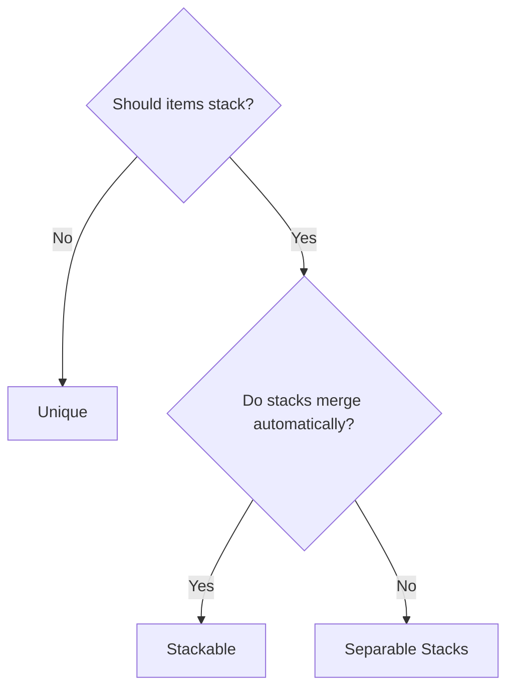
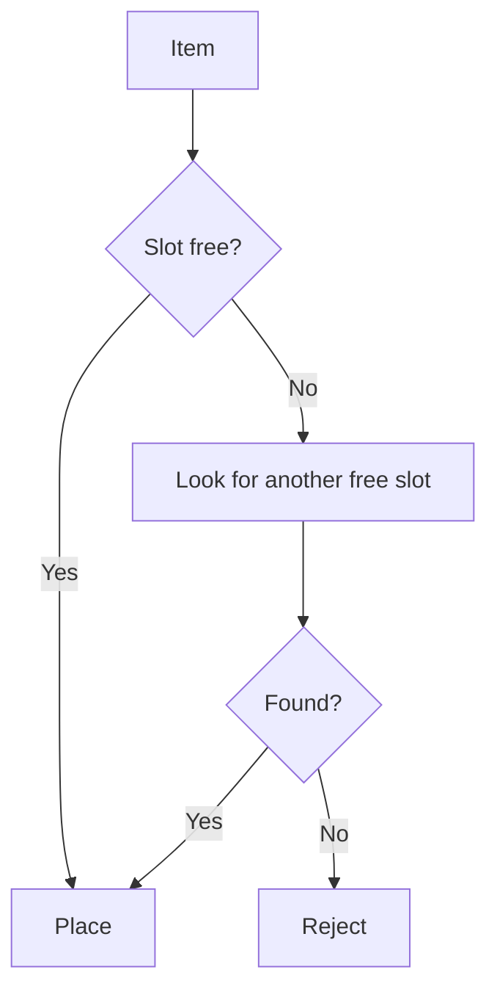
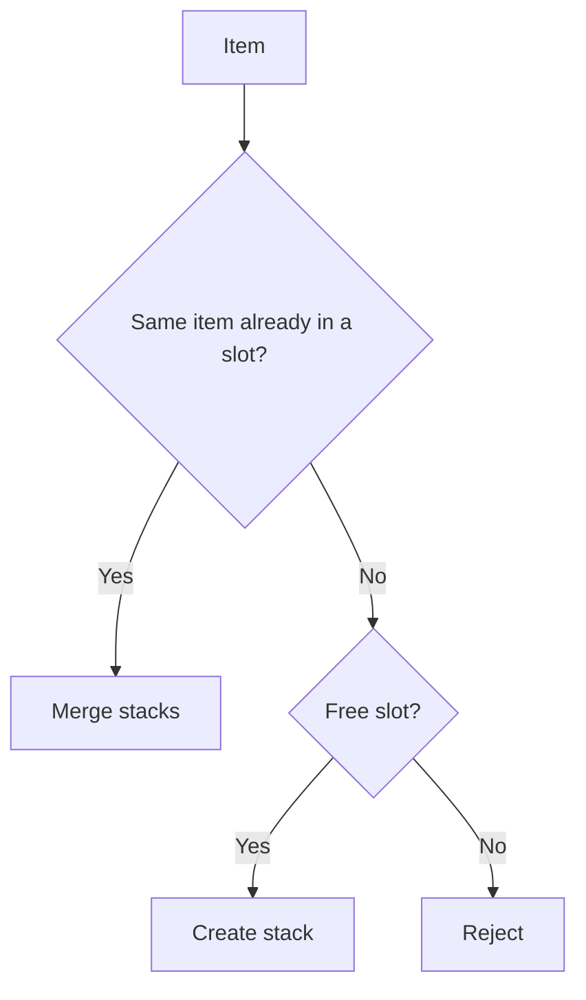
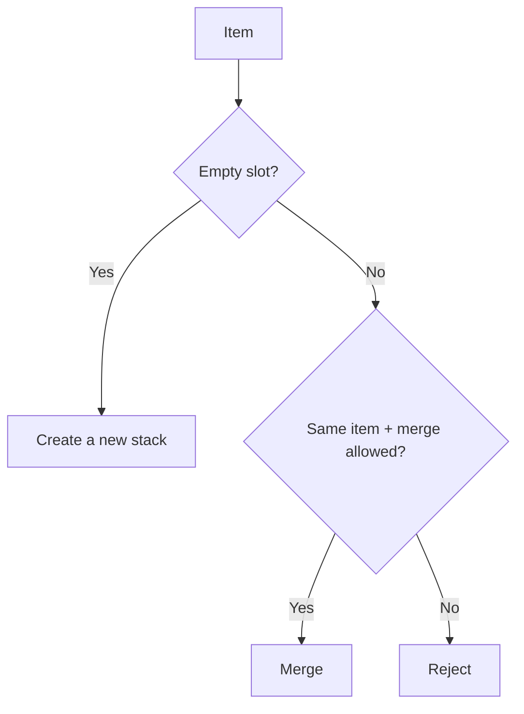

# Placement Strategies

Each inventory chooses a **strategy** that decides how items occupy and merge in
slots. The strategy is selected in the Inspector and applies to every add and move.

A strategy is **read-only**: it answers "where may this item go and how much fits?"
by producing *placement candidates*. It never adds, removes, or mutates anything —
the transfer engine performs all mutation. See [Transfer Pipeline](transfer-pipeline.md).

---

## Strategy Comparison

| | Slot 1 | Slot 2 | Slot 3 | Behavior |
|---|---|---|---|---|
| **Unique** | Sword | Shield | Potion | One item = one slot |
| **Stackable** | Potion x5 | Potion x3 | Shield | Identical items are automatically stacked |
| **Separable Stacks** | Squad x10 | Squad x20 | --- | Stacks are independent, merge on request |

---

## When to Use What



---

## Unique

Each item occupies exactly one slot; stacking is not supported. When several
instances are transferred, each one takes a separate slot.



Typical use: equipment inventory, collection of unique artifacts.

---

## Stackable

Identical items are automatically combined into one stack. When adding, the strategy
first offers a merge candidate for an existing stack of the same item, then a create
candidate for a free slot.



Typical use: consumables (potions, arrows), resources.

---

## Separable Stacks

Items can stack but are **not** merged automatically. You can keep several stacks of
the same item in different slots. A merge happens only on an explicit drop onto the
same item, when merging is allowed.



Typical use: Heroes of Might & Magic style (squads with independent stacks).

---

## Slot management (fixed vs dynamic)

Strategy decides *placement*; **slot management** decides whether the slot set is
fixed or can grow and shrink. It is a separate setting on the inventory.

- `FixedSlotManagementSettings` — a fixed number of slots.
- `DynamicSlotManagementSettings` — creates new slots as needed (up to a limit),
  keeps a minimum number of free slots, and removes excess empties on removal.

Dynamic slots work with any of the three strategies. The strategy only returns a
`NewDynamicSlot` candidate when growth is allowed; the engine drives the actual
slot creation and removal through `IDynamicSlotLifecycle`.

---

## Inspector Configuration

| Parameter | Values | Description |
|---|---|---|
| **Inventory Strategy** | `UniqueItemStrategy` / `StackableItemStrategy` / `SeparableStacksStrategy` | Placement strategy, selected through `[SerializeReference]` |
| **Slot Management** | `FixedSlotManagementSettings` / `DynamicSlotManagementSettings` | Slot lifecycle mode, selected through `[SerializeReference]` |
| **Max Slots** | number | Maximum slots (Dynamic only) |
| **Max Free Slots** | number | Empty slots to keep available (Dynamic only) |
| **Drag Amount** | `All` / `HalfDown` / `HalfUp` / `One` / `Custom` | How many items to drag from a stack |

---

## Custom Strategy

A custom strategy is read-only: it produces candidates, it does not mutate.

1. Inherit from `InventoryStrategyBase`.
2. Mark it `[Serializable]` so it appears in the `UniversalInventory` strategy picker.
3. Override the candidate methods:

```csharp
[Serializable]
public class MyCustomStrategy : InventoryStrategyBase
{
    // Validate a directly chosen slot and return its candidate (kind + capacity).
    public override bool TryGetCandidate(
        IPlacementGeometry geometry,
        InventoryAcceptanceRequest request,
        BaseSlot targetBaseSlot,
        out PlacementCandidate candidate)
    {
        // Resolve the anchor, decide merge vs create, compute capacity.
        // Helpers like TryCreatePlacementCandidate(...) and PassesRules(...) are available.
    }

    // Enumerate candidates for automatic placement (area drop / auto-transfer).
    public override PlacementCandidateSource GetCandidates(
        IPlacementGeometry geometry,
        InventoryAcceptanceRequest request)
    {
        // Return a lazy, re-enumerable source of candidates.
    }

    // How many items the inventory can accept right now (read-only count).
    public override int GetAcceptableCount(
        IPlacementGeometry geometry,
        InventoryAcceptanceRequest request)
    {
        // Your counting logic.
    }
}
```

!!! tip "Helpers on the base class"
    `PassesRules(slot, item, count)` validates slot rules, and
    `TryCreatePlacementCandidate(...)` builds a validated create candidate against the
    topology. Geometry (`IPlacementGeometry`) gives you anchor resolution, bounds and
    occupancy checks, and covered slots — your strategy never needs to know it is a grid.

!!! warning "Strategies do not mutate"
    There are no `TryAdd`/`TryRemove`/`TryAddToSlot` methods anymore. If you are looking
    for where items are actually placed, that is the transfer engine, not the strategy.

---

## Custom Slot Management

To create your own slot lifecycle mode:

1. Inherit from `SlotManagementSettingsBase`.
2. Mark it `[Serializable]` so it appears in the slot-management picker.
3. Override the hooks you need:

| Hook | Purpose |
|---|---|
| `CanCreateNewSlot(...)` | May the inventory grow right now? |
| `GetPotentialNewSlots(...)` | How many more slots could be created |
| `EnsureFreeSlots(...)` | Pre-create the configured number of free slots |
| `CanRemoveAnotherSlot(...)` | May an excess empty slot be removed? |
| `HandleSlotEmptied(...)` | React when a slot becomes empty (e.g. trim) |

---

## Key Classes

| Concept | Class | Description |
|---|---|---|
| Strategy contract | `IStrategy` | Read-only: candidates, capacity, max stack size |
| Base class | `InventoryStrategyBase` | Shared candidate helpers and rule checks |
| Shared stack base | `StackBasedInventoryStrategyBase` | Stack-size and per-item override support for stacking strategies |
| Unique | `UniqueItemStrategy` | One item = one slot |
| Stackable | `StackableItemStrategy` | Automatic stack merging |
| Separable | `SeparableStacksStrategy` | Independent stacks with optional merging |
| Candidate | `PlacementCandidate`, `PlacementCandidateSource` | Topology-neutral merge/create/new-slot intent |
| Ordering | `PlacementCandidateOrderer` | Orders candidates for automatic placement only |
| Slot management base | `SlotManagementSettingsBase` | Base for fixed, dynamic, and custom slot lifecycle |
| Slot management modes | `FixedSlotManagementSettings`, `DynamicSlotManagementSettings` | Fixed vs growing slot sets |
| Dynamic lifecycle | `IDynamicSlotLifecycle` | Engine-driven slot creation/removal |
