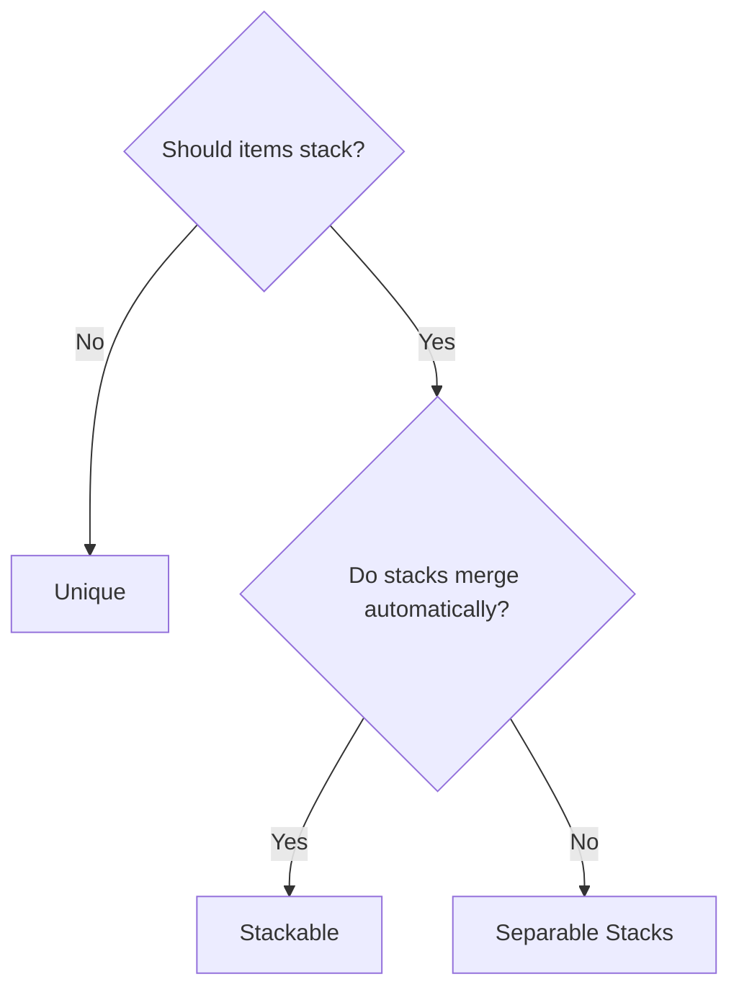
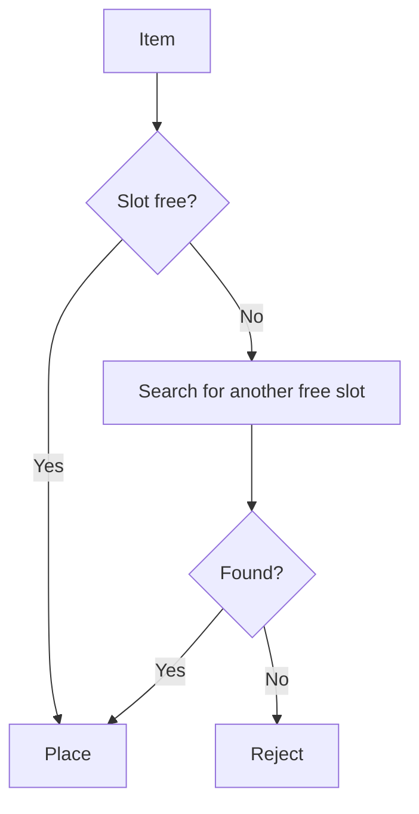
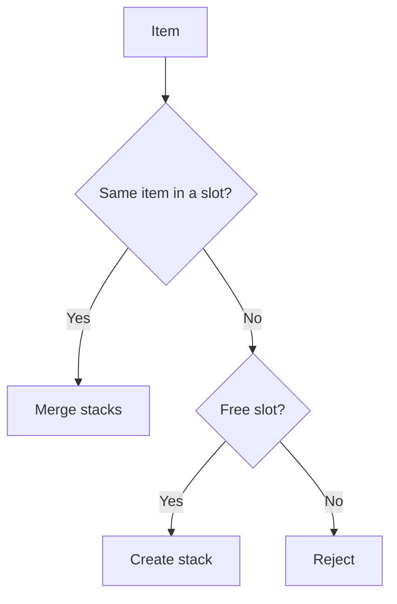
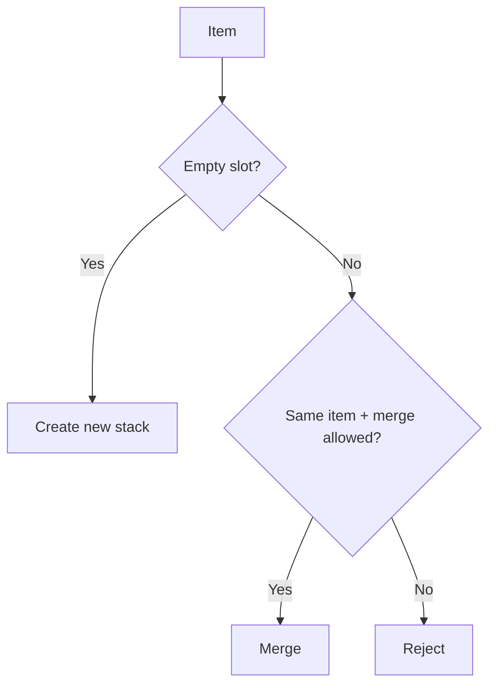

# Placement Strategies

Each inventory chooses a strategy that determines how items are placed and merged in slots. The strategy is set in the Inspector and affects all add and move operations.

---

## Strategy Comparison

| | Slot 1 | Slot 2 | Slot 3 | Behavior |
|---|---|---|---|---|
| **Unique** | Sword | Shield | Potion | One item = one slot |
| **Stackable** | Potion x5 | Potion x3 | Shield | Identical items are automatically stacked |
| **Separable Stacks** | Squad x10 | Squad x20 | --- | Stacks are independent, merge on request |

---

## When to Use What



---

## Unique

Each item occupies exactly one slot. Stacking is not supported --- when transferring multiple instances, each is placed in a separate slot.



Typical use: equipment inventory, collection of unique artifacts.

---

## Stackable

Identical items are automatically combined into one stack. When adding, the system first looks for an existing stack with the same item, then for a free slot.



Typical use: consumable items (potions, arrows), resources.

---

## Separable Stacks

Items can stack but are NOT automatically merged. You can have multiple stacks of the same item in different slots. Merging only occurs on an explicit drop onto the same item (if allowed by the `allowMergeOnDrop` setting).



Typical use: Heroes of Might & Magic style (squads with independent stacks).

---

## Dynamic Slots

A decorator that wraps any strategy and adds automatic slot creation/removal:

- Creates new slots as needed (up to a specified limit).
- Maintains a minimum number of free slots.
- Removes excess empty slots when items are removed.

Works with any of the three strategies.

---

## Inspector Configuration

| Parameter | Values | Description |
|---|---|---|
| **Item Behavior** | `Unique` / `Stackable` / `SeparableStacks` | Item placement strategy |
| **Slot Management** | `Fixed` / `Dynamic` | Fixed slots or dynamic creation |
| **Max Slots** | number | Maximum slots (for Dynamic) |
| **Max Free Slots** | number | How many empty slots to maintain (for Dynamic) |
| **Drag Amount** | `One` / `Half` / `All` / `Custom` | How many items to drag from a stack |

---

## Custom Strategy

To create your own placement strategy:

1. Create a class inheriting from `InventoryStrategyBase`.
2. Override the key methods:

```csharp
public class MyCustomStrategy : InventoryStrategyBase
{
    // Add an item to the inventory
    public override bool TryAdd(List<BaseSlot> slots, ItemStack stack, int targetIndex)
    {
        // Your placement logic
    }

    // Add an item to a specific slot
    public override bool TryAddToSlot(List<BaseSlot> slots, ItemStack stack,
        BaseSlot targetSlot, Action ensureFreeSlots, SlotOperationContext ctx)
    {
        // Your logic for a specific slot
    }

    // Remove an item
    public override bool TryRemove(List<BaseSlot> slots, IItemAdapter item,
        int count, int sourceIndex)
    {
        // Your removal logic
    }

    // How many items the inventory can accept
    public override int GetAcceptableCount(List<BaseSlot> slots,
        InventoryAcceptanceRequest request, bool canCreateNewSlot,
        int potentialNewSlots, BaseSlot slotPrefab)
    {
        // Your counting logic
    }

    // Can the inventory accept the item
    public override bool CanAcceptItem(List<BaseSlot> slots,
        InventoryAcceptanceRequest request, bool canCreateNewSlot,
        int potentialNewSlots, BaseSlot slotPrefab, out BaseSlot suggestedSlot)
    {
        // Your validation logic
    }
}
```

!!! tip "Rule Validation"
    Use the `PassesRules(slot, item, count)` method from the base class to validate slot rules before placement.

---

## Key Classes

| Concept | Class | Description |
|---|---|---|
| Base class | `InventoryStrategyBase` | Common methods for all strategies |
| Unique | `UniqueItemStrategy` | One item = one slot |
| Stackable | `StackableItemStrategy` | Automatic stack merging |
| Separable | `SeparableStacksStrategy` | Independent stacks with optional merging |
| Dynamic slots | `DynamicSlotDecorator` | Decorator for automatic slot creation |
| Interface | `IInventoryStrategy` | Contract for all strategies |
