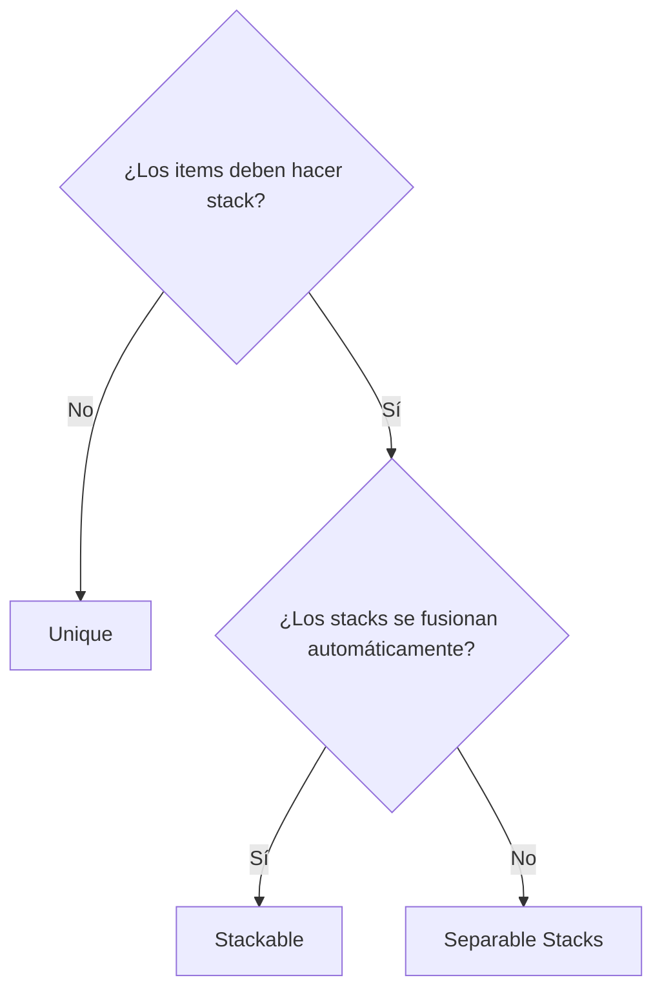
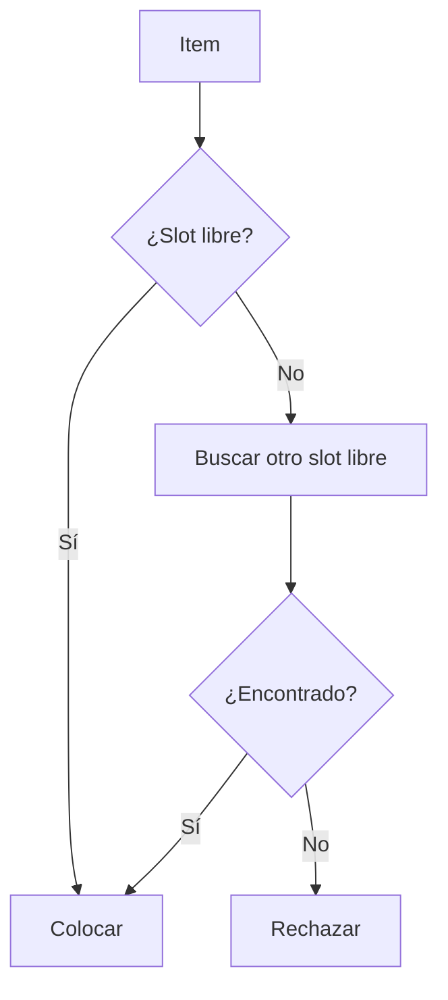
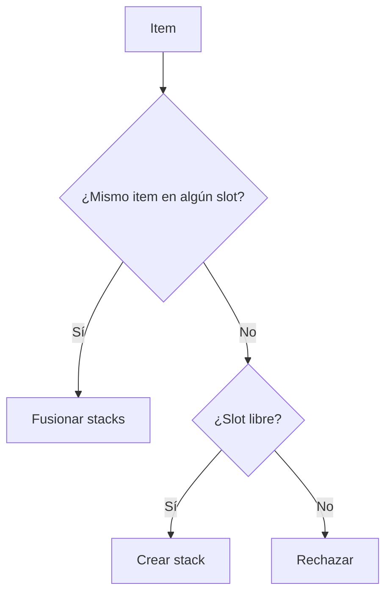
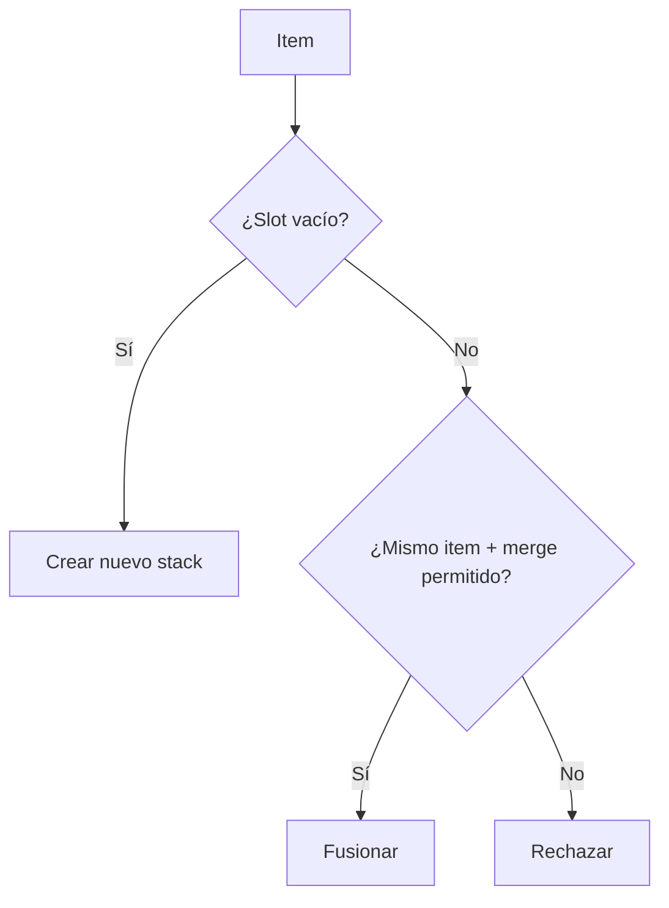

# Placement Strategies

Cada inventario elige una strategy que determina cómo se colocan y se fusionan los items en los slots. La strategy se configura en el Inspector y afecta a todas las operaciones de add y move.

---

## Comparación de strategies

| | Slot 1 | Slot 2 | Slot 3 | Comportamiento |
|---|---|---|---|---|
| **Unique** | Sword | Shield | Potion | Un item = un slot |
| **Stackable** | Potion x5 | Potion x3 | Shield | Los items idénticos se apilan automáticamente |
| **Separable Stacks** | Squad x10 | Squad x20 | --- | Los stacks son independientes, se fusionan bajo petición |

---

## Cuándo usar cada una



---

## Unique

Cada item ocupa exactamente un slot. No se soporta stacking: al transferir varias instancias, cada una se coloca en un slot separado.



Uso típico: inventario de equipamiento, colección de artefactos únicos.

---

## Stackable

Los items idénticos se combinan automáticamente en un solo stack. Al añadir, el sistema primero busca un stack existente con el mismo item y después un slot libre.



Uso típico: consumibles (pociones, flechas), recursos.

---

## Separable Stacks

Los items pueden apilarse pero NO se fusionan automáticamente. Puedes tener varios stacks del mismo item en distintos slots. La fusión solo ocurre en un drop explícito sobre el mismo item (si lo permite `allowMergeOnDrop`).



Uso típico: estilo Heroes of Might & Magic (escuadras con stacks independientes).

---

## Dynamic Slots

Un decorador que envuelve cualquier strategy y añade creación/eliminación automática de slots:

- Crea nuevos slots cuando hace falta (hasta un límite especificado).
- Mantiene un número mínimo de slots libres.
- Elimina slots vacíos sobrantes cuando se quitan items.

Funciona con cualquiera de las tres strategies.

---

## Configuración en el Inspector

| Parámetro | Valores | Descripción |
|---|---|---|
| **Inventory Strategy** | `UniqueItemStrategy` / `StackableItemStrategy` / `SeparableStacksStrategy` | Strategy de colocación elegida directamente mediante `[SerializeReference]` |
| **Slot Management** | `FixedSlotManagementSettings` / `DynamicSlotManagementSettings` | Modo de ciclo de vida de slots elegido directamente mediante `[SerializeReference]` |
| **Max Slots** | número | Slots máximos (para Dynamic) |
| **Max Free Slots** | número | Cuántos slots vacíos mantener (para Dynamic) |
| **Drag Amount** | `One` / `Half` / `All` / `Custom` | Cuántos items arrastrar desde un stack |

---

## Strategy personalizada

Para crear tu propia placement strategy:

1. Crea una clase que herede de `InventoryStrategyBase`.
2. Márquela con `[Serializable]`.
3. Aparecerá automáticamente en el strategy picker de `UniversalInventory`.
4. Sobrescribe los métodos clave:

```csharp
public class MyCustomStrategy : InventoryStrategyBase
{
    // Add an item to the inventory
    public override bool TryAdd(List<BaseSlot> slots, ItemStack stack, int targetIndex)
    {
        // Tu lógica de colocación
    }

    // Add an item to a specific slot
    public override bool TryAddToSlot(List<BaseSlot> slots, ItemStack stack,
        BaseSlot targetSlot, Action ensureFreeSlots, SlotOperationContext ctx)
    {
        // Tu lógica para un slot concreto
    }

    // Remove an item
    public override bool TryRemove(List<BaseSlot> slots, IItemAdapter item,
        int count, int sourceIndex)
    {
        // Tu lógica de eliminación
    }

    // How many items the inventory can accept
    public override int GetAcceptableCount(List<BaseSlot> slots,
        InventoryAcceptanceRequest request, bool canCreateNewSlot,
        int potentialNewSlots, BaseSlot slotPrefab)
    {
        // Tu lógica de recuento
    }

    // Can the inventory accept the item
    public override bool CanAcceptItem(List<BaseSlot> slots,
        InventoryAcceptanceRequest request, bool canCreateNewSlot,
        int potentialNewSlots, BaseSlot slotPrefab, out BaseSlot suggestedSlot)
    {
        // Tu lógica de validación
    }
}
```

!!! tip "Validación de rules"
    Usa el método `PassesRules(slot, item, count)` de la clase base para validar las slot rules antes de colocar.

## Slot Management personalizado

Para crear tu propio modo de ciclo de vida de slots:

1. Crea una clase que herede de `SlotManagementSettingsBase`.
2. Márquela con `[Serializable]`.
3. Sobrescribe los hooks que necesites, por ejemplo `WrapRuntimeStrategy`, `EnsureFreeSlots` o `HandleSlotEmptied`.
4. Aparecerá automáticamente en el picker de `Slot Management` de `UniversalInventory`.

---

## Clases clave

| Concepto | Clase | Descripción |
|---|---|---|
| Clase base | `InventoryStrategyBase` | Métodos comunes para todas las strategies |
| Base compartida de stacks | `StackBasedInventoryStrategyBase` | Soporte común para límite de stack y override por item en strategies de stack |
| Unique | `UniqueItemStrategy` | Un item = un slot |
| Stackable | `StackableItemStrategy` | Fusión automática de stacks |
| Separable | `SeparableStacksStrategy` | Stacks independientes con fusión opcional |
| Interfaces de capacidad | `IUniqueInventoryStrategy`, `IStackBasedInventoryStrategy`, `ISeparableStacksInventoryStrategy` | Interfaces semánticas opcionales para código personalizado |
| Base de slot management | `SlotManagementSettingsBase` | Clase base para modos fixed, dynamic y custom del ciclo de vida de slots |
| Dynamic slots | `DynamicSlotManagementSettings`, `DynamicSlotDecorator` | Modo dinámico y su decorador de runtime |
| Interface | `IInventoryStrategy` | Contrato para todas las strategies |

