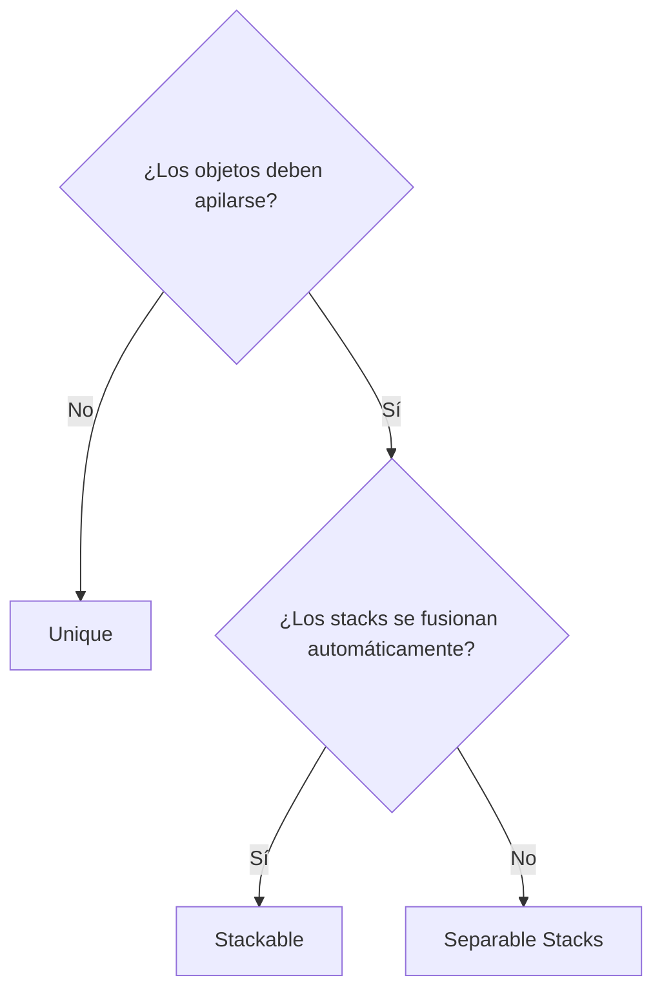
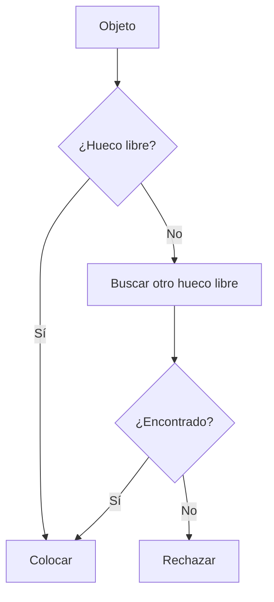
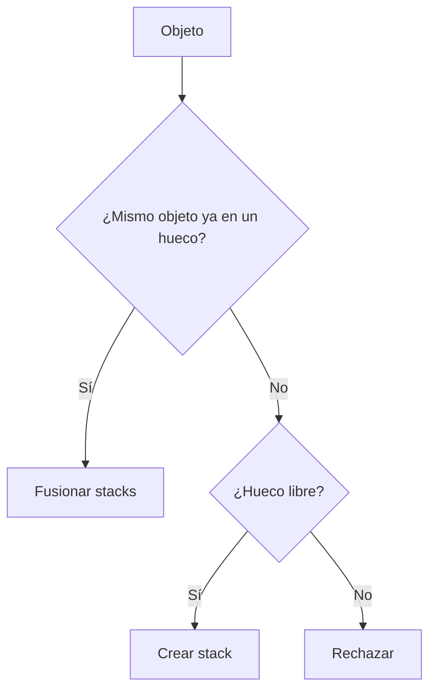
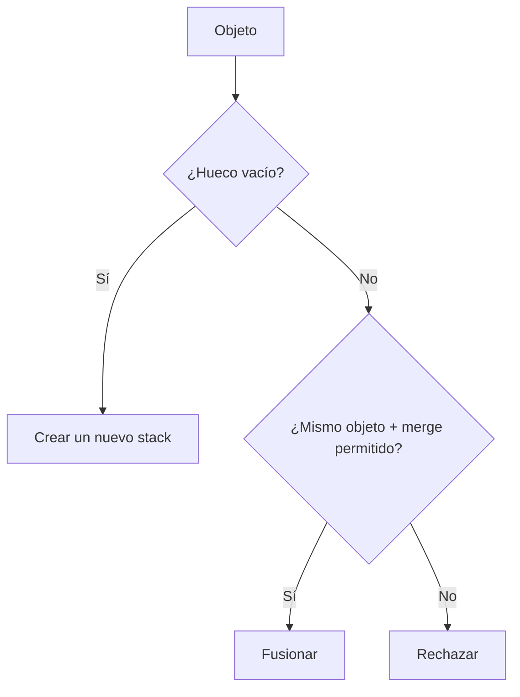

# Estrategias de colocación

Cada inventario elige una **estrategia** que decide cómo ocupan y se fusionan los objetos
en los huecos. La estrategia se selecciona en el Inspector y aplica a cada adición y movimiento.

Una estrategia es de **solo lectura**: responde "¿dónde puede ir este objeto y cuánto cabe?"
produciendo *candidatos de colocación*. Nunca añade, quita ni muta nada; toda la mutación la
realiza el motor de transferencia. Ver [Pipeline de transferencia](transfer-pipeline.md).

---

## Comparación de estrategias

| | Hueco 1 | Hueco 2 | Hueco 3 | Comportamiento |
|---|---|---|---|---|
| **Unique** | Espada | Escudo | Poción | Un objeto = un hueco |
| **Stackable** | Poción x5 | Poción x3 | Escudo | Los objetos idénticos se apilan automáticamente |
| **Separable Stacks** | Escuadra x10 | Escuadra x20 | --- | Los stacks son independientes, se fusionan a petición |

---

## Cuándo usar cada una



---

## Unique

Cada objeto ocupa exactamente un hueco; no hay apilado. Al transferir varias instancias,
cada una toma un hueco aparte.



Uso típico: inventario de equipo, colección de artefactos únicos.

---

## Stackable

Los objetos idénticos se combinan automáticamente en un stack. Al añadir, la estrategia
ofrece primero un candidato de merge para un stack existente del mismo objeto, y luego un
candidato de create para un hueco libre.



Uso típico: consumibles (pociones, flechas), recursos.

---

## Separable Stacks

Los objetos pueden apilarse pero **no** se fusionan automáticamente. Puedes tener varios
stacks del mismo objeto en huecos distintos. Un merge ocurre solo en un drop explícito sobre
el mismo objeto, cuando el merge está permitido.



Uso típico: estilo Heroes of Might & Magic (escuadras con stacks independientes).

---

## Gestión de huecos (fixed vs dynamic)

La estrategia decide la *colocación*; la **gestión de huecos** decide si el conjunto de
huecos es fijo o puede crecer y encoger. Es un ajuste aparte del inventario.

- `FixedSlotManagementSettings` — un número fijo de huecos.
- `DynamicSlotManagementSettings` — crea huecos nuevos según haga falta (hasta un límite),
  mantiene un mínimo de huecos libres y elimina los vacíos sobrantes al quitar objetos.

Los huecos dinámicos funcionan con cualquiera de las tres estrategias. La estrategia solo
devuelve un candidato `NewDynamicSlot` cuando se permite crecer; el motor dirige la creación
y eliminación reales mediante `IDynamicSlotLifecycle`.

---

## Configuración en el Inspector

| Parámetro | Valores | Descripción |
|---|---|---|
| **Inventory Strategy** | `UniqueItemStrategy` / `StackableItemStrategy` / `SeparableStacksStrategy` | Estrategia de colocación, seleccionada con `[SerializeReference]` |
| **Slot Management** | `FixedSlotManagementSettings` / `DynamicSlotManagementSettings` | Modo de ciclo de vida de huecos, con `[SerializeReference]` |
| **Max Slots** | número | Máximo de huecos (solo Dynamic) |
| **Max Free Slots** | número | Huecos vacíos a mantener disponibles (solo Dynamic) |
| **Drag Amount** | `All` / `HalfDown` / `HalfUp` / `One` / `Custom` | Cuántos objetos arrastrar de un stack |

---

## Estrategia personalizada

Una estrategia personalizada es de solo lectura: produce candidatos, no muta.

1. Hereda de `InventoryStrategyBase`.
2. Márcala `[Serializable]` para que aparezca en el selector de estrategias de `UniversalInventory`.
3. Sobrescribe los métodos de candidatos:

```csharp
[Serializable]
public class MyCustomStrategy : InventoryStrategyBase
{
    // Validar un hueco elegido directamente y devolver su candidato (kind + capacity).
    public override bool TryGetCandidate(
        IPlacementGeometry geometry,
        InventoryAcceptanceRequest request,
        BaseSlot targetBaseSlot,
        out PlacementCandidate candidate)
    {
        // Resolver el ancla, decidir merge vs create, calcular capacity.
        // Hay ayudantes como TryCreatePlacementCandidate(...) y PassesRules(...).
    }

    // Enumerar candidatos para colocación automática (drop en área / auto-transferencia).
    public override PlacementCandidateSource GetCandidates(
        IPlacementGeometry geometry,
        InventoryAcceptanceRequest request)
    {
        // Devolver una fuente de candidatos perezosa y reenumerable.
    }

    // Cuántos objetos puede aceptar el inventario ahora mismo (conteo de solo lectura).
    public override int GetAcceptableCount(
        IPlacementGeometry geometry,
        InventoryAcceptanceRequest request)
    {
        // Tu lógica de conteo.
    }
}
```

!!! tip "Ayudantes de la clase base"
    `PassesRules(slot, item, count)` valida las reglas del hueco, y
    `TryCreatePlacementCandidate(...)` construye un candidato de create validado contra la
    topología. La geometría (`IPlacementGeometry`) te da resolución de ancla, comprobaciones
    de límites y ocupación, y huecos cubiertos: tu estrategia nunca necesita saber que es una grid.

!!! warning "Las estrategias no mutan"
    Ya no existen los métodos `TryAdd`/`TryRemove`/`TryAddToSlot`. Si buscas dónde se colocan
    realmente los objetos, eso es el motor de transferencia, no la estrategia.

---

## Gestión de huecos personalizada

Para crear tu propio modo de ciclo de vida de huecos:

1. Hereda de `SlotManagementSettingsBase`.
2. Márcalo `[Serializable]` para que aparezca en el selector de gestión de huecos.
3. Sobrescribe los hooks que necesites:

| Hook | Propósito |
|---|---|
| `CanCreateNewSlot(...)` | ¿Puede crecer el inventario ahora mismo? |
| `GetPotentialNewSlots(...)` | Cuántos huecos más se podrían crear |
| `EnsureFreeSlots(...)` | Precrear el número configurado de huecos libres |
| `CanRemoveAnotherSlot(...)` | ¿Se puede eliminar un hueco vacío sobrante? |
| `HandleSlotEmptied(...)` | Reaccionar cuando un hueco queda vacío (p. ej. trim) |

---

## Clases clave

| Concepto | Clase | Descripción |
|---|---|---|
| Contrato de estrategia | `IStrategy` | Solo lectura: candidatos, capacity, tamaño máximo de stack |
| Clase base | `InventoryStrategyBase` | Ayudantes de candidatos y comprobaciones de reglas |
| Base de stack | `StackBasedInventoryStrategyBase` | Soporte de tamaño de stack y override por objeto para estrategias de apilado |
| Unique | `UniqueItemStrategy` | Un objeto = un hueco |
| Stackable | `StackableItemStrategy` | Fusión automática de stacks |
| Separable | `SeparableStacksStrategy` | Stacks independientes con merge opcional |
| Candidato | `PlacementCandidate`, `PlacementCandidateSource` | Intención merge/create/new-slot neutral a la topología |
| Ordenamiento | `PlacementCandidateOrderer` | Ordena candidatos solo para colocación automática |
| Base de gestión de huecos | `SlotManagementSettingsBase` | Base para modos fixed, dynamic y propios |
| Modos de huecos | `FixedSlotManagementSettings`, `DynamicSlotManagementSettings` | Conjunto de huecos fijo o creciente |
| Ciclo de vida dinámico | `IDynamicSlotLifecycle` | Creación/eliminación de huecos dirigida por el motor |
