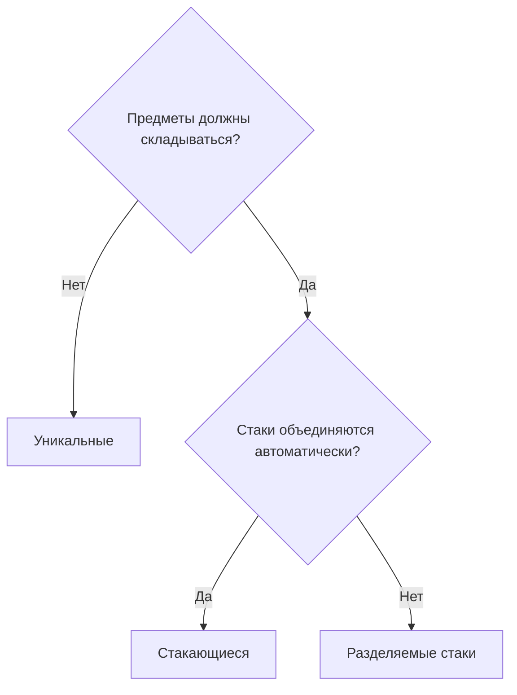
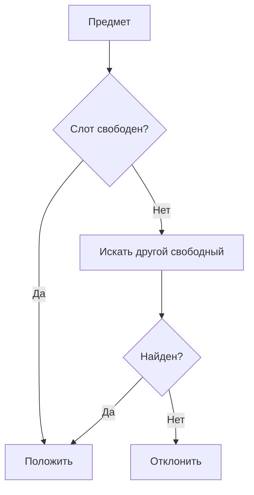
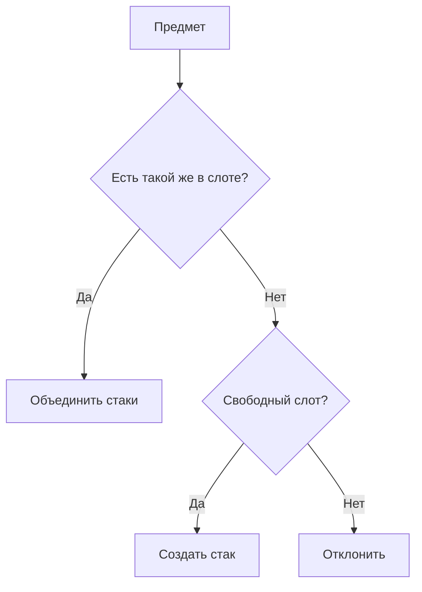
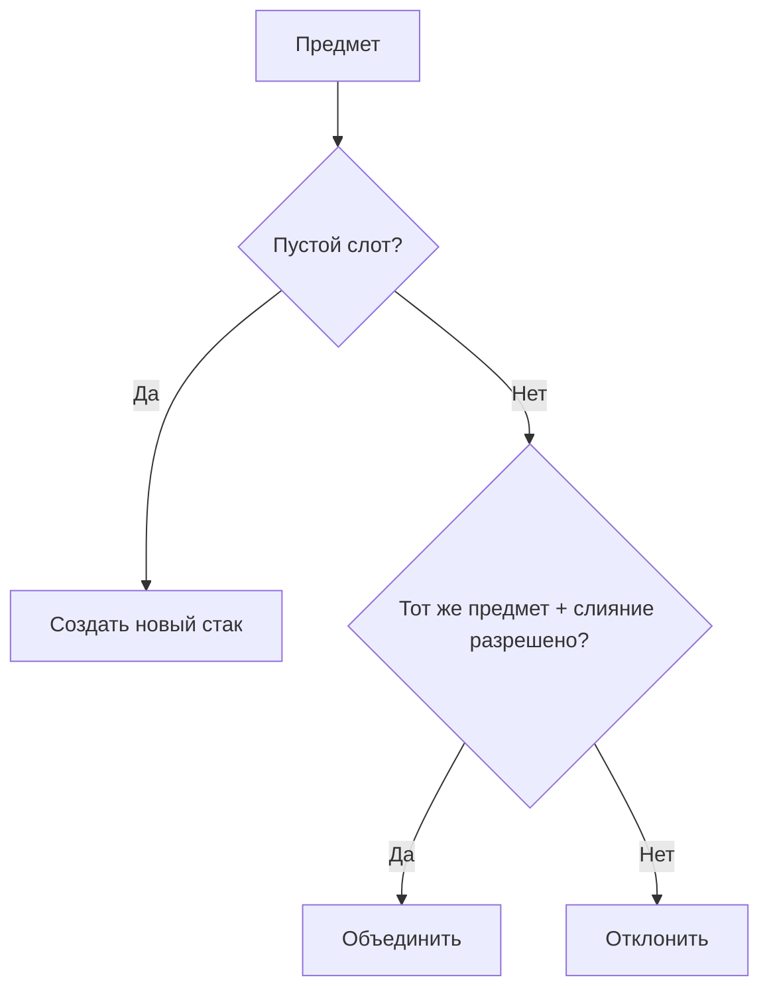

# Стратегии размещения

Каждый инвентарь выбирает стратегию, определяющую, как предметы размещаются и объединяются в слотах. Стратегия задаётся в Inspector и влияет на все операции добавления и перемещения.

---

## Сравнение стратегий

| | Слот 1 | Слот 2 | Слот 3 | Поведение |
|---|---|---|---|---|
| **Уникальные** | Меч | Щит | Зелье | Один предмет = один слот |
| **Стакающиеся** | Зелье x5 | Зелье x3 | Щит | Одинаковые автоматически складываются |
| **Разделяемые стаки** | Отряд x10 | Отряд x20 | --- | Стаки независимы, слияние по запросу |

---

## Когда что использовать



---

## Уникальные

Каждый предмет занимает ровно один слот. Стаки не поддерживаются --- при переносе нескольких экземпляров каждый размещается в отдельный слот.



Типичное применение: инвентарь экипировки, коллекция уникальных артефактов.

---

## Стакающиеся

Одинаковые предметы автоматически складываются в один стак. При добавлении система сначала ищет существующий стак с таким же предметом, затем --- свободный слот.



Типичное применение: расходуемые предметы (зелья, стрелы), ресурсы.

---

## Разделяемые стаки

Предметы могут складываться, но НЕ объединяются автоматически. Можно иметь несколько стаков одного предмета в разных слотах. Слияние происходит только при явном дропе на тот же предмет (если разрешено настройкой `allowMergeOnDrop`).



Типичное применение: стиль Heroes of Might & Magic (отряды с независимыми стаками).

---

## Динамические слоты

Декоратор, который оборачивает любую стратегию и добавляет автоматическое создание/удаление слотов:

- Создаёт новые слоты по мере необходимости (до заданного лимита).
- Обеспечивает минимальное количество свободных слотов.
- Удаляет лишние пустые слоты при удалении предметов.

Работает с любой из трёх стратегий.

---

## Настройка в Inspector

| Параметр | Значения | Описание |
|---|---|---|
| **Inventory Strategy** | `UniqueItemStrategy` / `StackableItemStrategy` / `SeparableStacksStrategy` | Стратегия размещения предметов, выбираемая напрямую через `[SerializeReference]` |
| **Slot Management** | `FixedSlotManagementSettings` / `DynamicSlotManagementSettings` | Режим жизненного цикла слотов, выбираемый напрямую через `[SerializeReference]` |
| **Max Slots** | число | Максимум слотов (для Dynamic) |
| **Max Free Slots** | число | Сколько пустых слотов поддерживать (для Dynamic) |
| **Drag Amount** | `One` / `Half` / `All` / `Custom` | Сколько предметов перетаскивать из стака |

---

## Своя стратегия

Чтобы создать собственную стратегию размещения:

1. Создайте класс-наследник `InventoryStrategyBase`.
2. Пометьте его `[Serializable]`.
3. Он автоматически появится в strategy picker у `UniversalInventory`.
4. Переопределите ключевые методы:

```csharp
public class MyCustomStrategy : InventoryStrategyBase
{
    // Добавить предмет в инвентарь
    public override bool TryAdd(List<BaseSlot> slots, ItemStack stack, int targetIndex)
    {
        // Ваша логика размещения
    }

    // Добавить предмет в конкретный слот
    public override bool TryAddToSlot(List<BaseSlot> slots, ItemStack stack,
        BaseSlot targetSlot, Action ensureFreeSlots, SlotOperationContext ctx)
    {
        // Ваша логика для конкретного слота
    }

    // Удалить предмет
    public override bool TryRemove(List<BaseSlot> slots, IItemAdapter item,
        int count, int sourceIndex)
    {
        // Ваша логика удаления
    }

    // Сколько предметов инвентарь может принять
    public override int GetAcceptableCount(List<BaseSlot> slots,
        InventoryAcceptanceRequest request, bool canCreateNewSlot,
        int potentialNewSlots, BaseSlot slotPrefab)
    {
        // Ваша логика подсчёта
    }

    // Может ли инвентарь принять предмет
    public override bool CanAcceptItem(List<BaseSlot> slots,
        InventoryAcceptanceRequest request, bool canCreateNewSlot,
        int potentialNewSlots, BaseSlot slotPrefab, out BaseSlot suggestedSlot)
    {
        // Ваша логика проверки
    }
}
```

!!! tip "Проверка правил"
    Используйте метод `PassesRules(slot, item, count)` из базового класса для проверки правил слота перед размещением.

## Свой Slot Management

Чтобы создать собственный режим жизненного цикла слотов:

1. Создайте класс-наследник `SlotManagementSettingsBase`.
2. Пометьте его `[Serializable]`.
3. Переопределите нужные hooks, например `WrapRuntimeStrategy`, `EnsureFreeSlots` или `HandleSlotEmptied`.
4. Он автоматически появится в picker поля `Slot Management` у `UniversalInventory`.

---

## Ключевые классы

| Концепция | Класс | Описание |
|---|---|---|
| Базовый класс | `InventoryStrategyBase` | Общие методы для всех стратегий |
| Общая stack-база | `StackBasedInventoryStrategyBase` | Общая поддержка лимита стека и per-item override для stack-стратегий |
| Уникальные | `UniqueItemStrategy` | Один предмет = один слот |
| Стакающиеся | `StackableItemStrategy` | Автоматическое объединение стаков |
| Разделяемые | `SeparableStacksStrategy` | Независимые стаки с опциональным слиянием |
| Capability interfaces | `IUniqueInventoryStrategy`, `IStackBasedInventoryStrategy`, `ISeparableStacksInventoryStrategy` | Опциональные semantic-интерфейсы для кастомного кода |
| База slot management | `SlotManagementSettingsBase` | Базовый класс для fixed, dynamic и custom режимов жизненного цикла слотов |
| Динамические слоты | `DynamicSlotManagementSettings`, `DynamicSlotDecorator` | Dynamic-режим и его runtime-декоратор |
| Интерфейс | `IInventoryStrategy` | Контракт для всех стратегий |
