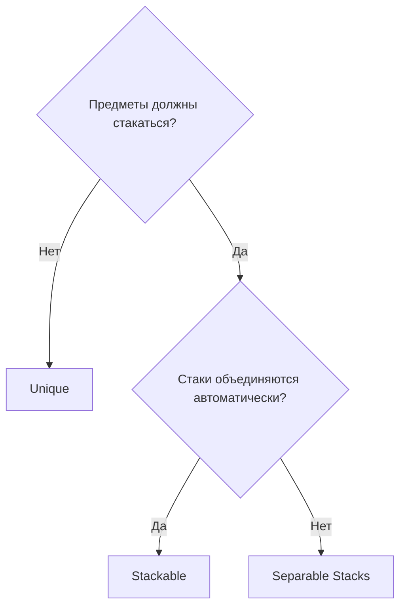
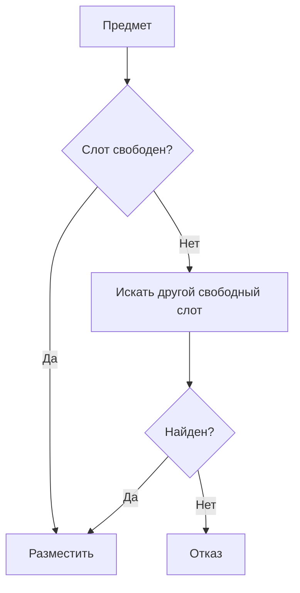
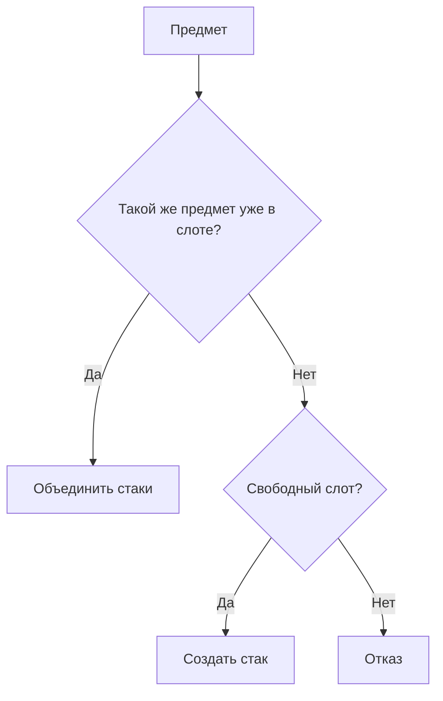
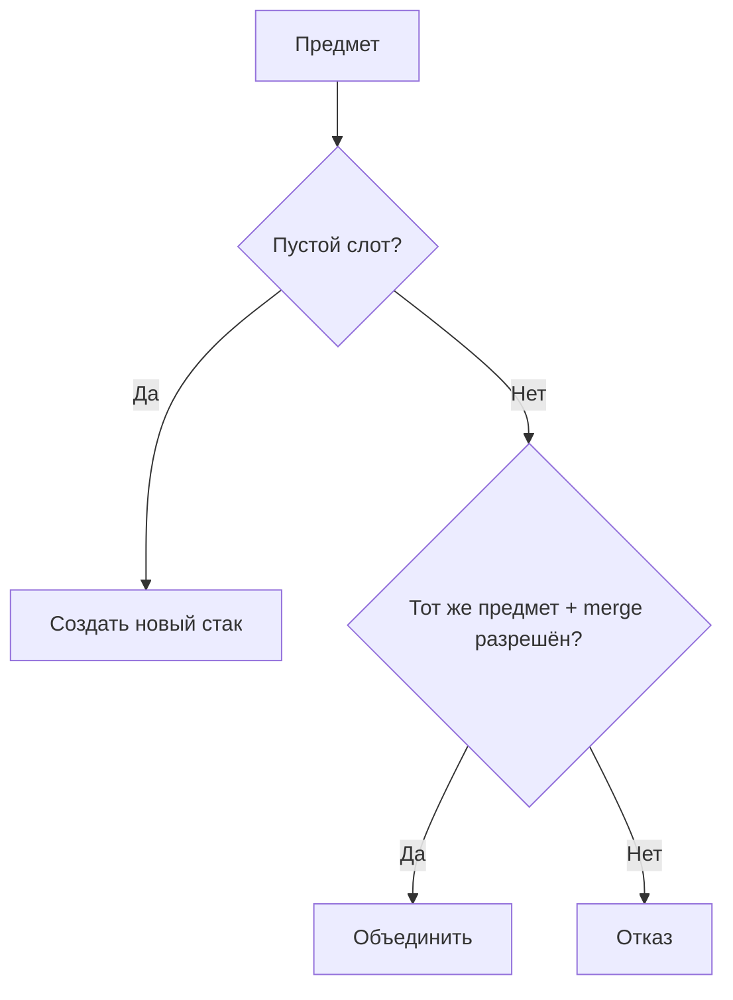

# Стратегии размещения

Каждый инвентарь выбирает **стратегию**, которая решает, как предметы занимают и
объединяются в слотах. Стратегия задаётся в инспекторе и применяется ко всем
добавлениям и перемещениям.

Стратегия **read-only**: она отвечает на вопрос «куда можно положить предмет и сколько
влезет?», выдавая *кандидатов размещения*. Сама она ничего не добавляет, не удаляет и
не мутирует — все изменения делает движок переноса. См. [Пайплайн переноса](transfer-pipeline.md).

---

## Сравнение стратегий

| | Слот 1 | Слот 2 | Слот 3 | Поведение |
|---|---|---|---|---|
| **Unique** | Меч | Щит | Зелье | Один предмет = один слот |
| **Stackable** | Зелье x5 | Зелье x3 | Щит | Одинаковые предметы автоматически стакаются |
| **Separable Stacks** | Отряд x10 | Отряд x20 | --- | Стаки независимы, объединяются по запросу |

---

## Что когда использовать



---

## Unique

Каждый предмет занимает ровно один слот; стакинг не поддерживается. При переносе
нескольких экземпляров каждый занимает отдельный слот.



Типичное применение: инвентарь экипировки, коллекция уникальных артефактов.

---

## Stackable

Одинаковые предметы автоматически объединяются в один стак. При добавлении стратегия
сначала предлагает merge-кандидата для существующего стака того же предмета, затем
create-кандидата для свободного слота.



Типичное применение: расходники (зелья, стрелы), ресурсы.

---

## Separable Stacks

Предметы могут стакаться, но **не** объединяются автоматически. Можно держать несколько
стаков одного предмета в разных слотах. Объединение происходит только при явном drop на
тот же предмет, когда merge разрешён.



Типичное применение: стиль Heroes of Might & Magic (отряды с независимыми стаками).

---

## Управление слотами (fixed или dynamic)

Стратегия решает *размещение*; **управление слотами** решает, фиксирован ли набор
слотов или может расти и сжиматься. Это отдельная настройка инвентаря.

- `FixedSlotManagementSettings` — фиксированное число слотов.
- `DynamicSlotManagementSettings` — создаёт новые слоты по мере необходимости (до
  лимита), держит минимум свободных слотов и удаляет лишние пустые при удалении.

Динамические слоты работают с любой из трёх стратегий. Стратегия лишь возвращает
кандидата `NewDynamicSlot`, когда рост разрешён; фактическим созданием и удалением
слотов управляет движок через `IDynamicSlotLifecycle`.

---

## Настройка в инспекторе

| Параметр | Значения | Описание |
|---|---|---|
| **Inventory Strategy** | `UniqueItemStrategy` / `StackableItemStrategy` / `SeparableStacksStrategy` | Стратегия размещения, выбирается через `[SerializeReference]` |
| **Slot Management** | `FixedSlotManagementSettings` / `DynamicSlotManagementSettings` | Режим жизненного цикла слотов, через `[SerializeReference]` |
| **Max Slots** | число | Максимум слотов (только Dynamic) |
| **Max Free Slots** | число | Сколько пустых слотов держать (только Dynamic) |
| **Drag Amount** | `All` / `HalfDown` / `HalfUp` / `One` / `Custom` | Сколько предметов тянуть из стака |

---

## Своя стратегия

Своя стратегия read-only: она выдаёт кандидатов, но не мутирует.

1. Наследуйтесь от `InventoryStrategyBase`.
2. Пометьте `[Serializable]`, чтобы она появилась в пикере стратегий `UniversalInventory`.
3. Переопределите методы кандидатов:

```csharp
[Serializable]
public class MyCustomStrategy : InventoryStrategyBase
{
    // Проверить напрямую выбранный слот и вернуть его кандидата (kind + capacity).
    public override bool TryGetCandidate(
        IPlacementGeometry geometry,
        InventoryAcceptanceRequest request,
        BaseSlot targetBaseSlot,
        out PlacementCandidate candidate)
    {
        // Резолвим якорь, решаем merge или create, считаем capacity.
        // Доступны помощники TryCreatePlacementCandidate(...) и PassesRules(...).
    }

    // Перечислить кандидатов для автоматического размещения (area drop / авто-перенос).
    public override PlacementCandidateSource GetCandidates(
        IPlacementGeometry geometry,
        InventoryAcceptanceRequest request)
    {
        // Вернуть ленивый, повторно перечисляемый источник кандидатов.
    }

    // Сколько предметов инвентарь может принять сейчас (read-only подсчёт).
    public override int GetAcceptableCount(
        IPlacementGeometry geometry,
        InventoryAcceptanceRequest request)
    {
        // Ваша логика подсчёта.
    }
}
```

!!! tip "Помощники базового класса"
    `PassesRules(slot, item, count)` проверяет правила слота, а
    `TryCreatePlacementCandidate(...)` строит провалидированного create-кандидата по
    топологии. Геометрия (`IPlacementGeometry`) даёт резолв якоря, проверки границ и
    занятости, покрытые слоты — стратегии не нужно знать, грид это или нет.

!!! warning "Стратегии не мутируют"
    Методов `TryAdd`/`TryRemove`/`TryAddToSlot` больше нет. Если вы ищете, где предметы
    реально размещаются, — это движок переноса, а не стратегия.

---

## Своё управление слотами

Чтобы создать свой режим жизненного цикла слотов:

1. Наследуйтесь от `SlotManagementSettingsBase`.
2. Пометьте `[Serializable]`, чтобы он появился в пикере управления слотами.
3. Переопределите нужные хуки:

| Хук | Назначение |
|---|---|
| `CanCreateNewSlot(...)` | Может ли инвентарь сейчас расти? |
| `GetPotentialNewSlots(...)` | Сколько ещё слотов можно создать |
| `EnsureFreeSlots(...)` | Заранее создать заданное число свободных слотов |
| `CanRemoveAnotherSlot(...)` | Можно ли удалить лишний пустой слот? |
| `HandleSlotEmptied(...)` | Реакция на опустевший слот (например, trim) |

---

## Ключевые классы

| Концепция | Класс | Описание |
|---|---|---|
| Контракт стратегии | `IStrategy` | Read-only: кандидаты, capacity, размер стака |
| Базовый класс | `InventoryStrategyBase` | Общие помощники кандидатов и проверки правил |
| База стак-стратегий | `StackBasedInventoryStrategyBase` | Размер стака и per-item override для стакающихся стратегий |
| Unique | `UniqueItemStrategy` | Один предмет = один слот |
| Stackable | `StackableItemStrategy` | Автоматическое объединение стаков |
| Separable | `SeparableStacksStrategy` | Независимые стаки с опциональным merge |
| Кандидат | `PlacementCandidate`, `PlacementCandidateSource` | Topology-neutral намерение merge/create/new-slot |
| Упорядочивание | `PlacementCandidateOrderer` | Упорядочивает кандидатов только для автоматического размещения |
| База управления слотами | `SlotManagementSettingsBase` | База для fixed, dynamic и своих режимов |
| Режимы слотов | `FixedSlotManagementSettings`, `DynamicSlotManagementSettings` | Фиксированный или растущий набор слотов |
| Динамический lifecycle | `IDynamicSlotLifecycle` | Создание/удаление слотов движком |
