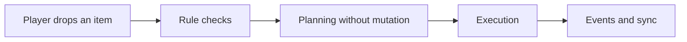
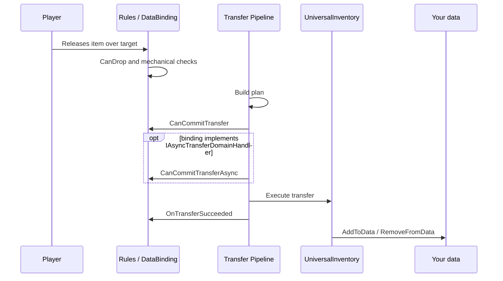
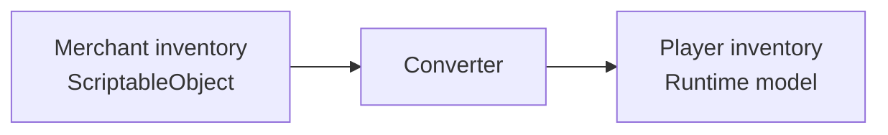
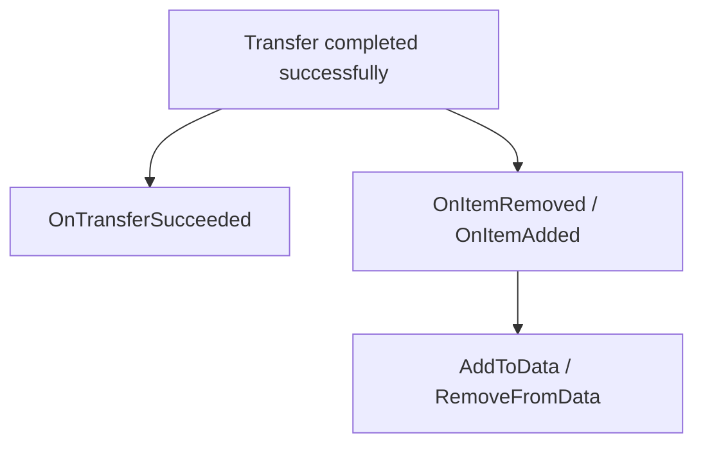
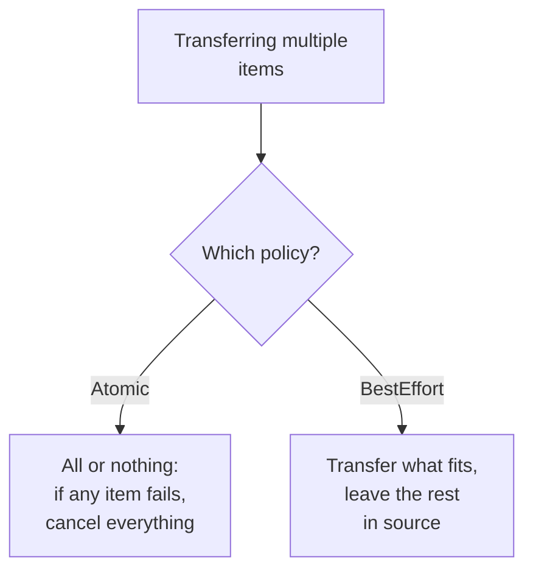
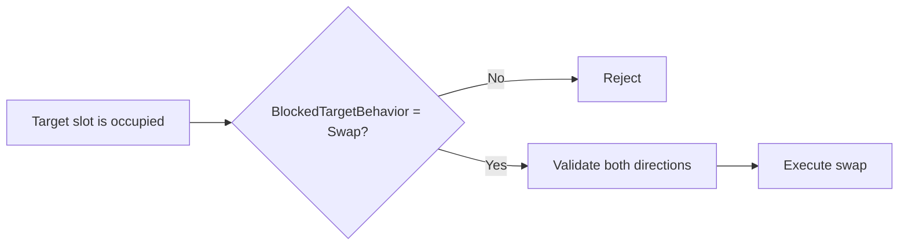

# Transfer Pipeline

This page explains transfer from the asset user's perspective.

The question is not "which helper classes exist?" but "in what order does the system decide, and where can I hook into it?"

---

## Short version

---

## What happens on a normal drop

---

## Why planning exists

Before any real mutation, the system decides:

- can the item fit
- is partial transfer needed
- is a swap required
- is there a valid target slot
- does the item need conversion for the target inventory

---

## Planning vs commit

- planning does not mutate inventory state
- commit applies real changes

That is why:

- `CanDrop` is good for preview and mechanics
- `CanCommitTransfer` is the right place for fast local pre-commit checks
- `CanCommitTransferAsync` is the right place for external async checks if the binding implements the interface

If both versions exist, the order is always:

1. `CanCommitTransfer`
2. `CanCommitTransferAsync`
3. commit

---

## Item conversion

The important user-facing detail is simple:

- the target inventory receives the item in its own format

---

## After success

---

## What happens on failure

If a check or commit fails, the behavior depends on the policy:

| Situation | What happens |
|---|---|
| `CanDrop` returns failure | transfer does not start, item returns to source |
| `CanCommitTransfer` returns failure | transfer is cancelled before commit, state unchanged |
| `CanCommitTransferAsync` returns failure | transfer is cancelled before commit, state unchanged |
| Atomic batch: one item fails | entire operation is cancelled, no items are moved |
| BestEffort batch: one item fails | remaining items are transferred, failed ones stay in source |

The key point: if a check fails, inventories remain in their original state. Planning builds a plan without mutations, and commit only applies after all checks pass.

---

## Drop Policy

The current model has three layers:

- `DropRequestPolicy`
  - temporary per-operation override
  - can override:
    - `BlockedTargetBehavior`
    - `AlternativePlacementMode`
    - `AllowPartial`
- `DropPolicySettings`
  - inventory-level defaults on `UniversalInventory`
  - defines:
    - blocked target behavior
    - allow merge on drop
    - allow partial
    - batch mode
    - alternative placement mode
- `ResolvedDropPolicy`
  - final non-nullable policy used by the planner

`BlockedTargetBehavior`:
- `Reject`
- `Swap`
- `FindAlternative`

## Temporary override through actions

Temporary drop policy override is done through action-level request policy, not by mutating `DragContext`.

Example:
- default `CompleteDragAction` calls `CompleteDrag(null)`
- `Ctrl` variant of `CompleteDragAction` calls `CompleteDrag(DropRequestPolicy.WithBlocked(BlockedTargetBehavior.Swap))`
- `Shift` variant of `CompleteDragAction` calls `CompleteDrag(DropRequestPolicy.WithFindAlternative())`
- actions can also override `AllowPartial` and `AlternativePlacementMode` for a single transfer

Important:
- the override only applies to the current transfer operation
- inventory-level `DropPolicySettings` stay unchanged
- final `ResolvedDropPolicy` is assembled in this order:
  1. action request override
  2. drop-target override
  3. inventory defaults

## Drop Policy Processing Order

For a single drag entry:

1. Resolve `ResolvedDropPolicy`
2. Try placing into the target slot if one exists
3. If everything fits, the entry succeeds
4. If only part fits:
   - `AllowPartial = false` -> fail
   - `AllowPartial = true` -> partial success
   - remainder can search for alternatives only when `BlockedTargetBehavior = FindAlternative`
5. If nothing fits into the target:
   - `Reject` -> fail
   - `Swap` -> planner creates a swap entry
   - `FindAlternative` -> placement strategy enumerates alternative slots
6. For same-inventory drops, `FindAlternative` does not reshuffle items across other slots. If the target fails, the item stays in place

## Batch operations

When transferring multiple items at once, behavior is determined by `BatchMode` inside `DropPolicy`:

By default, batch mode comes from the target inventory's `DropPolicySettings`, while request overrides only affect temporary runtime behavior.

---

## Swap is part of the same pipeline

