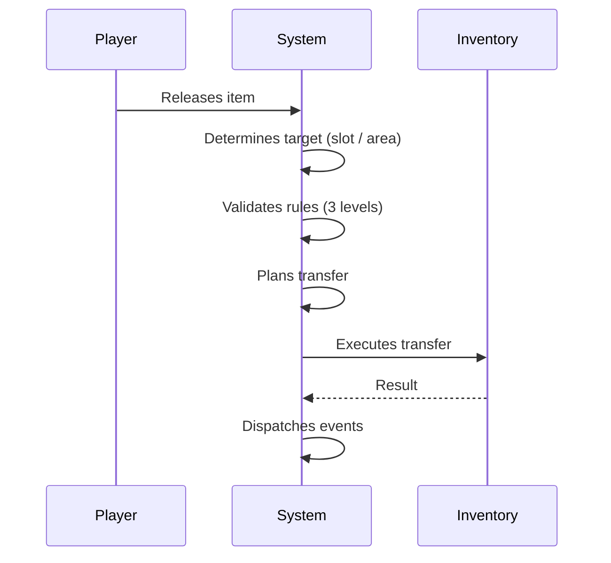
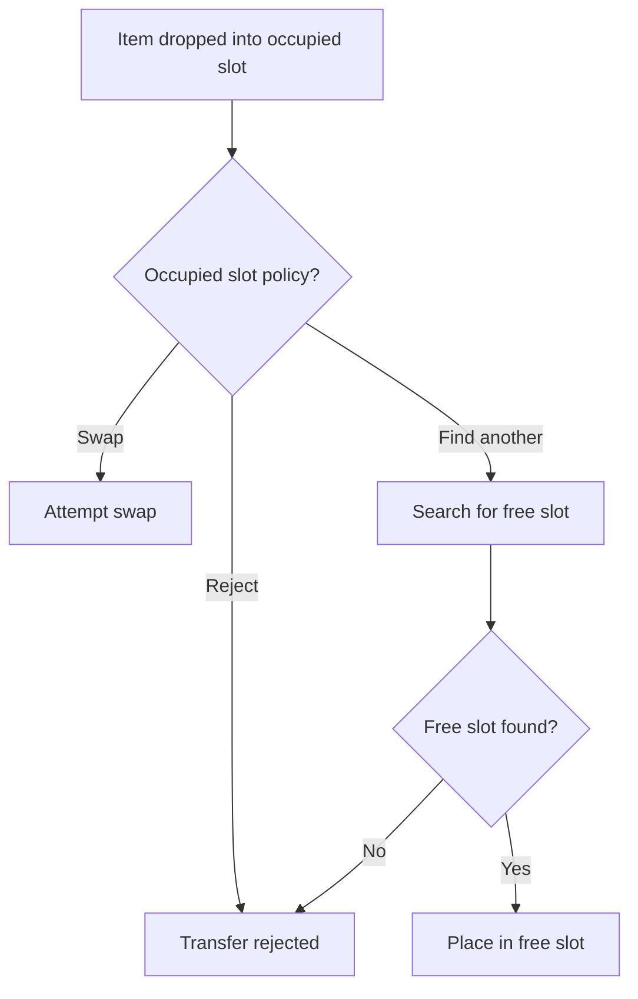
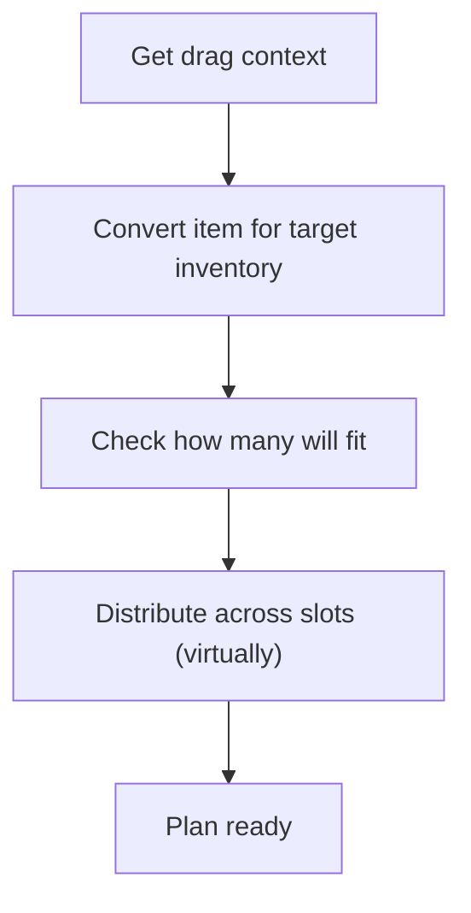
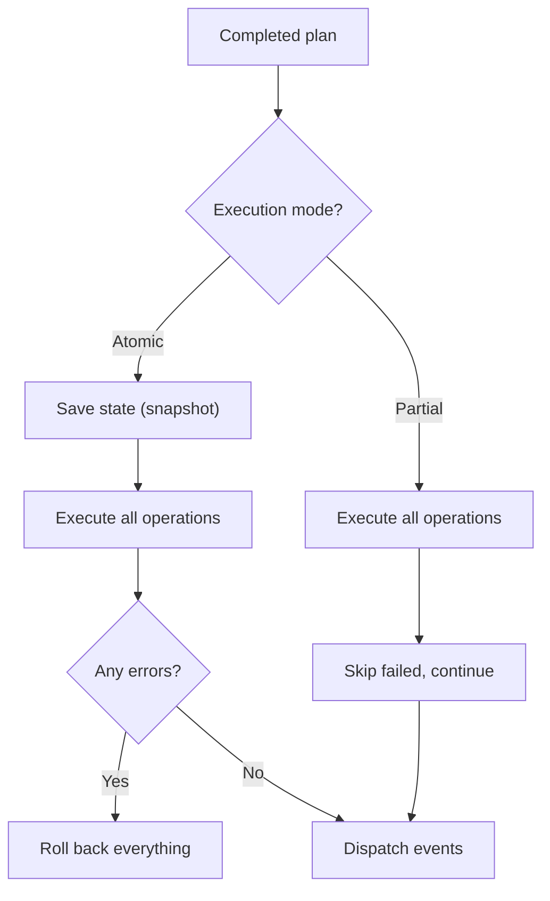
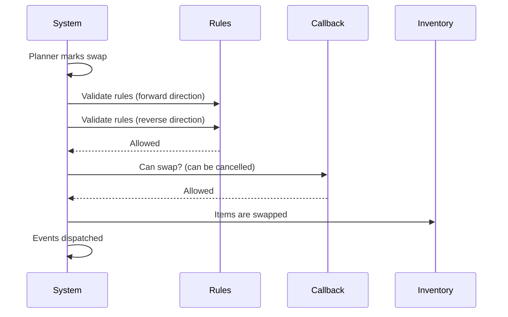
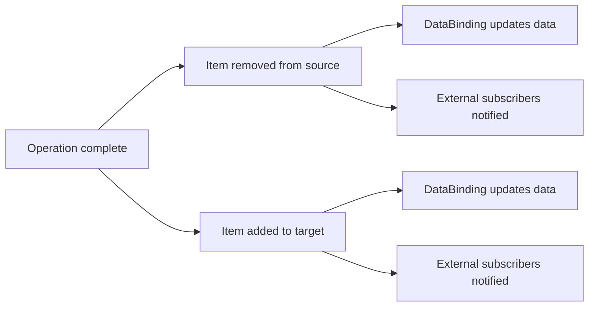
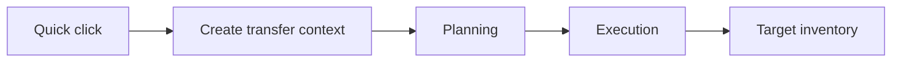

# Transfer Pipeline

Every item movement --- drag-and-drop, auto-transfer, swap --- goes through the same pipeline:
**Policy** &rarr; **Planning** &rarr; **Execution** &rarr; **Events**.

---

## Overview

The transfer system is built as a pipeline: first the behavior rules are determined (policy), then a plan is constructed without modifying data, after which the plan is executed and events are dispatched. This approach allows verifying an operation before executing it and rolling back on error.

---

## Item Path During Drag

---

## Drop Policy

Policy is an immutable set of 4 dimensions that define transfer behavior.

| Dimension | Options | What it controls |
|---|---|---|
| **What to do with an occupied slot** | Reject / Swap / Find another | Reaction to a non-empty target slot |
| **Capacity** | All or nothing / As many as fit | Whether partial transfer is allowed |
| **Batch execution** | Atomic / Partial | Roll back everything on error or keep successful |
| **Target usage** | Strictly to target / Target as hint | Exact drop or flexible search |

---

## Planning

During the planning phase the system builds a transfer plan without modifying inventory state. This allows pre-validating the feasibility of the operation.

!!! info "Item Conversion"
    Before planning, the item is converted to the target inventory's format.
    For example: a merchant's `TradableItemSO` becomes a player's `TradableItemModel`.

---

## Execution

During the execution phase the completed plan is applied to real inventories. The execution mode is determined by the policy.

- **Atomic** --- before execution, a snapshot of all affected inventories is saved. If any operation fails, everything is rolled back.
- **Partial (BestEffort)** --- executes everything possible. Failed operations are skipped.

---

## Swap

Swap is a built-in pipeline operation, not a separate path.

!!! warning "Cancelling a Swap"
    Any subscriber can set `Cancel = true` in the swap context to prevent it.

---

## When Events Are Dispatched

Events are deferred until the operation is fully complete:

- In **atomic** mode events are not dispatched if something went wrong (rollback).
- DataBinding is notified directly --- it has a 1:1 relationship with the inventory.
- External subscribers use `OnItemAdded` / `OnItemRemoved` events.

---

## Auto-Transfer

Quick-click uses the same transfer mechanism. Auto-transfer programmatically creates a drag context and passes it into the same planning and execution pipeline.

---

## Key Classes

| Concept | Class | Description |
|---|---|---|
| Policy | `DropPolicy` | Immutable set of 4 behavior dimensions |
| Planner | `TransferPlanner` | Builds a plan without mutating data |
| Executor | `TransferPlanExecutor` | Applies the plan, supports rollback |
| Transfer service | `InventoryTransferService` | Performs transactional transfer between slots |
| Drop processor | `InventoryDropProcessor` | Entry point: policy + plan + execution |
| Conversion | `TransferItemConversionUtility` | Converts an item for the target inventory |
| Auto-transfer | `AutoTransferService` | Programmatic transfer on click |
