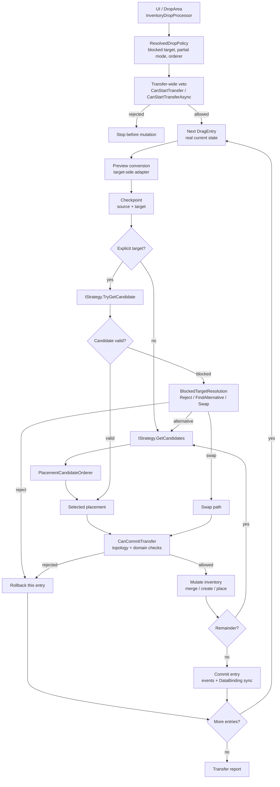
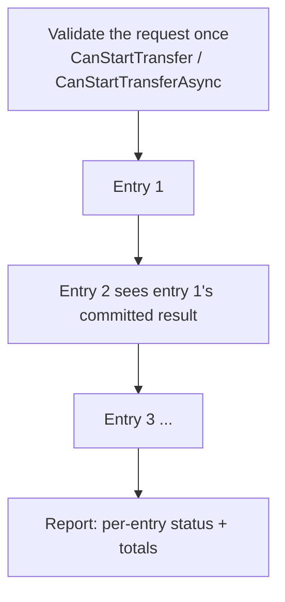

# Transfer Pipeline

This page explains what happens when an item is dropped: the order of steps, how
each common case behaves, and every point where you can plug in your own logic.

It is written to be readable without deep knowledge of the codebase. If you only
remember one thing: **there is no pre-built plan**. The system processes one entry
at a time against the *real* inventory state and commits as it goes.

See also:

- [Drop Policy Matrix](drop-policy-matrix.md) — the policy fields in one table
- [Placement Strategies](strategies.md) — how items choose slots
- [Cookbook: Item Conversion](item-conversion-cookbook.md)
- [Logs and Debugging](../reference/logs-and-debugging.md)

## The big picture

Key ideas:

- **Nothing is precomputed.** The system does not build a plan or a virtual copy of
  the inventory ahead of time; it mutates the real state as it goes.
- **Sequential and best-effort.** Entries are handled one by one; entry N sees the
  result of entry N-1. A failed entry is rolled back on its own and does not undo
  earlier successful entries.
- **Single-cell and shaped items use the same path.** A 1×1 item is just a footprint
  of one cell. Nothing branches on "is this a grid".

## Who does what

| Piece | Plain-English role |
|---|---|
| `InventoryDropProcessor` | The boundary. UI and drop areas call this; it owns nothing but delegation. |
| `InventoryTransferService` | The engine. Runs the entry loop, mutates the inventory, rolls back, fires events. |
| `IStrategy` | Decides *which* placement an item is allowed to use and how much fits (merge vs create, capacity, unique/stackable/separable). Read-only — it never mutates. |
| `IPlacementGeometry` + topology | Decides *where* a footprint lands: resolves the anchor slot, projects the oriented shape, checks bounds and occupancy. |
| Policy (`ResolvedDropPolicy`) | What to do when the chosen target is blocked, and whether a partial transfer is allowed. |
| `ITransferDomainHandler` | Your business logic veto and side effects (money, server, ownership). |

## One entry, step by step

For each `DragEntry`, `InventoryTransferService` does this:

1. **Resolve the target-side preview adapter.** If the two inventories represent
   items differently, the item is converted to how the *target* sees it — without
   touching the source yet. (See [Item Conversion](item-conversion-cookbook.md).)
2. **Build an acceptance request** describing what is being offered to the target.
3. **Take a checkpoint** of the source and target so the entry can be undone.
4. **Pick a placement:**
   - If the user dropped on a concrete slot, ask the strategy directly:
     `IStrategy.TryGetCandidate(...)`. No ordering is involved.
   - If automatic placement is needed, enumerate `IStrategy.GetCandidates(...)` and
     pick one with a `PlacementCandidateOrderer`.
5. **Before each mutation, re-validate** topology/bounds/occupancy and call the
   per-candidate domain check (`CanCommitTransfer`). Then apply the mutation
   (create, merge, place, or swap).
6. **Handle the remainder.** A big stack may fill several placements; whatever does
   not fit is returned to the source.
7. **Commit or roll back.** On success, dispatch events and DataBinding
   notifications *for this entry* before moving to the next. On failure, restore the
   checkpoint — no events are emitted.

## Cases

### Explicit target that is valid

The user dropped on a specific slot and the strategy accepts it. The candidate from
`TryGetCandidate` already carries the resolved placement/anchor and the exact amount
that fits. Candidate ordering is **not** used.

### Explicit target that is blocked

The chosen slot cannot take the item (occupied, incompatible, full). What happens
next is decided by `BlockedTargetResolutionKind`:

| Value | Behavior |
|---|---|
| `Reject` | The entry fails. Nothing moves. |
| `FindAlternative` | The hinted slot is left alone; the engine enumerates the other candidates and orders them with the configured `PlacementCandidateOrderer`. |
| `Swap` | A single-entry swap with the occupied target is attempted. |

`AllowSameInventoryAlternativePlacement` controls whether `FindAlternative` is
allowed to pick another slot inside the *same* inventory.

### Area drop / auto-transfer

There is no specific slot (the user dropped on the inventory area, or a
double-click/auto-move triggered `AutoTransferService`). The engine skips the
explicit-target step and goes straight to enumerating and ordering candidates.

### A large stack that spans several placements

A stack of 10 is still **one entry**, even if the target spreads it across several
placements. The engine:

1. creates a working stack of the requested size;
2. asks the strategy for candidates with capacity (Unique → 1 each, Stackable →
   one-per-id merge, Separable → up to max per stack);
3. peels off exactly that amount and applies the candidate;
4. re-enumerates candidates against the now-changed state and repeats;
5. returns whatever did not fit to the source.

Example: 10 items into a Unique inventory with 6 free slots → 6 transferred, 4
returned, reported as `RequestedAmount = 10, TransferredAmount = 6`.

### Partial vs require-full

`PartialTransferMode` decides what to do when only part of an entry fits:

- `Allow` — commit what fits, return the rest to the source.
- `RequireFull` — if the whole amount cannot be placed, roll the entry back.

This is **per entry**. `RequireFull` never undoes earlier entries in a batch.

### Same-inventory move

When moving inside one inventory, the source footprint is not freed blindly: a
partial attempt keeps the source occupied and excludes it from the candidate list,
so target placements cannot eat the very cells the remainder would need to return
to. A full relocation may run a separate attempt with the source temporarily
removed, and must move the whole entry or roll back.

### Occupied target with a handler

If the target slot is occupied and the inventory (or its binding) provides an
`IOccupiedSlotDropHandler`, that handler runs first as a pure check, then executes
all-or-nothing. Priority is: occupied handler → normal merge/create → blocked
policy. A handler never triggers alternatives or swaps itself.

### Dynamic slots

A dynamic inventory can grow. The strategy may return a `NewDynamicSlot` candidate,
but it does **not** create the slot. The engine creates the slot, tries the exact
placement, and removes the slot again if the placement fails.

### Swap

Swap is a dedicated single-entry path (not a strategy, not a plan). It only runs
when: there is exactly one entry, a concrete occupied target, the whole source
moves, both sides convert successfully in both directions, both pass rule/domain
validation, and the resulting footprints fit (and do not overlap in a same-inventory
swap). It captures both sides, removes both placements, places each converted item
at the other anchor, and commits both or rolls both back.

Batch swap (several dragged entries onto one occupied target with `Swap`) is
rejected before any mutation. A grid-vs-grid "group exchange" is a separate future
feature, not batch swap.

### Batch (several entries at once)

- Entries run in drag-context order; each sees the committed result of the previous.
- A failed entry is restored on its own; earlier successes stay.
- A target *hint* applies only to the first entry; the rest behave like an area drop.
- The batch succeeds if at least one entry moved; `IsPartial` means not everything did.

## Two kinds of validation

It is easy to confuse "rules" with "business logic". They are different layers and
run at different times.

| Layer | Interface | Question it answers | Runs when |
|---|---|---|---|
| Rules | `IGlobalRule` / `IInventoryRule` / `ISlotRule` | *Mechanically*, may this item go here? (type filter, locked slot, same-slot…) | drag start and target validation |
| Transfer-wide veto | `ITransferDomainHandler.CanStartTransfer` | May this whole operation start at all? | once, before the first mutation |
| Async transfer-wide veto | `IAsyncTransferDomainHandler.CanStartTransferAsync` | Same, but needs to await something (server, disk) | once, async path only, before first mutation |
| Per-commit check | `ITransferDomainHandler.CanCommitTransfer` | May this *specific* placement commit? (enough gold, ownership) | right before each candidate mutation |
| Success side effects | `ITransferDomainHandler.OnTransferSucceeded` | React after a placement committed | after a successful commit |

Use rules for mechanics. Use the domain handler for money, servers, ownership, and
side effects — never bake those into rules.

## When events fire

Events and DataBinding notifications for an entry are dispatched **only after that
entry commits**, and before the next entry starts. This guarantees the next entry
(and any domain handler) sees state that matches the live inventory.

Each add/remove event carries the exact sub-stack that actually moved — never the
raw `DragEntry.Stack`. An entry of 10 that lands as `6 + 4` emits events for 10
adapters total; an entry of 10 where 6 moved and 4 returned emits events for 6.

## Extension points

Everything you are meant to plug into, in one place:

| Extension point | Type | What it is for |
|---|---|---|
| **Placement strategy** | `IStrategy` / `InventoryStrategyBase` | Define how items occupy slots: unique, stackable, separable, or your own merge/create/capacity rules. Read-only; produces candidates. |
| **Topology** | `IInventoryTopology` (`SlotTopology`, `RectGridTopology`, custom) | Define the cell space: how many cells, how a shape projects, orientation steps and visual angles. A hex grid is just a topology with 6 steps. |
| **Placement shape** | `IPlacementShape` (`RectPlacementShape`, `ComplexPlacementShape`) | Define an item's footprint, including non-rectangular (L/T/cross) shapes and their rotations. |
| **Candidate orderer** | `PlacementCandidateOrderer` | Influence which slot automatic placement prefers (merge-first, empty-first, etc.). Never applied to an explicit target. |
| **Blocked-target policy** | `BlockedTargetResolutionKind` + `DropPolicySettings` | Choose reject / find-alternative / swap, plus partial-transfer and same-inventory options. Data-only, set in the Inspector. |
| **Transfer-wide veto** | `ITransferDomainHandler.CanStartTransfer` | Allow or deny the whole operation before anything changes (e.g. "shop is closed"). |
| **Async transfer-wide veto** | `IAsyncTransferDomainHandler.CanStartTransferAsync` | Same, when the answer requires awaiting a server, file, or database. |
| **Per-commit business check** | `ITransferDomainHandler.CanCommitTransfer` | Allow or deny one concrete placement (enough gold, ownership). |
| **Success hook** | `ITransferDomainHandler.OnTransferSucceeded` | Apply side effects after a committed placement (charge gold, analytics). |
| **Occupied-slot handler** | `IOccupiedSlotDropHandler` | Custom behavior when dropping onto an occupied slot (e.g. equip/insert into a container). |
| **Dynamic slot lifecycle** | `IDynamicSlotLifecycle` | Let an inventory grow/shrink its slots; the engine drives creation/removal. |
| **Item converter** | `IItemAdapterConverter` (via `CreateItemConverter()`) | Translate items between two inventories that use different adapter models. |
| **Rules** | `IGlobalRule` / `IInventoryRule` / `ISlotRule` | Declarative mechanical constraints at three levels. See [Rules](rules.md). |
| **Drop areas** | `DropAreaBase` | Custom drop targets (trash, sell, world-spawn) without touching the pipeline. See [Drop Areas](drop-areas.md). |

## What the pipeline does *not* promise

- **No batch-wide atomicity.** There is no `Atomic` mode. Each entry commits on its
  own; a later failure does not undo earlier entries.
- **No implicit relocation.** The engine never shuffles unrelated items to make
  room. Repacking/sorting is a separate, explicit action.
- **Preview is advisory.** A `TransferProbe` describes what *would* happen for the
  first placement; it reserves nothing and execution always re-validates. The
  execution report is the only authoritative result.
