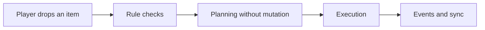
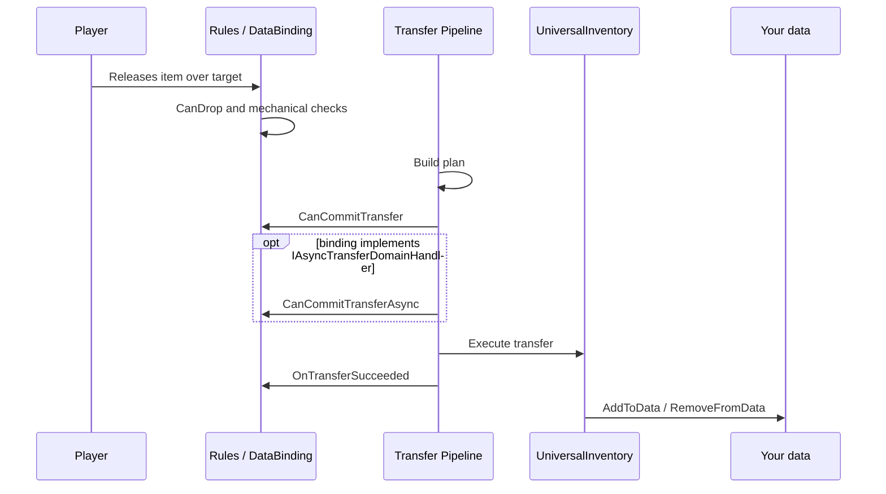
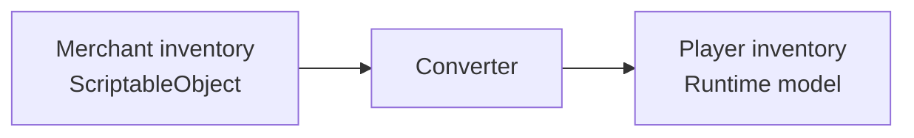
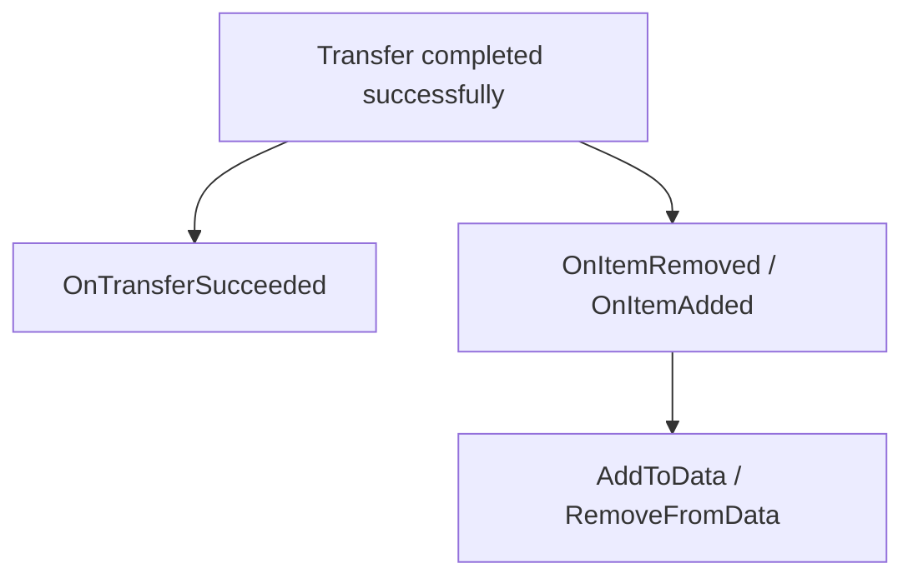
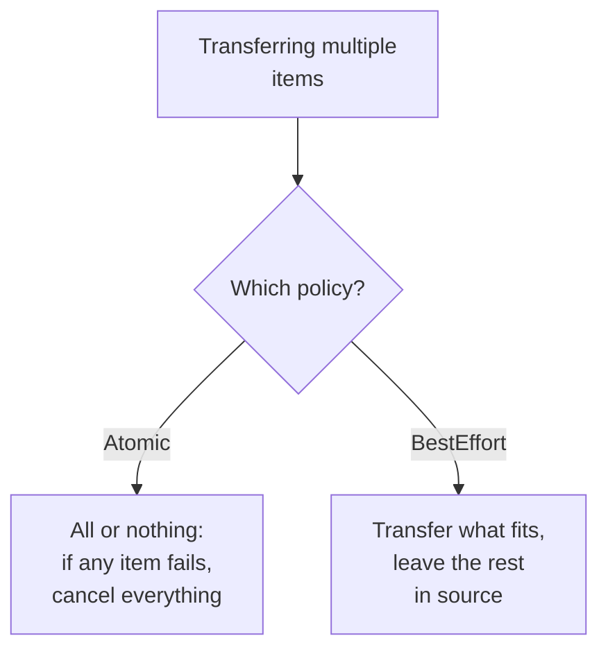
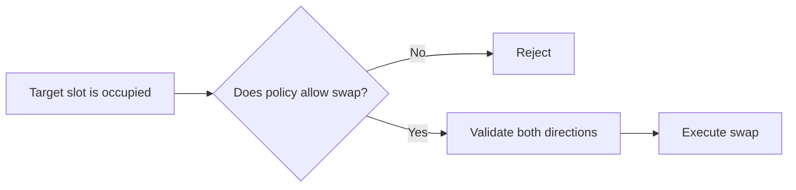

# Transfer Pipeline

This page explains transfer from the asset user's perspective.

The question is not "which helper classes exist?" but "in what order does the system decide, and where can I hook into it?"

---

## Short version

---

## What happens on a normal drop

---

## Why planning exists

Before any real mutation, the system decides:

- can the item fit
- is partial transfer needed
- is a swap required
- is there a valid target slot
- does the item need conversion for the target inventory

---

## Planning vs commit

- planning does not mutate inventory state
- commit applies real changes

That is why:

- `CanDrop` is good for preview and mechanics
- `CanCommitTransfer` is the right place for fast local pre-commit checks
- `CanCommitTransferAsync` is the right place for external async checks if the binding implements the interface

If both versions exist, the order is always:

1. `CanCommitTransfer`
2. `CanCommitTransferAsync`
3. commit

---

## Item conversion

The important user-facing detail is simple:

- the target inventory receives the item in its own format

---

## After success

---

## What happens on failure

If a check or commit fails, the behavior depends on the policy:

| Situation | What happens |
|---|---|
| `CanDrop` returns failure | transfer does not start, item returns to source |
| `CanCommitTransfer` returns failure | transfer is cancelled before commit, state unchanged |
| `CanCommitTransferAsync` returns failure | transfer is cancelled before commit, state unchanged |
| Atomic batch: one item fails | entire operation is cancelled, no items are moved |
| BestEffort batch: one item fails | remaining items are transferred, failed ones stay in source |

The key point: if a check fails, inventories remain in their original state. Planning builds a plan without mutations, and commit only applies after all checks pass.

---

## Batch operations and policies

When transferring multiple items at once, behavior is determined by `DropPolicy`:

Defaults:

- single transfer — `StrictTarget`, `Partial`, `BestEffort`
- batch (from selection) — `TargetAsHint`, `RejectAll`, `Atomic`

The policy can be configured in the inspector on each `UniversalInventory` (Drop Policy section).

---

## Swap is part of the same pipeline

