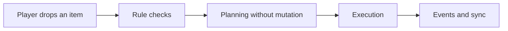
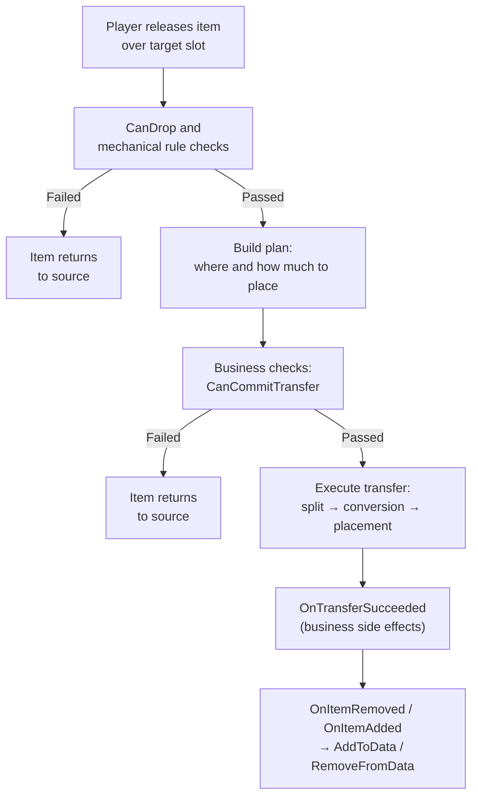
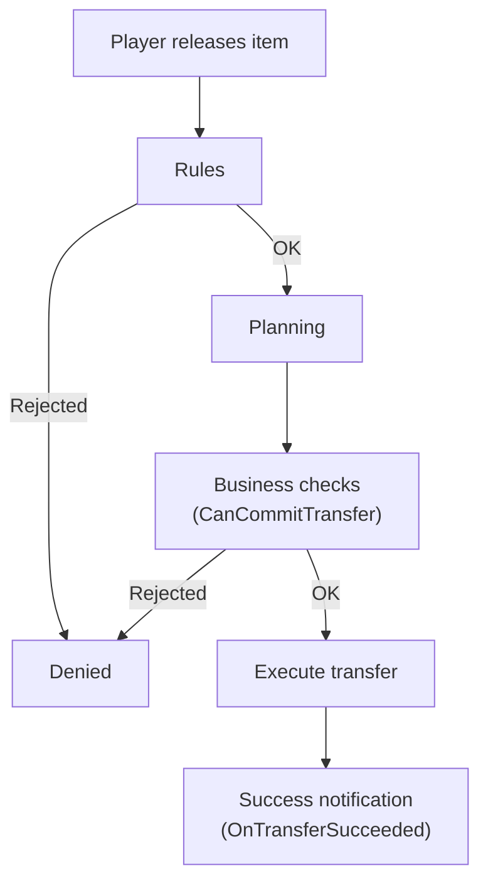
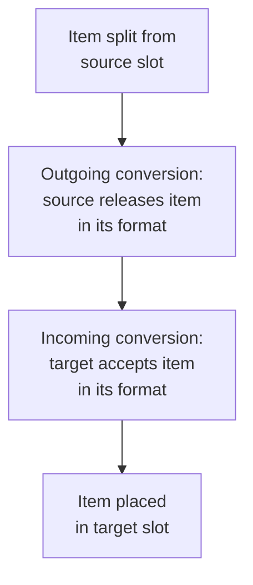
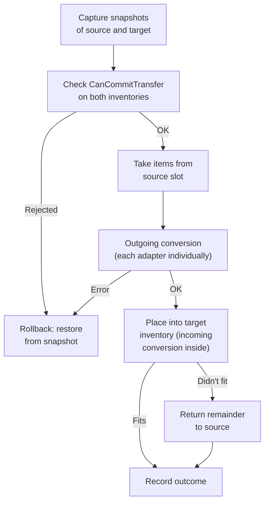
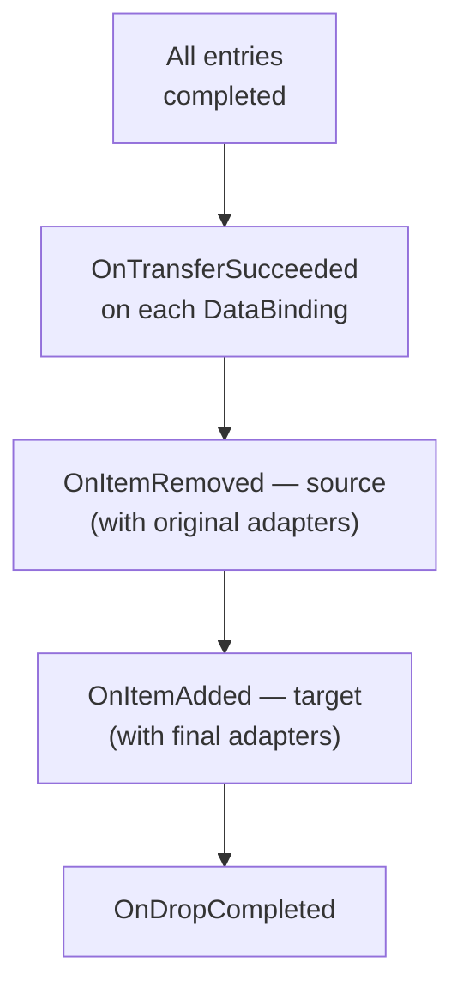
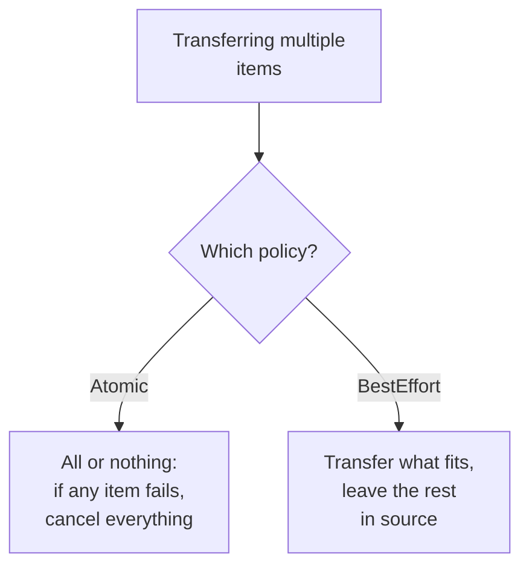
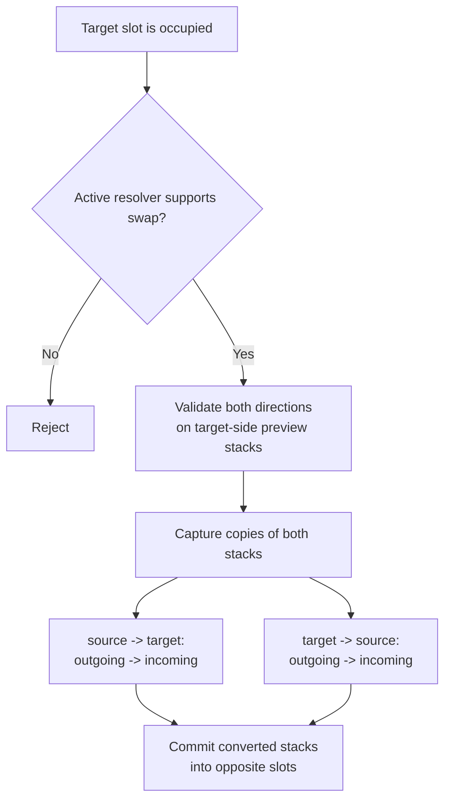

# Transfer Pipeline

This page explains transfer from the asset user's perspective.

The question is not "which helper classes exist?" but "in what order does the system decide, and where can I hook into it?"

For practical follow-ups, also see:

- [Drop Policy Matrix](drop-policy-matrix.md)
- [Cookbook: Item Conversion](item-conversion-cookbook.md)
- [Logs and Debugging](../reference/logs-and-debugging.md)

---

## Short version

---

## What happens on a normal drop

For direct slot drops this has one important consequence:

- when the operation already has a concrete `target slot` and the policy is not `FindAlternative`, planner/executor must not scan the rest of the inventory
- inventory-wide `GetAcceptableCount()` is only needed for area-drop, deferred placement, and alternative-slot search

---

## Why planning exists

Before any real mutation, the system decides:

- can the item fit
- is partial transfer needed
- is a swap required
- is there a valid target slot
- does the item need conversion for the target inventory

This enables:

- no state corruption on invalid operations
- atomic execution with rollback
- uniform handling of drag, quick transfer and swap

---

## Planning vs commit

- planning does not mutate inventory state
- commit applies real changes

That is why checks are split into several types, each with its own role.

---

## Three types of checks

The transfer pipeline has three distinct check mechanisms. They fire at different moments and serve different purposes:

### Rules — "is this allowed at all?"

Rules are checked **during the planning phase**, before any transfer attempt. These are mechanical constraints: does the item type match, is the slot allowed, is the inventory locked.

Rules work at three levels — the first rejection stops the operation:

| Level | What it checks | Example |
|---|---|---|
| **Global** | Entire application | Prevent drop into same slot |
| **Inventory** | Specific inventory | Unique item limit |
| **Slot** | Specific slot | Only weapons in weapon slot |

DataBinding also participates in rules: its `CanDrop` is called as part of inventory rules during planning.

For more on rules, see the [Rules](rules.md) section.

### Business checks (CanCommitTransfer) — "can we do this right now?"

Business checks fire **immediately before execution**, when the plan is already built. They are needed for checks that depend on current state and may change between planning and execution.

Order:

1. `CanCommitTransfer` — fast synchronous check
2. `CanCommitTransferAsync` — asynchronous check (if binding implements the interface)
3. commit

DataBindings on **both** inventories (source and target) are checked.

Example use cases:

- does the player have enough gold for the purchase
- did the server confirm the operation
- has state changed between planning and execution

### Success notification (OnTransferSucceeded) — "what to do after?"

`OnTransferSucceeded` fires **after all entries complete**, only on success. This is not a check, but a callback for side effects.

Examples:

- deduct currency
- update achievements
- record statistics

### When to use which

| Task | Where to write |
|---|---|
| "This item type can't go here" | Rule (CanDrop) |
| "Only weapons in weapon slot" | Slot rule |
| "Max 5 unique items" | Inventory rule |
| "Does the player have enough gold" | CanCommitTransfer |
| "Wait for server response" | CanCommitTransferAsync |
| "Deduct money after purchase" | OnTransferSucceeded |

---

## Item conversion

When source and target use different item representations, conversion happens in two stages:

Example: a merchant stores items as ScriptableObjects, and the player uses runtime models. On purchase:

1. Item is split from the merchant's slot
2. **Outgoing**: merchant releases the item (SO → intermediate format)
3. **Incoming**: player inventory accepts the item (intermediate → runtime model)
4. Item is placed in the player's slot

Important for asset users:

- each adapter in the stack is converted individually (unique runtime data is preserved)
- if any adapter fails conversion, the entire operation rolls back
- the target inventory receives the item already in its own format

---

## Detailed execution order

For each planned entry, the following happens:

After **all** entries are executed:

Important: events fire **after the entire operation completes**, not one per entry. This prevents false events when a later rollback occurs in Atomic mode.

Additional note:

- if execution already targets a concrete `targetSlot`, executor must not re-run inventory-wide capacity search
- in that branch it should trust the plan and commit placement only into the requested slot

---

## What happens on failure

If a check or commit fails, the behavior depends on the policy:

| Situation | What happens |
|---|---|
| `CanDrop` returns failure | transfer does not start, item returns to source |
| `CanCommitTransfer` returns failure | transfer is cancelled before commit, state unchanged |
| `CanCommitTransferAsync` returns failure | transfer is cancelled before commit, state unchanged |
| Atomic batch: one item fails | entire operation is cancelled, no items are moved |
| BestEffort batch: one item fails | remaining items are transferred, failed ones stay in source |

The key point: if a check fails, inventories remain in their original state. Planning builds a plan without mutations, and commit only applies after all checks pass.

---

## Drop Policy

The current model has three layers:

- `DropRequestPolicy`
  - temporary per-operation override
  - can override:
    - `BlockedTargetResolverBase`
    - `AllowPartial`
- `DropPolicySettings`
  - inventory-level defaults on `UniversalInventory`
  - defines:
    - blocked target resolver
    - allow merge on drop
    - allow partial
    - batch mode
- `ResolvedDropPolicy`
  - final non-nullable policy used by the planner
  - contains the concrete blocked-target resolver selected for this transfer

Built-in blocked target resolvers:
- `Reject`
- `Swap`
- `FindAlternative`

When `Swap` is selected, it owns a nested `[SerializeReference]` `ISwapStrategy`.
When `FindAlternative` is selected, it owns a nested `[SerializeReference]` `IAlternativePlacementStrategy`.

## Temporary override through actions

Temporary drop policy override is done through action-level request policy, not by mutating `DragContext`.

Example:
- default `CompleteDragAction` calls `CompleteDrag(null)`
- `Ctrl` variant of `CompleteDragAction` calls `CompleteDrag(DropRequestPolicy.WithSwap())`
- `Shift` variant of `CompleteDragAction` calls `CompleteDrag(DropRequestPolicy.WithFindAlternative())`
- actions can also override `AllowPartial`
- if needed, actions can supply a custom resolver object or a custom alternative placement strategy through `DropRequestPolicy.WithResolver(...)` or `DropRequestPolicy.WithFindAlternative(...)`

A separate variant is `SplitDropAction`: it calls `SplitDrop(policy, count)` instead of `CompleteDrag`. This allows dropping part of the stack (e.g. 1 item) without ending the drag. The transfer goes through the same pipeline (planner → executor → events). See [Input and Interaction](../systems/interaction.md#split-drop) for details.

Important:
- the override only applies to the current transfer operation
- inventory-level `DropPolicySettings` stay unchanged
- final `ResolvedDropPolicy` is assembled in this order:
  1. action request override
  2. drop-target override
  3. inventory defaults

## Custom Drop Policy Extensions

To create your own blocked-target behavior:

1. Create a class inheriting from `BlockedTargetResolverBase`.
2. Mark it `[Serializable]`.
3. Override `SwapStrategy` if your resolver should search custom swap candidates.
4. Override `AlternativePlacementStrategy` if your resolver should search alternative slots.
5. The class appears automatically in the `DropPolicySettings` managed reference picker.

To create your own swap strategy:

1. Create a class implementing `ISwapStrategy`.
2. Mark it `[Serializable]`.
3. Implement `EnumerateSwapTargets(...)` and return swap candidates in the exact order your workflow needs.
4. The class appears automatically inside `SwapBlockedTargetResolver`.

To create your own alternative placement strategy:

1. Create a class implementing `IAlternativePlacementStrategy`.
2. Mark it `[Serializable]`.
3. Implement `EnumerateAlternativeSlots(...)` and return slots in the exact order your workflow needs.
4. The class appears automatically inside `FindAlternativeBlockedTargetResolver`.

## Drop Policy Processing Order

For a single drag entry:

1. Resolve `ResolvedDropPolicy`
2. Try placing into the target slot if one exists
3. If everything fits, the entry succeeds
4. If only part fits:
   - `AllowPartial = false` -> fail
   - `AllowPartial = true` -> partial success
   - remainder can search for alternatives only when the active resolver exposes an `AlternativePlacementStrategy`
5. If nothing fits into the target:
   - `Reject` -> fail
   - `Swap`-capable resolver -> planner creates a swap entry
   - alternative-search resolver -> placement strategy enumerates alternative slots
6. For same-inventory drops, alternative-search resolvers do not reshuffle items across other slots. If the target fails, the item stays in place

## Batch operations

When transferring multiple items at once, behavior is determined by `BatchMode` inside `DropPolicy`:

By default, batch mode comes from the target inventory's `DropPolicySettings`, while request overrides only affect temporary runtime behavior.

---

## Swap is part of the same pipeline

In practice this means:

- cross-inventory swap must not be a raw stack exchange
- both directions are converted into the opposite inventory format before commit
- `OnItemRemoved` publishes `before` stacks, while `OnItemAdded` publishes `after` stacks
- otherwise a foreign adapter type remains in the slot and the next operation fails in `CanStartDrag` / `CanDrop`

---

## What you need to know vs what you don't

Usually an asset user needs to understand:

- where to write rules
- where to write business checks
- when data syncs
- why partial transfer and swap behave predictably

Usually not needed upfront:

- internal helper structures in the planning layer
- low-level execution layer steps
- map of all internal pipeline classes

If you're modifying the asset itself rather than just using it, see the [File Map](../reference/file-map.md).
