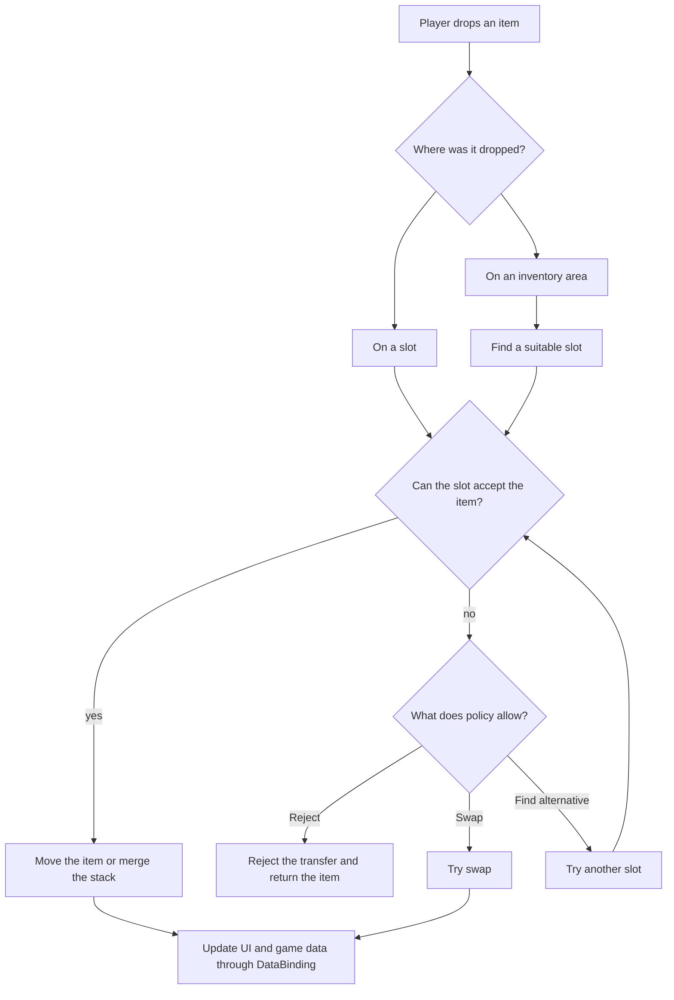
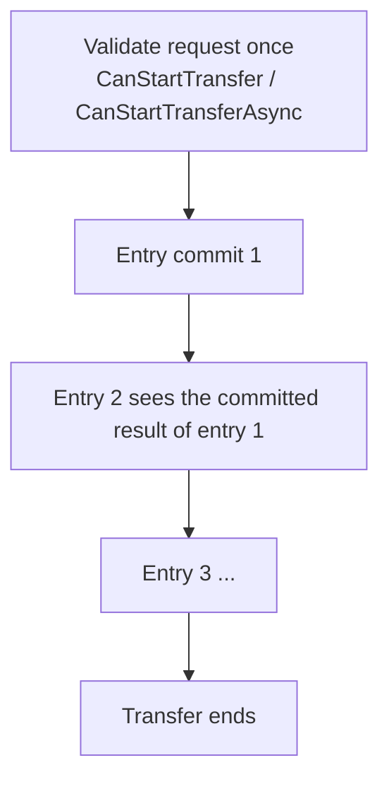

# Transfer Pipeline

This page explains what happens when the player drops an item over a slot, an
inventory area, or a drop zone.

The transfer pipeline checks whether the action is allowed, chooses the behavior
for the target, and either moves the item or leaves the inventories in a valid
state.

## Big Picture

## What Happens During Transfer

A typical transfer works like this:

1. The system resolves the source, target, and active drop policy settings.
2. If the inventories use different item models, the item is converted to the target
   inventory model.
3. The system checks whether the selected target can accept the item.
4. If the target is valid, the item is moved or merged into the stack in the target slot.
5. If the target is not valid, `DropPolicySettings` decides what happens next according
   to the selected options: reject the transfer, find another place, or try swap.
6. On success, events are sent and DataBinding is updated. On failure, the state is
   restored to the saved copy that was made before the transfer attempt.

## Cases

### Blocked Target

The selected slot cannot accept the item: it is occupied, incompatible, or full. What
happens next is controlled by `BlockedTargetResolutionKind`:

| Value | Behavior |
|---|---|
| `Reject` | The transfer entry fails. Nothing moves. |
| `FindAlternative` | The strategy provides available candidates, and the configured `PlacementCandidateOrderer` sorts them by priority. |
| `Swap` | The system attempts a single swap with the occupied target. |

`AllowSameInventoryAlternativePlacement` controls whether `FindAlternative`, when
moving an item inside the same inventory onto an occupied slot, may choose another
slot inside that same inventory. If it cannot, the item remains where it was before
the transfer attempt.

### Area Drop / Auto Transfer

There is no concrete slot: the player dropped onto the inventory area, or
double-click / auto-transfer started `AutoTransferService`. The engine skips explicit
target handling and immediately asks the strategy for candidates, then orders them.

### Large Stack Split Across Several Placements

A stack of 10 is still one transfer entry even if the target distributes it across
several placements. The engine:

1. creates a working stack of the requested size;
2. asks the strategy for candidate slots with free capacity, such as one item per slot
   for `UniqueItemStrategy`;
3. takes exactly that amount and applies the candidate;
4. processes candidates again against the changed state and repeats until the stack or
   the inventory slots run out;
5. returns anything that did not fit to the source.

Example: 10 items into a Unique inventory with 6 free slots means 6 are transferred and
4 are returned.

### Partial Or Require Full

The `_allowPartial` policy setting decides what happens when only part of a transfer
entry fits:

- `true` = `Allow` — commit what fits and return the rest to the source.
- `false` = `RequireFull` — if the whole amount cannot be placed, roll the entry back.

### Moving Inside One Inventory

When moving inside one inventory, the source is not blindly freed. A partial attempt
keeps the source occupied and excludes it from the candidate list, so target placements
cannot take the same cells that the remainder would need to return to. A full move may
run a separate attempt with the source temporarily removed, and it must move the whole
entry or roll back.

### Occupied Target Handler

If an item is dropped onto an occupied slot, the target inventory DataBinding can take over that case through `IOccupiedSlotDropHandler`.

There are two timing variants:

| Interface | When it is checked | When to use |
|---|---|---|
| `IPreRuleOccupiedSlotDropHandler` | before target slot drop rules | dropping onto the occupied slot really means another destination, such as a container inside that slot |
| `IPostRuleOccupiedSlotDropHandler` | after target slot drop rules | custom behavior must still pass the target's normal rules first |

`ExecuteOccupiedSlotDrop` returns `OccupiedSlotDropResult`:

- `Handled` — the handler performed the action itself; regular placement, alternative placement, and swap do not run.
- `Rejected` — the handler rejected the action; the transfer is cancelled and state is restored to the saved copy.
- `Fallthrough` — the handler does not take over this attempt; the regular occupied-slot pipeline continues.

### Batch

- Transfer entries run in drag-context order; each sees the committed result of the previous one.
- A failed entry rolls back by itself; previous transfers remain.
- The selected target slot applies only to the first entry; the rest behave like an area drop.

Batch swap, meaning several dragged items onto one occupied target with `Swap`, is
rejected before any mutation.

Partial transfer is applied **per entry**. `RequireFull` never cancels previous entries
in the batch.

## Validation

Several kinds of checks can allow or block a transfer, and they run at different times.

| Layer | Interface | Question | When it runs |
|---|---|---|---|
| Rules | `IGlobalRule` / `IInventoryRule` / `ISlotRule` | Can this item mechanically go here? Type filter, locked slot, and similar checks. | Drag start and target validation |
| Transfer-wide veto | `ITransferDomainHandler.CanStartTransfer` | Can this operation start at all? | Once, before the first mutation |
| Async transfer-wide veto | `IAsyncTransferDomainHandler.CanStartTransferAsync` | Same, but the answer needs waiting for something such as a server or disk. | Once, async path only, before the first mutation |
| Commit check | `ITransferDomainHandler.CanCommitTransfer` | Can this specific placement be committed? Enough gold, ownership, etc. | Right before each candidate mutation |
| Success side effects | `ITransferDomainHandler.OnTransferSucceeded` | React after a placement has been committed. | After a successful commit |

Rules are attached directly to slot or inventory objects. DataBinding also exposes
similar hooks by default: `CanStartDrag`, `CanDrop`, and `CanSwap`. Bindings can
implement `ITransferDomainHandler` and `IAsyncTransferDomainHandler` for additional
checks and actions that apply to the whole transfer.

## When Events Fire

Events and DataBinding notifications for an entry are sent **only after that entry is
committed** and before the next one starts. This ensures that the next entry sees the
same state as the live inventory.

Each add/remove event carries the exact sub-stack that actually moved, never the raw
`DragEntry.Stack`. An entry of 10 that lands as `6 + 4` sends events for 10 adapters
in total; an entry of 10 where 6 moved and 4 returned sends events for 6.

## Extension Points

Everything intended for plugging in custom logic is listed here:

| Extension point | Type | Purpose |
|---|---|---|
| **Placement strategy** | `IStrategy` / `InventoryStrategyBase` | Defines how items occupy slots: unique, stackable, separable, or custom merge/create/capacity logic. Read-only; returns candidates. |
| **Topology** | `IInventoryTopology` (`SlotTopology`, `RectGridTopology`, custom) | Defines the cell space: cell count, shape projection, orientation steps, and visual angles. |
| **Placement shape** | `IPlacementShape` (`RectPlacementShape`, `ComplexPlacementShape`) | Defines an item's footprint, including non-rectangular shapes and their rotations. |
| **Candidate orderer** | `PlacementCandidateOrderer` | Controls which slot automatic placement prefers, such as merge-first or empty-first. It is not used for an explicit target. |
| **Blocked target policy** | `BlockedTargetResolutionKind` + `DropPolicySettings` | Chooses reject / find-alternative / swap, plus partial-transfer and same-inventory options. Data-only, configured in the Inspector. |
| **Transfer-wide veto** | `ITransferDomainHandler.CanStartTransfer` | Allow or deny the whole operation before anything changes. |
| **Async transfer-wide veto** | `IAsyncTransferDomainHandler.CanStartTransferAsync` | Same, when the answer requires waiting for a server, file, or database. |
| **Business commit check** | `ITransferDomainHandler.CanCommitTransfer` | Allow or deny one specific placement, such as checking gold or ownership. |
| **Success hook** | `ITransferDomainHandler.OnTransferSucceeded` | Apply side effects after a committed placement. |
| **Occupied-slot handler** | `IPreRuleOccupiedSlotDropHandler` / `IPostRuleOccupiedSlotDropHandler` | Custom behavior when dropping onto an occupied slot, such as equip or insert into container. Implemented on DataBinding. |
| **Dynamic slot lifecycle** | `IDynamicSlotLifecycle` | Lets an inventory grow or shrink; the engine drives creation and removal. |
| **Item converter** | `IItemAdapterConverter` via `CreateItemConverter()` | Converts items between inventories with different adapter models. |
| **Rules** | `IGlobalRule` / `IInventoryRule` / `ISlotRule` | Declarative mechanical constraints on three levels. |
| **Drop zones** | `DropAreaBase` | Custom drop targets, such as trash, sale, or spawn in world, without changing the transfer pipeline. |
