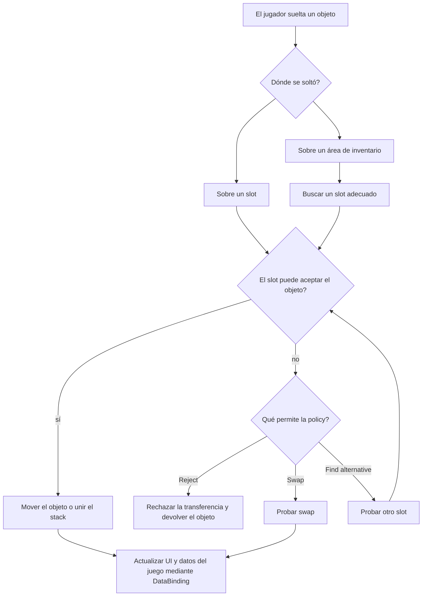
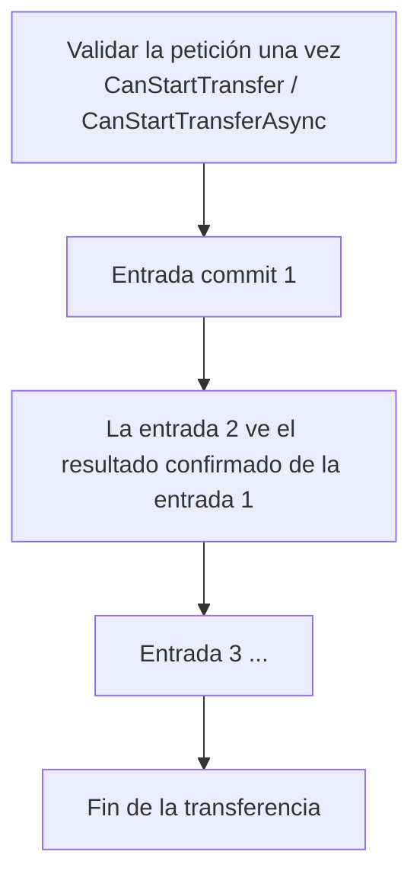

# Pipeline de transferencia

Esta página explica qué ocurre cuando el jugador suelta un objeto sobre un slot, un
área de inventario o una drop zone.

El objetivo del pipeline es comprobar si la acción está permitida, elegir el
comportamiento adecuado para el destino y mover el objeto o dejar los inventarios en
un estado válido.

## Idea general

## Qué ocurre durante la transferencia

Una transferencia típica funciona así:

1. El sistema resuelve el origen, el destino y la configuración activa de drop policy.
2. Si los inventarios usan modelos de objeto distintos, el objeto se convierte al modelo
   del inventario de destino.
3. El sistema comprueba si el destino elegido puede aceptar el objeto.
4. Si el destino es válido, el objeto se mueve o se une al stack del slot destino.
5. Si el destino no es válido, `DropPolicySettings` decide qué ocurre después según las
   opciones seleccionadas: rechazar la transferencia, buscar otro lugar o probar swap.
6. Si tiene éxito, se envían eventos y se actualiza DataBinding. Si falla, el estado se
   restaura a la copia guardada antes del intento de transferencia.

## Casos

### Destino bloqueado

El slot elegido no puede aceptar el objeto: está ocupado, es incompatible o está lleno.
Lo que ocurre después lo define `BlockedTargetResolutionKind`:

| Valor | Comportamiento |
|---|---|
| `Reject` | La entrada de transferencia falla. No se mueve nada. |
| `FindAlternative` | La estrategia devuelve candidatos disponibles y el `PlacementCandidateOrderer` configurado los ordena por prioridad. |
| `Swap` | El sistema intenta un swap único con el destino ocupado. |

`AllowSameInventoryAlternativePlacement` controla si `FindAlternative`, al mover un
objeto dentro del mismo inventario sobre un slot ocupado, puede elegir otro slot dentro
de ese mismo inventario. Si no puede, el objeto permanece donde estaba antes del intento
de transferencia.

### Drop en área / auto-transferencia

No hay un slot concreto: el jugador soltó el objeto sobre el área del inventario, o un
doble clic / auto-transferencia inició `AutoTransferService`. El motor omite el destino
explícito y pide candidatos directamente a la estrategia, luego los ordena.

### Stack grande repartido en varios lugares

Un stack de 10 sigue siendo una sola entrada de transferencia aunque el destino lo
reparta en varios lugares. El motor:

1. crea un stack de trabajo con la cantidad solicitada;
2. pide a la estrategia slots candidatos con capacidad libre, por ejemplo un objeto por
   slot para `UniqueItemStrategy`;
3. toma exactamente esa cantidad y aplica el candidato;
4. procesa los candidatos otra vez contra el estado ya cambiado y repite hasta que se
   agote el stack o los slots del inventario;
5. devuelve al origen lo que no cupo.

Ejemplo: 10 objetos a un inventario Unique con 6 slots libres significa 6 transferidos y
4 devueltos.

### Parcial o completo

El parámetro `_allowPartial` de la policy del inventario decide qué ocurre cuando solo
cabe parte de una entrada de transferencia:

- `true` = `Allow` — confirma lo que cabe y devuelve el resto al origen.
- `false` = `RequireFull` — si no puede colocarse toda la cantidad, la entrada se revierte.

### Movimiento dentro del mismo inventario

Al mover dentro del mismo inventario, el origen no se libera a ciegas. Un intento parcial
mantiene el origen ocupado y lo excluye de la lista de candidatos, para que los lugares de
destino no ocupen justo las celdas a las que el resto debería volver. Un movimiento
completo puede hacer un intento aparte con el origen eliminado temporalmente, y debe mover
toda la entrada o revertirse.

### Destino ocupado con handler

Si un item se suelta sobre un slot ocupado, el DataBinding del inventario destino puede tomar control de ese caso mediante `IOccupiedSlotDropHandler`.

Hay dos variantes de timing:

| Interface | Cuándo se comprueba | Cuándo usarla |
|---|---|---|
| `IPreRuleOccupiedSlotDropHandler` | antes de las drop rules del slot destino | soltar sobre el slot ocupado realmente significa otro destino, por ejemplo un contenedor dentro de ese slot |
| `IPostRuleOccupiedSlotDropHandler` | después de las drop rules del slot destino | el comportamiento personalizado debe pasar primero las reglas normales del destino |

`ExecuteOccupiedSlotDrop` devuelve `OccupiedSlotDropResult`:

- `Handled` — el handler ejecutó la acción; no se ejecutan la colocación normal, alternative placement ni swap.
- `Rejected` — el handler rechazó la acción; la transferencia se cancela y el estado se restaura a la copia guardada.
- `Fallthrough` — el handler no toma control de este intento; continúa el pipeline normal para un slot ocupado.

### Batch

- Las entradas de transferencia corren en el orden del drag-context; cada una ve el resultado confirmado de la anterior.
- Una entrada fallida se revierte sola; las transferencias anteriores permanecen.
- El slot destino elegido se aplica solo a la primera entrada; el resto se comporta como drop en área.

El batch-swap, es decir, varios objetos arrastrados sobre un mismo destino ocupado con
`Swap`, se rechaza antes de cualquier mutación.

La transferencia parcial se aplica **por entrada**. `RequireFull` nunca cancela entradas
anteriores del batch.

## Validación

Hay varios tipos de comprobaciones que permiten o bloquean una transferencia, y se
ejecutan en momentos distintos.

| Capa | Interfaz | Pregunta | Cuándo se ejecuta |
|---|---|---|---|
| Reglas | `IGlobalRule` / `IInventoryRule` / `ISlotRule` | Puede este objeto ir aquí mecánicamente? Filtro de tipo, slot bloqueado, etc. | Inicio del drag y validación del destino |
| Veto de toda la transferencia | `ITransferDomainHandler.CanStartTransfer` | Puede empezar esta operación? | Una vez, antes de la primera mutación |
| Veto asíncrono | `IAsyncTransferDomainHandler.CanStartTransferAsync` | Lo mismo, pero hay que esperar algo como servidor o disco. | Una vez, solo camino async, antes de la primera mutación |
| Comprobación de commit | `ITransferDomainHandler.CanCommitTransfer` | Puede confirmarse esta colocación concreta? Oro suficiente, propiedad, etc. | Justo antes de cada mutación de candidato |
| Efectos de éxito | `ITransferDomainHandler.OnTransferSucceeded` | Reaccionar después de una colocación confirmada. | Después de un commit exitoso |

Las reglas se colocan directamente en objetos de slot o inventario. DataBinding también
expone hooks similares por defecto: `CanStartDrag`, `CanDrop` y `CanSwap`. Los bindings
pueden implementar `ITransferDomainHandler` y `IAsyncTransferDomainHandler` para añadir
comprobaciones y acciones adicionales para toda la transferencia.

## Cuándo se disparan los eventos

Los eventos y notificaciones de DataBinding de una entrada se envían **solo después de
confirmar esa entrada** y antes de empezar la siguiente. Esto garantiza que la siguiente
entrada vea el mismo estado que el inventario en vivo.

Cada evento add/remove lleva el sub-stack exacto que realmente se movió, nunca el
`DragEntry.Stack` crudo. Una entrada de 10 que cae como `6 + 4` envía eventos por 10
adaptadores en total; una entrada de 10 donde se movieron 6 y volvieron 4 envía eventos
por 6.

## Puntos de extensión

Todo lo destinado a conectar lógica propia está listado aquí:

| Punto de extensión | Tipo | Para qué sirve |
|---|---|---|
| **Estrategia de colocación** | `IStrategy` / `InventoryStrategyBase` | Define cómo los objetos ocupan slots: unique, stackable, separable o lógica propia de merge/create/capacity. Solo lectura; devuelve candidatos. |
| **Topología** | `IInventoryTopology` (`SlotTopology`, `RectGridTopology`, propia) | Define el espacio de celdas: número de celdas, proyección de formas, pasos de orientación y ángulos visuales. |
| **Forma de colocación** | `IPlacementShape` (`RectPlacementShape`, `ComplexPlacementShape`) | Define el footprint de un objeto, incluidas formas no rectangulares y sus rotaciones. |
| **Ordenador de candidatos** | `PlacementCandidateOrderer` | Controla qué slot prefiere la colocación automática, por ejemplo merge-first o empty-first. No se usa para un destino explícito. |
| **Policy de destino bloqueado** | `BlockedTargetResolutionKind` + `DropPolicySettings` | Elige reject / find-alternative / swap, además de opciones de transferencia parcial y mismo inventario. Solo datos, configurado en Inspector. |
| **Veto de toda la transferencia** | `ITransferDomainHandler.CanStartTransfer` | Permitir o denegar toda la operación antes de que algo cambie. |
| **Veto asíncrono** | `IAsyncTransferDomainHandler.CanStartTransferAsync` | Lo mismo, cuando la respuesta requiere esperar a un servidor, archivo o base de datos. |
| **Comprobación de negocio por commit** | `ITransferDomainHandler.CanCommitTransfer` | Permitir o denegar una colocación concreta, por ejemplo oro o propiedad. |
| **Hook de éxito** | `ITransferDomainHandler.OnTransferSucceeded` | Aplicar efectos secundarios después de una colocación confirmada. |
| **Handler de slot ocupado** | `IPreRuleOccupiedSlotDropHandler` / `IPostRuleOccupiedSlotDropHandler` | Comportamiento propio al soltar sobre un slot ocupado, como equipar o meter en contenedor. Se implementa en DataBinding. |
| **Ciclo de vida de slots dinámicos** | `IDynamicSlotLifecycle` | Permite que un inventario crezca o se reduzca; el motor controla la creación y eliminación. |
| **Conversor de objetos** | `IItemAdapterConverter` mediante `CreateItemConverter()` | Convierte objetos entre inventarios con distintos modelos de adapter. |
| **Reglas** | `IGlobalRule` / `IInventoryRule` / `ISlotRule` | Restricciones mecánicas declarativas en tres niveles. |
| **Drop zones** | `DropAreaBase` | Destinos de drop propios, como basura, venta o spawn en mundo, sin cambiar el transfer pipeline. |
