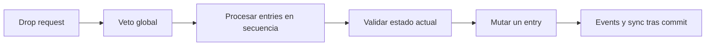

# Transfer Pipeline

Esta página describe el pipeline de transferencia just-in-time actual.

Consulta también:

- [Drop Policy Matrix](drop-policy-matrix.md)
- [Cookbook: Item Conversion](item-conversion-cookbook.md)
- [Logs and Debugging](../reference/logs-and-debugging.md)

## Versión corta

Ya no existe un `TransferPlan` materializado, estado virtual de slots ni rollback
atómico para todo el batch. Cada entry se evalúa contra el estado real dejado por
el entry anterior.

## Orden de un entry

Para cada `DragEntry`, el servicio:

1. valida las reglas de drag/drop;
2. resuelve el preview adapter del target sin mutar el source;
3. crea `InventoryAcceptanceRequest`;
4. valida un target explícito con `IStrategy.TryGetCandidate(...)`;
5. para colocación automática enumera `IStrategy.GetCandidates(...)` y aplica un
   `PlacementCandidateOrderer`;
6. ejecuta conversion, split, merge, placement o swap;
7. restaura los snapshots del entry si falla;
8. emite events y notificaciones DataBinding solo después del commit.

## Target explícito y colocación automática

Un target concreto se valida primero y no se pasa por un orderer.

Si está bloqueado:

- `Reject` rechaza el entry;
- `Swap` intenta un swap de un solo entry;
- `AlternativeSlots` enumera candidates automáticos y los ordena.

Area drop y auto-transfer empiezan directamente con candidates automáticos.

## Strategy y topology

`IStrategy` controla semántica de items, capacidad, merge/create y candidates.
`IPlacementGeometry` y la topology controlan anchor, footprint orientado, límites,
ocupación y covered slots. Items single-cell y shaped usan el mismo pipeline.

## Semántica batch

El batch es sequential best-effort:

- procesa entries en orden;
- un fallo restaura solo el entry actual;
- entries posteriores ven cambios anteriores;
- `PartialTransferMode.Allow` mueve lo que cabe y deja el resto en source;
- batch swap se rechaza antes de mutar. Swap requiere un entry completo.

## Puntos de extensión

`ITransferDomainHandler.CanStartTransfer(...)` se ejecuta antes de los entries y
puede cancelar toda la transferencia. Puede implementar una simulación propia,
pero la simulación no es obligatoria.

También existen rules, `IOccupiedSlotDropHandler`, `PlacementCandidateOrderer`,
converters y success hooks.

## Garantías de fallo

No hay atomicidad de todo el batch. Un entry fallido restaura sus snapshots de
source y target, y no emite notificaciones antes de su commit.
