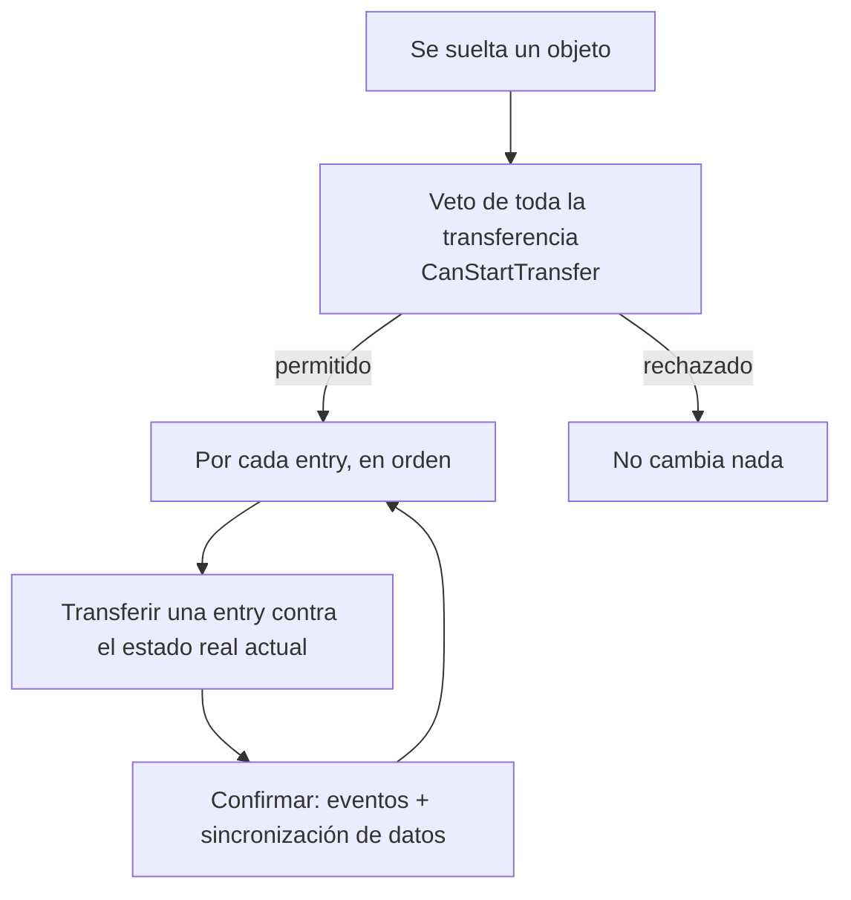
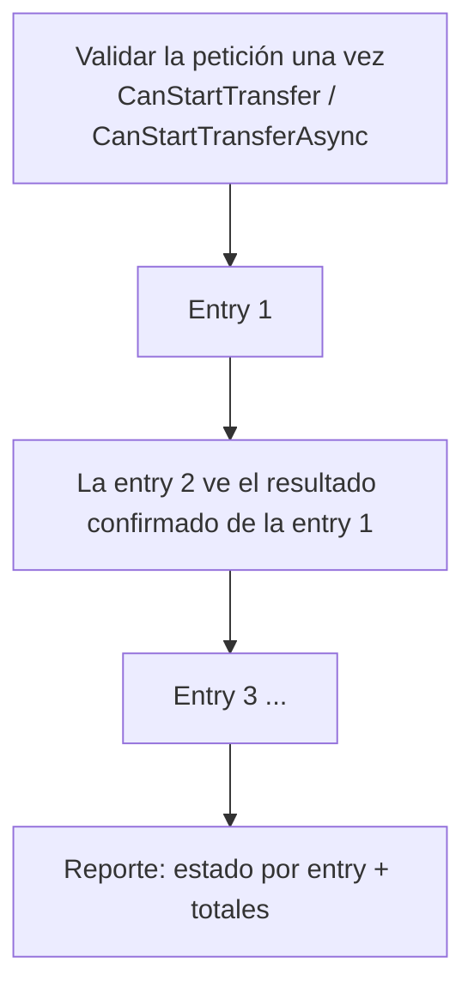

# Pipeline de transferencia

Esta página explica qué ocurre cuando se suelta un objeto: el orden de los pasos, cómo
se comporta cada caso común y todos los puntos donde puedes enchufar tu propia lógica.

Está escrita para leerse sin conocer a fondo el código. Si solo recuerdas una cosa:
**no hay un plan previo**. El sistema procesa una entrada (entry) cada vez contra el
estado *real* del inventario y confirma sobre la marcha.

Ver también:

- [Matriz de drop policy](drop-policy-matrix.md) — los campos de la política en una tabla
- [Estrategias de colocación](strategies.md) — cómo los objetos eligen huecos
- [Recetario: conversión de objetos](item-conversion-cookbook.md)
- [Logs y depuración](../reference/logs-and-debugging.md)

## La idea general

Ideas clave:

- **No se precalcula nada.** El sistema no construye un plan ni una copia virtual del
  inventario por adelantado; muta el estado real sobre la marcha.
- **Secuencial y best-effort.** Las entries se manejan una a una; la entry N ve el
  resultado de la entry N-1. Una entry fallida se revierte por sí sola y no deshace las
  entries exitosas anteriores.
- **Los objetos de una celda y los de forma usan el mismo camino.** Un objeto 1×1 es solo
  una huella (footprint) de una celda. Nada se ramifica según "esto es una grid".

## Quién hace qué

| Pieza | Rol en lenguaje claro |
|---|---|
| `InventoryDropProcessor` | La frontera. La UI y las zonas de drop la llaman; solo delega. |
| `InventoryTransferService` | El motor. Ejecuta el bucle de entries, muta el inventario, revierte, emite eventos. |
| `IStrategy` | Decide *qué* colocación puede usar un objeto y cuánto cabe (merge vs create, capacity, unique/stackable/separable). Es de solo lectura: nunca muta. |
| `IPlacementGeometry` + topología | Decide *dónde* aterriza una huella: resuelve el hueco ancla, proyecta la forma orientada, comprueba límites y ocupación. |
| Política (`ResolvedDropPolicy`) | Qué hacer cuando el destino elegido está bloqueado y si se permite una transferencia parcial. |
| `ITransferDomainHandler` | Tu veto de lógica de negocio y efectos secundarios (dinero, servidor, propiedad). |

## Una entry, paso a paso

Para cada `DragEntry`, `InventoryTransferService` hace lo siguiente:

1. **Resuelve el adaptador de preview del destino.** Si los dos inventarios representan
   los objetos de forma distinta, el objeto se convierte a cómo lo ve el *destino*, sin
   tocar aún el origen. (Ver [Conversión de objetos](item-conversion-cookbook.md).)
2. **Construye una petición de aceptación** que describe qué se ofrece al destino.
3. **Toma un checkpoint** del origen y el destino para poder deshacer la entry.
4. **Elige una colocación:**
   - Si el usuario soltó sobre un hueco concreto, pregunta a la estrategia directamente:
     `IStrategy.TryGetCandidate(...)`. No interviene el ordenamiento.
   - Si hace falta colocación automática, enumera `IStrategy.GetCandidates(...)` y elige
     uno con un `PlacementCandidateOrderer`.
5. **Antes de cada mutación revalida** topología/límites/ocupación y llama a la
   comprobación de dominio por colocación (`CanCommitTransfer`). Luego aplica la mutación
   (create, merge, place o swap).
6. **Gestiona el resto.** Un stack grande puede llenar varias colocaciones; lo que no cabe
   se devuelve al origen.
7. **Confirma o revierte.** Si tiene éxito, emite los eventos y notificaciones de
   DataBinding *de esta entry* antes de pasar a la siguiente. Si falla, restaura el
   checkpoint: no se emiten eventos.

## Casos

### Destino explícito válido

El usuario soltó sobre un hueco concreto y la estrategia lo acepta. El candidato de
`TryGetCandidate` ya lleva la colocación/ancla resueltas y la cantidad exacta que cabe.
El ordenamiento de candidatos **no** se usa.

### Destino explícito bloqueado

El hueco elegido no puede recibir el objeto (ocupado, incompatible, lleno). Lo que pasa a
continuación lo decide `BlockedTargetResolutionKind`:

| Valor | Comportamiento |
|---|---|
| `Reject` | La entry falla. No se mueve nada. |
| `FindAlternative` | El hueco indicado se deja intacto; el motor enumera el resto de candidatos y los ordena con el `PlacementCandidateOrderer` configurado. |
| `Swap` | Se intenta un swap de una sola entry con el destino ocupado. |

`AllowSameInventoryAlternativePlacement` controla si `FindAlternative` puede elegir otro
hueco dentro del *mismo* inventario.

### Drop en área / auto-transferencia

No hay hueco concreto (el usuario soltó sobre el área del inventario, o un doble clic /
auto-move disparó `AutoTransferService`). El motor se salta el paso de destino explícito y
va directo a enumerar y ordenar candidatos.

### Un stack grande que ocupa varias colocaciones

Un stack de 10 sigue siendo **una entry**, aunque el destino lo reparta en varias
colocaciones. El motor:

1. crea un stack de trabajo del tamaño solicitado;
2. pide a la estrategia candidatos con capacity (Unique → 1 cada uno, Stackable →
   merge one-per-id, Separable → hasta el máximo por stack);
3. separa exactamente esa cantidad y aplica el candidato;
4. vuelve a enumerar candidatos contra el estado ya cambiado y repite;
5. devuelve al origen lo que no cupo.

Ejemplo: 10 objetos a un inventario Unique con 6 huecos libres → 6 transferidos, 4
devueltos, reportado como `RequestedAmount = 10, TransferredAmount = 6`.

### Parcial vs completo

`PartialTransferMode` decide qué hacer cuando solo cabe parte de una entry:

- `Allow` — confirma lo que cabe y devuelve el resto al origen.
- `RequireFull` — si no se puede colocar todo, revierte la entry.

Esto es **por entry**. `RequireFull` nunca deshace entries anteriores de un lote.

### Movimiento dentro del mismo inventario

Al mover dentro de un inventario, la huella del origen no se libera a ciegas: un intento
parcial mantiene el origen ocupado y lo excluye de la lista de candidatos, para que las
colocaciones de destino no ocupen justo las celdas a las que el resto debería volver. Una
reubicación completa puede hacer un intento aparte con el origen eliminado temporalmente, y
debe mover toda la entry o revertir.

### Destino ocupado con un handler

Si el hueco de destino está ocupado y el inventario (o su binding) provee un
`IOccupiedSlotDropHandler`, ese handler corre primero como una comprobación pura y luego se
ejecuta de forma todo-o-nada. La prioridad es: handler de ocupado → merge/create normal →
política de bloqueo. Un handler nunca dispara alternativas ni swaps por sí mismo.

### Huecos dinámicos

Un inventario dinámico puede crecer. La estrategia puede devolver un candidato
`NewDynamicSlot`, pero **no** crea el hueco. El motor crea el hueco, intenta la colocación
exacta y lo vuelve a eliminar si la colocación falla.

### Swap (intercambio)

El swap es un camino dedicado de una sola entry (ni estrategia ni plan). Solo corre cuando:
hay exactamente una entry, un destino ocupado concreto, se mueve todo el origen, ambos
lados convierten con éxito en ambas direcciones, ambos pasan la validación de reglas/dominio
y las huellas resultantes caben (y no se solapan en un swap del mismo inventario). Captura
ambos lados, elimina ambas colocaciones, coloca cada objeto convertido en el ancla del otro
y confirma ambos o revierte ambos.

El swap por lotes (varias entries sobre un mismo destino ocupado con `Swap`) se rechaza
antes de cualquier mutación. Un "intercambio de grupo" grid-vs-grid es una función futura
aparte, no un swap por lotes.

### Lote (varias entries a la vez)

- Las entries corren en el orden del drag-context; cada una ve el resultado confirmado de la anterior.
- Una entry fallida se revierte sola; los éxitos previos permanecen.
- Una *pista* de destino solo aplica a la primera entry; el resto se comporta como drop en área.
- El lote tiene éxito si al menos una entry se movió; `IsPartial` significa que no todo lo hizo.

## Dos tipos de validación

Es fácil confundir "reglas" con "lógica de negocio". Son capas distintas y corren en
momentos distintos.

| Capa | Interfaz | Pregunta que responde | Cuándo corre |
|---|---|---|---|
| Reglas | `IGlobalRule` / `IInventoryRule` / `ISlotRule` | *Mecánicamente*, ¿puede ir este objeto aquí? (filtro de tipo, hueco bloqueado, mismo hueco…) | inicio del arrastre y validación del destino |
| Veto de toda la transferencia | `ITransferDomainHandler.CanStartTransfer` | ¿Puede empezar siquiera esta operación? | una vez, antes de la primera mutación |
| Veto asíncrono | `IAsyncTransferDomainHandler.CanStartTransferAsync` | Lo mismo, pero hay que esperar algo (servidor, disco) | una vez, solo camino async, antes de la primera mutación |
| Comprobación por commit | `ITransferDomainHandler.CanCommitTransfer` | ¿Puede confirmarse *esta* colocación concreta? (oro suficiente, propiedad) | justo antes de cada mutación de candidato |
| Efectos del éxito | `ITransferDomainHandler.OnTransferSucceeded` | Reaccionar tras una colocación confirmada | tras un commit exitoso |

Usa reglas para la mecánica. Usa el domain handler para dinero, servidores, propiedad y
efectos secundarios; nunca los metas en las reglas.

## Cuándo se disparan los eventos

Los eventos y notificaciones de DataBinding de una entry se emiten **solo después de que esa
entry se confirma**, y antes de que empiece la siguiente. Esto garantiza que la siguiente
entry (y cualquier domain handler) vea un estado que coincide con el inventario en vivo.

Cada evento add/remove lleva el sub-stack exacto que realmente se movió, nunca el
`DragEntry.Stack` crudo. Una entry de 10 que aterriza como `6 + 4` emite eventos por 10
adaptadores en total; una entry de 10 donde se movieron 6 y volvieron 4 emite por 6.

## Puntos de extensión

Todo lo pensado para enchufar tu lógica, en un solo lugar:

| Punto de extensión | Tipo | Para qué sirve |
|---|---|---|
| **Estrategia de colocación** | `IStrategy` / `InventoryStrategyBase` | Define cómo ocupan los objetos los huecos: unique, stackable, separable o tu propia lógica de merge/create/capacity. De solo lectura; produce candidatos. |
| **Topología** | `IInventoryTopology` (`SlotTopology`, `RectGridTopology`, propia) | Define el espacio de celdas: cuántas, cómo se proyecta una forma, pasos de orientación y ángulos visuales. Un hex grid es solo una topología con 6 pasos. |
| **Forma de colocación** | `IPlacementShape` (`RectPlacementShape`, `ComplexPlacementShape`) | Define la huella de un objeto, incluyendo formas no rectangulares (L/T/cruz) y sus rotaciones. |
| **Ordenador de candidatos** | `PlacementCandidateOrderer` | Influye en qué hueco prefiere la colocación automática (merge-first, empty-first, etc.). Nunca se aplica a un destino explícito. |
| **Política de destino bloqueado** | `BlockedTargetResolutionKind` + `DropPolicySettings` | Elige reject / find-alternative / swap, más opciones de transferencia parcial y mismo-inventario. Solo datos, se configura en el Inspector. |
| **Veto de toda la transferencia** | `ITransferDomainHandler.CanStartTransfer` | Permitir o denegar toda la operación antes de que algo cambie (p. ej. "la tienda está cerrada"). |
| **Veto asíncrono** | `IAsyncTransferDomainHandler.CanStartTransferAsync` | Lo mismo, cuando la respuesta requiere esperar a un servidor, fichero o base de datos. |
| **Comprobación de negocio por commit** | `ITransferDomainHandler.CanCommitTransfer` | Permitir o denegar una colocación concreta (oro suficiente, propiedad). |
| **Hook de éxito** | `ITransferDomainHandler.OnTransferSucceeded` | Efectos secundarios tras una colocación confirmada (cobrar oro, analítica). |
| **Handler de hueco ocupado** | `IOccupiedSlotDropHandler` | Comportamiento propio al soltar sobre un hueco ocupado (equipar, meter en un contenedor). |
| **Ciclo de vida de huecos dinámicos** | `IDynamicSlotLifecycle` | Permite al inventario crecer/encoger; el motor dirige la creación/eliminación. |
| **Conversor de objetos** | `IItemAdapterConverter` (vía `CreateItemConverter()`) | Traduce objetos entre dos inventarios con modelos de adaptador distintos. |
| **Reglas** | `IGlobalRule` / `IInventoryRule` / `ISlotRule` | Restricciones mecánicas declarativas en tres niveles. Ver [Reglas](rules.md). |
| **Zonas de drop** | `DropAreaBase` | Destinos de drop propios (basura, venta, spawn en el mundo) sin tocar el pipeline. Ver [Zonas de drop](drop-areas.md). |

## Lo que el pipeline *no* promete

- **No hay atomicidad de todo el lote.** No existe el modo `Atomic`. Cada entry se confirma
  sola; un fallo posterior no deshace las entries anteriores.
- **No hay reubicación implícita.** El motor nunca mueve objetos ajenos para hacer sitio.
  Reempaquetar/ordenar es una acción aparte y explícita.
- **El preview es orientativo.** Un `TransferProbe` describe lo que *ocurriría* para la
  primera colocación; no reserva nada y la ejecución siempre revalida. El reporte de
  ejecución es el único resultado autoritativo.
