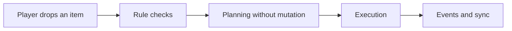
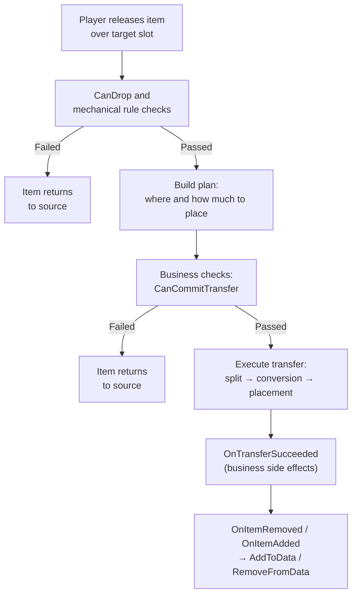
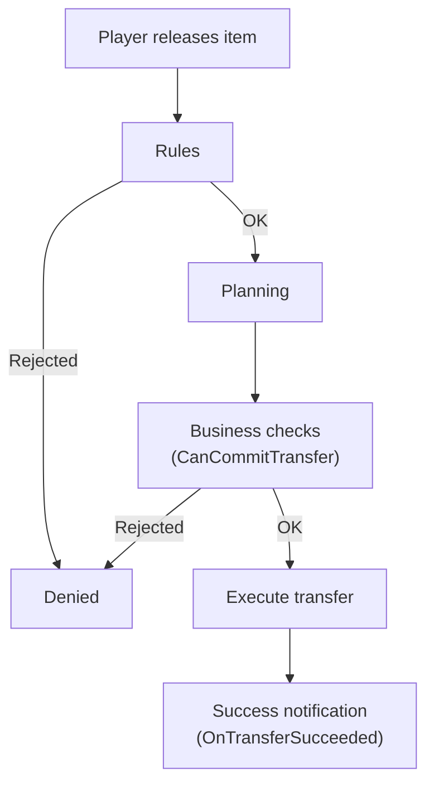
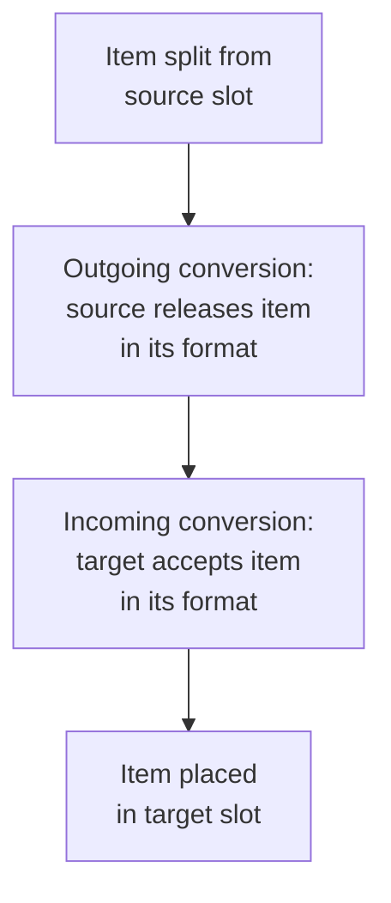
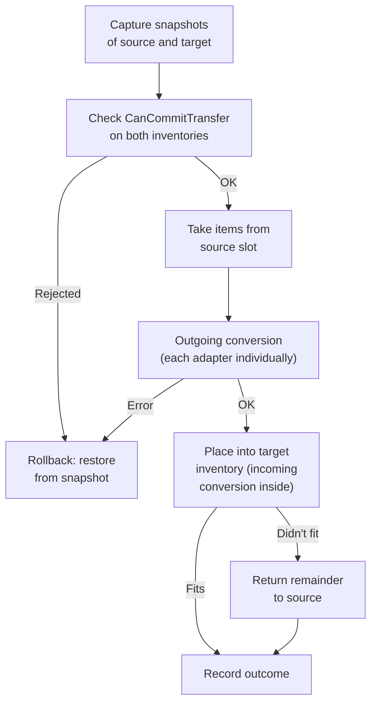
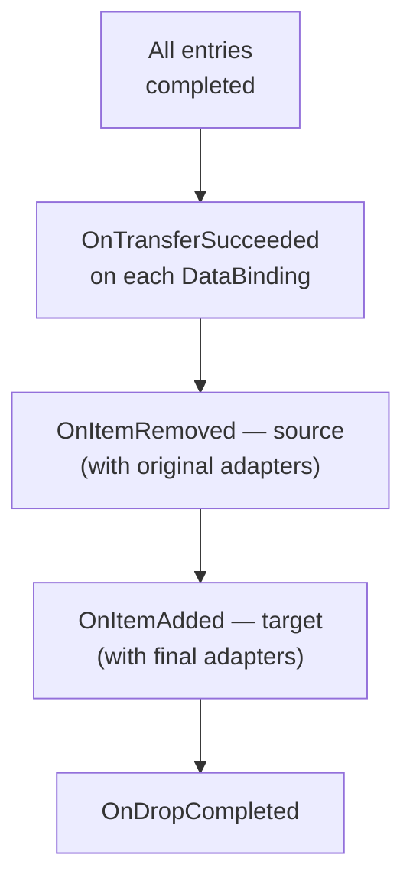
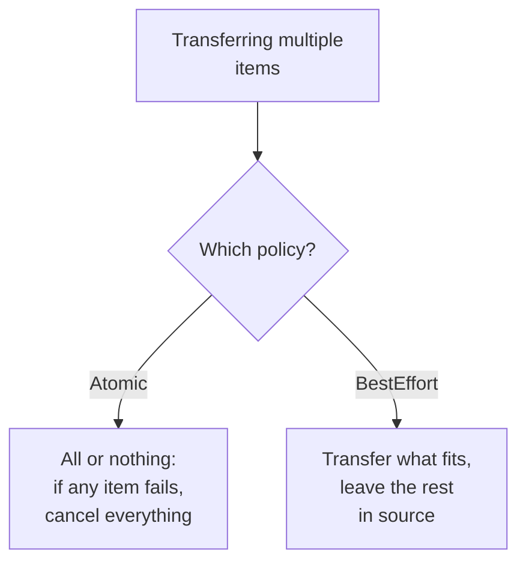
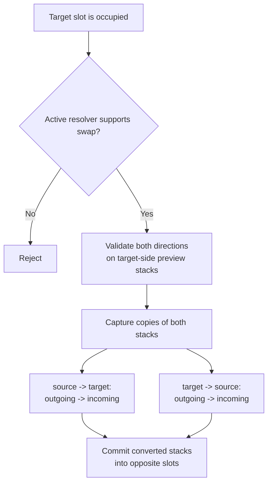

# Transfer Pipeline

Esta página explica la transferencia desde la perspectiva del usuario del asset.

La pregunta aquí no es "¿qué helper classes existen?", sino "¿en qué orden decide el sistema, y dónde puedo engancharme?"

Para seguimientos prácticos, consulta también:

- [Drop Policy Matrix](drop-policy-matrix.md)
- [Cookbook: Item Conversion](item-conversion-cookbook.md)
- [Logs and Debugging](../reference/logs-and-debugging.md)

---

## Versión corta

---

## Qué ocurre en un drop normal

Para drops directos sobre slot esto tiene una consecuencia importante:

- cuando la operación ya tiene un `target slot` concreto y la policy no es `FindAlternative`, planner/executor no deben escanear el resto del inventario
- el `GetAcceptableCount()` a nivel de inventario solo es necesario para area-drop, deferred placement y búsqueda de slots alternativos

---

## Por qué existe el planning

Antes de cualquier mutación real, el sistema decide:

- si el item cabe
- si hace falta partial transfer
- si se requiere swap
- si existe un target slot válido
- si el item necesita conversión para el inventario objetivo

Esto permite:

- no corromper el estado en operaciones inválidas
- ejecución atómica con rollback
- manejo uniforme de drag, quick transfer y swap

---

## Planning vs commit

- el planning no muta el estado del inventario
- el commit aplica cambios reales

Por eso las comprobaciones se dividen en varios tipos, cada una con su papel.

---

## Tres tipos de comprobaciones

El transfer pipeline tiene tres mecanismos de comprobación distintos. Se disparan en momentos diferentes y sirven para propósitos distintos:

### Rules — "¿está permitido en absoluto?"

Las rules se comprueban **durante la fase de planning**, antes de cualquier intento de transferencia. Son restricciones mecánicas: si el tipo de item encaja, si el slot está permitido, si el inventario está bloqueado.

Las rules funcionan a tres niveles: la primera denegación detiene la operación:

| Nivel | Qué comprueba | Ejemplo |
|---|---|---|
| **Global** | Toda la aplicación | Impedir drop en el mismo slot |
| **Inventory** | Inventario concreto | Límite de items únicos |
| **Slot** | Slot concreto | Solo armas en el slot de arma |

DataBinding también participa en las rules: su `CanDrop` se llama como parte de las inventory rules durante el planning.

Para más sobre las rules, consulta la sección [Rules](rules.md).

### Business checks (CanCommitTransfer) — "¿podemos hacer esto ahora mismo?"

Las business checks se ejecutan **inmediatamente antes de la ejecución**, cuando el plan ya está construido. Son necesarias para comprobaciones que dependen del estado actual y pueden cambiar entre el planning y la ejecución.

Orden:

1. `CanCommitTransfer` — comprobación síncrona y rápida
2. `CanCommitTransferAsync` — comprobación asíncrona (si el binding implementa la interface)
3. commit

Se comprueban los DataBindings de **ambos** inventarios (origen y destino).

Ejemplos típicos:

- si el jugador tiene suficiente oro para la compra
- si el servidor confirmó la operación
- si el estado cambió entre el planning y la ejecución

### Success notification (OnTransferSucceeded) — "¿qué hacer después?"

`OnTransferSucceeded` se dispara **después de que todas las entries se completen**, y solo en caso de éxito. No es una comprobación, sino un callback para side effects.

Ejemplos:

- descontar moneda
- actualizar logros
- registrar estadísticas

### Cuándo usar cada una

| Tarea | Dónde escribirla |
|---|---|
| "Este tipo de item no puede ir aquí" | Rule (`CanDrop`) |
| "Solo armas en el slot de arma" | Slot rule |
| "Máximo 5 items únicos" | Inventory rule |
| "¿Tiene el jugador suficiente oro?" | `CanCommitTransfer` |
| "Esperar respuesta del servidor" | `CanCommitTransferAsync` |
| "Descontar dinero tras la compra" | `OnTransferSucceeded` |

---

## Conversión de items

Cuando origen y destino usan representaciones distintas del item, la conversión ocurre en dos etapas:

Ejemplo: un comerciante almacena items como ScriptableObjects y el jugador usa runtime models. En una compra:

1. El item se separa del slot del comerciante
2. **Outgoing**: el comerciante libera el item (SO → formato intermedio)
3. **Incoming**: el inventario del jugador acepta el item (formato intermedio → runtime model)
4. El item se coloca en el slot del jugador

Importante para quien use el asset:

- cada adapter del stack se convierte individualmente (los datos runtime únicos se conservan)
- si algún adapter falla durante la conversión, toda la operación hace rollback
- el inventario objetivo recibe el item ya en su propio formato

---

## Orden detallado de ejecución

Para cada planned entry, ocurre lo siguiente:

Después de que **todas** las entries se hayan ejecutado:

Importante: los eventos se disparan **después de que termine toda la operación**, no uno por cada entry. Esto evita eventos falsos cuando ocurre un rollback posterior en modo Atomic.

Nota adicional:

- si la ejecución ya apunta a un `targetSlot` concreto, el executor no debe volver a lanzar una búsqueda de capacidad a nivel de inventario
- en esa rama debe confiar en el plan y confirmar la colocación solo en el slot solicitado

---

## Qué ocurre si hay fallo

Si una comprobación o un commit falla, el comportamiento depende de la policy:

| Situación | Qué ocurre |
|---|---|
| `CanDrop` devuelve fallo | la transferencia no empieza, el item vuelve al origen |
| `CanCommitTransfer` devuelve fallo | la transferencia se cancela antes del commit, el estado no cambia |
| `CanCommitTransferAsync` devuelve fallo | la transferencia se cancela antes del commit, el estado no cambia |
| Batch atómico: falla un item | se cancela toda la operación y no se mueve ningún item |
| Batch BestEffort: falla un item | el resto se transfiere y los que fallan permanecen en origen |

La idea clave es: si una comprobación falla, los inventarios permanecen en su estado original. El planning construye el plan sin mutaciones, y el commit solo se aplica después de que todas las comprobaciones hayan pasado.

---

## Drop Policy

El modelo actual tiene tres capas:

- `DropRequestPolicy`
  - override temporal por operación
  - puede sobrescribir:
    - `BlockedTargetResolverBase`
    - `AllowPartial`
- `DropPolicySettings`
  - valores por defecto a nivel de inventario en `UniversalInventory`
  - define:
    - blocked target resolver
    - permitir merge on drop
    - permitir parcial
    - batch mode
- `ResolvedDropPolicy`
  - policy final no anulable que usa el planner
  - contiene el blocked-target resolver concreto usado por esta transferencia

Resolvers integrados para blocked target:
- `Reject`
- `Swap`
- `FindAlternative`

Cuando se selecciona `Swap`, contiene internamente una `[SerializeReference]` `ISwapStrategy`.
Cuando se selecciona `FindAlternative`, contiene internamente una `[SerializeReference]` `IAlternativePlacementStrategy`.

## Override temporal a través de acciones

El override temporal de drop policy se hace mediante la request policy de la acción, no mutando `DragContext`.

Ejemplo:
- `CompleteDragAction` por defecto llama a `CompleteDrag(null)`
- la variante con `Ctrl` de `CompleteDragAction` llama a `CompleteDrag(DropRequestPolicy.WithSwap())`
- la variante con `Shift` de `CompleteDragAction` llama a `CompleteDrag(DropRequestPolicy.WithFindAlternative())`
- las acciones también pueden sobrescribir `AllowPartial`
- si hace falta, también pueden pasar un resolver propio o una placement strategy propia con `DropRequestPolicy.WithResolver(...)` o `DropRequestPolicy.WithFindAlternative(...)`

Una variante separada es `SplitDropAction`: llama a `SplitDrop(policy, count)` en lugar de `CompleteDrag`. Esto permite soltar parte del stack (p. ej., 1 item) sin terminar el drag. La transferencia pasa por el mismo pipeline (planner → executor → eventos). Ver [Input and Interaction](../systems/interaction.md#split-drop) para más detalles.

Importante:
- el override solo se aplica a la operación de transferencia actual
- `DropPolicySettings` a nivel de inventario no cambian
- el `ResolvedDropPolicy` final se monta en este orden:
  1. action request override
  2. drop-target override
  3. inventory defaults

## Extensiones personalizadas de Drop Policy

Para crear tu propio comportamiento de blocked target:

1. Crea una clase que herede de `BlockedTargetResolverBase`.
2. Márquela con `[Serializable]`.
3. Sobrescribe `SwapStrategy` si tu resolver debe buscar swap candidates personalizados.
4. Sobrescribe `AlternativePlacementStrategy` si tu resolver debe buscar slots alternativos.
5. La clase aparecerá automáticamente en el managed reference picker de `DropPolicySettings`.

Para crear tu propia swap strategy:

1. Crea una clase que implemente `ISwapStrategy`.
2. Márquela con `[Serializable]`.
3. Implementa `EnumerateSwapTargets(...)` y devuelve los swap candidates en el orden exacto que necesites.
4. La clase aparecerá automáticamente dentro de `SwapBlockedTargetResolver`.

Para crear tu propia strategy de colocación alternativa:

1. Crea una clase que implemente `IAlternativePlacementStrategy`.
2. Márquela con `[Serializable]`.
3. Implementa `EnumerateAlternativeSlots(...)` y devuelve los slots en el orden exacto que necesites.
4. La clase aparecerá automáticamente dentro de `FindAlternativeBlockedTargetResolver`.

## Orden de procesamiento de Drop Policy

Para una sola drag entry:

1. Resolver `ResolvedDropPolicy`
2. Intentar colocar en el target slot si existe
3. Si cabe todo, la entry tiene éxito
4. Si solo cabe una parte:
   - `AllowPartial = false` -> fallo
   - `AllowPartial = true` -> éxito parcial
   - el resto puede buscar alternativas solo cuando el resolver activo expone `AlternativePlacementStrategy`
5. Si no cabe nada en el objetivo:
   - `Reject` -> fallo
   - resolver con soporte de `Swap` -> el planner crea una swap entry
   - resolver con alternative placement -> la placement strategy enumera slots alternativos
6. En drops dentro del mismo inventario, los resolvers con alternative placement no reordenan items a través de otros slots. Si el target falla, el item permanece en su sitio

## Operaciones por lotes

Al transferir varios items a la vez, el comportamiento viene determinado por `BatchMode` dentro de `DropPolicy`:

Por defecto, el batch mode proviene de `DropPolicySettings` del inventario objetivo, mientras que los request overrides solo afectan al comportamiento temporal en runtime.

---

## El swap forma parte del mismo pipeline

En la práctica esto significa:

- el swap entre inventarios no debe ser un raw stack exchange
- ambas direcciones se convierten al formato del inventario opuesto antes del commit
- `OnItemRemoved` publica stacks `before`, mientras que `OnItemAdded` publica stacks `after`
- de lo contrario queda un adapter extranjero dentro del slot y la siguiente operación falla en `CanStartDrag` / `CanDrop`

