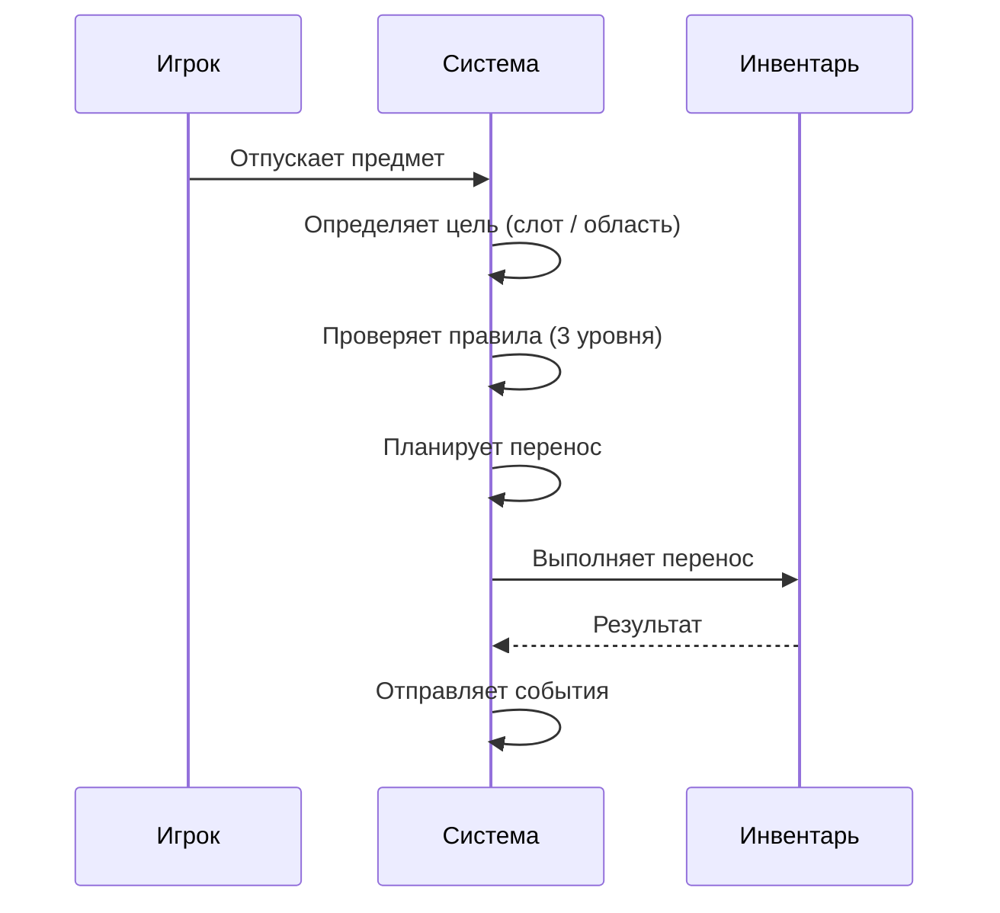
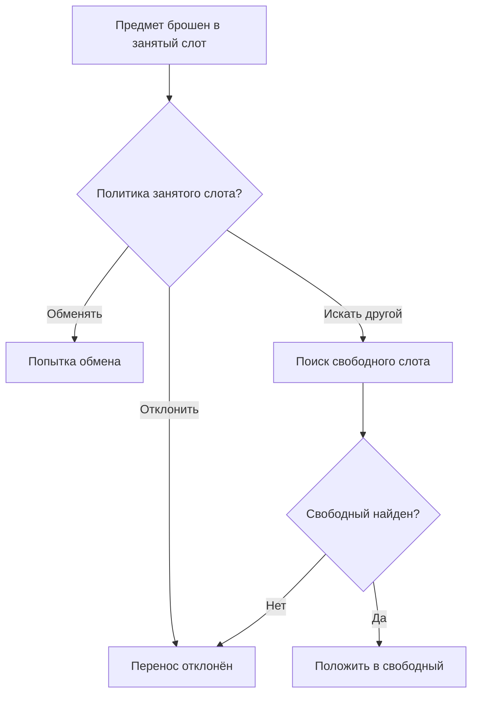
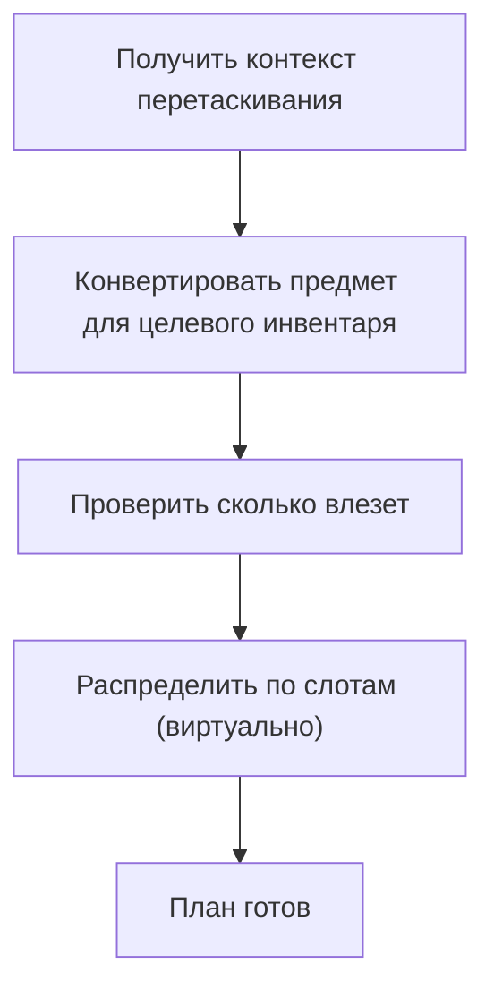
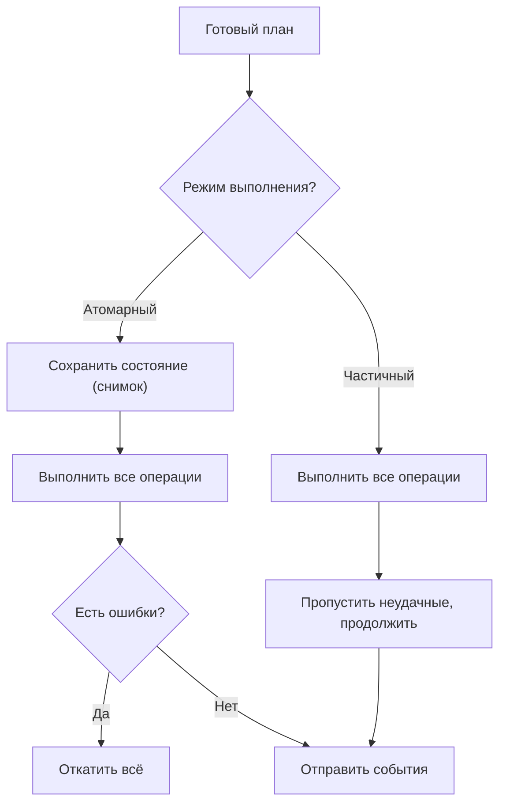
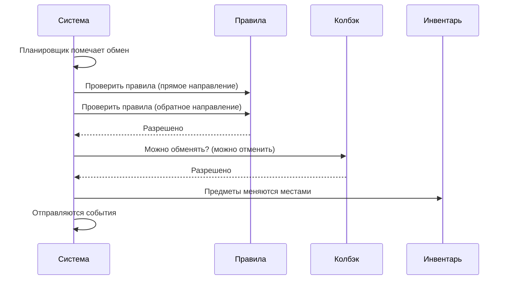
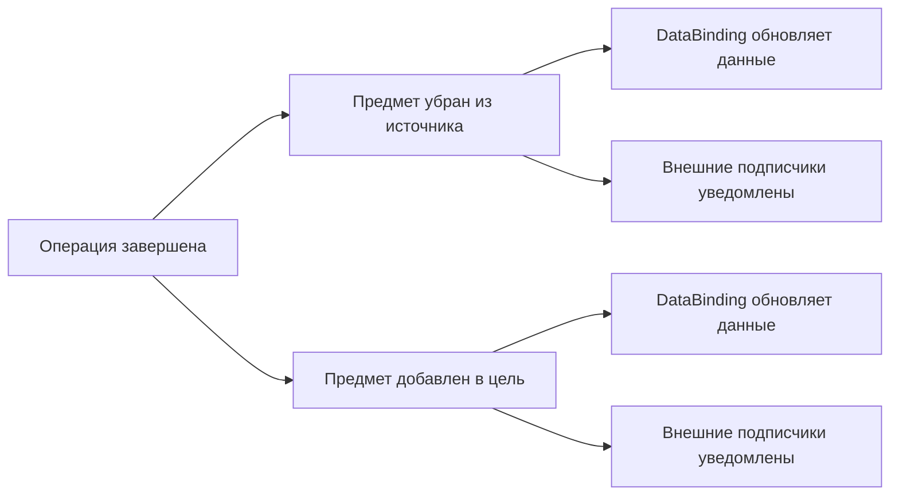
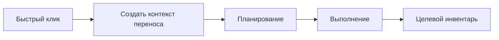

# Конвейер переноса

Каждое перемещение предмета --- перетаскивание, автоперенос, обмен --- проходит один и тот же конвейер:
**Политика** &rarr; **Планирование** &rarr; **Выполнение** &rarr; **События**.

---

## Обзор

Система переноса построена как конвейер: сначала определяются правила поведения (политика), затем строится план без изменения данных, после чего план выполняется и рассылаются события. Такой подход позволяет проверить операцию до её выполнения и откатить при ошибке.

---

## Путь предмета при перетаскивании

---

## Политика дропа

Политика --- неизменяемый набор из 4 измерений, определяющих поведение переноса.

| Измерение | Варианты | Что контролирует |
|---|---|---|
| **Что делать с занятым слотом** | Отклонить / Обменять / Искать другой | Реакция на непустой целевой слот |
| **Ёмкость** | Всё или ничего / Сколько влезет | Разрешён ли частичный перенос |
| **Пакетное выполнение** | Атомарное / Частичное | Откатить всё при ошибке или сохранить успешное |
| **Использование цели** | Строго в цель / Цель как подсказка | Точный дроп или гибкий поиск |

---

## Планирование

На этапе планирования система строит план переноса, не изменяя состояние инвентарей. Это позволяет предварительно проверить выполнимость операции.

!!! info "Конвертация предметов"
    Перед планированием предмет конвертируется в формат целевого инвентаря.
    Например: `TradableItemSO` торговца становится `TradableItemModel` игрока.

---

## Выполнение

На этапе выполнения готовый план применяется к реальным инвентарям. Режим выполнения определяется политикой.

- **Атомарный** --- перед выполнением сохраняется снимок состояния всех затронутых инвентарей. Если хотя бы одна операция не удалась, всё откатывается.
- **Частичный (BestEffort)** --- выполняется всё, что возможно. Неудачные операции пропускаются.

---

## Обмен (Swap)

Обмен --- встроенная операция конвейера, а не отдельный путь.

!!! warning "Отмена обмена"
    Любой подписчик может установить `Cancel = true` в контексте обмена, чтобы предотвратить его.

---

## Когда отправляются события

События откладываются до полного завершения операции:

- В **атомарном** режиме события не отправляются, если что-то пошло не так (откат).
- DataBinding уведомляется напрямую --- он имеет связь 1:1 с инвентарём.
- Внешние подписчики используют события `OnItemAdded` / `OnItemRemoved`.

---

## Автоперенос

Quick-click (быстрый клик) использует тот же механизм переноса. Автоперенос создаёт контекст перетаскивания программно и передаёт его в тот же конвейер планирования и выполнения.

---

## Ключевые классы

| Концепция | Класс | Описание |
|---|---|---|
| Политика | `DropPolicy` | Неизменяемый набор из 4 измерений поведения |
| Планировщик | `TransferPlanner` | Строит план без мутации данных |
| Исполнитель | `TransferPlanExecutor` | Применяет план, поддерживает откат |
| Сервис переноса | `InventoryTransferService` | Выполняет транзакционный перенос между слотами |
| Процессор дропа | `InventoryDropProcessor` | Точка входа: политика + план + выполнение |
| Конвертация | `TransferItemConversionUtility` | Преобразует предмет для целевого инвентаря |
| Автоперенос | `AutoTransferService` | Программный перенос по клику |
