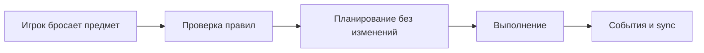
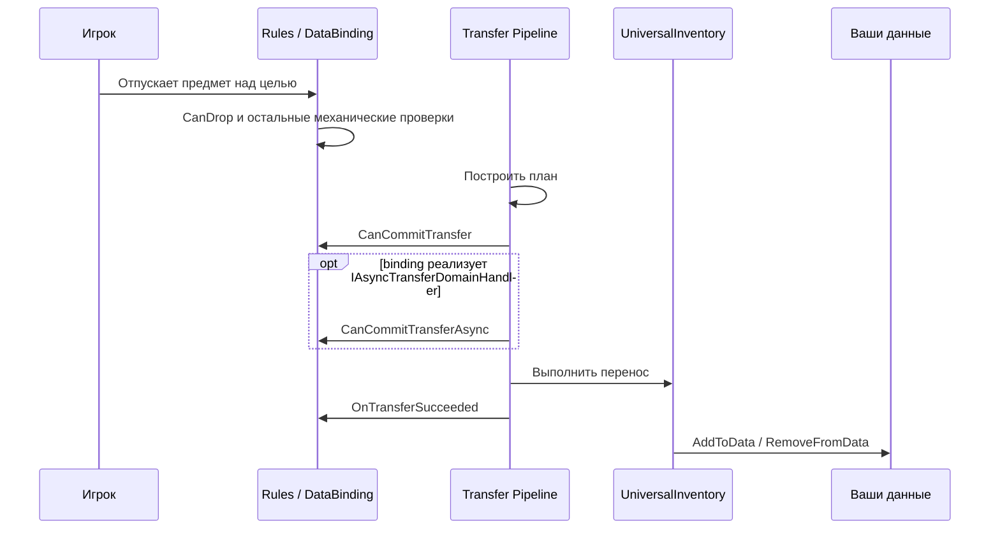
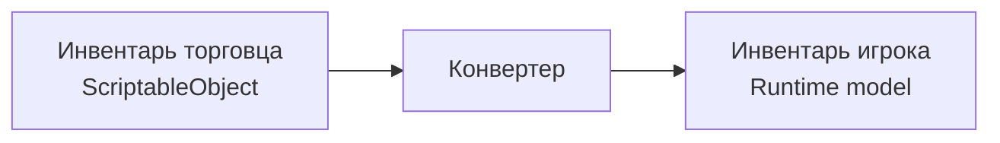
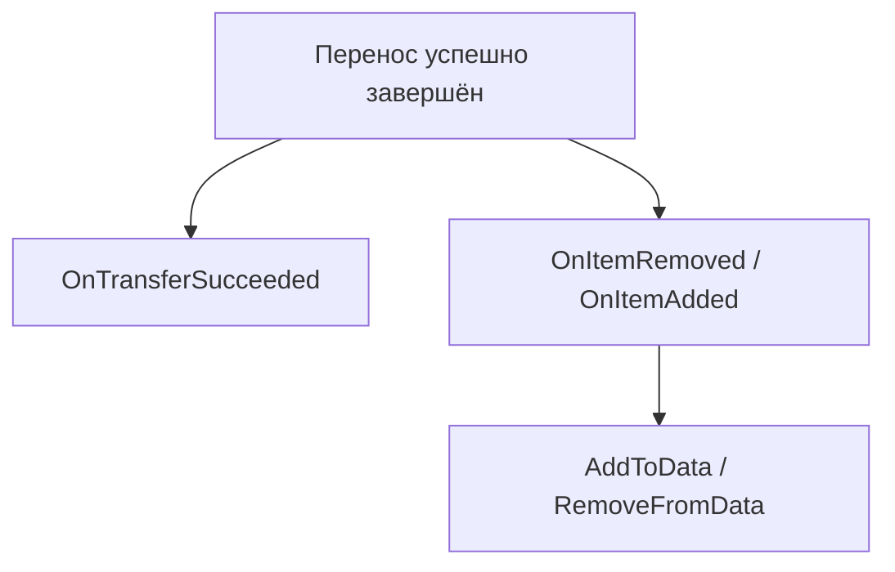
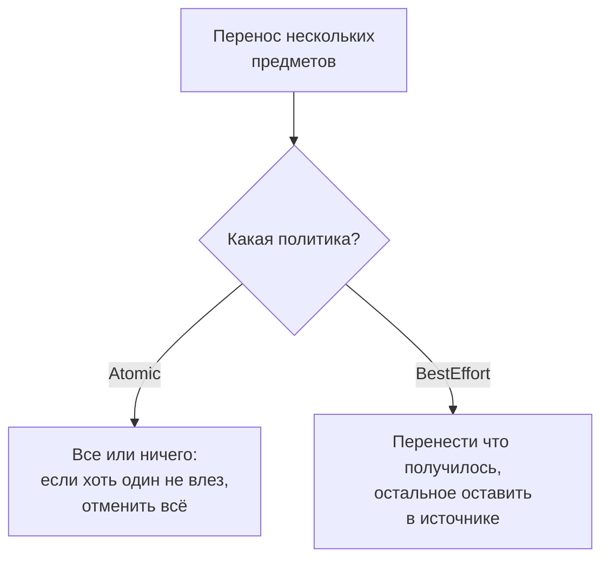
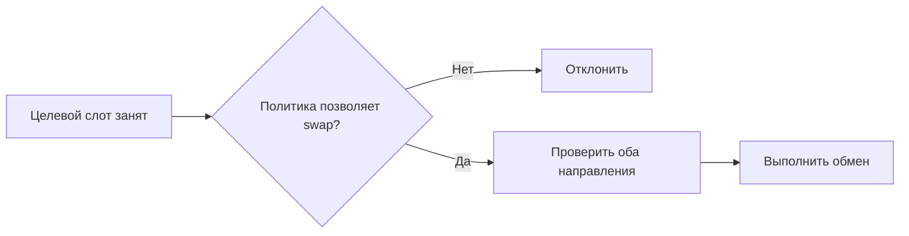

# Конвейер переноса

Эта страница объясняет перенос с точки зрения пользователя ассета.

Не "какие helper-классы существуют", а "в каком порядке система принимает решение и где вы можете вмешаться".

---

## Короткая версия

---

## Что происходит при обычном дропе

---

## Зачем нужен этап планирования

Перед реальным переносом система сначала считает, что она собирается сделать:

- влезает ли предмет целиком
- нужен ли partial transfer
- требуется ли swap
- есть ли подходящий слот
- нужно ли конвертировать предмет для целевого инвентаря

Это позволяет:

- не портить состояние при невалидной операции
- поддерживать atomic execution и rollback
- одинаково обрабатывать drag, quick transfer и swap

---

## Planning и commit — это не одно и то же

Это важное различие:

- на этапе planning система ещё ничего не меняет
- на этапе commit изменения уже применяются к инвентарям

Именно поэтому:

- `CanDrop` хорошо подходит для preview и механических ограничений
- `CanCommitTransfer` нужен для быстрых локальных pre-commit проверок
- `CanCommitTransferAsync` нужен для внешних асинхронных проверок, если binding реализует этот интерфейс

Если доступны обе версии, порядок всегда такой:

1. `CanCommitTransfer`
2. `CanCommitTransferAsync`
3. commit

---

## Конвертация предметов

Если источник и цель используют разные представления предметов, конвертация происходит до размещения в целевом инвентаре.

Пример:

С точки зрения пользователя ассета важно только одно:

- целевой инвентарь получает предмет уже в своём формате

---

## Что происходит после успешного переноса

Разделение обязанностей такое:

- `OnTransferSucceeded` — бизнес side effects
- `AddToData / RemoveFromData` — синхронизация ваших моделей данных

---

## Что происходит при отказе

Если проверка или commit не прошли, поведение зависит от политики:

| Ситуация | Что происходит |
|---|---|
| `CanDrop` вернул отказ | перенос не начинается, предмет возвращается в источник |
| `CanCommitTransfer` вернул отказ | перенос отменяется до commit, состояние не менялось |
| `CanCommitTransferAsync` вернул отказ | перенос отменяется до commit, состояние не менялось |
| Atomic batch: один из предметов не прошёл | вся операция отменяется, ни один предмет не переносится |
| BestEffort batch: один из предметов не прошёл | остальные предметы переносятся, неудачные остаются в источнике |

Главное: если проверка не прошла, инвентари остаются в исходном состоянии. Этап планирования строит план без мутаций, а commit применяется только после всех проверок.

---

## Drop Policy

Текущая модель состоит из трёх уровней:

- `DropRequestPolicy`
  - временный override для конкретной операции
  - может задать:
    - `BlockedTargetBehavior`
    - `AlternativePlacementMode`
    - `AllowPartial`
- `DropPolicySettings`
  - inventory-level defaults в `UniversalInventory`
  - задаёт:
    - blocked target behavior
    - allow merge on drop
    - allow partial
    - batch mode
    - alternative placement mode
- `ResolvedDropPolicy`
  - итог после resolution
  - именно он используется planner-ом

`BlockedTargetBehavior`:
- `Reject`
- `Swap`
- `FindAlternative`

## Порядок обработки Drop Policy

Для одного drag entry порядок такой:

1. Резолвится `ResolvedDropPolicy`
2. Planner пытается положить предмет в target slot, если он есть
3. Если в target вошло всё, entry успешен
4. Если вошла только часть:
   - `AllowPartial = false` -> fail
   - `AllowPartial = true` -> partial success
   - остаток ищет другие слоты только если `BlockedTargetBehavior = FindAlternative`
5. Если в target не вошло ничего:
   - `Reject` -> fail
   - `Swap` -> planner строит swap entry
   - `FindAlternative` -> стратегия перечисляет alternative slots
6. Для same-inventory `FindAlternative` не перераскладывает предметы по другим слотам. Если target не подошёл, предмет остаётся на месте

## Batch-операции

При групповом переносе (несколько предметов за раз) поведение определяется `BatchMode` внутри `DropPolicy`:

По умолчанию batch mode берётся из inventory-level `DropPolicySettings`, а request override меняет только временное поведение конкретной операции.

---

## Swap — это часть того же пайплайна

Обмен предметами не является отдельной системой. Для пользователя это просто ещё один вариант успешного переноса, если `BlockedTargetBehavior = Swap`.

---

## Что имеет смысл знать, а что нет

Обычно пользователю ассета нужно понимать:

- где пишутся rules
- где писать business checks
- когда синхронизируются данные
- почему partial transfer и swap ведут себя предсказуемо

Обычно не нужно понимать заранее:

- внутренние helper-структуры planning layer
- низкоуровневые шаги execution layer
- карту всех внутренних классов конвейера

Если вы меняете сам ассет, а не только используете его, тогда уже смотрите [Карту файлов](../reference/file-map.md).
