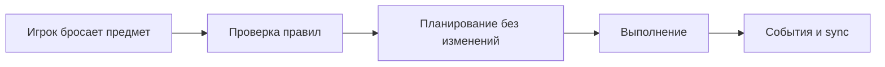
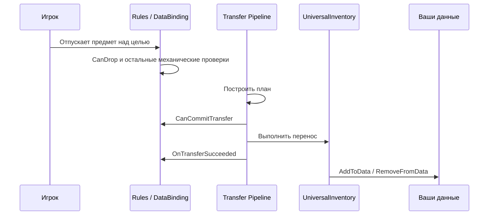
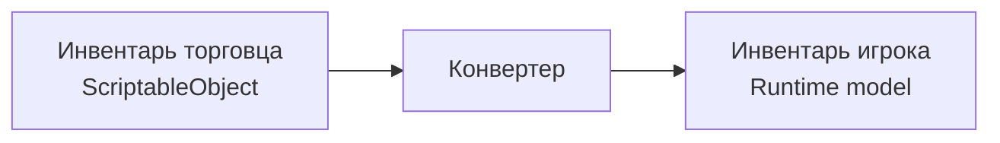
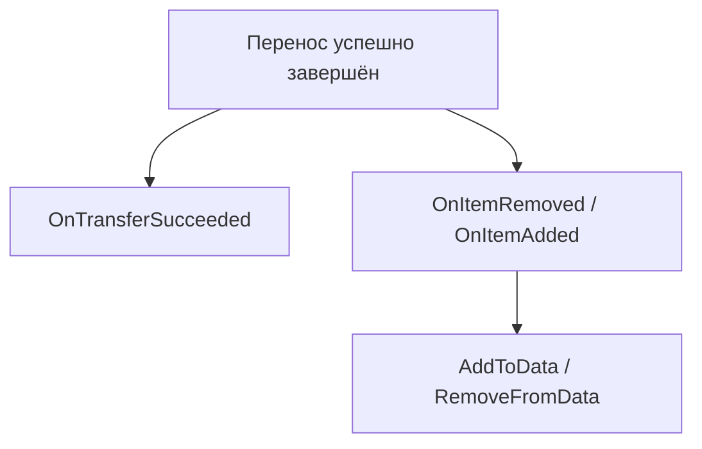
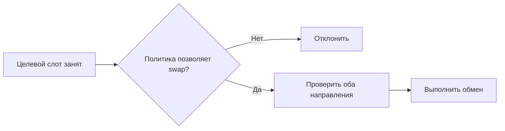

# Конвейер переноса

Эта страница объясняет перенос с точки зрения пользователя ассета.

Не "какие helper-классы существуют", а "в каком порядке система принимает решение и где вы можете вмешаться".

---

## Короткая версия

---

## Что происходит при обычном дропе

---

## Зачем нужен этап планирования

Перед реальным переносом система сначала считает, что она собирается сделать:

- влезает ли предмет целиком
- нужен ли partial transfer
- требуется ли swap
- есть ли подходящий слот
- нужно ли конвертировать предмет для целевого инвентаря

Это позволяет:

- не портить состояние при невалидной операции
- поддерживать atomic execution и rollback
- одинаково обрабатывать drag, quick transfer и swap

---

## Planning и commit — это не одно и то же

Это важное различие:

- на этапе planning система ещё ничего не меняет
- на этапе commit изменения уже применяются к инвентарям

Именно поэтому:

- `CanDrop` хорошо подходит для preview и механических ограничений
- `CanCommitTransfer` нужен для проверок, которые должны выполняться один раз перед реальным commit

---

## Конвертация предметов

Если источник и цель используют разные представления предметов, конвертация происходит до размещения в целевом инвентаре.

Пример:

С точки зрения пользователя ассета важно только одно:

- целевой инвентарь получает предмет уже в своём формате

---

## Что происходит после успешного переноса

Разделение обязанностей такое:

- `OnTransferSucceeded` — бизнес side effects
- `AddToData / RemoveFromData` — синхронизация ваших моделей данных

---

## Swap — это часть того же пайплайна

Обмен предметами не является отдельной системой. Для пользователя это просто ещё один вариант успешного переноса, если так настроена drop policy.

---

## Что имеет смысл знать, а что нет

Обычно пользователю ассета нужно понимать:

- где пишутся rules
- где писать business checks
- когда синхронизируются данные
- почему partial transfer и swap ведут себя предсказуемо

Обычно не нужно понимать заранее:

- внутренние helper-структуры planning layer
- низкоуровневые шаги execution layer
- карту всех внутренних классов конвейера

Если вы меняете сам ассет, а не только используете его, тогда уже смотрите [Карту файлов](../reference/file-map.md).
