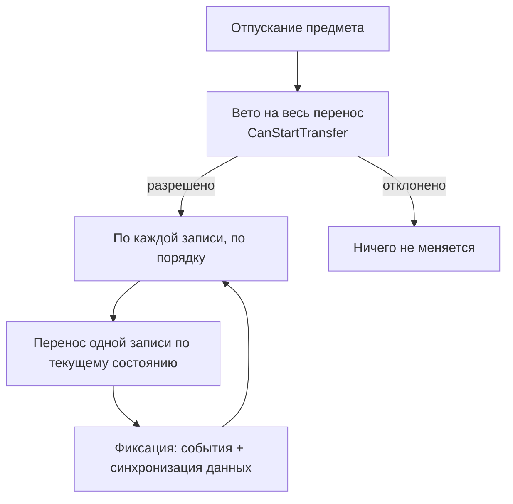
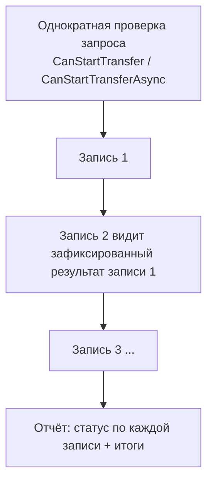

# Пайплайн переноса

Эта страница объясняет, что происходит при отпускании предмета: порядок шагов, как
ведёт себя каждый типичный случай и все точки, куда можно встроить свою логику.

Написано так, чтобы было понятно без глубокого знания кодовой базы. Если запомнить
только одно: **готового плана нет**. Система обрабатывает по одной записи (entry) за
раз, по *реальному* состоянию инвентаря, и фиксирует результат по ходу.

См. также:

- [Матрица drop-политик](drop-policy-matrix.md) — поля политики одной таблицей
- [Стратегии размещения](strategies.md) — как предметы выбирают слоты
- [Рецепты: конвертация предметов](item-conversion-cookbook.md)
- [Логи и отладка](../reference/logs-and-debugging.md)

## Общая картина

Ключевые идеи:

- **Нет `TransferPlan`, нет виртуального состояния слотов.** Раньше сначала строился
  план, потом исполнялся. Этого больше нет.
- **Последовательно и best-effort.** Записи обрабатываются по одной; запись N видит
  результат записи N-1. Упавшая запись откатывается сама по себе и не отменяет
  предыдущие успешные.
- **Одноклеточные и фигурные предметы идут одним путём.** Предмет 1×1 — это просто
  footprint из одной клетки. Никаких ветвлений «это грид или нет».

## Кто за что отвечает

| Компонент | Роль простыми словами |
|---|---|
| `InventoryDropProcessor` | Граница. Его вызывают UI и drop-зоны; он только делегирует. |
| `InventoryTransferService` | Движок. Гоняет цикл по записям, мутирует инвентарь, откатывает, шлёт события. |
| `IStrategy` | Решает, *какое* размещение допустимо и сколько влезает (merge или create, capacity, unique/stackable/separable). Read-only — сам не мутирует. |
| `IPlacementGeometry` + топология | Решает, *куда* ложится footprint: резолвит якорный слот, проецирует форму с ориентацией, проверяет границы и занятость. |
| Политика (`ResolvedDropPolicy`) | Что делать, если выбранная цель заблокирована, и допустим ли частичный перенос. |
| `ITransferDomainHandler` | Ваше бизнес-вето и побочные эффекты (деньги, сервер, владение). |

## Одна запись, по шагам

Для каждой `DragEntry` `InventoryTransferService` делает следующее:

1. **Резолвит превью-адаптер для цели.** Если инвентари по-разному представляют
   предметы, предмет конвертируется в то, как его видит *цель* — не трогая источник.
   (См. [Конвертацию предметов](item-conversion-cookbook.md).)
2. **Строит acceptance-запрос**, описывающий, что предлагается цели.
3. **Делает checkpoint** источника и цели, чтобы запись можно было откатить.
4. **Выбирает размещение:**
   - Если отпустили на конкретный слот — спрашивает стратегию напрямую:
     `IStrategy.TryGetCandidate(...)`. Упорядочивание не используется.
   - Если нужно автоматическое размещение — перечисляет `IStrategy.GetCandidates(...)`
     и выбирает кандидата через `PlacementCandidateOrderer`.
5. **Перед каждой мутацией перепроверяет** топологию/границы/занятость и вызывает
   per-candidate проверку домена (`CanCommitTransfer`). Затем применяет мутацию
   (create, merge, place или swap).
6. **Обрабатывает остаток.** Большой стак может занять несколько размещений; то, что
   не влезло, возвращается источнику.
7. **Фиксирует или откатывает.** При успехе шлёт события и уведомления DataBinding
   *для этой записи* до перехода к следующей. При неудаче восстанавливает checkpoint —
   события не отправляются.

## Случаи

### Явная цель, которая подходит

Отпустили на конкретный слот, и стратегия его принимает. Кандидат из
`TryGetCandidate` уже содержит резолвнутые placement/anchor и точное влезающее
количество. Упорядочивание **не** используется.

### Явная цель, которая заблокирована

Выбранный слот не может принять предмет (занят, несовместим, полон). Что дальше —
определяет `BlockedTargetResolutionKind`:

| Значение | Поведение |
|---|---|
| `Reject` | Запись падает. Ничего не двигается. |
| `FindAlternative` | Подсказанный слот не трогается; движок перечисляет остальных кандидатов и упорядочивает их настроенным `PlacementCandidateOrderer`. |
| `Swap` | Пытается single-entry swap с занятой целью. |

`AllowSameInventoryAlternativePlacement` определяет, может ли `FindAlternative`
выбрать другой слот внутри *того же* инвентаря.

### Drop в область / авто-перенос

Конкретного слота нет (отпустили на область инвентаря, либо двойной клик/авто-перенос
запустил `AutoTransferService`). Движок пропускает шаг явной цели и сразу перечисляет
и упорядочивает кандидатов.

### Большой стак на несколько размещений

Стак из 10 — это всё равно **одна запись**, даже если цель раскидает его по
нескольким размещениям. Движок:

1. создаёт рабочий стак нужного размера;
2. спрашивает у стратегии кандидатов с capacity (Unique → по 1, Stackable →
   merge one-per-id, Separable → до максимума на стак);
3. отделяет ровно это количество и применяет кандидата;
4. перечисляет кандидатов заново по уже изменённому состоянию и повторяет;
5. возвращает не влезшее источнику.

Пример: 10 предметов в Unique-инвентарь с 6 свободными слотами → перенесено 6,
возвращено 4, в отчёте `RequestedAmount = 10, TransferredAmount = 6`.

### Частично или только целиком

`PartialTransferMode` решает, что делать, если влезает лишь часть записи:

- `Allow` — фиксируем то, что влезло, остаток возвращаем источнику.
- `RequireFull` — если нельзя разместить весь объём, запись откатывается.

Это **на запись**. `RequireFull` никогда не отменяет предыдущие записи batch.

### Перемещение внутри одного инвентаря

При перемещении внутри одного инвентаря source-footprint не освобождается вслепую:
частичная попытка держит источник занятым и исключает его из списка кандидатов, чтобы
целевые размещения не заняли те самые клетки, куда остаток должен вернуться. Полное
перемещение может выполнить отдельную попытку с временно удалённым источником и
обязано перенести запись целиком, иначе откат.

### Занятая цель с обработчиком

Если целевой слот занят, а инвентарь (или его биндинг) предоставляет
`IOccupiedSlotDropHandler`, сначала отрабатывает этот обработчик как чистая проверка,
затем исполняется all-or-nothing. Приоритет: занятый обработчик → обычный merge/create
→ blocked-политика. Обработчик сам не запускает alternatives или swap.

### Динамические слоты

Динамический инвентарь может расти. Стратегия может вернуть кандидата
`NewDynamicSlot`, но сама слот **не** создаёт. Движок создаёт слот, пробует точное
размещение и удаляет слот обратно, если размещение не удалось.

### Swap (обмен)

Swap — отдельный single-entry путь (не стратегия и не план). Срабатывает только если:
ровно одна запись, конкретная занятая цель, переносится весь источник, обе стороны
успешно конвертируются в обе стороны, обе проходят rule/domain-проверки и итоговые
footprints помещаются (и не пересекаются при swap внутри одного инвентаря). Захватывает
обе стороны, удаляет оба размещения, кладёт каждый сконвертированный предмет на чужой
якорь и фиксирует оба либо откатывает оба.

Batch-swap (несколько перетаскиваемых записей на одну занятую цель с `Swap`)
отклоняется до любой мутации. Grid-vs-grid «групповой обмен» — отдельная будущая
фича, а не batch-swap.

### Batch (несколько записей сразу)

- Записи идут в порядке drag-context; каждая видит зафиксированный результат предыдущей.
- Упавшая запись откатывается сама; предыдущие успехи остаются.
- Подсказка цели (hint) применяется только к первой записи; остальные ведут себя как drop в область.
- Batch успешен, если перенеслась хотя бы одна запись; `IsPartial` означает, что не всё.

## Два вида валидации

Легко спутать «правила» с «бизнес-логикой». Это разные слои, и срабатывают они в
разное время.

| Слой | Интерфейс | На какой вопрос отвечает | Когда срабатывает |
|---|---|---|---|
| Правила | `IGlobalRule` / `IInventoryRule` / `ISlotRule` | *Механически*, можно ли сюда этот предмет? (фильтр типа, залоченный слот, тот же слот…) | старт перетаскивания и валидация цели |
| Вето на весь перенос | `ITransferDomainHandler.CanStartTransfer` | Можно ли вообще начинать операцию? | один раз, до первой мутации |
| Асинхронное вето | `IAsyncTransferDomainHandler.CanStartTransferAsync` | То же, но нужно что-то дождаться (сервер, диск) | один раз, только async-путь, до первой мутации |
| Проверка на commit | `ITransferDomainHandler.CanCommitTransfer` | Можно ли зафиксировать *это конкретное* размещение? (хватает золота, владение) | прямо перед каждой мутацией кандидата |
| Побочные эффекты успеха | `ITransferDomainHandler.OnTransferSucceeded` | Реакция после зафиксированного размещения | после успешного commit |

Правила — для механики. Domain-обработчик — для денег, серверов, владения и побочных
эффектов; не зашивайте это в правила.

## Когда срабатывают события

События и уведомления DataBinding для записи отправляются **только после фиксации
этой записи** и до старта следующей. Это гарантирует, что следующая запись (и любой
domain-обработчик) видит состояние, совпадающее с живым инвентарём.

Каждое событие add/remove несёт точный реально перенесённый sub-стак — никогда не
сырой `DragEntry.Stack`. Запись из 10, легшая как `6 + 4`, даёт события суммарно на 10
адаптеров; запись из 10, где перенеслось 6, а 4 вернулись, — события на 6.

## Точки расширения

Всё, что предназначено для подключения своей логики, в одном месте:

| Точка расширения | Тип | Для чего |
|---|---|---|
| **Стратегия размещения** | `IStrategy` / `InventoryStrategyBase` | Как предметы занимают слоты: unique, stackable, separable или своя логика merge/create/capacity. Read-only; выдаёт кандидатов. |
| **Топология** | `IInventoryTopology` (`SlotTopology`, `RectGridTopology`, своя) | Пространство клеток: сколько клеток, как проецируется форма, шаги ориентации и визуальные углы. Гекс-грид — просто топология с 6 шагами. |
| **Форма размещения** | `IPlacementShape` (`RectPlacementShape`, `ComplexPlacementShape`) | Footprint предмета, включая непрямоугольные (L/T/крест) формы и их повороты. |
| **Упорядочиватель кандидатов** | `PlacementCandidateOrderer` | Влияет на то, какой слот предпочтёт автоматическое размещение (merge-first, empty-first и т. д.). К явной цели не применяется. |
| **Политика заблокированной цели** | `BlockedTargetResolutionKind` + `DropPolicySettings` | Выбор reject / find-alternative / swap, плюс частичный перенос и same-inventory опции. Только данные, задаётся в инспекторе. |
| **Вето на весь перенос** | `ITransferDomainHandler.CanStartTransfer` | Разрешить/запретить всю операцию до любых изменений (например, «магазин закрыт»). |
| **Асинхронное вето** | `IAsyncTransferDomainHandler.CanStartTransferAsync` | То же, когда ответ требует ожидания сервера, файла или БД. |
| **Бизнес-проверка на commit** | `ITransferDomainHandler.CanCommitTransfer` | Разрешить/запретить одно конкретное размещение (хватает золота, владение). |
| **Хук успеха** | `ITransferDomainHandler.OnTransferSucceeded` | Побочные эффекты после зафиксированного размещения (списать золото, аналитика). |
| **Обработчик занятого слота** | `IOccupiedSlotDropHandler` | Своё поведение при drop на занятый слот (надеть, вложить в контейнер). |
| **Жизненный цикл динамических слотов** | `IDynamicSlotLifecycle` | Позволяет инвентарю расти/сжиматься; созданием/удалением управляет движок. |
| **Конвертер предметов** | `IItemAdapterConverter` (через `CreateItemConverter()`) | Перевод предметов между инвентарями с разными моделями адаптеров. |
| **Правила** | `IGlobalRule` / `IInventoryRule` / `ISlotRule` | Декларативные механические ограничения на трёх уровнях. См. [Правила](rules.md). |
| **Drop-зоны** | `DropAreaBase` | Свои цели для отпускания (мусорка, продажа, спавн в мире) без вмешательства в пайплайн. См. [Drop-зоны](drop-areas.md). |

## Чего пайплайн *не* обещает

- **Нет атомарности всего batch.** Режима `Atomic` нет. Каждая запись фиксируется
  сама; поздняя ошибка не отменяет ранние записи.
- **Нет неявного переразмещения.** Движок не двигает посторонние предметы ради
  места. Переупаковка/сортировка — отдельное явное действие.
- **Превью — совещательное.** `TransferProbe` описывает, что *произошло бы* для
  первого размещения; он ничего не резервирует, а исполнение всегда перепроверяет.
  Единственный авторитетный результат — отчёт об исполнении.
