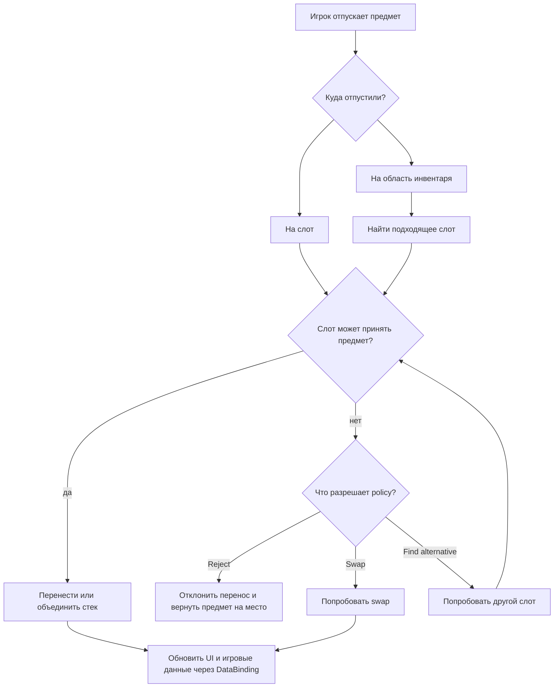
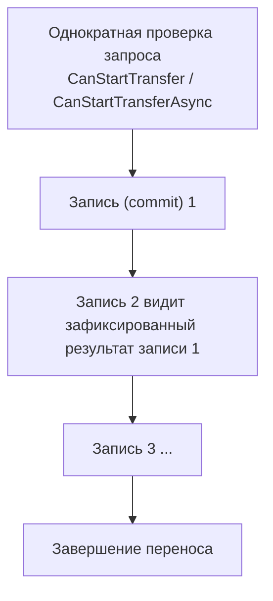

# Пайплайн переноса

Эта страница объясняет, что происходит, когда игрок отпускает предмет над слотом,
инвентарём или drop-зоной.

Главный смысл пайплайна: система проверяет, можно ли выполнить действие, выбирает
подходящее поведение для цели и либо переносит предмет, либо оставляет инвентари в
валидном состоянии.

## Общая картина

## Что происходит при переносе

Типичный перенос проходит так:

1. Система определяет источник, цель и активные настройки drop policy.
2. Если у инвентарей разные модели предметов, предмет приводится к модели целевого
   инвентаря. Конвертация выполняется один раз за перетаскивание и переиспользуется, поэтому
   предмет, показанный в превью, — это тот же предмет, который будет сохранён.
3. Система проверяет, может ли выбранная цель принять предмет. Эти проверки видят уже
   сконвертированный предмет, а предмет, который сконвертировать нельзя, отклоняется здесь же —
   с указанием причины.
4. Если цель подходит, предмет переносится или объединяется со стеком в целевом слоте.
5. Если цель не подходит, `DropPolicySettings` в соответствии с выбранными опциями решает, что делать дальше: отклонить перенос, найти другое место или попробовать swap.
6. При успехе отправляются события и обновляется DataBinding. При ошибке состояние
   возвращается к сохранённой копии, которая была сделана перед попыткой переноса.

## Случаи

### Цель заблокирована

Выбранный слот не может принять предмет (занят, несовместим, полон). Что дальше —
определяет `BlockedTargetResolutionKind`:

| Значение | Поведение |
|---|---|
| `Reject` | Запись падает. Ничего не двигается. |
| `FindAlternative` | Стратегия дает доступных кандидатов и настроенный `PlacementCandidateOrderer` упорядочивает их по приоритету. |
| `Swap` | Пытается выполнить swap с занятой целью. `SwapDisplacementMode.SinglePlacement` (по умолчанию) разрешает вытеснить одно размещение; `AllCoveredPlacements` позволяет одному shaped entry вытеснить все разные размещения под его footprint. Каждый предмет проверяется для своего фактического места назначения. |

`AllowSameInventoryAlternativePlacement` определяет, может ли `FindAlternative`, при переносе предмета в рамках одного инвентаря на занятый слот, выбрать другой слот (новый) внутри *того же* инвентаря. Если нет то предмет остается где был до попытки переноса.

`AllCoveredPlacements` размещает вытесненные предметы вокруг anchor источника, сохраняя их
топологическое смещение относительно anchor цели. Probe и execution используют один resolver, а
прямой перенос и все встречные переносы коммитятся атомарно. Это multi-swap одного entry, а не
batch swap нескольких перетаскиваемых entries.

Исключение — перенос внутри одного инвентаря, где освобождаемая область пересекается со следом
въезжающего предмета. Вытесненный предмет, который попал бы под этот след, сдвигается дальше на
вектор самого свопа и обязан остаться внутри освобождаемой области, иначе swap отклоняется. Такой
сдвиг считается для каждого предмета отдельно, поэтому взаимный порядок вытесненных предметов в
этом случае может не сохраниться.

Настройка имеет смысл только там, где предмет занимает больше одной клетки: если предмет всегда
занимает ровно одну клетку, его след не может задеть второе размещение и оба режима работают
одинаково.

Якорь входящего предмета всегда берётся от курсора, как при обычном shaped-дропе: он отвечает
только за то, в какие слоты и с каким поворотом лечь. Что именно вытесняется, читается с фактически
накрытых клеток, поэтому точно позиционированный предмет не переезжает на чужой якорь. Сама клетка под
курсором на решение не влияет: она может быть пустой или занятой самим перетаскиваемым предметом —
своп всё равно состоится, если след накрывает чужое размещение. У многоклеточного предмета эта
клетка зависит от точки захвата, и иначе один и тот же дроп срабатывал бы или нет только из-за неё.

`PartialOverlapSwapMode` решает, что делать, когда входящий след накрывает предмет лишь частично —
у предметов разной формы это обычное дело.

`Reject` (по умолчанию) отклоняет такой своп, но только если полное накрытие было достижимо. Предмет,
который по форме не смог бы накрыть лежащего под ним ни при каком совмещении, меняется местами как
обычно, поэтому свопы «маленький предмет на большой» продолжают работать.

`WithDragOffset` разрешает частичное накрытие и ставит вытесненный предмет по смещению захвата; не
влезло — отказ.

`VacatedArea` разрешает частичное накрытие и подбирает позицию перебором, предпочитая клетки, которые
своп освобождает, затем позиции, опирающиеся на них бо́льшим числом клеток, и лишь потом близость к
позиции по смещению захвата. Подбор жадный, попредметный, без бэктрекинга.

### Drop в область / авто-перенос

Конкретного слота нет (отпустили на область инвентаря, либо двойной клик/авто-перенос
запустил `AutoTransferService`). Движок пропускает шаг явной цели и сразу берет кандидатов у стратегии и упорядочивает их.

### Большой стек на несколько размещений

Стек из 10 — это всё равно **одна запись**, даже если цель раскидает его по
нескольким размещениям. Движок:

1. создаёт рабочий стек нужного размера;
2. спрашивает у стратегии слоты кандидатов с свободным местом (Unique например по 1 предмету на слот);
3. отделяет ровно это количество и применяет кандидата;
4. обрабатывает кандидатов заново по уже изменённому состоянию и повторяет пока не закончится стек или слоты в инвентаре;
5. возвращает не влезшее источнику.

Пример: 10 предметов в Unique-инвентарь с 6 свободными слотами → перенесено 6,
возвращено 4.

### Частично или только целиком

Параметр в policy инвентаря `_allowPartial` решает, что делать, если влезает лишь часть записи:

- `true` = `Allow` — фиксируем то, что влезло, остаток возвращаем источнику.
- `false` = `RequireFull` — если нельзя разместить весь объём, запись откатывается.

### Перемещение внутри одного инвентаря

При перемещении внутри одного инвентаря источник не освобождается вслепую:
частичная попытка держит источник занятым и исключает его из списка кандидатов, чтобы
целевые размещения не заняли те самые клетки, куда остаток должен вернуться. Полное
перемещение может выполнить отдельную попытку с временно удалённым источником и
обязано перенести запись целиком, иначе откат.

### Занятая цель с обработчиком

Если предмет бросили на занятый слот, DataBinding целевого инвентаря может забрать эту ситуацию себе через `IOccupiedSlotDropHandler`.

Есть два варианта timing:

| Интерфейс | Когда проверяется | Когда использовать |
|---|---|---|
| `IPreRuleOccupiedSlotDropHandler` | до drop-правил целевого слота | drop на занятый слот на самом деле означает другую цель, например контейнер внутри слота |
| `IPostRuleOccupiedSlotDropHandler` | после drop-правил целевого слота | кастомное поведение должно сначала пройти обычные правила цели |

`ExecuteOccupiedSlotDrop` возвращает `OccupiedSlotDropResult`:

- `Handled` — handler выполнил действие сам; обычное размещение, alternative placement и swap не запускаются.
- `Rejected` — handler запретил действие; перенос отменяется и состояние возвращается к сохранённой копии.
- `Fallthrough` — handler не забирает эту попытку; дальше работает обычный pipeline для занятого слота.

### Batch (несколько записей сразу)

- Записи переноса идут в порядке drag-context; каждая видит зафиксированный результат предыдущей.
- Упавшая запись откатывается сама; предыдущие переносы остаются.
- Выбранный слот цели применяется только к первой записи; остальные ведут себя как drop в область.

Batch-swap (несколько перетаскиваемых предметов на одну занятую цель с `Swap`)
отклоняется до любой мутации.

Частичный перенос применяется **на запись**. `RequireFull` никогда не отменяет предыдущие записи batch.

## Валидации

Есть несколько видов проверок разрешающих и запрещающих перенос, и срабатывают они в
разное время.

| Слой | Интерфейс | На какой вопрос отвечает | Когда срабатывает |
|---|---|---|---|
| Правила | `IGlobalRule` / `IInventoryRule` / `ISlotRule` | *Механически*, можно ли сюда этот предмет? (фильтр типа, залоченный слот…) | старт перетаскивания и валидация цели |
| Вето на весь перенос | `ITransferDomainHandler.CanStartTransfer` | Можно ли вообще начинать операцию? | один раз, до первой мутации |
| Асинхронное вето | `IAsyncTransferDomainHandler.CanStartTransferAsync` | То же, но нужно что-то дождаться (сервер, диск) | один раз, только async-путь, до первой мутации |
| Проверка на commit | `ITransferDomainHandler.CanCommitTransfer` | Можно ли зафиксировать *это конкретное* размещение? (хватает золота, владение) | прямо перед каждой мутацией кандидата |
| Побочные эффекты успеха | `ITransferDomainHandler.OnTransferSucceeded` | Реакция после зафиксированного размещения | после успешного commit |

Правила вешаются напрямую на объекты слота или инвентаря. В DataBinding по умолчанию есть доступный для определения их аналог — `CanStartDrag`, `CanDrop` и `CanSwap`. Интерфейсами `ITransferDomainHandler` и `IAsyncTransferDomainHandler` в binding можно добавить дополнительные проверки и действия для всего переноса.

## Когда срабатывают события

События и уведомления DataBinding для записи отправляются **только после фиксации
этой записи** и до старта следующей. Это гарантирует, что следующая запись видит состояние, совпадающее с живым инвентарём.

Каждое событие add/remove несёт точный реально перенесённый sub-стек — никогда не
сырой `DragEntry.Stack`. Запись из 10, легшая как `6 + 4`, даёт события суммарно на 10
адаптеров; запись из 10, где перенеслось 6, а 4 вернулись, — события на 6.

## Точки расширения

Всё, что предназначено для подключения своей логики, в одном месте:

| Точка расширения | Тип | Для чего |
|---|---|---|
| **Стратегия размещения** | `IStrategy` / `InventoryStrategyBase` | Как предметы занимают слоты: unique, stackable, separable или своя логика merge/create/capacity. Read-only; выдаёт кандидатов. |
| **Топология** | `IInventoryTopology` (`SlotTopology`, `RectGridTopology`, своя) | Пространство клеток: сколько клеток, как проецируется форма, шаги ориентации и визуальные углы. Гекс-грид — просто топология с 6 шагами. |
| **Форма размещения** | `IPlacementShape` (`RectPlacementShape`, `ComplexPlacementShape`) | Footprint предмета, включая непрямоугольные (L/T/крест) формы и их повороты. |
| **Упорядочиватель кандидатов** | `PlacementCandidateOrderer` | Влияет на то, какой слот предпочтёт автоматическое размещение (merge-first, empty-first и т. д.). К явной цели не применяется. |
| **Политика заблокированной цели** | `BlockedTargetResolutionKind` + `DropPolicySettings` | Выбор reject / find-alternative / swap, плюс частичный перенос и same-inventory опции. Только данные, задаётся в инспекторе. |
| **Вето на весь перенос** | `ITransferDomainHandler.CanStartTransfer` | Разрешить/запретить всю операцию до любых изменений (например, «магазин закрыт»). |
| **Асинхронное вето** | `IAsyncTransferDomainHandler.CanStartTransferAsync` | То же, когда ответ требует ожидания сервера, файла или БД. |
| **Бизнес-проверка на commit** | `ITransferDomainHandler.CanCommitTransfer` | Разрешить/запретить одно конкретное размещение (хватает золота, владение). |
| **Хук успеха** | `ITransferDomainHandler.OnTransferSucceeded` | Побочные эффекты после зафиксированного размещения (списать золото, аналитика). |
| **Обработчик занятого слота** | `IPreRuleOccupiedSlotDropHandler` / `IPostRuleOccupiedSlotDropHandler` | Своё поведение при drop на занятый слот (надеть, вложить в контейнер). Реализуется на DataBinding. |
| **Жизненный цикл динамических слотов** | `IDynamicSlotLifecycle` | Позволяет инвентарю расти/сжиматься; созданием/удалением управляет движок. |
| **Конвертер предметов** | `IItemAdapterConverter` (через `CreateItemConverter()`) | Перевод предметов между инвентарями с разными моделями адаптеров. |
| **Правила** | `IGlobalRule` / `IInventoryRule` / `ISlotRule` | Декларативные механические ограничения на трёх уровнях. |
| **Drop-зоны** | `DropAreaBase` | Свои цели для отпускания (мусорка, продажа, спавн в мире) без вмешательства в пайплайн. |
