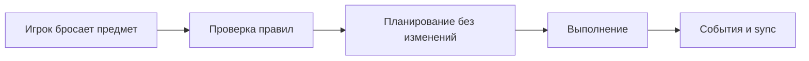
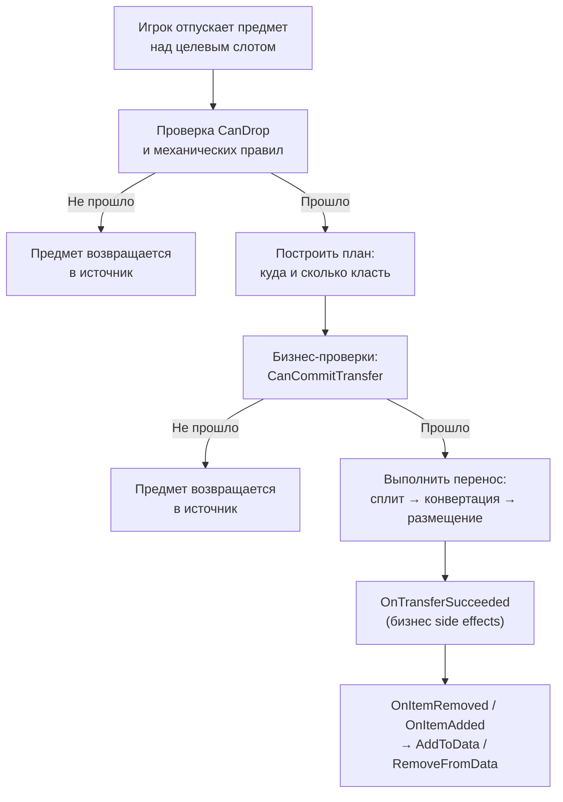
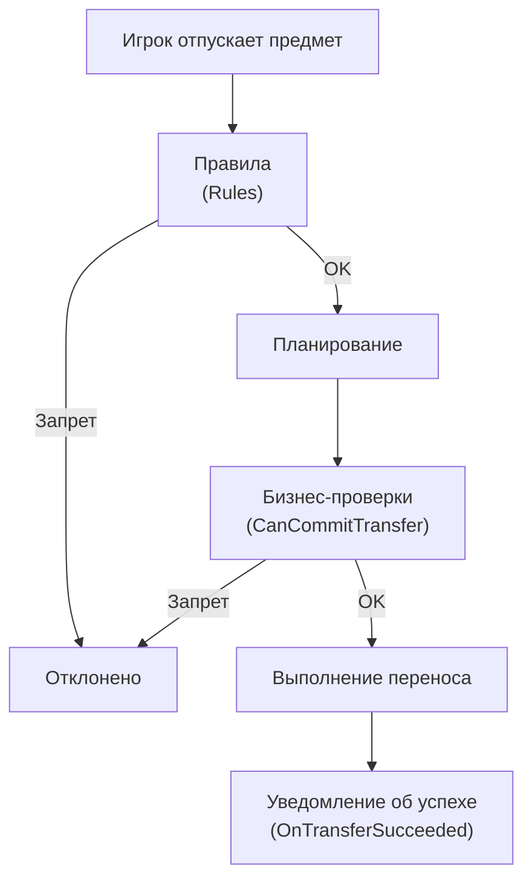
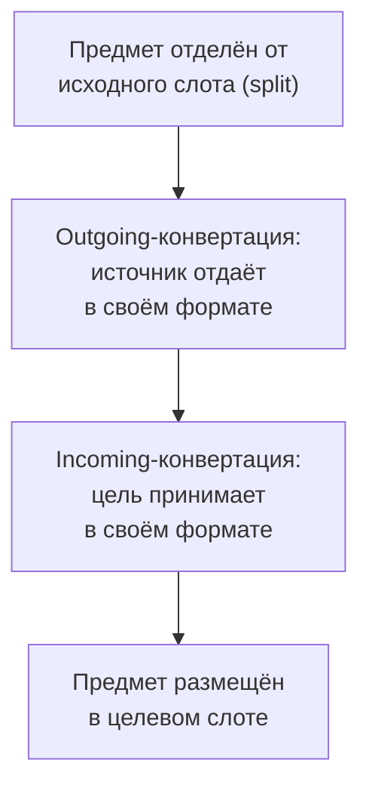
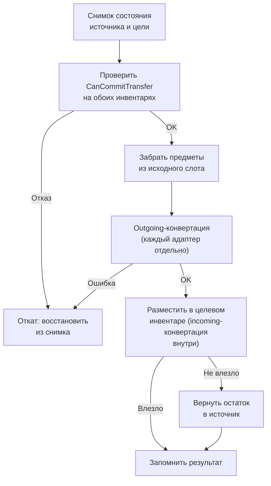
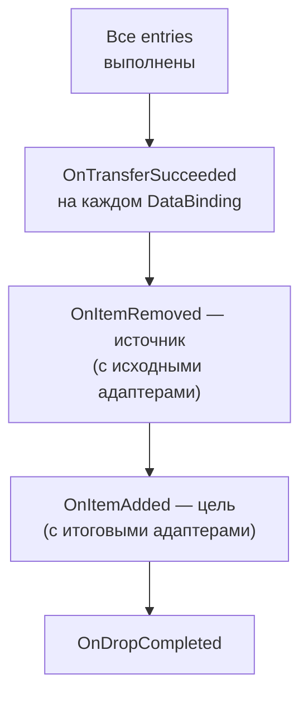
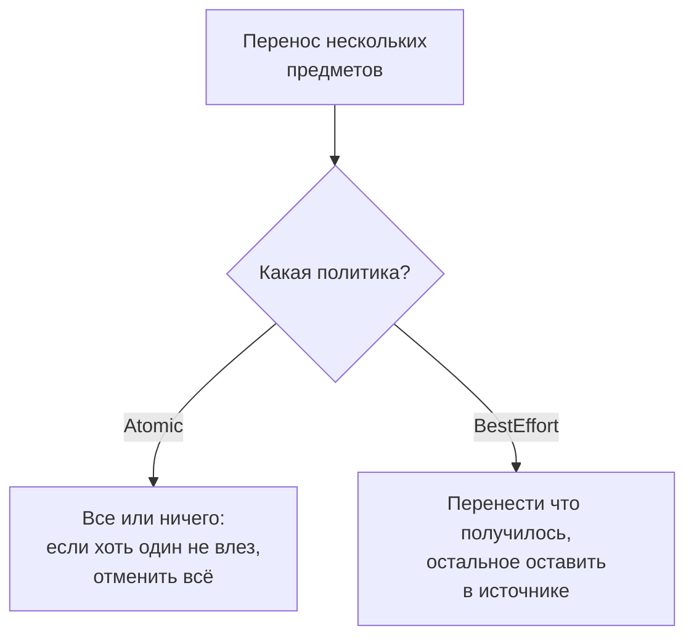
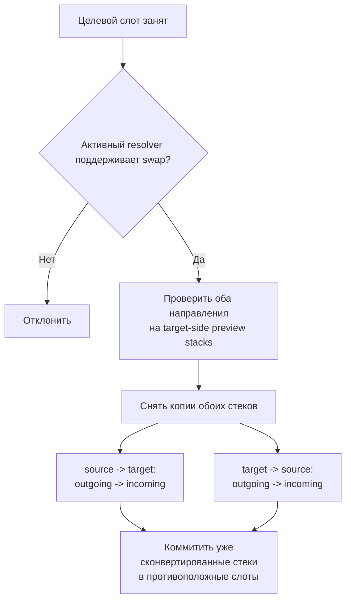

# Конвейер переноса

Эта страница объясняет перенос с точки зрения пользователя ассета.

Не "какие helper-классы существуют", а "в каком порядке система принимает решение и где вы можете вмешаться".

Для прикладных кейсов см. также:

- [Матрица Drop Policy](drop-policy-matrix.md)
- [Cookbook: конвертация предметов](item-conversion-cookbook.md)
- [Логи и отладка](../reference/logs-and-debugging.md)

---

## Короткая версия

---

## Что происходит при обычном дропе

Для direct slot drop это означает важное ограничение:

- если у операции уже есть конкретный `target slot` и policy не равен `FindAlternative`, planner/executor не должны сканировать остальные слоты инвентаря
- inventory-wide поиск по `GetAcceptableCount()` нужен только для area-drop, deferred placement и сценариев поиска альтернативных слотов

---

## Зачем нужен этап планирования

Перед реальным переносом система сначала считает, что она собирается сделать:

- влезает ли предмет целиком
- нужен ли partial transfer
- требуется ли swap
- есть ли подходящий слот
- нужно ли конвертировать предмет для целевого инвентаря

Это позволяет:

- не портить состояние при невалидной операции
- поддерживать atomic execution и rollback
- одинаково обрабатывать drag, quick transfer и swap

---

## Planning и commit — это не одно и то же

Это важное различие:

- на этапе planning система ещё ничего не меняет
- на этапе commit изменения уже применяются к инвентарям

Именно поэтому проверки разделены на несколько типов, каждый со своей ролью.

---

## Три типа проверок

В пайплайне переноса есть три разных механизма проверки. Они срабатывают в разные моменты и отвечают за разные вещи:

### Правила (Rules) — "можно ли вообще?"

Правила проверяются **на этапе планирования**, ещё до попытки переноса. Это механические ограничения: подходит ли тип предмета, разрешён ли слот, не заблокирован ли инвентарь.

Правила работают на трёх уровнях — первый отказ останавливает операцию:

| Уровень | Что проверяет | Пример |
|---|---|---|
| **Глобальные** | Всё приложение | Запрет дропа в тот же слот |
| **Инвентарные** | Конкретный инвентарь | Лимит уникальных предметов |
| **Слотовые** | Конкретный слот | Только оружие в слот оружия |

DataBinding тоже участвует в правилах: его `CanDrop` вызывается как часть инвентарных правил при планировании.

Подробнее о правилах — в разделе [Правила (Rules)](rules.md).

### Бизнес-проверки (CanCommitTransfer) — "можно ли прямо сейчас?"

Бизнес-проверки срабатывают **непосредственно перед выполнением**, когда план уже готов. Они нужны для проверок, которые зависят от текущего состояния и могут измениться между планированием и выполнением.

Порядок:

1. `CanCommitTransfer` — быстрая синхронная проверка
2. `CanCommitTransferAsync` — асинхронная проверка (если binding реализует интерфейс)
3. commit

Проверяются DataBinding'и **обоих** инвентарей (источника и цели).

Примеры использования:

- хватает ли у игрока денег на покупку
- подтвердил ли сервер операцию
- не изменилось ли состояние между планированием и выполнением

### Уведомление об успехе (OnTransferSucceeded) — "что делать после?"

`OnTransferSucceeded` вызывается **после завершения всех entries**, только при успехе. Это не проверка, а callback для side effects.

Примеры:

- списать валюту
- обновить достижения
- записать статистику

### Когда что использовать

| Задача | Где писать |
|---|---|
| "Этот тип предмета нельзя класть сюда" | Правило (CanDrop) |
| "В слот оружия — только оружие" | Слотовое правило |
| "Максимум 5 уникальных предметов" | Инвентарное правило |
| "Достаточно ли у игрока золота" | CanCommitTransfer |
| "Подождать ответ от сервера" | CanCommitTransferAsync |
| "Списать деньги после покупки" | OnTransferSucceeded |

---

## Конвертация предметов

Если источник и цель используют разные представления предметов, конвертация происходит в два этапа:

Пример: торговец хранит предметы как ScriptableObject, а игрок — как runtime-модели. При покупке:

1. Предмет отделяется от слота торговца
2. **Outgoing**: торговец выпускает предмет (SO → промежуточный формат)
3. **Incoming**: инвентарь игрока принимает предмет (промежуточный → runtime-модель)
4. Предмет размещается в слоте игрока

С точки зрения пользователя ассета важно:

- каждый адаптер в стеке конвертируется индивидуально (сохраняется уникальная runtime-информация)
- если хотя бы один адаптер не конвертировался, вся операция откатывается
- целевой инвентарь получает предмет уже в своём формате

---

## Подробный порядок выполнения переноса

Для каждого запланированного entry происходит следующее:

После того как **все** entries выполнены:

Важно: события стреляют **после завершения всей операции**, а не по одному на каждый entry. Это предотвращает ложные события при последующем откате в Atomic режиме.

Дополнение:

- если execution уже привязан к конкретному `targetSlot`, executor не должен повторно делать inventory-wide capacity search
- в этой ветке он доверяет уже построенному plan и коммитит placement только в указанный слот

---

## Что происходит при отказе

Если проверка или commit не прошли, поведение зависит от политики:

| Ситуация | Что происходит |
|---|---|
| `CanDrop` вернул отказ | перенос не начинается, предмет возвращается в источник |
| `CanCommitTransfer` вернул отказ | перенос отменяется до commit, состояние не менялось |
| `CanCommitTransferAsync` вернул отказ | перенос отменяется до commit, состояние не менялось |
| Atomic batch: один из предметов не прошёл | вся операция отменяется, ни один предмет не переносится |
| BestEffort batch: один из предметов не прошёл | остальные предметы переносятся, неудачные остаются в источнике |

Главное: если проверка не прошла, инвентари остаются в исходном состоянии. Этап планирования строит план без мутаций, а commit применяется только после всех проверок.

---

## Drop Policy

Текущая модель состоит из трёх уровней:

- `DropRequestPolicy`
  - временный override для конкретной операции
  - может задать:
    - `BlockedTargetResolverBase`
    - `AllowPartial`
- `DropPolicySettings`
  - inventory-level defaults в `UniversalInventory`
  - задаёт:
    - blocked target resolver
    - allow merge on drop
    - allow partial
    - batch mode
- `ResolvedDropPolicy`
  - итог после resolution
  - именно он используется planner-ом
  - содержит конкретный blocked-target resolver для текущего переноса

Встроенные blocked target resolver'ы:
- `Reject`
- `Swap`
- `FindAlternative`

Если выбран `Swap`, внутри него задаётся вложенная `[SerializeReference]` `ISwapStrategy`.
Если выбран `FindAlternative`, внутри него задаётся вложенная `[SerializeReference]` `IAlternativePlacementStrategy`.

## Временный override через actions

Временная подмена drop policy делается не через мутацию `DragContext`, а через action-level request override.

Пример:
- обычный `CompleteDragAction` вызывает `CompleteDrag(null)`
- `Ctrl`-вариант `CompleteDragAction` вызывает `CompleteDrag(DropRequestPolicy.WithSwap())`
- `Shift`-вариант `CompleteDragAction` вызывает `CompleteDrag(DropRequestPolicy.WithFindAlternative())`
- action также может временно переопределить `AllowPartial`
- при необходимости action может передать свой resolver или свою стратегию alternative placement через `DropRequestPolicy.WithResolver(...)` или `DropRequestPolicy.WithFindAlternative(...)`

Отдельный вариант — `SplitDropAction`: вызывает `SplitDrop(policy, count)` вместо `CompleteDrag`. Это позволяет сбросить часть стека (например, 1 предмет), не прекращая перетаскивание. Перенос проходит через тот же конвейер (planner → executor → события). Подробнее — в разделе [Ввод и взаимодействие](../systems/interaction.md#частичный-сброс-split-drop).

Важно:
- override действует только на текущую операцию переноса
- inventory-level `DropPolicySettings` остаётся неизменным
- итоговый `ResolvedDropPolicy` собирается в порядке:
  1. action request override
  2. drop-target override
  3. inventory defaults

## Кастомные расширения Drop Policy

Чтобы создать своё поведение для blocked target:

1. Создайте класс-наследник `BlockedTargetResolverBase`.
2. Пометьте его `[Serializable]`.
3. Переопределите `SwapStrategy`, если resolver должен искать кастомные swap-candidates.
4. Переопределите `AlternativePlacementStrategy`, если resolver должен искать альтернативные слоты.
5. Класс автоматически появится в managed reference picker у `DropPolicySettings`.

Чтобы создать свою swap strategy:

1. Создайте класс, реализующий `ISwapStrategy`.
2. Пометьте его `[Serializable]`.
3. Реализуйте `EnumerateSwapTargets(...)` и возвращайте swap-candidates в нужном вам порядке.
4. Класс автоматически появится внутри `SwapBlockedTargetResolver`.

Чтобы создать свою стратегию alternative placement:

1. Создайте класс, реализующий `IAlternativePlacementStrategy`.
2. Пометьте его `[Serializable]`.
3. Реализуйте `EnumerateAlternativeSlots(...)` и возвращайте слоты в нужном вам порядке.
4. Класс автоматически появится внутри `FindAlternativeBlockedTargetResolver`.

## Порядок обработки Drop Policy

Для одного drag entry порядок такой:

1. Резолвится `ResolvedDropPolicy`
2. Planner пытается положить предмет в target slot, если он есть
3. Если в target вошло всё, entry успешен
4. Если вошла только часть:
   - `AllowPartial = false` -> fail
   - `AllowPartial = true` -> partial success
   - остаток ищет другие слоты только если активный resolver отдаёт `AlternativePlacementStrategy`
5. Если в target не вошло ничего:
   - `Reject` -> fail
   - resolver с поддержкой `Swap` -> planner строит swap entry
   - resolver с alternative placement -> стратегия перечисляет alternative slots
6. Для same-inventory резолверы с alternative placement не перераскладывают предметы по другим слотам. Если target не подошёл, предмет остаётся на месте

## Batch-операции

При групповом переносе (несколько предметов за раз) поведение определяется `BatchMode` внутри `DropPolicy`:

По умолчанию batch mode берётся из inventory-level `DropPolicySettings`, а request override меняет только временное поведение конкретной операции.

---

## Swap — это часть того же пайплайна

Обмен предметами не является отдельной системой. Для пользователя это просто ещё один вариант успешного переноса, если активный resolver поддерживает `Swap`.

Практически это значит:

- cross-inventory swap больше не должен быть raw exchange стеков
- оба направления сначала конвертируются в формат противоположного инвентаря
- `OnItemRemoved` публикует стеки `before`, а `OnItemAdded` — стеки `after`
- иначе в слоте остаётся чужой adapter-тип и следующая операция начинает падать на `CanStartDrag`/`CanDrop`

---

## Что имеет смысл знать, а что нет

Обычно пользователю ассета нужно понимать:

- где пишутся rules
- где писать business checks
- когда синхронизируются данные
- почему partial transfer и swap ведут себя предсказуемо

Обычно не нужно понимать заранее:

- внутренние helper-структуры planning layer
- низкоуровневые шаги execution layer
- карту всех внутренних классов конвейера

Если вы меняете сам ассет, а не только используете его, тогда уже смотрите [Карту файлов](../reference/file-map.md).
