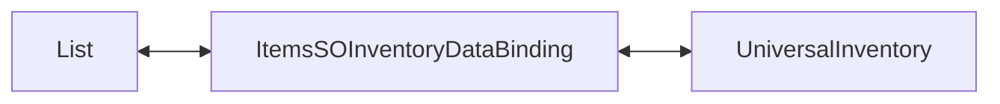

# Demo1 Inventories

`Examples/Demo1 Inventaries/InventariesDemo.unity`

This is the most basic sample in the package. It shows an inventory without separate game logic, economy, or world integration.

## What the demo shows

- a simple `List<ItemExampleSO>`
- `ListInventoryDataBinding<ItemExampleSO, ItemAdapterSoAdapter>`
- loading a list into `UniversalInventory`
- syncing UI changes back into data
- local `CanStartDrag` and `CanDrop` overrides

## How it is structured

Main pieces:

- `ItemExampleSO.cs` — item data
- `Adapters/ItemAdapterSoAdapter.cs` — UI-layer adapter
- `DataBindings/ItemsSOInventoryDataBinding.cs` — binding between the list and the inventory
- `SO/Rules/*` — example rule preset

Architecturally this is the shortest chain in the project:

There is no separate domain service here. The binding reads the list, creates adapters, and syncs changes back into the same list.

## How it works

1. `GetItems()` returns the `items` list.
2. `ReloadUI()` builds UI stacks via `CreateAdapter(...)`.
3. Drag and drop runs through the standard pipeline.
4. After a successful transfer the binding receives add/remove callbacks.
5. `AddToData(...)` and `RemoveFromData(...)` update the source list.

The demo also shows where simple local restrictions fit best:

- `CanStartDrag(...)` — block drag from a specific inventory
- `CanDrop(...)` — block drop into a specific inventory

## Files to inspect

| File | Role |
|---|---|
| `Examples/Demo1 Inventaries/DataBindings/ItemsSOInventoryDataBinding.cs` | main binding of the sample |
| `Examples/Demo1 Inventaries/Adapters/ItemAdapterSoAdapter.cs` | adapter for `ItemExampleSO` |
| `Examples/Demo1 Inventaries/ItemExampleSO.cs` | item data model |
| `Scripts/DataBinding/ListInventoryDataBinding.cs` | base class for list-based bindings |

## When to use this as a starting point

- you need a first inventory without a complex domain model
- you want to understand the `ListInventoryDataBinding` lifecycle
- you want a quick place to test slot rules, filters, or visual setup
