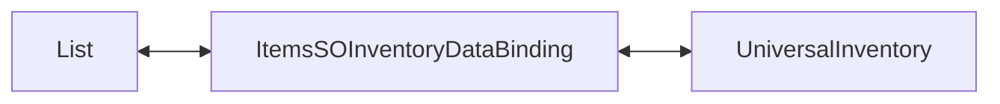

# Demo1 Inventories

    <iframe
    src="https://www.youtube.com/embed/96VOcrIeLUk"
    title="Project showcase video"
    allow="accelerometer; autoplay; clipboard-write; encrypted-media; gyroscope; picture-in-picture; web-share"
    allowfullscreen>
    </iframe>

`Examples/Demo1 Inventories/InventoriesDemo.unity`

This is the most basic asset example. It shows an inventory without separate game
logic, economy, or world integration.

## What The Demo Shows

- a simple `ItemExampleSO` list
- `ListInventoryDataBinding<ItemExampleSO, ItemAdapterSoAdapter>`
- loading a list into `UniversalInventory`
- synchronizing UI changes back to data
- local `CanStartDrag` and `CanDrop` overrides

## How It Is Structured

Main parts:

- `ItemExampleSO.cs` — item data
- `Adapters/ItemAdapterSoAdapter.cs` — UI-layer adapter
- `DataBindings/ItemsSOInventoryDataBinding.cs` — binding between the data list and inventory
- `SO/Rules/*` — example rule preset

The binding reads the list, creates adapters, and synchronizes changes back into the
same list.

## How It Works

1. `GetItems()` returns the `items` list.
2. `ReloadUI()` builds the initial UI stacks from that list through `CreateAdapter(...)`.
   You can call it when data changes to redraw the inventory, but `ListInventoryDataBinding`
   does not preserve positions.
3. After a successful transfer, the inventory calls the binding's `AddToData(...)` and
   `RemoveFromData(...)`, updating the source list.

The example also shows where to add simple local restrictions:

- `CanStartDrag(...)` — block dragging from a specific inventory
- `CanDrop(...)` — block dropping into a specific inventory

## When To Use This Example

- you need a first inventory without a complex model
