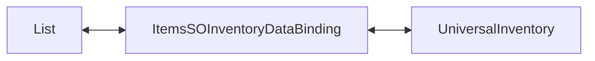

# Demo1 Inventories

    <iframe
    src="https://www.youtube.com/embed/96VOcrIeLUk"
    title="Project showcase video"
    allow="accelerometer; autoplay; clipboard-write; encrypted-media; gyroscope; picture-in-picture; web-share"
    allowfullscreen>
    </iframe>

`Examples/Demo1 Inventories/InventoriesDemo.unity`

Este es el ejemplo más básico del asset. Muestra un inventario sin lógica de juego
separada, economía o integración con el mundo.

## Qué muestra la demo

- una lista simple de `ItemExampleSO`
- `ListInventoryDataBinding<ItemExampleSO, ItemAdapterSoAdapter>`
- carga de una lista en `UniversalInventory`
- sincronización de cambios de UI de vuelta a los datos
- overrides locales de `CanStartDrag` y `CanDrop`

## Cómo está estructurada

Partes principales:

- `ItemExampleSO.cs` — datos del item
- `Adapters/ItemAdapterSoAdapter.cs` — adapter de la capa UI
- `DataBindings/ItemsSOInventoryDataBinding.cs` — binding entre la lista de datos y el inventario
- `SO/Rules/*` — preset de reglas de ejemplo

El binding lee la lista, crea adapters y sincroniza los cambios de vuelta a la misma lista.

## Cómo funciona

1. `GetItems()` devuelve la lista `items`.
2. `ReloadUI()` construye los stacks iniciales de UI desde esa lista mediante
   `CreateAdapter(...)`. Puedes llamarlo cuando cambien los datos para redibujar el
   inventario, pero `ListInventoryDataBinding` no conserva posiciones.
3. Después de una transferencia exitosa, el inventario llama a `AddToData(...)` y
   `RemoveFromData(...)` del binding, actualizando la lista original.

El ejemplo también muestra dónde añadir restricciones locales simples:

- `CanStartDrag(...)` — bloquear el drag desde un inventario concreto
- `CanDrop(...)` — bloquear el drop en un inventario concreto

## Cuándo usar este ejemplo como base

- necesitas un primer inventario sin un modelo complejo
