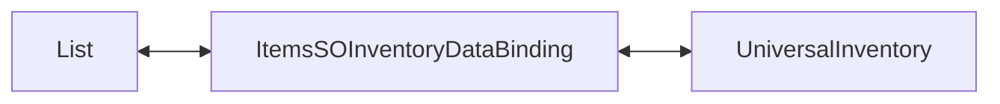

# Demo1 Inventories

    <iframe
    src="https://www.youtube.com/embed/96VOcrIeLUk"
    title="Project showcase video"
    allow="accelerometer; autoplay; clipboard-write; encrypted-media; gyroscope; picture-in-picture; web-share"
    allowfullscreen>
    </iframe>

`Examples/Demo1 Inventories/InventoriesDemo.unity`

Это самый базовый пример ассета. Он показывает inventory без отдельной игровой логики, экономики или world-интеграции.

## Что показывает демо

- простой список `ItemExampleSO`
- `ListInventoryDataBinding<ItemExampleSO, ItemAdapterSoAdapter>`
- загрузку списка в `UniversalInventory`
- обратную синхронизацию UI -> данные
- локальные переопределения `CanStartDrag` и `CanDrop`

## Как устроено

Основные части:

- `ItemExampleSO.cs` — данные предмета
- `Adapters/ItemAdapterSoAdapter.cs` — адаптер UI-слоя
- `DataBindings/ItemsSOInventoryDataBinding.cs` — binding между списком данных и inventory
- `SO/Rules/*` — пример rule preset

Сам binding читает список, создаёт адаптеры и синхронизирует изменения обратно в тот же список.

## Как работает

1. `GetItems()` отдаёт список `items`.
2. `ReloadUI()` строит изначальный UI-стеки из этого списка через `CreateAdapter(...)`. Эту функцию можно вызывать по событиям когда что то изменилось в данных для полной перерисоки, но для `ListInventoryDataBinding` не сохраняется позиция.
3. После успешного переноса инвентарь вызывает у binding соответствующие `AddToData(...)` и `RemoveFromData(...)` - обновляет исходный список.

Дополнительно пример показывает, где удобно добавлять простые локальные ограничения:

- `CanStartDrag(...)` — запретить перетаскивание из конкретного инвенторя
- `CanDrop(...)` — запретить перетаскивание в конкретный инвентарь

## Когда брать этот пример за основу

- нужен первый инвентарь без сложной модели
