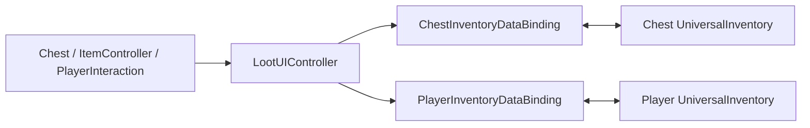

# Demo2 Loot

`Examples/Demo2 Loot/LootDemo.unity`

This demo is not about a special inventory type. It is about wiring game world events to UI.

## What the demo shows

- chests as interactive world objects
- player interaction and event-driven UI opening
- separate bindings for the player and the chest
- pickup/drop flows connected to the world
- a mediator approach: world objects do not know about UI directly

## How it is structured

Main layers:

- `Scripts/Core/*` — `Chest`, `ItemController`, `IInteractable`
- `Scripts/Player/*` — `PlayerController`, `PlayerInteraction`, `PlayerInventoryData`
- `Scripts/DataBinding/*` — player and chest bindings
- `Scripts/UI/LootUIController.cs` — mediator between world layer and UI

Main shape:

The key point is that `Chest` and `PlayerInteraction` live in the world layer and do not know about specific UI panels. Only `LootUIController` opens and wires the UI.

## How it works

Opening a chest:

1. `PlayerInteraction` finds an `IInteractable`.
2. A player action calls `Interact(...)`.
3. `Chest` changes state and emits an event.
4. `LootUIController` receives that event.
5. The controller shows the panel and calls `BindToChest(...)`.
6. `ChestInventoryDataBinding` loads the chest content into UI.

Moving items:

1. The user drags an item between the player and chest inventories.
2. The standard transfer pipeline executes the move.
3. After a successful commit the bindings update `Chest` and `PlayerInventoryData`.

## Files to inspect

| File | Role |
|---|---|
| `Examples/Demo2 Loot/Scripts/UI/LootUIController.cs` | world -> UI mediator |
| `Examples/Demo2 Loot/Scripts/Core/Chest.cs` | world-side container |
| `Examples/Demo2 Loot/Scripts/Player/PlayerInteraction.cs` | interaction discovery and trigger |
| `Examples/Demo2 Loot/Scripts/DataBinding/ChestInventoryDataBinding.cs` | chest binding |
| `Examples/Demo2 Loot/Scripts/DataBinding/PlayerInventoryDataBinding.cs` | player binding |
| `Examples/Demo2 Loot/Scripts/Core/ItemController.cs` | world item / pickup flow |

## When to use this as a starting point

- you need world-driven UI
- you need chests that open through interaction
- you want a reference for separating world logic from inventory UI
