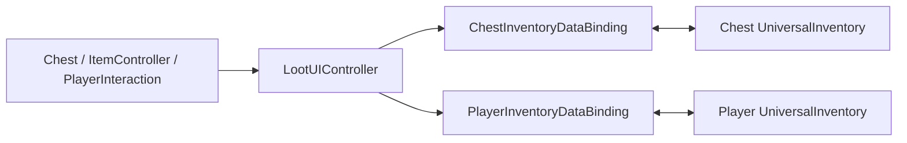

# Demo2 Loot

    <iframe
    src="https://www.youtube.com/embed/sjPC_8PYXR8"
    title="Project showcase video"
    allow="accelerometer; autoplay; clipboard-write; encrypted-media; gyroscope; picture-in-picture; web-share"
    allowfullscreen>
    </iframe>

`Examples/Demo2 Loot/LootDemo.unity`

Este es un ejemplo de inventario indexado por slot y de cómo conectar eventos del mundo de juego con la UI.

## Qué muestra la demo

- cofres como objetos interactivos del mundo
- bindings separados para el jugador y el cofre
- cambio de distintas fuentes de datos para DataBinding
- flujos de pickup/drop conectados al mundo
- un enfoque de mediador: los objetos del mundo no conocen directamente la UI

## Cómo está estructurada

Capas principales:

- `Scripts/Core/*` — `Chest`, `ItemController`, `IInteractable`
- `Scripts/Player/*` — `PlayerController`, `PlayerInteraction`, `PlayerInventoryData`
- `Scripts/DataBinding/*` — bindings del jugador y del cofre
- `Scripts/UI/LootUIController.cs` — mediador entre la capa de mundo y la UI

Forma principal:

El punto clave es que `Chest` y `PlayerInteraction` viven en la capa de mundo y no conocen paneles concretos de UI. Solo `LootUIController` abre y conecta la UI.

## Cómo funciona

Apertura de un cofre:

1. `PlayerInteraction` encuentra un `IInteractable`.
2. Una acción del jugador llama a `Interact(...)`.
3. `Chest` cambia de estado y emite un evento.
4. `LootUIController` recibe ese evento.
5. El controlador muestra el panel y llama a `BindToChest(...)`.
6. `ChestInventoryDataBinding` carga el contenido del cofre en la UI.

Mover items:

1. El usuario arrastra un item entre los inventarios del jugador y del cofre.
2. El transfer pipeline estándar ejecuta el movimiento.
3. Tras un commit exitoso, los bindings actualizan `Chest` y `PlayerInventoryData`.

## Archivos para inspeccionar

| Archivo | Rol |
|---|---|
| `Scripts/UI/LootUIController.cs` | mediador mundo -> UI |
| `Scripts/Core/Chest.cs` | contenedor del lado del mundo |
| `Scripts/Player/PlayerInteraction.cs` | detección y disparo de interacción |
| `Scripts/DataBinding/ChestInventoryDataBinding.cs` | binding del cofre |
| `Scripts/DataBinding/PlayerInventoryDataBinding.cs` | binding del jugador |
| `Scripts/Core/ItemController.cs` | flujo de item del mundo / pickup |

## Cuándo usar esto como punto de partida

- necesitas UI impulsada por eventos del mundo
- necesitas cofres que se abren mediante interacción
- quieres una referencia para separar la lógica del mundo de la UI del inventario

