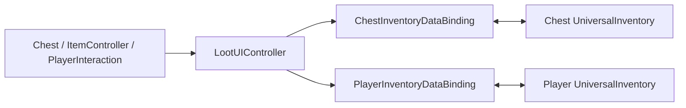

# Demo2 Loot

    <iframe
    src="https://www.youtube.com/embed/sjPC_8PYXR8"
    title="Project showcase video"
    allow="accelerometer; autoplay; clipboard-write; encrypted-media; gyroscope; picture-in-picture; web-share"
    allowfullscreen>
    </iframe>

`Examples/Demo2 Loot/LootDemo.unity`

Это пример не про отдельный тип inventory, а про связку игрового мира, событий и UI.

## Что показывает демо

- сундуки как интерактивные world-объекты
- player interaction и открытие UI по событию
- отдельные bindings для игрока и сундука
- pickup/drop сценарии, связанные с миром
- mediator-подход: мир не знает о UI напрямую

## Как устроено

Основные слои:

- `Scripts/Core/*` — `Chest`, `ItemController`, `IInteractable`
- `Scripts/Player/*` — `PlayerController`, `PlayerInteraction`, `PlayerInventoryData`
- `Scripts/DataBinding/*` — bindings игрока и сундука
- `Scripts/UI/LootUIController.cs` — посредник между world layer и UI

Главная схема:

Ключевой момент примера: `Chest` и `PlayerInteraction` живут в игровом мире и не знают о конкретных UI-панелях. UI открывает и связывает только `LootUIController`.

## Как работает

Открытие сундука:

1. `PlayerInteraction` находит `IInteractable`.
2. По действию игрока вызывается `Interact(...)`.
3. `Chest` меняет состояние и публикует событие.
4. `LootUIController` получает это событие.
5. Контроллер активирует панель и вызывает `BindToChest(...)`.
6. `ChestInventoryDataBinding` загружает содержимое сундука в UI.

Перенос предметов:

1. Игрок таскает предмет между inventory игрока и сундука.
2. Стандартный transfer pipeline выполняет перенос.
3. После успешного commit binding-и обновляют `Chest` и `PlayerInventoryData`.

## Что смотреть в коде

| Файл | Роль |
|---|---|
| `Examples/Demo2 Loot/Scripts/UI/LootUIController.cs` | посредник world -> UI |
| `Examples/Demo2 Loot/Scripts/Core/Chest.cs` | контейнер игрового мира |
| `Examples/Demo2 Loot/Scripts/Player/PlayerInteraction.cs` | обнаружение и запуск взаимодействия |
| `Examples/Demo2 Loot/Scripts/DataBinding/ChestInventoryDataBinding.cs` | binding сундука |
| `Examples/Demo2 Loot/Scripts/DataBinding/PlayerInventoryDataBinding.cs` | binding игрока |
| `Examples/Demo2 Loot/Scripts/Core/ItemController.cs` | world item / pickup flow |

## Когда брать этот пример за основу

- нужен world-driven UI
- нужны сундуки, открывающиеся по взаимодействию
- нужен пример разделения world logic и inventory UI
