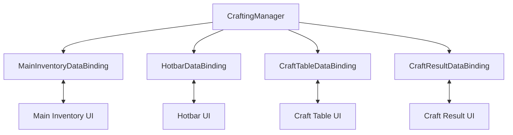

# Demo3 Minecraft

    <iframe
    src="https://www.youtube.com/embed/vai7yQJLLVc"
    title="Project showcase video"
    allow="accelerometer; autoplay; clipboard-write; encrypted-media; gyroscope; picture-in-picture; web-share"
    allowfullscreen>
    </iframe>

`Examples/Demo3 Minecraft/MinecraftDemo.unity`

This is a slot-indexed inventory and crafting sample where UI syncs with fixed domain arrays rather than a plain list.

## What the demo shows

- `SlotIndexedInventoryDataBinding`
- separate panels for hotbar, main inventory, and craft table
- per-slot max stack limits
- `CraftResultDataBinding` as a custom read-only output inventory

## How it is structured

The central domain entry point is:

- `Crafting/CraftingManager.cs`

It stores:

- `_hotbarItems`
- `_inventoryItems`
- `_craftTableItems`
- the recipe list
- the current recipe and craft multiplier

UI is split into four independent bindings:

- `MainInventoryDataBinding`
- `HotbarDataBinding`
- `CraftTableDataBinding`
- `CraftResultDataBinding`

## How it works

Regular slots:

1. A binding enumerates occupied indices through `GetOccupiedSlots()`.
2. `AddToSlotData(...)` and `RemoveFromSlotData(...)` call `CraftingManager` methods.
3. On `Awake()` the inventory receives `SetMaxStackSize(CraftingManager.MaxItemsPerSlot)`.

Crafting:

1. A change in the craft table updates `_craftTableItems`.
2. `CraftingManager.RefreshCraftResult()` resolves the matching recipe.
3. `CraftResultDataBinding.OnReloadUI()` shows the result and configures drag step size.
4. When the user takes the result, `OnItemRemovedFromUI(...)` calls `ConsumeCraftIngredients(...)`.

This is a good example of a read-only slot that rejects incoming drops but still triggers a domain side effect after a successful extraction.

## Files to inspect

| File | Role |
|---|---|
| `Crafting/CraftingManager.cs` | domain data and crafting logic |
| `DataBindings/MainInventoryDataBinding.cs` | main inventory binding |
| `DataBindings/HotbarDataBinding.cs` | hotbar binding |
| `DataBindings/CraftTableDataBinding.cs` | craft table binding |
| `DataBindings/CraftResultDataBinding.cs` | result slot binding |
| `Crafting/CraftingRecipeSO.cs` | recipe and matching |

## When to use this as a starting point

- you need an inventory with fixed indices
- you need crafting on top of several inventory sections
- you want an example of an output slot with a post-extraction domain effect
