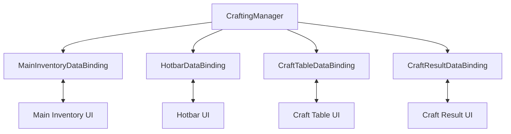

# Demo3 Minecraft

    <iframe
    src="https://www.youtube.com/embed/vai7yQJLLVc"
    title="Project showcase video"
    allow="accelerometer; autoplay; clipboard-write; encrypted-media; gyroscope; picture-in-picture; web-share"
    allowfullscreen>
    </iframe>

`Examples/Demo3 Minecraft/MinecraftDemo.unity`

Esta es una muestra de inventario indexado por slot y crafting, donde la UI se sincroniza con arrays de dominio fijos en lugar de con una lista simple.

## Qué muestra la demo

- `SlotIndexedInventoryDataBinding`
- paneles separados para hotbar, inventario principal y mesa de crafteo
- límites de stack máximo por slot
- `CraftResultDataBinding` como inventario de salida personalizado de solo lectura

## Cómo está estructurada

El punto central de entrada del dominio es:

- `Crafting/CraftingManager.cs`

Almacena:

- `_hotbarItems`
- `_inventoryItems`
- `_craftTableItems`
- la lista de recetas
- la receta actual y el multiplicador de craft

La UI se divide en cuatro bindings independientes:

- `MainInventoryDataBinding`
- `HotbarDataBinding`
- `CraftTableDataBinding`
- `CraftResultDataBinding`

## Cómo funciona

Slots normales:

1. Un binding enumera los índices ocupados mediante `GetOccupiedSlots()`.
2. `AddToSlotData(...)` y `RemoveFromSlotData(...)` llaman a métodos de `CraftingManager`.
3. En `Awake()` el inventario recibe `SetMaxStackSize(CraftingManager.MaxItemsPerSlot)`.

Crafting:

1. Un cambio en la craft table actualiza `_craftTableItems`.
2. `CraftingManager.RefreshCraftResult()` resuelve la receta coincidente.
3. `CraftResultDataBinding.OnReloadUI()` muestra el resultado y configura el drag step size.
4. Cuando el usuario toma el resultado, `OnItemRemovedFromUI(...)` llama a `ConsumeCraftIngredients(...)`.

Este es un buen ejemplo de un slot de solo lectura que rechaza drops entrantes, pero aun así dispara un efecto de dominio tras una extracción exitosa.

## Archivos para inspeccionar

| Archivo | Rol |
|---|---|
| `Crafting/CraftingManager.cs` | datos de dominio y lógica de crafting |
| `DataBindings/MainInventoryDataBinding.cs` | binding del inventario principal |
| `DataBindings/HotbarDataBinding.cs` | binding del hotbar |
| `DataBindings/CraftTableDataBinding.cs` | binding de la craft table |
| `DataBindings/CraftResultDataBinding.cs` | binding del slot de resultado |
| `Crafting/CraftingRecipeSO.cs` | receta y matching |

## Cuándo usar esto como punto de partida

- necesitas un inventario con índices fijos
- necesitas crafting sobre varias secciones de inventario
- quieres un ejemplo de slot de salida con un efecto de dominio posterior a la extracción

