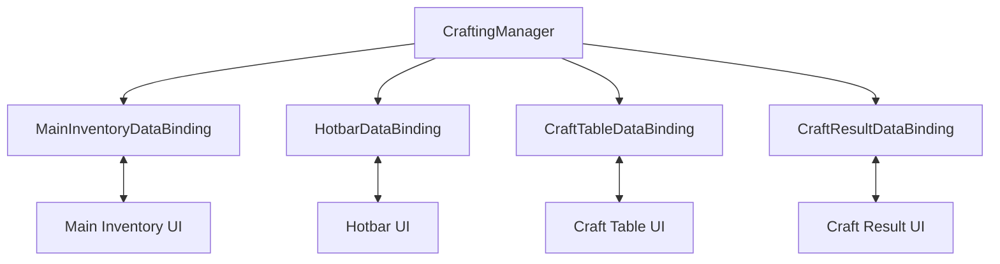

# Demo3 Minecraft

    <iframe
    src="https://www.youtube.com/embed/vai7yQJLLVc"
    title="Project showcase video"
    allow="accelerometer; autoplay; clipboard-write; encrypted-media; gyroscope; picture-in-picture; web-share"
    allowfullscreen>
    </iframe>

`Examples/Demo3 Minecraft/MinecraftDemo.unity`

Это пример slot-indexed inventory и крафта, где UI синхронизируется не со списком, а с фиксированными массивами доменных данных.

## Что показывает демо

- `SlotIndexedInventoryDataBinding`
- отдельные панели для hotbar, main inventory и craft table
- ограничение максимального стека на слот
- вычисление рецепта и отдельный result slot
- side effects при взятии результата крафта

## Как устроено

Центральная точка доменной логики:

- `Crafting/CraftingManager.cs`

Он хранит:

- `_hotbarItems`
- `_inventoryItems`
- `_craftTableItems`
- список рецептов
- текущий результат и множитель крафта

UI разбит на четыре независимых binding-а:

- `MainInventoryDataBinding`
- `HotbarDataBinding`
- `CraftTableDataBinding`
- `CraftResultDataBinding`

## Как работает

Обычные слоты:

1. Binding перечисляет занятые индексы через `GetOccupiedSlots()`.
2. `AddToSlotData(...)` и `RemoveFromSlotData(...)` вызывают методы `CraftingManager`.
3. На `Awake()` inventory получает `SetMaxStackSize(CraftingManager.MaxItemsPerSlot)`.

Крафт:

1. Изменение craft table обновляет массив `_craftTableItems`.
2. `CraftingManager.RefreshCraftResult()` ищет подходящий рецепт.
3. `CraftResultDataBinding.OnReloadUI()` показывает результат и настраивает шаг drag-а.
4. Когда пользователь забирает результат, `OnItemRemovedFromUI(...)` вызывает `ConsumeCraftIngredients(...)`.

Это хороший пример read-only слота, который не принимает входящий drop, но запускает доменный side effect на успешном извлечении.

## Что смотреть в коде

| Файл | Роль |
|---|---|
| `Examples/Demo3 Minecraft/Crafting/CraftingManager.cs` | доменные данные и логика крафта |
| `Examples/Demo3 Minecraft/DataBindings/MainInventoryDataBinding.cs` | main inventory binding |
| `Examples/Demo3 Minecraft/DataBindings/HotbarDataBinding.cs` | hotbar binding |
| `Examples/Demo3 Minecraft/DataBindings/CraftTableDataBinding.cs` | craft table binding |
| `Examples/Demo3 Minecraft/DataBindings/CraftResultDataBinding.cs` | result slot binding |
| `Examples/Demo3 Minecraft/Crafting/CraftingRecipeSO.cs` | рецепт и matching |

## Когда брать этот пример за основу

- нужен inventory с жёсткими индексами
- нужен крафт поверх нескольких inventory-секций
- нужен пример output slot с доменным эффектом после извлечения
